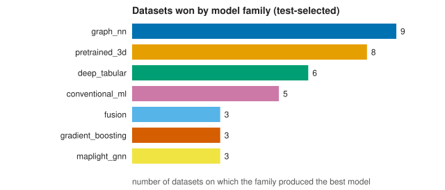
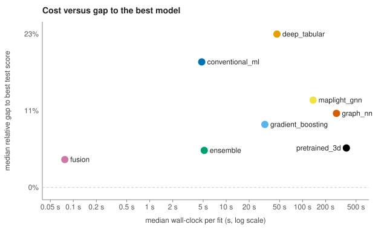
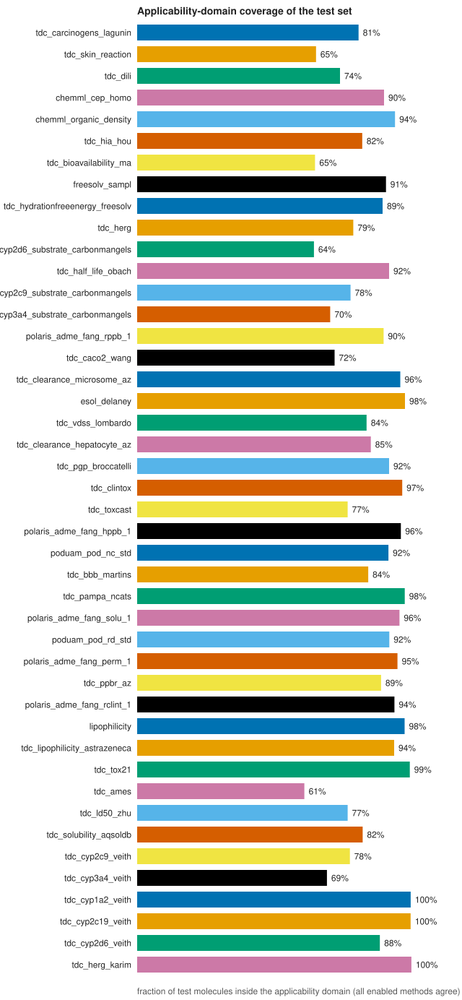

# QSARena run report

- Output directory: `benchmark_results\qsarena_benchmark_oof_ensemble`
- Generated: 2026-10-06 09:45:15 with qsarena 0.1.0
- Mode: benchmark; profile: full; GPU: yes
- 44 dataset(s): 44 completed
- Config signature: `97be762568e0fe5e7d4ccde76269ce3c6e615e0760033fedd2847dc1ea3ad1bb`

## Warnings

None.

## Datasets

| Dataset | Status | Task | Rows used | Unparseable SMILES dropped | Primary metric | Error / remedy |
|---|---|---|---|---|---|---|
| chemml_cep_homo | completed | regression | 500 | 0 | RMSE |  |
| chemml_organic_density | completed | regression | 500 | 0 | RMSE |  |
| esol_delaney | completed | regression | 1128 | 0 | RMSE |  |
| freesolv_sampl | completed | regression | 642 | 0 | RMSE |  |
| lipophilicity | completed | regression | 4200 | 0 | RMSE |  |
| poduam_pod_nc_std | completed | regression | 1842 | 3 | RMSE |  |
| poduam_pod_rd_std | completed | regression | 2355 | 2 | RMSE |  |
| polaris_adme_fang_hppb_1 | completed | regression | 1808 | 0 | mse |  |
| polaris_adme_fang_perm_1 | completed | regression | 2642 | 0 | mse |  |
| polaris_adme_fang_rclint_1 | completed | regression | 3054 | 0 | mse |  |
| polaris_adme_fang_rppb_1 | completed | regression | 885 | 0 | mse |  |
| polaris_adme_fang_solu_1 | completed | regression | 2173 | 0 | mse |  |
| tdc_ames | completed | classification | 7278 | 0 | AUROC |  |
| tdc_bbb_martins | completed | classification | 2030 | 0 | AUROC |  |
| tdc_bioavailability_ma | completed | classification | 640 | 0 | AUROC |  |
| tdc_caco2_wang | completed | regression | 910 | 0 | MAE |  |
| tdc_carcinogens_lagunin | completed | classification | 280 | 0 | AUROC |  |
| tdc_clearance_hepatocyte_az | completed | regression | 1213 | 0 | Spearman |  |
| tdc_clearance_microsome_az | completed | regression | 1102 | 0 | Spearman |  |
| tdc_clintox | completed | classification | 1478 | 0 | AUROC |  |
| tdc_cyp1a2_veith | completed | classification | 12579 | 0 | AUROC |  |
| tdc_cyp2c19_veith | completed | classification | 12665 | 0 | AUROC |  |
| tdc_cyp2c9_substrate_carbonmangels | completed | classification | 669 | 0 | AUPRC |  |
| tdc_cyp2c9_veith | completed | classification | 12092 | 0 | AUPRC |  |
| tdc_cyp2d6_substrate_carbonmangels | completed | classification | 667 | 0 | AUPRC |  |
| tdc_cyp2d6_veith | completed | classification | 13130 | 0 | AUPRC |  |
| tdc_cyp3a4_substrate_carbonmangels | completed | classification | 670 | 0 | AUROC |  |
| tdc_cyp3a4_veith | completed | classification | 12328 | 0 | AUPRC |  |
| tdc_dili | completed | classification | 475 | 0 | AUROC |  |
| tdc_half_life_obach | completed | regression | 667 | 0 | Spearman |  |
| tdc_herg | completed | classification | 655 | 0 | AUROC |  |
| tdc_herg_karim | completed | classification | 13445 | 0 | AUROC |  |
| tdc_hia_hou | completed | classification | 578 | 0 | AUROC |  |
| tdc_hydrationfreeenergy_freesolv | completed | regression | 642 | 0 | RMSE |  |
| tdc_ld50_zhu | completed | regression | 7385 | 0 | MAE |  |
| tdc_lipophilicity_astrazeneca | completed | regression | 4200 | 0 | MAE |  |
| tdc_pampa_ncats | completed | classification | 2034 | 0 | AUROC |  |
| tdc_pgp_broccatelli | completed | classification | 1218 | 0 | AUROC |  |
| tdc_ppbr_az | completed | regression | 2790 | 0 | MAE |  |
| tdc_skin_reaction | completed | classification | 404 | 0 | AUROC |  |
| tdc_solubility_aqsoldb | completed | regression | 9980 | 2 | MAE |  |
| tdc_tox21 | completed | classification | 7258 | 7 | AUROC |  |
| tdc_toxcast | completed | classification | 1731 | 0 | AUROC |  |
| tdc_vdss_lombardo | completed | regression | 1130 | 0 | Spearman |  |

## Best model per dataset

Selection protocol: **both**. *Test-selected* picks the best held-out score, which is optimistic because the test set chooses. *CV-selected* picks the best cross-validated training score (only models that report one) and then shows its untouched test score: the honest estimate.

CV scores are computed on the training split after train-only feature selection on that same split, so they are optimistic in absolute terms: use them to rank models, and quote the test score of the CV-selected model.

**Regression**

| Dataset | Selected by | Best model | Family | Primary metric | CV score | Test score | Test RMSE | Test MAE | Test R2 | Test Spearman |
|---|---|---|---|---|---|---|---|---|---|---|
| chemml_cep_homo | test (optimistic) | Ensemble (OOF Stacking (RidgeCV, 5-fold)) | ensemble | RMSE | – | 0.090 | 0.090 | 0.068 | 0.984 | 0.990 |
| chemml_cep_homo | CV (honest) | TabPFNRegressor | deep_tabular | RMSE | 0.109 | 0.102 | 0.102 | 0.077 | 0.979 | 0.988 |
| chemml_organic_density | test (optimistic) | TabPFNRegressor | deep_tabular | RMSE | 0.005 | 0.005 | 0.005 | 0.004 | 0.976 | 0.988 |
| chemml_organic_density | CV (honest) | TabPFNRegressor | deep_tabular | RMSE | 0.005 | 0.005 | 0.005 | 0.004 | 0.976 | 0.988 |
| esol_delaney | test (optimistic) | Ensemble (Weighted average (inverse OOF error)) | ensemble | RMSE | – | 0.622 | 0.622 | 0.480 | 0.816 | 0.900 |
| esol_delaney | CV (honest) | TabPFNRegressor | deep_tabular | RMSE | 0.701 | 0.673 | 0.673 | 0.500 | 0.784 | 0.895 |
| freesolv_sampl | test (optimistic) | TabPFNRegressor | deep_tabular | RMSE | 1.352 | 0.933 | 0.933 | 0.537 | 0.955 | 0.982 |
| freesolv_sampl | CV (honest) | XGBoost (ADMETboost features) | gradient_boosting | RMSE | 1.051 | 2.063 | 2.063 | 0.822 | 0.782 | 0.965 |
| lipophilicity | test (optimistic) | Ensemble (OOF Stacking (RidgeCV, 5-fold)) | ensemble | RMSE | – | 0.507 | 0.507 | 0.382 | 0.836 | 0.907 |
| lipophilicity | CV (honest) | TabPFNRegressor | deep_tabular | RMSE | 0.673 | 0.595 | 0.595 | 0.451 | 0.774 | 0.868 |
| poduam_pod_nc_std | test (optimistic) | Ensemble (OOF Stacking (RidgeCV, 5-fold)) | ensemble | RMSE | – | 0.694 | 0.694 | 0.527 | 0.644 | 0.714 |
| poduam_pod_nc_std | CV (honest) | XGBoost (ADMETboost features) | gradient_boosting | RMSE | 0.720 | 0.729 | 0.729 | 0.544 | 0.607 | 0.710 |
| poduam_pod_rd_std | test (optimistic) | Ensemble (OOF Stacking (RidgeCV, 5-fold)) | ensemble | RMSE | – | 0.556 | 0.556 | 0.404 | 0.486 | 0.674 |
| poduam_pod_rd_std | CV (honest) | XGBoost (ADMETboost features) | gradient_boosting | RMSE | 0.643 | 0.567 | 0.567 | 0.404 | 0.467 | 0.664 |
| polaris_adme_fang_hppb_1 | test (optimistic) | Ensemble (OOF Stacking (RidgeCV, 5-fold)) | ensemble | mse | – | 0.178 | 0.422 | 0.316 | 0.682 | 0.829 |
| polaris_adme_fang_hppb_1 | CV (honest) | XGBoost (ADMETboost features) | gradient_boosting | mse | 0.239 | 0.214 | 0.462 | 0.359 | 0.618 | 0.790 |
| polaris_adme_fang_perm_1 | test (optimistic) | Ensemble (OOF Stacking (RidgeCV, 5-fold)) | ensemble | mse | – | 0.144 | 0.379 | 0.281 | 0.717 | 0.836 |
| polaris_adme_fang_perm_1 | CV (honest) | XGBoost (ADMETboost features) | gradient_boosting | mse | 0.222 | 0.194 | 0.441 | 0.332 | 0.617 | 0.785 |
| polaris_adme_fang_rclint_1 | test (optimistic) | Ensemble (OOF Stacking (RidgeCV, 5-fold)) | ensemble | mse | – | 0.234 | 0.484 | 0.375 | 0.596 | 0.778 |
| polaris_adme_fang_rclint_1 | CV (honest) | XGBoost | gradient_boosting | mse | 0.276 | 0.293 | 0.541 | 0.421 | 0.495 | 0.706 |
| polaris_adme_fang_rppb_1 | test (optimistic) | Ensemble (OOF Stacking (RidgeCV, 5-fold)) | ensemble | mse | – | 0.228 | 0.478 | 0.359 | 0.591 | 0.788 |
| polaris_adme_fang_rppb_1 | CV (honest) | XGBoost (ADMETboost features) | gradient_boosting | mse | 0.293 | 0.257 | 0.507 | 0.379 | 0.540 | 0.761 |
| polaris_adme_fang_solu_1 | test (optimistic) | Uni-Mol V2 (84m) | pretrained_3d | mse | – | 0.304 | 0.551 | 0.403 | 0.455 | 0.572 |
| polaris_adme_fang_solu_1 | CV (honest) | XGBoost (ADMETboost features) | gradient_boosting | mse | 0.296 | 0.353 | 0.594 | 0.413 | 0.367 | 0.539 |
| tdc_caco2_wang | test (optimistic) | Ensemble (OOF Stacking (RidgeCV, 5-fold)) | ensemble | MAE | – | 0.269 | 0.338 | 0.269 | 0.758 | 0.852 |
| tdc_caco2_wang | CV (honest) | XGBoost (ADMETboost features) | gradient_boosting | MAE | 0.294 | 0.293 | 0.377 | 0.293 | 0.698 | 0.816 |
| tdc_clearance_hepatocyte_az | test (optimistic) | MapLight + GNN (CatBoost, Strict Parity) | maplight_gnn | Spearman | – | 0.516 | 44.113 | 32.142 | 0.156 | 0.516 |
| tdc_clearance_hepatocyte_az | CV (honest) | XGBoost (ADMETboost features) | gradient_boosting | Spearman | 0.434 | 0.369 | 46.931 | 35.346 | 0.044 | 0.369 |
| tdc_clearance_microsome_az | test (optimistic) | Uni-Mol V2 (84m) | pretrained_3d | Spearman | – | 0.678 | 33.507 | 23.315 | 0.395 | 0.678 |
| tdc_clearance_microsome_az | CV (honest) | XGBoost (ADMETboost features) | gradient_boosting | Spearman | 0.623 | 0.549 | 37.901 | 25.586 | 0.226 | 0.549 |
| tdc_half_life_obach | test (optimistic) | Uni-Mol V1 | pretrained_3d | Spearman | – | 0.597 | 19.128 | 8.253 | 0.223 | 0.597 |
| tdc_half_life_obach | CV (honest) | XGBoost (ADMETboost features) | gradient_boosting | Spearman | 0.356 | 0.473 | 33.967 | 15.579 | -1.450 | 0.473 |
| tdc_hydrationfreeenergy_freesolv | test (optimistic) | Ensemble (Weighted average (inverse OOF error)) | ensemble | RMSE | – | 1.075 | 1.075 | 0.800 | 0.878 | 0.941 |
| tdc_hydrationfreeenergy_freesolv | CV (honest) | XGBoost (ADMETboost features) | gradient_boosting | RMSE | 1.444 | 1.138 | 1.138 | 0.806 | 0.863 | 0.927 |
| tdc_ld50_zhu | test (optimistic) | TabPFNRegressor | deep_tabular | MAE | – | 0.552 | 0.806 | 0.552 | 0.420 | 0.708 |
| tdc_ld50_zhu | CV (honest) | XGBoost | gradient_boosting | MAE | 0.407 | 0.588 | 0.845 | 0.588 | 0.362 | 0.668 |
| tdc_lipophilicity_astrazeneca | test (optimistic) | Ensemble (OOF Stacking (RidgeCV, 5-fold)) | ensemble | MAE | – | 0.412 | 0.551 | 0.412 | 0.784 | 0.872 |
| tdc_lipophilicity_astrazeneca | CV (honest) | TabPFNRegressor | deep_tabular | MAE | 0.434 | 0.439 | 0.598 | 0.439 | 0.746 | 0.846 |
| tdc_ppbr_az | test (optimistic) | Ensemble (OOF Stacking (RidgeCV, 5-fold)) | ensemble | MAE | – | 7.118 | 10.768 | 7.118 | 0.495 | 0.723 |
| tdc_ppbr_az | CV (honest) | TabPFNRegressor | deep_tabular | MAE | 6.982 | 8.537 | 13.038 | 8.537 | 0.260 | 0.585 |
| tdc_solubility_aqsoldb | test (optimistic) | Ensemble (OOF Stacking (RidgeCV, 5-fold)) | ensemble | MAE | – | 0.676 | 0.955 | 0.676 | 0.827 | 0.895 |
| tdc_solubility_aqsoldb | CV (honest) | XGBoost (ADMETboost features) | gradient_boosting | MAE | 0.612 | 0.719 | 0.999 | 0.719 | 0.810 | 0.884 |
| tdc_vdss_lombardo | test (optimistic) | MapLight + GNN (CatBoost, Strict Parity) | maplight_gnn | Spearman | – | 0.680 | 4.670 | 1.980 | 0.258 | 0.680 |
| tdc_vdss_lombardo | CV (honest) | XGBoost (ADMETboost features) | gradient_boosting | Spearman | 0.556 | 0.465 | 7.933 | 3.716 | -1.140 | 0.465 |

**Classification**

| Dataset | Selected by | Best model | Family | Primary metric | CV score | Test score | Test AUROC | Test AUPRC | Test Bal. acc. | Test MCC |
|---|---|---|---|---|---|---|---|---|---|---|
| tdc_ames | test (optimistic) | Ensemble (OOF Stacking (RidgeCV, 5-fold)) | ensemble | AUROC | – | 0.883 | 0.883 | 0.913 | 0.814 | 0.625 |
| tdc_ames | CV (honest) | Extra trees | conventional_ml | AUROC | 0.918 | 0.871 | 0.871 | 0.906 | 0.795 | 0.587 |
| tdc_bbb_martins | test (optimistic) | Random forest | conventional_ml | AUROC | 0.920 | 0.925 | 0.925 | 0.980 | 0.764 | 0.603 |
| tdc_bbb_martins | CV (honest) | XGBoost (ADMETboost features) | gradient_boosting | AUROC | 0.930 | 0.916 | 0.916 | 0.972 | 0.795 | 0.608 |
| tdc_bioavailability_ma | test (optimistic) | CatBoost | gradient_boosting | AUROC | 0.672 | 0.777 | 0.777 | 0.907 | 0.652 | 0.359 |
| tdc_bioavailability_ma | CV (honest) | XGBoost (ADMETboost features) | gradient_boosting | AUROC | 0.697 | 0.721 | 0.721 | 0.892 | 0.583 | 0.209 |
| tdc_carcinogens_lagunin | test (optimistic) | Chemprop v2 (AttentiveFP, ensemble=3) | graph_nn | AUROC | – | 0.929 | 0.929 | 0.835 | 0.895 | 0.801 |
| tdc_carcinogens_lagunin | CV (honest) | XGBoost (ADMETboost features) | gradient_boosting | AUROC | 0.811 | 0.908 | 0.908 | 0.850 | 0.868 | 0.759 |
| tdc_clintox | test (optimistic) | CFA (Combinatorial Fusion) | fusion | AUROC | – | 0.974 | 0.974 | 0.774 | 0.571 | 0.370 |
| tdc_clintox | CV (honest) | AdaBoost | conventional_ml | AUROC | 0.924 | 0.886 | 0.886 | 0.497 | 0.500 | 0.000 |
| tdc_cyp1a2_veith | test (optimistic) | Ensemble (Weighted average (inverse OOF error)) | ensemble | AUROC | – | 0.974 | 0.974 | 0.978 | 0.500 | 0.000 |
| tdc_cyp1a2_veith | CV (honest) | XGBoost | gradient_boosting | AUROC | 0.926 | 0.969 | 0.969 | 0.973 | 0.915 | 0.828 |
| tdc_cyp2c19_veith | test (optimistic) | Ensemble (OOF Stacking (RidgeCV, 5-fold)) | ensemble | AUROC | – | 0.938 | 0.938 | 0.888 | 0.871 | 0.760 |
| tdc_cyp2c19_veith | CV (honest) | XGBoost | gradient_boosting | AUROC | 0.893 | 0.926 | 0.926 | 0.871 | 0.845 | 0.707 |
| tdc_cyp2c9_substrate_carbonmangels | test (optimistic) | Chemprop v2 (AttentiveFP, ensemble=3) | graph_nn | AUPRC | – | 0.438 | 0.655 | 0.438 | 0.521 | 0.129 |
| tdc_cyp2c9_substrate_carbonmangels | CV (honest) | XGBoost (ADMETboost features) | gradient_boosting | AUPRC | 0.385 | 0.357 | 0.545 | 0.357 | 0.519 | 0.076 |
| tdc_cyp2c9_veith | test (optimistic) | Ensemble (OOF Stacking (RidgeCV, 5-fold)) | ensemble | AUPRC | – | 0.827 | 0.914 | 0.827 | 0.834 | 0.676 |
| tdc_cyp2c9_veith | CV (honest) | HistGradientBoosting | conventional_ml | AUPRC | 0.831 | 0.791 | 0.898 | 0.791 | 0.803 | 0.617 |
| tdc_cyp2d6_substrate_carbonmangels | test (optimistic) | Chemprop v2 (D-MPNN + RDKit2D, ensemble=3) | graph_nn | AUPRC | – | 0.693 | 0.806 | 0.693 | 0.713 | 0.462 |
| tdc_cyp2d6_substrate_carbonmangels | CV (honest) | XGBoost (ADMETboost features) | gradient_boosting | AUPRC | 0.634 | 0.644 | 0.820 | 0.644 | 0.684 | 0.417 |
| tdc_cyp2d6_veith | test (optimistic) | Ensemble (OOF Stacking (RidgeCV, 5-fold)) | ensemble | AUPRC | – | 0.763 | 0.905 | 0.763 | 0.790 | 0.659 |
| tdc_cyp2d6_veith | CV (honest) | XGBoost | gradient_boosting | AUPRC | 0.741 | 0.729 | 0.894 | 0.729 | 0.740 | 0.576 |
| tdc_cyp3a4_substrate_carbonmangels | test (optimistic) | Ensemble (OOF Stacking (RidgeCV, 5-fold)) | ensemble | AUROC | – | 0.665 | 0.665 | 0.719 | 0.598 | 0.199 |
| tdc_cyp3a4_substrate_carbonmangels | CV (honest) | XGBoost (ADMETboost features) | gradient_boosting | AUROC | 0.695 | 0.660 | 0.660 | 0.729 | 0.611 | 0.226 |
| tdc_cyp3a4_veith | test (optimistic) | Ensemble (OOF Stacking (RidgeCV, 5-fold)) | ensemble | AUPRC | – | 0.905 | 0.924 | 0.905 | 0.848 | 0.695 |
| tdc_cyp3a4_veith | CV (honest) | HistGradientBoosting | conventional_ml | AUPRC | 0.882 | 0.880 | 0.900 | 0.880 | 0.807 | 0.611 |
| tdc_dili | test (optimistic) | Ensemble (OOF Stacking (RidgeCV, 5-fold)) | ensemble | AUROC | – | 0.933 | 0.933 | 0.870 | 0.904 | 0.816 |
| tdc_dili | CV (honest) | XGBoost (ADMETboost features) | gradient_boosting | AUROC | 0.880 | 0.923 | 0.923 | 0.899 | 0.884 | 0.771 |
| tdc_herg | test (optimistic) | Chemprop v2 (AttentiveFP, ensemble=3) | graph_nn | AUROC | – | 0.857 | 0.857 | 0.936 | 0.735 | 0.522 |
| tdc_herg | CV (honest) | XGBoost (ADMETboost features) | gradient_boosting | AUROC | 0.887 | 0.792 | 0.792 | 0.866 | 0.737 | 0.560 |
| tdc_herg_karim | test (optimistic) | Ensemble (Weighted average (inverse OOF error)) | ensemble | AUROC | – | 0.907 | 0.907 | 0.916 | 0.829 | 0.656 |
| tdc_herg_karim | CV (honest) | XGBoost | gradient_boosting | AUROC | 0.877 | 0.902 | 0.902 | 0.909 | 0.822 | 0.644 |
| tdc_hia_hou | test (optimistic) | XGBoost (ADMETboost features) | gradient_boosting | AUROC | 0.972 | 0.994 | 0.994 | 0.998 | 0.907 | 0.879 |
| tdc_hia_hou | CV (honest) | XGBoost (ADMETboost features) | gradient_boosting | AUROC | 0.972 | 0.994 | 0.994 | 0.998 | 0.907 | 0.879 |
| tdc_pampa_ncats | test (optimistic) | Uni-Mol V1 | pretrained_3d | AUROC | – | 0.763 | 0.763 | 0.965 | 0.620 | 0.332 |
| tdc_pampa_ncats | CV (honest) | XGBoost (ADMETboost features) | gradient_boosting | AUROC | 0.738 | 0.743 | 0.743 | 0.956 | 0.536 | 0.147 |
| tdc_pgp_broccatelli | test (optimistic) | Uni-Mol V2 (84m) | pretrained_3d | AUROC | – | 0.933 | 0.933 | 0.937 | 0.874 | 0.748 |
| tdc_pgp_broccatelli | CV (honest) | Random forest | conventional_ml | AUROC | 0.954 | 0.904 | 0.904 | 0.915 | 0.809 | 0.623 |
| tdc_skin_reaction | test (optimistic) | XGBoost (ADMETboost features) | gradient_boosting | AUROC | 0.767 | 0.667 | 0.667 | 0.836 | 0.554 | 0.180 |
| tdc_skin_reaction | CV (honest) | XGBoost (ADMETboost features) | gradient_boosting | AUROC | 0.767 | 0.667 | 0.667 | 0.836 | 0.554 | 0.180 |
| tdc_tox21 | test (optimistic) | Chemprop v2 (AttentiveFP, ensemble=3) | graph_nn | AUROC | – | 0.597 | 0.597 | 0.047 | 0.500 | 0.000 |
| tdc_tox21 | CV (honest) | Extra trees | conventional_ml | AUROC | 0.799 | 0.549 | 0.549 | 0.018 | 0.500 | 0.000 |
| tdc_toxcast | test (optimistic) | HistGradientBoosting | conventional_ml | AUROC | 0.766 | 0.716 | 0.716 | 0.472 | 0.580 | 0.281 |
| tdc_toxcast | CV (honest) | XGBoost (ADMETboost features) | gradient_boosting | AUROC | 0.814 | 0.704 | 0.704 | 0.505 | 0.577 | 0.291 |


## Leaderboard / rank table

| Dataset | Leaderboard metric | Our model | Our value | Published best | Est. rank vs top-10 | Published entries | Caution |
|---|---|---|---|---|---|---|---|
| esol_delaney | RMSE | Ensemble (Weighted average (inverse OOF error)) | 0.622 | – | 1 | 2 | sparse reference (2 published entries); test-selected |
| lipophilicity | RMSE | Ensemble (OOF Stacking (RidgeCV, 5-fold)) | 0.507 | – | 1 | 2 | sparse reference (2 published entries); test-selected |
| poduam_pod_nc_std | RMSE | Ensemble (OOF Stacking (RidgeCV, 5-fold)) | 0.694 | – | 1 | 2 | sparse reference (2 published entries); test-selected |
| poduam_pod_rd_std | RMSE | Ensemble (OOF Stacking (RidgeCV, 5-fold)) | 0.556 | – | 1 | 2 | sparse reference (2 published entries); test-selected |
| polaris_adme_fang_hppb_1 | mse | Ensemble (OOF Stacking (RidgeCV, 5-fold)) | 0.178 | – | 4 | 10 | test-selected |
| polaris_adme_fang_perm_1 | mse | Ensemble (OOF Stacking (RidgeCV, 5-fold)) | 0.144 | – | 4 | 10 | test-selected |
| polaris_adme_fang_rclint_1 | mse | Ensemble (OOF Stacking (RidgeCV, 5-fold)) | 0.234 | – | 5 | 10 | test-selected |
| polaris_adme_fang_rppb_1 | mse | Ensemble (OOF Stacking (RidgeCV, 5-fold)) | 0.228 | – | 1 | 10 | test-selected |
| polaris_adme_fang_solu_1 | mse | Uni-Mol V2 (84m) | 0.304 | – | 7 | 10 | test-selected |
| tdc_caco2_wang | MAE | Ensemble (OOF Stacking (RidgeCV, 5-fold)) | 0.269 | – | 2 | 10 | test-selected |
| tdc_carcinogens_lagunin | AUROC | Chemprop v2 (AttentiveFP, ensemble=3) | 0.929 | – | 1 | 10 | test-selected |
| tdc_clearance_hepatocyte_az | Spearman | Ensemble (OOF Stacking (RidgeCV, 5-fold)) | 0.412 | – | 11 | 10 | test-selected |
| tdc_clearance_microsome_az | Spearman | Uni-Mol V2 (84m) | 0.678 | – | 1 | 10 | test-selected |
| tdc_clintox | AUROC | CFA (Combinatorial Fusion) | 0.974 | 0.996 | 2 | 6 | sparse reference (6 published entries); test-selected |
| tdc_half_life_obach | Spearman | Uni-Mol V1 | 0.597 | – | 1 | 10 | test-selected |
| tdc_hydrationfreeenergy_freesolv | RMSE | Ensemble (Weighted average (inverse OOF error)) | 1.075 | – | 4 | 6 | sparse reference (6 published entries); test-selected |
| tdc_ld50_zhu | MAE | TabPFNRegressor | 0.552 | 0.552 | 1 | 10 | test-selected |
| tdc_lipophilicity_astrazeneca | MAE | Ensemble (OOF Stacking (RidgeCV, 5-fold)) | 0.412 | – | 1 | 10 | test-selected |
| tdc_ppbr_az | MAE | Ensemble (OOF Stacking (RidgeCV, 5-fold)) | 7.118 | – | 1 | 10 | test-selected |
| tdc_skin_reaction | AUROC | XGBoost (ADMETboost features) | 0.667 | 0.741 | 6 | 10 | test-selected |
| tdc_solubility_aqsoldb | MAE | Ensemble (OOF Stacking (RidgeCV, 5-fold)) | 0.676 | – | 1 | 10 | test-selected |
| tdc_tox21 | AUROC | Chemprop v2 (AttentiveFP, ensemble=3) | 0.597 | – | 7 | 6 | sparse reference (6 published entries); test-selected |
| tdc_toxcast | AUROC | HistGradientBoosting | 0.716 | 0.714 | 1 | 1 | sparse reference (1 published entries); test-selected |
| tdc_vdss_lombardo | Spearman | Uni-Mol V1 | 0.605 | – | 6 | 10 | test-selected |

Ranks are estimated by inserting our test score into the cached published top-10; they are only leaderboard-equivalent on official splits.

## Plots



Which model family produced each dataset's best model.



Each point is a model family: its median fitting time against its median relative gap to the best test score of the same dataset (0% = it was the best). Lower-left is cheap and competitive.



Share of each dataset's test molecules that every enabled applicability-domain method places inside the domain.

## Model failures and skipped stages

| Dataset | Model | Error | Remedy |
|---|---|---|---|
| chemml_cep_homo | Chemprop v2 (D-MPNN, ensemble=3) | 'ascii' codec can't decode byte 0xe2 in position 3460: ordinal not in range(128) | See run.log and events.jsonl for the traceback; rerun with --verbosity debug for more detail. |
| chemml_cep_homo | Chemprop v2 (D-MPNN + RDKit2D, ensemble=3) | 'ascii' codec can't decode byte 0xe2 in position 3795: ordinal not in range(128) | See run.log and events.jsonl for the traceback; rerun with --verbosity debug for more detail. |
| chemml_cep_homo | Chemprop v2 (CMPNN, ensemble=3) | 'ascii' codec can't decode byte 0xe2 in position 3458: ordinal not in range(128) | See run.log and events.jsonl for the traceback; rerun with --verbosity debug for more detail. |
| chemml_cep_homo | Chemprop v2 (AttentiveFP, ensemble=3) | 'ascii' codec can't decode byte 0xe2 in position 3808: ordinal not in range(128) | See run.log and events.jsonl for the traceback; rerun with --verbosity debug for more detail. |
| chemml_cep_homo | Chemprop v2 (D-MPNN + Selected descriptors, ensemble=3) | 'ascii' codec can't decode byte 0xe2 in position 3697: ordinal not in range(128) | See run.log and events.jsonl for the traceback; rerun with --verbosity debug for more detail. |
| chemml_cep_homo | Chemprop v2 (D-MPNN, ensemble=3) | 'ascii' codec can't decode byte 0xe2 in position 145: ordinal not in range(128) | See run.log and events.jsonl for the traceback; rerun with --verbosity debug for more detail. |
| chemml_cep_homo | Chemprop v2 (D-MPNN + RDKit2D, ensemble=3) | 'ascii' codec can't decode byte 0xe2 in position 3726: ordinal not in range(128) | See run.log and events.jsonl for the traceback; rerun with --verbosity debug for more detail. |
| chemml_cep_homo | Chemprop v2 (CMPNN, ensemble=3) | 'ascii' codec can't decode byte 0xe2 in position 145: ordinal not in range(128) | See run.log and events.jsonl for the traceback; rerun with --verbosity debug for more detail. |
| chemml_cep_homo | Chemprop v2 (AttentiveFP, ensemble=3) | 'ascii' codec can't decode byte 0xe2 in position 3739: ordinal not in range(128) | See run.log and events.jsonl for the traceback; rerun with --verbosity debug for more detail. |
| chemml_cep_homo | Chemprop v2 (D-MPNN + Selected descriptors, ensemble=3) | 'ascii' codec can't decode byte 0xe2 in position 163: ordinal not in range(128) | See run.log and events.jsonl for the traceback; rerun with --verbosity debug for more detail. |
| chemml_cep_homo | Uni-Mol V2 (84m) | CUDA out of memory. Tried to allocate 2.26 GiB. GPU 0 has a total capacity of 39.39 GiB of which 1.90 GiB is free. Process 29510 has 8.51 GiB memory in use. Inc | GPU memory exhausted: lower the batch size (--unimol-batch-size, --chemprop-batch-size) or use a larger GPU. |
| chemml_cep_homo | Chemprop v2 (D-MPNN, ensemble=3) | 'ascii' codec can't decode byte 0xe2 in position 145: ordinal not in range(128) | See run.log and events.jsonl for the traceback; rerun with --verbosity debug for more detail. |
| chemml_cep_homo | Chemprop v2 (D-MPNN + RDKit2D, ensemble=3) | 'ascii' codec can't decode byte 0xe2 in position 3726: ordinal not in range(128) | See run.log and events.jsonl for the traceback; rerun with --verbosity debug for more detail. |
| chemml_cep_homo | Chemprop v2 (CMPNN, ensemble=3) | 'ascii' codec can't decode byte 0xe2 in position 145: ordinal not in range(128) | See run.log and events.jsonl for the traceback; rerun with --verbosity debug for more detail. |
| chemml_cep_homo | Chemprop v2 (AttentiveFP, ensemble=3) | 'ascii' codec can't decode byte 0xe2 in position 3739: ordinal not in range(128) | See run.log and events.jsonl for the traceback; rerun with --verbosity debug for more detail. |
| chemml_cep_homo | Chemprop v2 (D-MPNN + Selected descriptors, ensemble=3) | 'ascii' codec can't decode byte 0xe2 in position 163: ordinal not in range(128) | See run.log and events.jsonl for the traceback; rerun with --verbosity debug for more detail. |
| chemml_cep_homo | Uni-Mol V2 (310m) | CUDA out of memory. Tried to allocate 1.13 GiB. GPU 0 has a total capacity of 39.39 GiB of which 568.81 MiB is free. Process 29510 has 8.51 GiB memory in use. I | GPU memory exhausted: lower the batch size (--unimol-batch-size, --chemprop-batch-size) or use a larger GPU. |
| chemml_cep_homo | Chemprop v2 (D-MPNN, ensemble=3) | 'ascii' codec can't decode byte 0xe2 in position 145: ordinal not in range(128) | See run.log and events.jsonl for the traceback; rerun with --verbosity debug for more detail. |
| chemml_cep_homo | Chemprop v2 (D-MPNN + RDKit2D, ensemble=3) | 'ascii' codec can't decode byte 0xe2 in position 3726: ordinal not in range(128) | See run.log and events.jsonl for the traceback; rerun with --verbosity debug for more detail. |
| chemml_cep_homo | Chemprop v2 (CMPNN, ensemble=3) | 'ascii' codec can't decode byte 0xe2 in position 145: ordinal not in range(128) | See run.log and events.jsonl for the traceback; rerun with --verbosity debug for more detail. |
| chemml_cep_homo | Chemprop v2 (AttentiveFP, ensemble=3) | 'ascii' codec can't decode byte 0xe2 in position 3739: ordinal not in range(128) | See run.log and events.jsonl for the traceback; rerun with --verbosity debug for more detail. |
| chemml_cep_homo | Chemprop v2 (D-MPNN + Selected descriptors, ensemble=3) | 'ascii' codec can't decode byte 0xe2 in position 163: ordinal not in range(128) | See run.log and events.jsonl for the traceback; rerun with --verbosity debug for more detail. |
| chemml_cep_homo | Uni-Mol V2 (310m) | CUDA out of memory. Tried to allocate 1.13 GiB. GPU 0 has a total capacity of 39.39 GiB of which 568.81 MiB is free. Process 29510 has 8.51 GiB memory in use. I | GPU memory exhausted: lower the batch size (--unimol-batch-size, --chemprop-batch-size) or use a larger GPU. |
| chemml_cep_homo | Chemprop v2 (D-MPNN, ensemble=3) | 'ascii' codec can't decode byte 0xe2 in position 145: ordinal not in range(128) | See run.log and events.jsonl for the traceback; rerun with --verbosity debug for more detail. |
| chemml_cep_homo | Chemprop v2 (D-MPNN + RDKit2D, ensemble=3) | 'ascii' codec can't decode byte 0xe2 in position 3726: ordinal not in range(128) | See run.log and events.jsonl for the traceback; rerun with --verbosity debug for more detail. |
| chemml_cep_homo | Chemprop v2 (CMPNN, ensemble=3) | 'ascii' codec can't decode byte 0xe2 in position 145: ordinal not in range(128) | See run.log and events.jsonl for the traceback; rerun with --verbosity debug for more detail. |
| chemml_cep_homo | Chemprop v2 (AttentiveFP, ensemble=3) | 'ascii' codec can't decode byte 0xe2 in position 3739: ordinal not in range(128) | See run.log and events.jsonl for the traceback; rerun with --verbosity debug for more detail. |
| chemml_cep_homo | Chemprop v2 (D-MPNN + Selected descriptors, ensemble=3) | 'ascii' codec can't decode byte 0xe2 in position 163: ordinal not in range(128) | See run.log and events.jsonl for the traceback; rerun with --verbosity debug for more detail. |
| chemml_cep_homo | Uni-Mol V2 (310m) | CUDA out of memory. Tried to allocate 1.13 GiB. GPU 0 has a total capacity of 39.39 GiB of which 568.81 MiB is free. Process 29510 has 8.51 GiB memory in use. I | GPU memory exhausted: lower the batch size (--unimol-batch-size, --chemprop-batch-size) or use a larger GPU. |
| chemml_cep_homo | Chemprop v2 (AttentiveFP, ensemble=3) | [Errno 32] Broken pipe | See run.log and events.jsonl for the traceback; rerun with --verbosity debug for more detail. |
| chemml_cep_homo | Chemprop v2 (AttentiveFP, ensemble=3) | 'ascii' codec can't decode byte 0xe2 in position 3739: ordinal not in range(128) | See run.log and events.jsonl for the traceback; rerun with --verbosity debug for more detail. |
| chemml_cep_homo | Chemprop v2 (D-MPNN + Selected descriptors, ensemble=3) | 'ascii' codec can't decode byte 0xe2 in position 163: ordinal not in range(128) | See run.log and events.jsonl for the traceback; rerun with --verbosity debug for more detail. |
| chemml_cep_homo | Uni-Mol V2 (310m) | CUDA out of memory. Tried to allocate 1.13 GiB. GPU 0 has a total capacity of 39.39 GiB of which 1.10 GiB is free. Process 29510 has 8.51 GiB memory in use. Inc | GPU memory exhausted: lower the batch size (--unimol-batch-size, --chemprop-batch-size) or use a larger GPU. |
| chemml_cep_homo | Chemprop v2 (AttentiveFP, ensemble=3) | 'ascii' codec can't decode byte 0xe2 in position 3739: ordinal not in range(128) | See run.log and events.jsonl for the traceback; rerun with --verbosity debug for more detail. |
| chemml_cep_homo | Chemprop v2 (AttentiveFP, ensemble=3) | 'ascii' codec can't decode byte 0xe2 in position 3739: ordinal not in range(128) | See run.log and events.jsonl for the traceback; rerun with --verbosity debug for more detail. |
| chemml_cep_homo | Chemprop v2 (D-MPNN + Selected descriptors, ensemble=3) | 'ascii' codec can't decode byte 0xe2 in position 163: ordinal not in range(128) | See run.log and events.jsonl for the traceback; rerun with --verbosity debug for more detail. |
| chemml_cep_homo | Uni-Mol V2 (164m) | CUDA out of memory. Tried to allocate 578.00 MiB. GPU 0 has a total capacity of 39.39 GiB of which 144.81 MiB is free. Process 29510 has 8.51 GiB memory in use. | GPU memory exhausted: lower the batch size (--unimol-batch-size, --chemprop-batch-size) or use a larger GPU. |
| chemml_cep_homo | Chemprop v2 (AttentiveFP, ensemble=3) | 'ascii' codec can't decode byte 0xe2 in position 3739: ordinal not in range(128) | See run.log and events.jsonl for the traceback; rerun with --verbosity debug for more detail. |
| chemml_cep_homo | Chemprop v2 (AttentiveFP, ensemble=3) | 'ascii' codec can't decode byte 0xe2 in position 3739: ordinal not in range(128) | See run.log and events.jsonl for the traceback; rerun with --verbosity debug for more detail. |
| chemml_cep_homo | Chemprop v2 (D-MPNN + Selected descriptors, ensemble=3) | 'ascii' codec can't decode byte 0xe2 in position 163: ordinal not in range(128) | See run.log and events.jsonl for the traceback; rerun with --verbosity debug for more detail. |
| chemml_organic_density | Chemprop v2 (D-MPNN, ensemble=3) | 'ascii' codec can't decode byte 0xe2 in position 3481: ordinal not in range(128) | See run.log and events.jsonl for the traceback; rerun with --verbosity debug for more detail. |
| chemml_organic_density | Chemprop v2 (D-MPNN + RDKit2D, ensemble=3) | 'ascii' codec can't decode byte 0xe2 in position 3816: ordinal not in range(128) | See run.log and events.jsonl for the traceback; rerun with --verbosity debug for more detail. |
| chemml_organic_density | Chemprop v2 (CMPNN, ensemble=3) | 'ascii' codec can't decode byte 0xe2 in position 3479: ordinal not in range(128) | See run.log and events.jsonl for the traceback; rerun with --verbosity debug for more detail. |
| chemml_organic_density | Chemprop v2 (AttentiveFP, ensemble=3) | 'ascii' codec can't decode byte 0xe2 in position 3829: ordinal not in range(128) | See run.log and events.jsonl for the traceback; rerun with --verbosity debug for more detail. |
| chemml_organic_density | Chemprop v2 (D-MPNN + Selected descriptors, ensemble=3) | 'ascii' codec can't decode byte 0xe2 in position 3725: ordinal not in range(128) | See run.log and events.jsonl for the traceback; rerun with --verbosity debug for more detail. |
| chemml_organic_density | Chemprop v2 (D-MPNN, ensemble=3) | 'ascii' codec can't decode byte 0xe2 in position 152: ordinal not in range(128) | See run.log and events.jsonl for the traceback; rerun with --verbosity debug for more detail. |
| chemml_organic_density | Chemprop v2 (D-MPNN + RDKit2D, ensemble=3) | 'ascii' codec can't decode byte 0xe2 in position 160: ordinal not in range(128) | See run.log and events.jsonl for the traceback; rerun with --verbosity debug for more detail. |
| chemml_organic_density | Chemprop v2 (CMPNN, ensemble=3) | 'ascii' codec can't decode byte 0xe2 in position 152: ordinal not in range(128) | See run.log and events.jsonl for the traceback; rerun with --verbosity debug for more detail. |
| chemml_organic_density | Chemprop v2 (AttentiveFP, ensemble=3) | 'ascii' codec can't decode byte 0xe2 in position 164: ordinal not in range(128) | See run.log and events.jsonl for the traceback; rerun with --verbosity debug for more detail. |
| chemml_organic_density | Chemprop v2 (D-MPNN + Selected descriptors, ensemble=3) | 'ascii' codec can't decode byte 0xe2 in position 170: ordinal not in range(128) | See run.log and events.jsonl for the traceback; rerun with --verbosity debug for more detail. |
| chemml_organic_density | Chemprop v2 (D-MPNN, ensemble=3) | 'ascii' codec can't decode byte 0xe2 in position 152: ordinal not in range(128) | See run.log and events.jsonl for the traceback; rerun with --verbosity debug for more detail. |
| chemml_organic_density | Chemprop v2 (D-MPNN + RDKit2D, ensemble=3) | 'ascii' codec can't decode byte 0xe2 in position 160: ordinal not in range(128) | See run.log and events.jsonl for the traceback; rerun with --verbosity debug for more detail. |
| chemml_organic_density | Chemprop v2 (CMPNN, ensemble=3) | 'ascii' codec can't decode byte 0xe2 in position 152: ordinal not in range(128) | See run.log and events.jsonl for the traceback; rerun with --verbosity debug for more detail. |
| chemml_organic_density | Chemprop v2 (AttentiveFP, ensemble=3) | 'ascii' codec can't decode byte 0xe2 in position 164: ordinal not in range(128) | See run.log and events.jsonl for the traceback; rerun with --verbosity debug for more detail. |
| chemml_organic_density | Chemprop v2 (D-MPNN + Selected descriptors, ensemble=3) | 'ascii' codec can't decode byte 0xe2 in position 170: ordinal not in range(128) | See run.log and events.jsonl for the traceback; rerun with --verbosity debug for more detail. |
| chemml_organic_density | Uni-Mol V2 (310m) | CUDA out of memory. Tried to allocate 106.00 MiB. GPU 0 has a total capacity of 39.39 GiB of which 94.81 MiB is free. Process 29510 has 8.51 GiB memory in use.  | GPU memory exhausted: lower the batch size (--unimol-batch-size, --chemprop-batch-size) or use a larger GPU. |
| chemml_organic_density | Chemprop v2 (D-MPNN, ensemble=3) | 'ascii' codec can't decode byte 0xe2 in position 152: ordinal not in range(128) | See run.log and events.jsonl for the traceback; rerun with --verbosity debug for more detail. |
| chemml_organic_density | Chemprop v2 (D-MPNN + RDKit2D, ensemble=3) | 'ascii' codec can't decode byte 0xe2 in position 160: ordinal not in range(128) | See run.log and events.jsonl for the traceback; rerun with --verbosity debug for more detail. |
| chemml_organic_density | Chemprop v2 (CMPNN, ensemble=3) | 'ascii' codec can't decode byte 0xe2 in position 152: ordinal not in range(128) | See run.log and events.jsonl for the traceback; rerun with --verbosity debug for more detail. |
| chemml_organic_density | Chemprop v2 (AttentiveFP, ensemble=3) | 'ascii' codec can't decode byte 0xe2 in position 164: ordinal not in range(128) | See run.log and events.jsonl for the traceback; rerun with --verbosity debug for more detail. |
| chemml_organic_density | Chemprop v2 (D-MPNN + Selected descriptors, ensemble=3) | 'ascii' codec can't decode byte 0xe2 in position 170: ordinal not in range(128) | See run.log and events.jsonl for the traceback; rerun with --verbosity debug for more detail. |
| chemml_organic_density | Uni-Mol V2 (310m) | CUDA out of memory. Tried to allocate 106.00 MiB. GPU 0 has a total capacity of 39.39 GiB of which 94.81 MiB is free. Process 29510 has 8.51 GiB memory in use.  | GPU memory exhausted: lower the batch size (--unimol-batch-size, --chemprop-batch-size) or use a larger GPU. |
| chemml_organic_density | Chemprop v2 (D-MPNN, ensemble=3) | 'ascii' codec can't decode byte 0xe2 in position 152: ordinal not in range(128) | See run.log and events.jsonl for the traceback; rerun with --verbosity debug for more detail. |
| chemml_organic_density | Chemprop v2 (D-MPNN + RDKit2D, ensemble=3) | 'ascii' codec can't decode byte 0xe2 in position 160: ordinal not in range(128) | See run.log and events.jsonl for the traceback; rerun with --verbosity debug for more detail. |
| chemml_organic_density | Chemprop v2 (CMPNN, ensemble=3) | 'ascii' codec can't decode byte 0xe2 in position 152: ordinal not in range(128) | See run.log and events.jsonl for the traceback; rerun with --verbosity debug for more detail. |
| chemml_organic_density | Chemprop v2 (AttentiveFP, ensemble=3) | 'ascii' codec can't decode byte 0xe2 in position 164: ordinal not in range(128) | See run.log and events.jsonl for the traceback; rerun with --verbosity debug for more detail. |
| chemml_organic_density | Chemprop v2 (D-MPNN + Selected descriptors, ensemble=3) | 'ascii' codec can't decode byte 0xe2 in position 170: ordinal not in range(128) | See run.log and events.jsonl for the traceback; rerun with --verbosity debug for more detail. |
| chemml_organic_density | Uni-Mol V2 (310m) | CUDA out of memory. Tried to allocate 106.00 MiB. GPU 0 has a total capacity of 39.39 GiB of which 94.81 MiB is free. Process 29510 has 8.51 GiB memory in use.  | GPU memory exhausted: lower the batch size (--unimol-batch-size, --chemprop-batch-size) or use a larger GPU. |
| chemml_organic_density | Uni-Mol V2 (310m) | CUDA out of memory. Tried to allocate 1.64 GiB. GPU 0 has a total capacity of 39.39 GiB of which 1.31 GiB is free. Process 29510 has 8.51 GiB memory in use. Pro | GPU memory exhausted: lower the batch size (--unimol-batch-size, --chemprop-batch-size) or use a larger GPU. |
| esol_delaney | Chemprop v2 (D-MPNN, ensemble=3) | 'ascii' codec can't decode byte 0xe2 in position 5182: ordinal not in range(128) | See run.log and events.jsonl for the traceback; rerun with --verbosity debug for more detail. |
| esol_delaney | Chemprop v2 (D-MPNN + RDKit2D, ensemble=3) | 'ascii' codec can't decode byte 0xe2 in position 5517: ordinal not in range(128) | See run.log and events.jsonl for the traceback; rerun with --verbosity debug for more detail. |
| esol_delaney | Chemprop v2 (CMPNN, ensemble=3) | 'ascii' codec can't decode byte 0xe2 in position 5180: ordinal not in range(128) | See run.log and events.jsonl for the traceback; rerun with --verbosity debug for more detail. |
| esol_delaney | Chemprop v2 (AttentiveFP, ensemble=3) | 'ascii' codec can't decode byte 0xe2 in position 5530: ordinal not in range(128) | See run.log and events.jsonl for the traceback; rerun with --verbosity debug for more detail. |
| esol_delaney | Chemprop v2 (D-MPNN + Selected descriptors, ensemble=3) | 'ascii' codec can't decode byte 0xe2 in position 5393: ordinal not in range(128) | See run.log and events.jsonl for the traceback; rerun with --verbosity debug for more detail. |
| esol_delaney | Chemprop v2 (D-MPNN, ensemble=3) | 'ascii' codec can't decode byte 0xe2 in position 142: ordinal not in range(128) | See run.log and events.jsonl for the traceback; rerun with --verbosity debug for more detail. |
| esol_delaney | Chemprop v2 (D-MPNN + RDKit2D, ensemble=3) | 'ascii' codec can't decode byte 0xe2 in position 150: ordinal not in range(128) | See run.log and events.jsonl for the traceback; rerun with --verbosity debug for more detail. |
| esol_delaney | Chemprop v2 (CMPNN, ensemble=3) | 'ascii' codec can't decode byte 0xe2 in position 142: ordinal not in range(128) | See run.log and events.jsonl for the traceback; rerun with --verbosity debug for more detail. |
| esol_delaney | Chemprop v2 (AttentiveFP, ensemble=3) | 'ascii' codec can't decode byte 0xe2 in position 154: ordinal not in range(128) | See run.log and events.jsonl for the traceback; rerun with --verbosity debug for more detail. |
| esol_delaney | Chemprop v2 (D-MPNN + Selected descriptors, ensemble=3) | 'ascii' codec can't decode byte 0xe2 in position 160: ordinal not in range(128) | See run.log and events.jsonl for the traceback; rerun with --verbosity debug for more detail. |
| esol_delaney | Chemprop v2 (D-MPNN, ensemble=3) | 'ascii' codec can't decode byte 0xe2 in position 142: ordinal not in range(128) | See run.log and events.jsonl for the traceback; rerun with --verbosity debug for more detail. |
| esol_delaney | Chemprop v2 (D-MPNN + RDKit2D, ensemble=3) | 'ascii' codec can't decode byte 0xe2 in position 150: ordinal not in range(128) | See run.log and events.jsonl for the traceback; rerun with --verbosity debug for more detail. |
| esol_delaney | Chemprop v2 (CMPNN, ensemble=3) | 'ascii' codec can't decode byte 0xe2 in position 142: ordinal not in range(128) | See run.log and events.jsonl for the traceback; rerun with --verbosity debug for more detail. |
| esol_delaney | Chemprop v2 (AttentiveFP, ensemble=3) | 'ascii' codec can't decode byte 0xe2 in position 154: ordinal not in range(128) | See run.log and events.jsonl for the traceback; rerun with --verbosity debug for more detail. |
| esol_delaney | Chemprop v2 (D-MPNN + Selected descriptors, ensemble=3) | 'ascii' codec can't decode byte 0xe2 in position 160: ordinal not in range(128) | See run.log and events.jsonl for the traceback; rerun with --verbosity debug for more detail. |
| esol_delaney | Chemprop v2 (D-MPNN, ensemble=3) | 'ascii' codec can't decode byte 0xe2 in position 142: ordinal not in range(128) | See run.log and events.jsonl for the traceback; rerun with --verbosity debug for more detail. |
| esol_delaney | Chemprop v2 (D-MPNN + RDKit2D, ensemble=3) | 'ascii' codec can't decode byte 0xe2 in position 150: ordinal not in range(128) | See run.log and events.jsonl for the traceback; rerun with --verbosity debug for more detail. |
| esol_delaney | Chemprop v2 (CMPNN, ensemble=3) | 'ascii' codec can't decode byte 0xe2 in position 142: ordinal not in range(128) | See run.log and events.jsonl for the traceback; rerun with --verbosity debug for more detail. |
| esol_delaney | Chemprop v2 (AttentiveFP, ensemble=3) | 'ascii' codec can't decode byte 0xe2 in position 154: ordinal not in range(128) | See run.log and events.jsonl for the traceback; rerun with --verbosity debug for more detail. |
| esol_delaney | Chemprop v2 (D-MPNN + Selected descriptors, ensemble=3) | 'ascii' codec can't decode byte 0xe2 in position 160: ordinal not in range(128) | See run.log and events.jsonl for the traceback; rerun with --verbosity debug for more detail. |
| freesolv_sampl | Chemprop v2 (D-MPNN, ensemble=3) | 'ascii' codec can't decode byte 0xe2 in position 144: ordinal not in range(128) | See run.log and events.jsonl for the traceback; rerun with --verbosity debug for more detail. |
| freesolv_sampl | Chemprop v2 (D-MPNN + RDKit2D, ensemble=3) | 'ascii' codec can't decode byte 0xe2 in position 152: ordinal not in range(128) | See run.log and events.jsonl for the traceback; rerun with --verbosity debug for more detail. |
| freesolv_sampl | Chemprop v2 (CMPNN, ensemble=3) | 'ascii' codec can't decode byte 0xe2 in position 144: ordinal not in range(128) | See run.log and events.jsonl for the traceback; rerun with --verbosity debug for more detail. |
| freesolv_sampl | Chemprop v2 (AttentiveFP, ensemble=3) | 'ascii' codec can't decode byte 0xe2 in position 156: ordinal not in range(128) | See run.log and events.jsonl for the traceback; rerun with --verbosity debug for more detail. |
| freesolv_sampl | Chemprop v2 (D-MPNN + Selected descriptors, ensemble=3) | 'ascii' codec can't decode byte 0xe2 in position 162: ordinal not in range(128) | See run.log and events.jsonl for the traceback; rerun with --verbosity debug for more detail. |
| freesolv_sampl | Uni-Mol V2 (310m) | CUDA out of memory. Tried to allocate 1.22 GiB. GPU 0 has a total capacity of 39.39 GiB of which 826.81 MiB is free. Process 29510 has 8.51 GiB memory in use. I | GPU memory exhausted: lower the batch size (--unimol-batch-size, --chemprop-batch-size) or use a larger GPU. |
| freesolv_sampl | Chemprop v2 (D-MPNN, ensemble=3) | 'ascii' codec can't decode byte 0xe2 in position 3388: ordinal not in range(128) | See run.log and events.jsonl for the traceback; rerun with --verbosity debug for more detail. |
| freesolv_sampl | Chemprop v2 (D-MPNN + RDKit2D, ensemble=3) | 'ascii' codec can't decode byte 0xe2 in position 3723: ordinal not in range(128) | See run.log and events.jsonl for the traceback; rerun with --verbosity debug for more detail. |
| freesolv_sampl | Chemprop v2 (CMPNN, ensemble=3) | 'ascii' codec can't decode byte 0xe2 in position 3386: ordinal not in range(128) | See run.log and events.jsonl for the traceback; rerun with --verbosity debug for more detail. |
| freesolv_sampl | Chemprop v2 (AttentiveFP, ensemble=3) | 'ascii' codec can't decode byte 0xe2 in position 3736: ordinal not in range(128) | See run.log and events.jsonl for the traceback; rerun with --verbosity debug for more detail. |
| freesolv_sampl | Chemprop v2 (D-MPNN + Selected descriptors, ensemble=3) | 'ascii' codec can't decode byte 0xe2 in position 3601: ordinal not in range(128) | See run.log and events.jsonl for the traceback; rerun with --verbosity debug for more detail. |
| freesolv_sampl | Chemprop v2 (D-MPNN, ensemble=3) | 'ascii' codec can't decode byte 0xe2 in position 144: ordinal not in range(128) | See run.log and events.jsonl for the traceback; rerun with --verbosity debug for more detail. |
| freesolv_sampl | Chemprop v2 (D-MPNN + RDKit2D, ensemble=3) | 'ascii' codec can't decode byte 0xe2 in position 152: ordinal not in range(128) | See run.log and events.jsonl for the traceback; rerun with --verbosity debug for more detail. |
| freesolv_sampl | Chemprop v2 (CMPNN, ensemble=3) | 'ascii' codec can't decode byte 0xe2 in position 144: ordinal not in range(128) | See run.log and events.jsonl for the traceback; rerun with --verbosity debug for more detail. |
| freesolv_sampl | Chemprop v2 (AttentiveFP, ensemble=3) | 'ascii' codec can't decode byte 0xe2 in position 156: ordinal not in range(128) | See run.log and events.jsonl for the traceback; rerun with --verbosity debug for more detail. |
| freesolv_sampl | Chemprop v2 (D-MPNN + Selected descriptors, ensemble=3) | 'ascii' codec can't decode byte 0xe2 in position 162: ordinal not in range(128) | See run.log and events.jsonl for the traceback; rerun with --verbosity debug for more detail. |
| freesolv_sampl | Chemprop v2 (D-MPNN, ensemble=3) | 'ascii' codec can't decode byte 0xe2 in position 144: ordinal not in range(128) | See run.log and events.jsonl for the traceback; rerun with --verbosity debug for more detail. |
| freesolv_sampl | Chemprop v2 (D-MPNN + RDKit2D, ensemble=3) | 'ascii' codec can't decode byte 0xe2 in position 152: ordinal not in range(128) | See run.log and events.jsonl for the traceback; rerun with --verbosity debug for more detail. |
| freesolv_sampl | Chemprop v2 (CMPNN, ensemble=3) | 'ascii' codec can't decode byte 0xe2 in position 144: ordinal not in range(128) | See run.log and events.jsonl for the traceback; rerun with --verbosity debug for more detail. |
| freesolv_sampl | Chemprop v2 (AttentiveFP, ensemble=3) | 'ascii' codec can't decode byte 0xe2 in position 156: ordinal not in range(128) | See run.log and events.jsonl for the traceback; rerun with --verbosity debug for more detail. |
| freesolv_sampl | Chemprop v2 (D-MPNN + Selected descriptors, ensemble=3) | 'ascii' codec can't decode byte 0xe2 in position 162: ordinal not in range(128) | See run.log and events.jsonl for the traceback; rerun with --verbosity debug for more detail. |
| freesolv_sampl | Chemprop v2 (D-MPNN, ensemble=3) | 'ascii' codec can't decode byte 0xe2 in position 144: ordinal not in range(128) | See run.log and events.jsonl for the traceback; rerun with --verbosity debug for more detail. |
| freesolv_sampl | Chemprop v2 (D-MPNN + RDKit2D, ensemble=3) | 'ascii' codec can't decode byte 0xe2 in position 152: ordinal not in range(128) | See run.log and events.jsonl for the traceback; rerun with --verbosity debug for more detail. |
| freesolv_sampl | Chemprop v2 (CMPNN, ensemble=3) | 'ascii' codec can't decode byte 0xe2 in position 144: ordinal not in range(128) | See run.log and events.jsonl for the traceback; rerun with --verbosity debug for more detail. |
| freesolv_sampl | Chemprop v2 (AttentiveFP, ensemble=3) | 'ascii' codec can't decode byte 0xe2 in position 156: ordinal not in range(128) | See run.log and events.jsonl for the traceback; rerun with --verbosity debug for more detail. |
| freesolv_sampl | Chemprop v2 (D-MPNN + Selected descriptors, ensemble=3) | 'ascii' codec can't decode byte 0xe2 in position 162: ordinal not in range(128) | See run.log and events.jsonl for the traceback; rerun with --verbosity debug for more detail. |
| lipophilicity | Chemprop v2 (D-MPNN, ensemble=3) | 'ascii' codec can't decode byte 0xe2 in position 143: ordinal not in range(128) | See run.log and events.jsonl for the traceback; rerun with --verbosity debug for more detail. |
| lipophilicity | Chemprop v2 (D-MPNN + RDKit2D, ensemble=3) | 'ascii' codec can't decode byte 0xe2 in position 151: ordinal not in range(128) | See run.log and events.jsonl for the traceback; rerun with --verbosity debug for more detail. |
| lipophilicity | Chemprop v2 (CMPNN, ensemble=3) | 'ascii' codec can't decode byte 0xe2 in position 143: ordinal not in range(128) | See run.log and events.jsonl for the traceback; rerun with --verbosity debug for more detail. |
| lipophilicity | Chemprop v2 (AttentiveFP, ensemble=3) | 'ascii' codec can't decode byte 0xe2 in position 155: ordinal not in range(128) | See run.log and events.jsonl for the traceback; rerun with --verbosity debug for more detail. |
| lipophilicity | Chemprop v2 (D-MPNN + Selected descriptors, ensemble=3) | 'ascii' codec can't decode byte 0xe2 in position 161: ordinal not in range(128) | See run.log and events.jsonl for the traceback; rerun with --verbosity debug for more detail. |
| lipophilicity | Uni-Mol V2 (84m) | CUDA out of memory. Tried to allocate 3.29 GiB. GPU 0 has a total capacity of 39.39 GiB of which 376.38 MiB is free. Including non-PyTorch memory, this process  | GPU memory exhausted: lower the batch size (--unimol-batch-size, --chemprop-batch-size) or use a larger GPU. |
| lipophilicity | Chemprop v2 (D-MPNN, ensemble=3) | 'ascii' codec can't decode byte 0xe2 in position 3664: ordinal not in range(128) | See run.log and events.jsonl for the traceback; rerun with --verbosity debug for more detail. |
| lipophilicity | Chemprop v2 (D-MPNN + RDKit2D, ensemble=3) | 'ascii' codec can't decode byte 0xe2 in position 3999: ordinal not in range(128) | See run.log and events.jsonl for the traceback; rerun with --verbosity debug for more detail. |
| lipophilicity | Chemprop v2 (CMPNN, ensemble=3) | 'ascii' codec can't decode byte 0xe2 in position 3662: ordinal not in range(128) | See run.log and events.jsonl for the traceback; rerun with --verbosity debug for more detail. |
| lipophilicity | Chemprop v2 (AttentiveFP, ensemble=3) | 'ascii' codec can't decode byte 0xe2 in position 4012: ordinal not in range(128) | See run.log and events.jsonl for the traceback; rerun with --verbosity debug for more detail. |
| lipophilicity | Chemprop v2 (D-MPNN + Selected descriptors, ensemble=3) | 'ascii' codec can't decode byte 0xe2 in position 3876: ordinal not in range(128) | See run.log and events.jsonl for the traceback; rerun with --verbosity debug for more detail. |
| lipophilicity | Uni-Mol V2 (84m) | CUDA out of memory. Tried to allocate 3.29 GiB. GPU 0 has a total capacity of 39.39 GiB of which 382.38 MiB is free. Including non-PyTorch memory, this process  | GPU memory exhausted: lower the batch size (--unimol-batch-size, --chemprop-batch-size) or use a larger GPU. |
| lipophilicity | Chemprop v2 (D-MPNN, ensemble=3) | 'ascii' codec can't decode byte 0xe2 in position 143: ordinal not in range(128) | See run.log and events.jsonl for the traceback; rerun with --verbosity debug for more detail. |
| lipophilicity | Chemprop v2 (D-MPNN + RDKit2D, ensemble=3) | 'ascii' codec can't decode byte 0xe2 in position 151: ordinal not in range(128) | See run.log and events.jsonl for the traceback; rerun with --verbosity debug for more detail. |
| lipophilicity | Chemprop v2 (CMPNN, ensemble=3) | 'ascii' codec can't decode byte 0xe2 in position 143: ordinal not in range(128) | See run.log and events.jsonl for the traceback; rerun with --verbosity debug for more detail. |
| lipophilicity | Chemprop v2 (AttentiveFP, ensemble=3) | 'ascii' codec can't decode byte 0xe2 in position 155: ordinal not in range(128) | See run.log and events.jsonl for the traceback; rerun with --verbosity debug for more detail. |
| lipophilicity | Chemprop v2 (D-MPNN + Selected descriptors, ensemble=3) | 'ascii' codec can't decode byte 0xe2 in position 161: ordinal not in range(128) | See run.log and events.jsonl for the traceback; rerun with --verbosity debug for more detail. |
| lipophilicity | Uni-Mol V2 (84m) | CUDA out of memory. Tried to allocate 3.29 GiB. GPU 0 has a total capacity of 39.49 GiB of which 478.56 MiB is free. Including non-PyTorch memory, this process  | GPU memory exhausted: lower the batch size (--unimol-batch-size, --chemprop-batch-size) or use a larger GPU. |
| lipophilicity | TabPFNRegressor | Fail to call predict: [HTTP 429] Daily usage limit reached. Your daily limit is 5000000 tokens. Resets at 2026-09-27 00:00:00 UTC. To learn more or request an i | TabPFN API budget or authentication problem; set PRIORLABS_API_KEY, install local tabpfn on a GPU, or --no-run-tabpfn. |
| poduam_pod_nc_std | Chemprop v2 (D-MPNN, ensemble=3) | 'ascii' codec can't decode byte 0xe2 in position 3399: ordinal not in range(128) | See run.log and events.jsonl for the traceback; rerun with --verbosity debug for more detail. |
| poduam_pod_nc_std | Chemprop v2 (D-MPNN + RDKit2D, ensemble=3) | 'ascii' codec can't decode byte 0xe2 in position 3734: ordinal not in range(128) | See run.log and events.jsonl for the traceback; rerun with --verbosity debug for more detail. |
| poduam_pod_nc_std | Chemprop v2 (CMPNN, ensemble=3) | 'ascii' codec can't decode byte 0xe2 in position 3397: ordinal not in range(128) | See run.log and events.jsonl for the traceback; rerun with --verbosity debug for more detail. |
| poduam_pod_nc_std | Chemprop v2 (AttentiveFP, ensemble=3) | 'ascii' codec can't decode byte 0xe2 in position 3747: ordinal not in range(128) | See run.log and events.jsonl for the traceback; rerun with --verbosity debug for more detail. |
| poduam_pod_nc_std | Chemprop v2 (D-MPNN + Selected descriptors, ensemble=3) | 'ascii' codec can't decode byte 0xe2 in position 3615: ordinal not in range(128) | See run.log and events.jsonl for the traceback; rerun with --verbosity debug for more detail. |
| poduam_pod_nc_std | Uni-Mol V2 (84m) | CUDA out of memory. Tried to allocate 1.45 GiB. GPU 0 has a total capacity of 39.39 GiB of which 310.38 MiB is free. Including non-PyTorch memory, this process  | GPU memory exhausted: lower the batch size (--unimol-batch-size, --chemprop-batch-size) or use a larger GPU. |
| poduam_pod_nc_std | Chemprop v2 (D-MPNN, ensemble=3) | 'ascii' codec can't decode byte 0xe2 in position 3399: ordinal not in range(128) | See run.log and events.jsonl for the traceback; rerun with --verbosity debug for more detail. |
| poduam_pod_nc_std | Chemprop v2 (D-MPNN + RDKit2D, ensemble=3) | 'ascii' codec can't decode byte 0xe2 in position 3734: ordinal not in range(128) | See run.log and events.jsonl for the traceback; rerun with --verbosity debug for more detail. |
| poduam_pod_nc_std | Chemprop v2 (CMPNN, ensemble=3) | 'ascii' codec can't decode byte 0xe2 in position 3397: ordinal not in range(128) | See run.log and events.jsonl for the traceback; rerun with --verbosity debug for more detail. |
| poduam_pod_nc_std | Chemprop v2 (AttentiveFP, ensemble=3) | 'ascii' codec can't decode byte 0xe2 in position 3747: ordinal not in range(128) | See run.log and events.jsonl for the traceback; rerun with --verbosity debug for more detail. |
| poduam_pod_nc_std | Chemprop v2 (D-MPNN + Selected descriptors, ensemble=3) | 'ascii' codec can't decode byte 0xe2 in position 3615: ordinal not in range(128) | See run.log and events.jsonl for the traceback; rerun with --verbosity debug for more detail. |
| poduam_pod_nc_std | Uni-Mol V2 (84m) | CUDA out of memory. Tried to allocate 1.45 GiB. GPU 0 has a total capacity of 39.39 GiB of which 272.38 MiB is free. Including non-PyTorch memory, this process  | GPU memory exhausted: lower the batch size (--unimol-batch-size, --chemprop-batch-size) or use a larger GPU. |
| poduam_pod_nc_std | Chemprop v2 (D-MPNN, ensemble=3) | 'ascii' codec can't decode byte 0xe2 in position 3399: ordinal not in range(128) | See run.log and events.jsonl for the traceback; rerun with --verbosity debug for more detail. |
| poduam_pod_nc_std | Chemprop v2 (D-MPNN + RDKit2D, ensemble=3) | 'ascii' codec can't decode byte 0xe2 in position 3734: ordinal not in range(128) | See run.log and events.jsonl for the traceback; rerun with --verbosity debug for more detail. |
| poduam_pod_nc_std | Chemprop v2 (CMPNN, ensemble=3) | 'ascii' codec can't decode byte 0xe2 in position 3397: ordinal not in range(128) | See run.log and events.jsonl for the traceback; rerun with --verbosity debug for more detail. |
| poduam_pod_nc_std | Chemprop v2 (AttentiveFP, ensemble=3) | 'ascii' codec can't decode byte 0xe2 in position 3747: ordinal not in range(128) | See run.log and events.jsonl for the traceback; rerun with --verbosity debug for more detail. |
| poduam_pod_nc_std | Chemprop v2 (D-MPNN + Selected descriptors, ensemble=3) | 'ascii' codec can't decode byte 0xe2 in position 3615: ordinal not in range(128) | See run.log and events.jsonl for the traceback; rerun with --verbosity debug for more detail. |
| poduam_pod_nc_std | Uni-Mol V2 (84m) | CUDA out of memory. Tried to allocate 1.45 GiB. GPU 0 has a total capacity of 39.49 GiB of which 414.56 MiB is free. Including non-PyTorch memory, this process  | GPU memory exhausted: lower the batch size (--unimol-batch-size, --chemprop-batch-size) or use a larger GPU. |
| poduam_pod_nc_std | Chemprop v2 (D-MPNN, ensemble=3) | 'ascii' codec can't decode byte 0xe2 in position 3399: ordinal not in range(128) | See run.log and events.jsonl for the traceback; rerun with --verbosity debug for more detail. |
| poduam_pod_nc_std | Chemprop v2 (D-MPNN + RDKit2D, ensemble=3) | 'ascii' codec can't decode byte 0xe2 in position 3734: ordinal not in range(128) | See run.log and events.jsonl for the traceback; rerun with --verbosity debug for more detail. |
| poduam_pod_nc_std | Chemprop v2 (CMPNN, ensemble=3) | 'ascii' codec can't decode byte 0xe2 in position 3397: ordinal not in range(128) | See run.log and events.jsonl for the traceback; rerun with --verbosity debug for more detail. |
| poduam_pod_nc_std | Chemprop v2 (AttentiveFP, ensemble=3) | 'ascii' codec can't decode byte 0xe2 in position 3747: ordinal not in range(128) | See run.log and events.jsonl for the traceback; rerun with --verbosity debug for more detail. |
| poduam_pod_nc_std | Chemprop v2 (D-MPNN + Selected descriptors, ensemble=3) | 'ascii' codec can't decode byte 0xe2 in position 3615: ordinal not in range(128) | See run.log and events.jsonl for the traceback; rerun with --verbosity debug for more detail. |
| poduam_pod_nc_std | Uni-Mol V2 (84m) | CUDA out of memory. Tried to allocate 1.45 GiB. GPU 0 has a total capacity of 39.49 GiB of which 414.56 MiB is free. Including non-PyTorch memory, this process  | GPU memory exhausted: lower the batch size (--unimol-batch-size, --chemprop-batch-size) or use a larger GPU. |
| poduam_pod_rd_std | Chemprop v2 (D-MPNN, ensemble=3) | 'ascii' codec can't decode byte 0xe2 in position 3399: ordinal not in range(128) | See run.log and events.jsonl for the traceback; rerun with --verbosity debug for more detail. |
| poduam_pod_rd_std | Chemprop v2 (D-MPNN + RDKit2D, ensemble=3) | 'ascii' codec can't decode byte 0xe2 in position 3734: ordinal not in range(128) | See run.log and events.jsonl for the traceback; rerun with --verbosity debug for more detail. |
| poduam_pod_rd_std | Chemprop v2 (CMPNN, ensemble=3) | 'ascii' codec can't decode byte 0xe2 in position 3397: ordinal not in range(128) | See run.log and events.jsonl for the traceback; rerun with --verbosity debug for more detail. |
| poduam_pod_rd_std | Chemprop v2 (AttentiveFP, ensemble=3) | 'ascii' codec can't decode byte 0xe2 in position 3747: ordinal not in range(128) | See run.log and events.jsonl for the traceback; rerun with --verbosity debug for more detail. |
| poduam_pod_rd_std | Chemprop v2 (D-MPNN + Selected descriptors, ensemble=3) | 'ascii' codec can't decode byte 0xe2 in position 3615: ordinal not in range(128) | See run.log and events.jsonl for the traceback; rerun with --verbosity debug for more detail. |
| poduam_pod_rd_std | Uni-Mol V2 (84m) | CUDA out of memory. Tried to allocate 3.53 GiB. GPU 0 has a total capacity of 39.39 GiB of which 3.13 GiB is free. Including non-PyTorch memory, this process ha | GPU memory exhausted: lower the batch size (--unimol-batch-size, --chemprop-batch-size) or use a larger GPU. |
| poduam_pod_rd_std | Chemprop v2 (D-MPNN, ensemble=3) | 'ascii' codec can't decode byte 0xe2 in position 147: ordinal not in range(128) | See run.log and events.jsonl for the traceback; rerun with --verbosity debug for more detail. |
| poduam_pod_rd_std | Chemprop v2 (D-MPNN + RDKit2D, ensemble=3) | 'ascii' codec can't decode byte 0xe2 in position 155: ordinal not in range(128) | See run.log and events.jsonl for the traceback; rerun with --verbosity debug for more detail. |
| poduam_pod_rd_std | Chemprop v2 (CMPNN, ensemble=3) | 'ascii' codec can't decode byte 0xe2 in position 147: ordinal not in range(128) | See run.log and events.jsonl for the traceback; rerun with --verbosity debug for more detail. |
| poduam_pod_rd_std | Chemprop v2 (AttentiveFP, ensemble=3) | 'ascii' codec can't decode byte 0xe2 in position 159: ordinal not in range(128) | See run.log and events.jsonl for the traceback; rerun with --verbosity debug for more detail. |
| poduam_pod_rd_std | Chemprop v2 (D-MPNN + Selected descriptors, ensemble=3) | 'ascii' codec can't decode byte 0xe2 in position 165: ordinal not in range(128) | See run.log and events.jsonl for the traceback; rerun with --verbosity debug for more detail. |
| poduam_pod_rd_std | Uni-Mol V2 (84m) | CUDA out of memory. Tried to allocate 3.53 GiB. GPU 0 has a total capacity of 39.39 GiB of which 3.18 GiB is free. Including non-PyTorch memory, this process ha | GPU memory exhausted: lower the batch size (--unimol-batch-size, --chemprop-batch-size) or use a larger GPU. |
| poduam_pod_rd_std | Chemprop v2 (D-MPNN, ensemble=3) | 'ascii' codec can't decode byte 0xe2 in position 147: ordinal not in range(128) | See run.log and events.jsonl for the traceback; rerun with --verbosity debug for more detail. |
| poduam_pod_rd_std | Chemprop v2 (D-MPNN + RDKit2D, ensemble=3) | 'ascii' codec can't decode byte 0xe2 in position 155: ordinal not in range(128) | See run.log and events.jsonl for the traceback; rerun with --verbosity debug for more detail. |
| poduam_pod_rd_std | Chemprop v2 (CMPNN, ensemble=3) | 'ascii' codec can't decode byte 0xe2 in position 147: ordinal not in range(128) | See run.log and events.jsonl for the traceback; rerun with --verbosity debug for more detail. |
| poduam_pod_rd_std | Chemprop v2 (AttentiveFP, ensemble=3) | 'ascii' codec can't decode byte 0xe2 in position 159: ordinal not in range(128) | See run.log and events.jsonl for the traceback; rerun with --verbosity debug for more detail. |
| poduam_pod_rd_std | Chemprop v2 (D-MPNN + Selected descriptors, ensemble=3) | 'ascii' codec can't decode byte 0xe2 in position 165: ordinal not in range(128) | See run.log and events.jsonl for the traceback; rerun with --verbosity debug for more detail. |
| poduam_pod_rd_std | Uni-Mol V2 (84m) | CUDA out of memory. Tried to allocate 3.53 GiB. GPU 0 has a total capacity of 39.49 GiB of which 3.23 GiB is free. Including non-PyTorch memory, this process ha | GPU memory exhausted: lower the batch size (--unimol-batch-size, --chemprop-batch-size) or use a larger GPU. |
| poduam_pod_rd_std | Chemprop v2 (D-MPNN, ensemble=3) | 'ascii' codec can't decode byte 0xe2 in position 147: ordinal not in range(128) | See run.log and events.jsonl for the traceback; rerun with --verbosity debug for more detail. |
| poduam_pod_rd_std | Chemprop v2 (D-MPNN + RDKit2D, ensemble=3) | 'ascii' codec can't decode byte 0xe2 in position 155: ordinal not in range(128) | See run.log and events.jsonl for the traceback; rerun with --verbosity debug for more detail. |
| poduam_pod_rd_std | Chemprop v2 (CMPNN, ensemble=3) | 'ascii' codec can't decode byte 0xe2 in position 147: ordinal not in range(128) | See run.log and events.jsonl for the traceback; rerun with --verbosity debug for more detail. |
| poduam_pod_rd_std | Chemprop v2 (AttentiveFP, ensemble=3) | 'ascii' codec can't decode byte 0xe2 in position 159: ordinal not in range(128) | See run.log and events.jsonl for the traceback; rerun with --verbosity debug for more detail. |
| poduam_pod_rd_std | Chemprop v2 (D-MPNN + Selected descriptors, ensemble=3) | 'ascii' codec can't decode byte 0xe2 in position 165: ordinal not in range(128) | See run.log and events.jsonl for the traceback; rerun with --verbosity debug for more detail. |
| poduam_pod_rd_std | Uni-Mol V2 (84m) | CUDA out of memory. Tried to allocate 3.53 GiB. GPU 0 has a total capacity of 39.49 GiB of which 3.23 GiB is free. Including non-PyTorch memory, this process ha | GPU memory exhausted: lower the batch size (--unimol-batch-size, --chemprop-batch-size) or use a larger GPU. |
| polaris_adme_fang_hppb_1 | Chemprop v2 (D-MPNN, ensemble=3) | 'ascii' codec can't decode byte 0xe2 in position 154: ordinal not in range(128) | See run.log and events.jsonl for the traceback; rerun with --verbosity debug for more detail. |
| polaris_adme_fang_hppb_1 | Chemprop v2 (D-MPNN + RDKit2D, ensemble=3) | 'ascii' codec can't decode byte 0xe2 in position 162: ordinal not in range(128) | See run.log and events.jsonl for the traceback; rerun with --verbosity debug for more detail. |
| polaris_adme_fang_hppb_1 | Chemprop v2 (CMPNN, ensemble=3) | 'ascii' codec can't decode byte 0xe2 in position 154: ordinal not in range(128) | See run.log and events.jsonl for the traceback; rerun with --verbosity debug for more detail. |
| polaris_adme_fang_hppb_1 | Chemprop v2 (AttentiveFP, ensemble=3) | 'ascii' codec can't decode byte 0xe2 in position 166: ordinal not in range(128) | See run.log and events.jsonl for the traceback; rerun with --verbosity debug for more detail. |
| polaris_adme_fang_hppb_1 | Chemprop v2 (D-MPNN + Selected descriptors, ensemble=3) | 'ascii' codec can't decode byte 0xe2 in position 172: ordinal not in range(128) | See run.log and events.jsonl for the traceback; rerun with --verbosity debug for more detail. |
| polaris_adme_fang_hppb_1 | Uni-Mol V2 (84m) | CUDA out of memory. Tried to allocate 1.68 GiB. GPU 0 has a total capacity of 39.39 GiB of which 340.38 MiB is free. Including non-PyTorch memory, this process  | GPU memory exhausted: lower the batch size (--unimol-batch-size, --chemprop-batch-size) or use a larger GPU. |
| polaris_adme_fang_hppb_1 | Chemprop v2 (D-MPNN, ensemble=3) | 'ascii' codec can't decode byte 0xe2 in position 154: ordinal not in range(128) | See run.log and events.jsonl for the traceback; rerun with --verbosity debug for more detail. |
| polaris_adme_fang_hppb_1 | Chemprop v2 (D-MPNN + RDKit2D, ensemble=3) | 'ascii' codec can't decode byte 0xe2 in position 162: ordinal not in range(128) | See run.log and events.jsonl for the traceback; rerun with --verbosity debug for more detail. |
| polaris_adme_fang_hppb_1 | Chemprop v2 (CMPNN, ensemble=3) | 'ascii' codec can't decode byte 0xe2 in position 154: ordinal not in range(128) | See run.log and events.jsonl for the traceback; rerun with --verbosity debug for more detail. |
| polaris_adme_fang_hppb_1 | Chemprop v2 (AttentiveFP, ensemble=3) | 'ascii' codec can't decode byte 0xe2 in position 166: ordinal not in range(128) | See run.log and events.jsonl for the traceback; rerun with --verbosity debug for more detail. |
| polaris_adme_fang_hppb_1 | Chemprop v2 (D-MPNN + Selected descriptors, ensemble=3) | 'ascii' codec can't decode byte 0xe2 in position 172: ordinal not in range(128) | See run.log and events.jsonl for the traceback; rerun with --verbosity debug for more detail. |
| polaris_adme_fang_hppb_1 | Uni-Mol V2 (84m) | CUDA out of memory. Tried to allocate 1.68 GiB. GPU 0 has a total capacity of 39.39 GiB of which 338.38 MiB is free. Including non-PyTorch memory, this process  | GPU memory exhausted: lower the batch size (--unimol-batch-size, --chemprop-batch-size) or use a larger GPU. |
| polaris_adme_fang_hppb_1 | Chemprop v2 (D-MPNN, ensemble=3) | 'ascii' codec can't decode byte 0xe2 in position 154: ordinal not in range(128) | See run.log and events.jsonl for the traceback; rerun with --verbosity debug for more detail. |
| polaris_adme_fang_hppb_1 | Chemprop v2 (D-MPNN + RDKit2D, ensemble=3) | 'ascii' codec can't decode byte 0xe2 in position 162: ordinal not in range(128) | See run.log and events.jsonl for the traceback; rerun with --verbosity debug for more detail. |
| polaris_adme_fang_hppb_1 | Chemprop v2 (CMPNN, ensemble=3) | 'ascii' codec can't decode byte 0xe2 in position 154: ordinal not in range(128) | See run.log and events.jsonl for the traceback; rerun with --verbosity debug for more detail. |
| polaris_adme_fang_hppb_1 | Chemprop v2 (AttentiveFP, ensemble=3) | 'ascii' codec can't decode byte 0xe2 in position 166: ordinal not in range(128) | See run.log and events.jsonl for the traceback; rerun with --verbosity debug for more detail. |
| polaris_adme_fang_hppb_1 | Chemprop v2 (D-MPNN + Selected descriptors, ensemble=3) | 'ascii' codec can't decode byte 0xe2 in position 172: ordinal not in range(128) | See run.log and events.jsonl for the traceback; rerun with --verbosity debug for more detail. |
| polaris_adme_fang_hppb_1 | Uni-Mol V2 (84m) | CUDA out of memory. Tried to allocate 1.68 GiB. GPU 0 has a total capacity of 39.49 GiB of which 444.56 MiB is free. Including non-PyTorch memory, this process  | GPU memory exhausted: lower the batch size (--unimol-batch-size, --chemprop-batch-size) or use a larger GPU. |
| polaris_adme_fang_hppb_1 | Chemprop v2 (D-MPNN, ensemble=3) | 'ascii' codec can't decode byte 0xe2 in position 154: ordinal not in range(128) | See run.log and events.jsonl for the traceback; rerun with --verbosity debug for more detail. |
| polaris_adme_fang_hppb_1 | Chemprop v2 (D-MPNN + RDKit2D, ensemble=3) | 'ascii' codec can't decode byte 0xe2 in position 162: ordinal not in range(128) | See run.log and events.jsonl for the traceback; rerun with --verbosity debug for more detail. |
| polaris_adme_fang_hppb_1 | Chemprop v2 (CMPNN, ensemble=3) | 'ascii' codec can't decode byte 0xe2 in position 154: ordinal not in range(128) | See run.log and events.jsonl for the traceback; rerun with --verbosity debug for more detail. |
| polaris_adme_fang_hppb_1 | Chemprop v2 (AttentiveFP, ensemble=3) | 'ascii' codec can't decode byte 0xe2 in position 166: ordinal not in range(128) | See run.log and events.jsonl for the traceback; rerun with --verbosity debug for more detail. |
| polaris_adme_fang_hppb_1 | Chemprop v2 (D-MPNN + Selected descriptors, ensemble=3) | 'ascii' codec can't decode byte 0xe2 in position 172: ordinal not in range(128) | See run.log and events.jsonl for the traceback; rerun with --verbosity debug for more detail. |
| polaris_adme_fang_hppb_1 | Uni-Mol V2 (84m) | CUDA out of memory. Tried to allocate 1.68 GiB. GPU 0 has a total capacity of 39.49 GiB of which 444.56 MiB is free. Including non-PyTorch memory, this process  | GPU memory exhausted: lower the batch size (--unimol-batch-size, --chemprop-batch-size) or use a larger GPU. |
| polaris_adme_fang_perm_1 | Chemprop v2 (D-MPNN, ensemble=3) | 'ascii' codec can't decode byte 0xe2 in position 154: ordinal not in range(128) | See run.log and events.jsonl for the traceback; rerun with --verbosity debug for more detail. |
| polaris_adme_fang_perm_1 | Chemprop v2 (D-MPNN + RDKit2D, ensemble=3) | 'ascii' codec can't decode byte 0xe2 in position 162: ordinal not in range(128) | See run.log and events.jsonl for the traceback; rerun with --verbosity debug for more detail. |
| polaris_adme_fang_perm_1 | Chemprop v2 (CMPNN, ensemble=3) | 'ascii' codec can't decode byte 0xe2 in position 154: ordinal not in range(128) | See run.log and events.jsonl for the traceback; rerun with --verbosity debug for more detail. |
| polaris_adme_fang_perm_1 | Chemprop v2 (AttentiveFP, ensemble=3) | 'ascii' codec can't decode byte 0xe2 in position 166: ordinal not in range(128) | See run.log and events.jsonl for the traceback; rerun with --verbosity debug for more detail. |
| polaris_adme_fang_perm_1 | Chemprop v2 (D-MPNN + Selected descriptors, ensemble=3) | 'ascii' codec can't decode byte 0xe2 in position 172: ordinal not in range(128) | See run.log and events.jsonl for the traceback; rerun with --verbosity debug for more detail. |
| polaris_adme_fang_perm_1 | Chemprop v2 (D-MPNN, ensemble=3) | 'ascii' codec can't decode byte 0xe2 in position 154: ordinal not in range(128) | See run.log and events.jsonl for the traceback; rerun with --verbosity debug for more detail. |
| polaris_adme_fang_perm_1 | Chemprop v2 (D-MPNN + RDKit2D, ensemble=3) | 'ascii' codec can't decode byte 0xe2 in position 162: ordinal not in range(128) | See run.log and events.jsonl for the traceback; rerun with --verbosity debug for more detail. |
| polaris_adme_fang_perm_1 | Chemprop v2 (CMPNN, ensemble=3) | 'ascii' codec can't decode byte 0xe2 in position 154: ordinal not in range(128) | See run.log and events.jsonl for the traceback; rerun with --verbosity debug for more detail. |
| polaris_adme_fang_perm_1 | Chemprop v2 (AttentiveFP, ensemble=3) | 'ascii' codec can't decode byte 0xe2 in position 166: ordinal not in range(128) | See run.log and events.jsonl for the traceback; rerun with --verbosity debug for more detail. |
| polaris_adme_fang_perm_1 | Chemprop v2 (D-MPNN + Selected descriptors, ensemble=3) | 'ascii' codec can't decode byte 0xe2 in position 172: ordinal not in range(128) | See run.log and events.jsonl for the traceback; rerun with --verbosity debug for more detail. |
| polaris_adme_fang_perm_1 | Chemprop v2 (D-MPNN, ensemble=3) | 'ascii' codec can't decode byte 0xe2 in position 154: ordinal not in range(128) | See run.log and events.jsonl for the traceback; rerun with --verbosity debug for more detail. |
| polaris_adme_fang_perm_1 | Chemprop v2 (D-MPNN + RDKit2D, ensemble=3) | 'ascii' codec can't decode byte 0xe2 in position 162: ordinal not in range(128) | See run.log and events.jsonl for the traceback; rerun with --verbosity debug for more detail. |
| polaris_adme_fang_perm_1 | Chemprop v2 (CMPNN, ensemble=3) | 'ascii' codec can't decode byte 0xe2 in position 154: ordinal not in range(128) | See run.log and events.jsonl for the traceback; rerun with --verbosity debug for more detail. |
| polaris_adme_fang_perm_1 | Chemprop v2 (AttentiveFP, ensemble=3) | 'ascii' codec can't decode byte 0xe2 in position 166: ordinal not in range(128) | See run.log and events.jsonl for the traceback; rerun with --verbosity debug for more detail. |
| polaris_adme_fang_perm_1 | Chemprop v2 (D-MPNN + Selected descriptors, ensemble=3) | 'ascii' codec can't decode byte 0xe2 in position 172: ordinal not in range(128) | See run.log and events.jsonl for the traceback; rerun with --verbosity debug for more detail. |
| polaris_adme_fang_perm_1 | Chemprop v2 (D-MPNN, ensemble=3) | 'ascii' codec can't decode byte 0xe2 in position 154: ordinal not in range(128) | See run.log and events.jsonl for the traceback; rerun with --verbosity debug for more detail. |
| polaris_adme_fang_rclint_1 | Chemprop v2 (D-MPNN, ensemble=3) | 'ascii' codec can't decode byte 0xe2 in position 156: ordinal not in range(128) | See run.log and events.jsonl for the traceback; rerun with --verbosity debug for more detail. |
| polaris_adme_fang_rclint_1 | Chemprop v2 (D-MPNN + RDKit2D, ensemble=3) | 'ascii' codec can't decode byte 0xe2 in position 164: ordinal not in range(128) | See run.log and events.jsonl for the traceback; rerun with --verbosity debug for more detail. |
| polaris_adme_fang_rclint_1 | Chemprop v2 (CMPNN, ensemble=3) | 'ascii' codec can't decode byte 0xe2 in position 156: ordinal not in range(128) | See run.log and events.jsonl for the traceback; rerun with --verbosity debug for more detail. |
| polaris_adme_fang_rclint_1 | Chemprop v2 (AttentiveFP, ensemble=3) | 'ascii' codec can't decode byte 0xe2 in position 168: ordinal not in range(128) | See run.log and events.jsonl for the traceback; rerun with --verbosity debug for more detail. |
| polaris_adme_fang_rclint_1 | Chemprop v2 (D-MPNN + Selected descriptors, ensemble=3) | 'ascii' codec can't decode byte 0xe2 in position 174: ordinal not in range(128) | See run.log and events.jsonl for the traceback; rerun with --verbosity debug for more detail. |
| polaris_adme_fang_rclint_1 | Uni-Mol V2 (84m) | CUDA out of memory. Tried to allocate 3.05 GiB. GPU 0 has a total capacity of 39.39 GiB of which 2.56 GiB is free. Including non-PyTorch memory, this process ha | GPU memory exhausted: lower the batch size (--unimol-batch-size, --chemprop-batch-size) or use a larger GPU. |
| polaris_adme_fang_rclint_1 | Chemprop v2 (D-MPNN, ensemble=3) | 'ascii' codec can't decode byte 0xe2 in position 156: ordinal not in range(128) | See run.log and events.jsonl for the traceback; rerun with --verbosity debug for more detail. |
| polaris_adme_fang_rclint_1 | Chemprop v2 (D-MPNN + RDKit2D, ensemble=3) | 'ascii' codec can't decode byte 0xe2 in position 164: ordinal not in range(128) | See run.log and events.jsonl for the traceback; rerun with --verbosity debug for more detail. |
| polaris_adme_fang_rclint_1 | Chemprop v2 (CMPNN, ensemble=3) | 'ascii' codec can't decode byte 0xe2 in position 156: ordinal not in range(128) | See run.log and events.jsonl for the traceback; rerun with --verbosity debug for more detail. |
| polaris_adme_fang_rclint_1 | Chemprop v2 (AttentiveFP, ensemble=3) | 'ascii' codec can't decode byte 0xe2 in position 168: ordinal not in range(128) | See run.log and events.jsonl for the traceback; rerun with --verbosity debug for more detail. |
| polaris_adme_fang_rclint_1 | Chemprop v2 (D-MPNN + Selected descriptors, ensemble=3) | 'ascii' codec can't decode byte 0xe2 in position 174: ordinal not in range(128) | See run.log and events.jsonl for the traceback; rerun with --verbosity debug for more detail. |
| polaris_adme_fang_rclint_1 | Uni-Mol V2 (84m) | CUDA out of memory. Tried to allocate 1.53 GiB. GPU 0 has a total capacity of 39.39 GiB of which 418.38 MiB is free. Including non-PyTorch memory, this process  | GPU memory exhausted: lower the batch size (--unimol-batch-size, --chemprop-batch-size) or use a larger GPU. |
| polaris_adme_fang_rclint_1 | Chemprop v2 (D-MPNN, ensemble=3) | 'ascii' codec can't decode byte 0xe2 in position 156: ordinal not in range(128) | See run.log and events.jsonl for the traceback; rerun with --verbosity debug for more detail. |
| polaris_adme_fang_rclint_1 | Chemprop v2 (D-MPNN + RDKit2D, ensemble=3) | 'ascii' codec can't decode byte 0xe2 in position 164: ordinal not in range(128) | See run.log and events.jsonl for the traceback; rerun with --verbosity debug for more detail. |
| polaris_adme_fang_rclint_1 | Chemprop v2 (CMPNN, ensemble=3) | 'ascii' codec can't decode byte 0xe2 in position 156: ordinal not in range(128) | See run.log and events.jsonl for the traceback; rerun with --verbosity debug for more detail. |
| polaris_adme_fang_rclint_1 | Chemprop v2 (AttentiveFP, ensemble=3) | 'ascii' codec can't decode byte 0xe2 in position 168: ordinal not in range(128) | See run.log and events.jsonl for the traceback; rerun with --verbosity debug for more detail. |
| polaris_adme_fang_rclint_1 | Chemprop v2 (D-MPNN + Selected descriptors, ensemble=3) | 'ascii' codec can't decode byte 0xe2 in position 174: ordinal not in range(128) | See run.log and events.jsonl for the traceback; rerun with --verbosity debug for more detail. |
| polaris_adme_fang_rclint_1 | Uni-Mol V2 (84m) | CUDA out of memory. Tried to allocate 3.05 GiB. GPU 0 has a total capacity of 39.49 GiB of which 2.74 GiB is free. Including non-PyTorch memory, this process ha | GPU memory exhausted: lower the batch size (--unimol-batch-size, --chemprop-batch-size) or use a larger GPU. |
| polaris_adme_fang_rclint_1 | TabPFNRegressor | Fail to call predict: [HTTP 429] Daily usage limit reached. Your daily limit is 5000000 tokens. Resets at 2026-09-27 00:00:00 UTC. To learn more or request an i | TabPFN API budget or authentication problem; set PRIORLABS_API_KEY, install local tabpfn on a GPU, or --no-run-tabpfn. |
| polaris_adme_fang_rppb_1 | Chemprop v2 (D-MPNN, ensemble=3) | 'ascii' codec can't decode byte 0xe2 in position 154: ordinal not in range(128) | See run.log and events.jsonl for the traceback; rerun with --verbosity debug for more detail. |
| polaris_adme_fang_rppb_1 | Chemprop v2 (D-MPNN + RDKit2D, ensemble=3) | 'ascii' codec can't decode byte 0xe2 in position 162: ordinal not in range(128) | See run.log and events.jsonl for the traceback; rerun with --verbosity debug for more detail. |
| polaris_adme_fang_rppb_1 | Chemprop v2 (CMPNN, ensemble=3) | 'ascii' codec can't decode byte 0xe2 in position 154: ordinal not in range(128) | See run.log and events.jsonl for the traceback; rerun with --verbosity debug for more detail. |
| polaris_adme_fang_rppb_1 | Chemprop v2 (AttentiveFP, ensemble=3) | 'ascii' codec can't decode byte 0xe2 in position 166: ordinal not in range(128) | See run.log and events.jsonl for the traceback; rerun with --verbosity debug for more detail. |
| polaris_adme_fang_rppb_1 | Chemprop v2 (D-MPNN + Selected descriptors, ensemble=3) | 'ascii' codec can't decode byte 0xe2 in position 172: ordinal not in range(128) | See run.log and events.jsonl for the traceback; rerun with --verbosity debug for more detail. |
| polaris_adme_fang_rppb_1 | Chemprop v2 (D-MPNN, ensemble=3) | 'ascii' codec can't decode byte 0xe2 in position 154: ordinal not in range(128) | See run.log and events.jsonl for the traceback; rerun with --verbosity debug for more detail. |
| polaris_adme_fang_rppb_1 | Chemprop v2 (D-MPNN + RDKit2D, ensemble=3) | 'ascii' codec can't decode byte 0xe2 in position 162: ordinal not in range(128) | See run.log and events.jsonl for the traceback; rerun with --verbosity debug for more detail. |
| polaris_adme_fang_rppb_1 | Chemprop v2 (CMPNN, ensemble=3) | 'ascii' codec can't decode byte 0xe2 in position 154: ordinal not in range(128) | See run.log and events.jsonl for the traceback; rerun with --verbosity debug for more detail. |
| polaris_adme_fang_rppb_1 | Chemprop v2 (AttentiveFP, ensemble=3) | 'ascii' codec can't decode byte 0xe2 in position 166: ordinal not in range(128) | See run.log and events.jsonl for the traceback; rerun with --verbosity debug for more detail. |
| polaris_adme_fang_rppb_1 | Chemprop v2 (D-MPNN + Selected descriptors, ensemble=3) | 'ascii' codec can't decode byte 0xe2 in position 172: ordinal not in range(128) | See run.log and events.jsonl for the traceback; rerun with --verbosity debug for more detail. |
| polaris_adme_fang_rppb_1 | Chemprop v2 (D-MPNN, ensemble=3) | 'ascii' codec can't decode byte 0xe2 in position 154: ordinal not in range(128) | See run.log and events.jsonl for the traceback; rerun with --verbosity debug for more detail. |
| polaris_adme_fang_rppb_1 | Chemprop v2 (D-MPNN + RDKit2D, ensemble=3) | 'ascii' codec can't decode byte 0xe2 in position 162: ordinal not in range(128) | See run.log and events.jsonl for the traceback; rerun with --verbosity debug for more detail. |
| polaris_adme_fang_rppb_1 | Chemprop v2 (CMPNN, ensemble=3) | 'ascii' codec can't decode byte 0xe2 in position 154: ordinal not in range(128) | See run.log and events.jsonl for the traceback; rerun with --verbosity debug for more detail. |
| polaris_adme_fang_rppb_1 | Chemprop v2 (AttentiveFP, ensemble=3) | 'ascii' codec can't decode byte 0xe2 in position 166: ordinal not in range(128) | See run.log and events.jsonl for the traceback; rerun with --verbosity debug for more detail. |
| polaris_adme_fang_rppb_1 | Chemprop v2 (D-MPNN + Selected descriptors, ensemble=3) | 'ascii' codec can't decode byte 0xe2 in position 172: ordinal not in range(128) | See run.log and events.jsonl for the traceback; rerun with --verbosity debug for more detail. |
| polaris_adme_fang_rppb_1 | Chemprop v2 (D-MPNN, ensemble=3) | 'ascii' codec can't decode byte 0xe2 in position 154: ordinal not in range(128) | See run.log and events.jsonl for the traceback; rerun with --verbosity debug for more detail. |
| polaris_adme_fang_rppb_1 | Chemprop v2 (D-MPNN + RDKit2D, ensemble=3) | 'ascii' codec can't decode byte 0xe2 in position 162: ordinal not in range(128) | See run.log and events.jsonl for the traceback; rerun with --verbosity debug for more detail. |
| polaris_adme_fang_rppb_1 | Chemprop v2 (CMPNN, ensemble=3) | 'ascii' codec can't decode byte 0xe2 in position 154: ordinal not in range(128) | See run.log and events.jsonl for the traceback; rerun with --verbosity debug for more detail. |
| polaris_adme_fang_rppb_1 | Chemprop v2 (AttentiveFP, ensemble=3) | 'ascii' codec can't decode byte 0xe2 in position 166: ordinal not in range(128) | See run.log and events.jsonl for the traceback; rerun with --verbosity debug for more detail. |
| polaris_adme_fang_rppb_1 | Chemprop v2 (D-MPNN + Selected descriptors, ensemble=3) | 'ascii' codec can't decode byte 0xe2 in position 172: ordinal not in range(128) | See run.log and events.jsonl for the traceback; rerun with --verbosity debug for more detail. |
| polaris_adme_fang_solu_1 | Chemprop v2 (D-MPNN, ensemble=3) | 'ascii' codec can't decode byte 0xe2 in position 3420: ordinal not in range(128) | See run.log and events.jsonl for the traceback; rerun with --verbosity debug for more detail. |
| polaris_adme_fang_solu_1 | Chemprop v2 (D-MPNN + RDKit2D, ensemble=3) | 'ascii' codec can't decode byte 0xe2 in position 3755: ordinal not in range(128) | See run.log and events.jsonl for the traceback; rerun with --verbosity debug for more detail. |
| polaris_adme_fang_solu_1 | Chemprop v2 (CMPNN, ensemble=3) | 'ascii' codec can't decode byte 0xe2 in position 3418: ordinal not in range(128) | See run.log and events.jsonl for the traceback; rerun with --verbosity debug for more detail. |
| polaris_adme_fang_solu_1 | Chemprop v2 (AttentiveFP, ensemble=3) | 'ascii' codec can't decode byte 0xe2 in position 3768: ordinal not in range(128) | See run.log and events.jsonl for the traceback; rerun with --verbosity debug for more detail. |
| polaris_adme_fang_solu_1 | Chemprop v2 (D-MPNN + Selected descriptors, ensemble=3) | 'ascii' codec can't decode byte 0xe2 in position 3643: ordinal not in range(128) | See run.log and events.jsonl for the traceback; rerun with --verbosity debug for more detail. |
| polaris_adme_fang_solu_1 | Chemprop v2 (D-MPNN, ensemble=3) | 'ascii' codec can't decode byte 0xe2 in position 154: ordinal not in range(128) | See run.log and events.jsonl for the traceback; rerun with --verbosity debug for more detail. |
| polaris_adme_fang_solu_1 | Chemprop v2 (D-MPNN + RDKit2D, ensemble=3) | 'ascii' codec can't decode byte 0xe2 in position 162: ordinal not in range(128) | See run.log and events.jsonl for the traceback; rerun with --verbosity debug for more detail. |
| polaris_adme_fang_solu_1 | Chemprop v2 (CMPNN, ensemble=3) | 'ascii' codec can't decode byte 0xe2 in position 154: ordinal not in range(128) | See run.log and events.jsonl for the traceback; rerun with --verbosity debug for more detail. |
| polaris_adme_fang_solu_1 | Chemprop v2 (AttentiveFP, ensemble=3) | 'ascii' codec can't decode byte 0xe2 in position 166: ordinal not in range(128) | See run.log and events.jsonl for the traceback; rerun with --verbosity debug for more detail. |
| polaris_adme_fang_solu_1 | Chemprop v2 (D-MPNN + Selected descriptors, ensemble=3) | 'ascii' codec can't decode byte 0xe2 in position 172: ordinal not in range(128) | See run.log and events.jsonl for the traceback; rerun with --verbosity debug for more detail. |
| polaris_adme_fang_solu_1 | Chemprop v2 (D-MPNN, ensemble=3) | 'ascii' codec can't decode byte 0xe2 in position 154: ordinal not in range(128) | See run.log and events.jsonl for the traceback; rerun with --verbosity debug for more detail. |
| polaris_adme_fang_solu_1 | Chemprop v2 (D-MPNN + RDKit2D, ensemble=3) | 'ascii' codec can't decode byte 0xe2 in position 162: ordinal not in range(128) | See run.log and events.jsonl for the traceback; rerun with --verbosity debug for more detail. |
| polaris_adme_fang_solu_1 | Chemprop v2 (CMPNN, ensemble=3) | 'ascii' codec can't decode byte 0xe2 in position 154: ordinal not in range(128) | See run.log and events.jsonl for the traceback; rerun with --verbosity debug for more detail. |
| polaris_adme_fang_solu_1 | Chemprop v2 (AttentiveFP, ensemble=3) | 'ascii' codec can't decode byte 0xe2 in position 166: ordinal not in range(128) | See run.log and events.jsonl for the traceback; rerun with --verbosity debug for more detail. |
| polaris_adme_fang_solu_1 | Chemprop v2 (D-MPNN + Selected descriptors, ensemble=3) | 'ascii' codec can't decode byte 0xe2 in position 172: ordinal not in range(128) | See run.log and events.jsonl for the traceback; rerun with --verbosity debug for more detail. |
| polaris_adme_fang_solu_1 | Chemprop v2 (D-MPNN, ensemble=3) | 'ascii' codec can't decode byte 0xe2 in position 154: ordinal not in range(128) | See run.log and events.jsonl for the traceback; rerun with --verbosity debug for more detail. |
| polaris_adme_fang_solu_1 | Chemprop v2 (D-MPNN + RDKit2D, ensemble=3) | 'ascii' codec can't decode byte 0xe2 in position 162: ordinal not in range(128) | See run.log and events.jsonl for the traceback; rerun with --verbosity debug for more detail. |
| polaris_adme_fang_solu_1 | Chemprop v2 (CMPNN, ensemble=3) | 'ascii' codec can't decode byte 0xe2 in position 154: ordinal not in range(128) | See run.log and events.jsonl for the traceback; rerun with --verbosity debug for more detail. |
| polaris_adme_fang_solu_1 | Chemprop v2 (AttentiveFP, ensemble=3) | 'ascii' codec can't decode byte 0xe2 in position 166: ordinal not in range(128) | See run.log and events.jsonl for the traceback; rerun with --verbosity debug for more detail. |
| polaris_adme_fang_solu_1 | Chemprop v2 (D-MPNN + Selected descriptors, ensemble=3) | 'ascii' codec can't decode byte 0xe2 in position 172: ordinal not in range(128) | See run.log and events.jsonl for the traceback; rerun with --verbosity debug for more detail. |
| tdc_ames | Chemprop v2 (D-MPNN, ensemble=3) | 'ascii' codec can't decode byte 0xe2 in position 138: ordinal not in range(128) | See run.log and events.jsonl for the traceback; rerun with --verbosity debug for more detail. |
| tdc_ames | Chemprop v2 (D-MPNN + RDKit2D, ensemble=3) | 'ascii' codec can't decode byte 0xe2 in position 146: ordinal not in range(128) | See run.log and events.jsonl for the traceback; rerun with --verbosity debug for more detail. |
| tdc_ames | Chemprop v2 (CMPNN, ensemble=3) | 'ascii' codec can't decode byte 0xe2 in position 138: ordinal not in range(128) | See run.log and events.jsonl for the traceback; rerun with --verbosity debug for more detail. |
| tdc_ames | Chemprop v2 (AttentiveFP, ensemble=3) | 'ascii' codec can't decode byte 0xe2 in position 150: ordinal not in range(128) | See run.log and events.jsonl for the traceback; rerun with --verbosity debug for more detail. |
| tdc_ames | Chemprop v2 (D-MPNN + Selected descriptors, ensemble=3) | 'ascii' codec can't decode byte 0xe2 in position 156: ordinal not in range(128) | See run.log and events.jsonl for the traceback; rerun with --verbosity debug for more detail. |
| tdc_ames | Chemprop v2 (D-MPNN, ensemble=3) | 'ascii' codec can't decode byte 0xe2 in position 138: ordinal not in range(128) | See run.log and events.jsonl for the traceback; rerun with --verbosity debug for more detail. |
| tdc_ames | Chemprop v2 (D-MPNN + RDKit2D, ensemble=3) | 'ascii' codec can't decode byte 0xe2 in position 146: ordinal not in range(128) | See run.log and events.jsonl for the traceback; rerun with --verbosity debug for more detail. |
| tdc_ames | Chemprop v2 (CMPNN, ensemble=3) | 'ascii' codec can't decode byte 0xe2 in position 138: ordinal not in range(128) | See run.log and events.jsonl for the traceback; rerun with --verbosity debug for more detail. |
| tdc_ames | Chemprop v2 (AttentiveFP, ensemble=3) | 'ascii' codec can't decode byte 0xe2 in position 150: ordinal not in range(128) | See run.log and events.jsonl for the traceback; rerun with --verbosity debug for more detail. |
| tdc_ames | Chemprop v2 (D-MPNN + Selected descriptors, ensemble=3) | 'ascii' codec can't decode byte 0xe2 in position 156: ordinal not in range(128) | See run.log and events.jsonl for the traceback; rerun with --verbosity debug for more detail. |
| tdc_ames | Chemprop v2 (D-MPNN, ensemble=3) | 'ascii' codec can't decode byte 0xe2 in position 138: ordinal not in range(128) | See run.log and events.jsonl for the traceback; rerun with --verbosity debug for more detail. |
| tdc_ames | Chemprop v2 (D-MPNN + RDKit2D, ensemble=3) | 'ascii' codec can't decode byte 0xe2 in position 146: ordinal not in range(128) | See run.log and events.jsonl for the traceback; rerun with --verbosity debug for more detail. |
| tdc_ames | Chemprop v2 (CMPNN, ensemble=3) | 'ascii' codec can't decode byte 0xe2 in position 138: ordinal not in range(128) | See run.log and events.jsonl for the traceback; rerun with --verbosity debug for more detail. |
| tdc_ames | Chemprop v2 (AttentiveFP, ensemble=3) | 'ascii' codec can't decode byte 0xe2 in position 150: ordinal not in range(128) | See run.log and events.jsonl for the traceback; rerun with --verbosity debug for more detail. |
| tdc_ames | Chemprop v2 (D-MPNN + Selected descriptors, ensemble=3) | 'ascii' codec can't decode byte 0xe2 in position 156: ordinal not in range(128) | See run.log and events.jsonl for the traceback; rerun with --verbosity debug for more detail. |
| tdc_ames | TabPFNClassifier | Fail to call predict: [HTTP 429] Daily usage limit reached. Your daily limit is 5000000 tokens. Resets at 2026-09-27 00:00:00 UTC. To learn more or request an i | TabPFN API budget or authentication problem; set PRIORLABS_API_KEY, install local tabpfn on a GPU, or --no-run-tabpfn. |
| tdc_bbb_martins | Chemprop v2 (D-MPNN, ensemble=3) | 'ascii' codec can't decode byte 0xe2 in position 5538: ordinal not in range(128) | See run.log and events.jsonl for the traceback; rerun with --verbosity debug for more detail. |
| tdc_bbb_martins | Chemprop v2 (D-MPNN + RDKit2D, ensemble=3) | 'ascii' codec can't decode byte 0xe2 in position 8018: ordinal not in range(128) | See run.log and events.jsonl for the traceback; rerun with --verbosity debug for more detail. |
| tdc_bbb_martins | Chemprop v2 (CMPNN, ensemble=3) | 'ascii' codec can't decode byte 0xe2 in position 5536: ordinal not in range(128) | See run.log and events.jsonl for the traceback; rerun with --verbosity debug for more detail. |
| tdc_bbb_martins | Chemprop v2 (AttentiveFP, ensemble=3) | 'ascii' codec can't decode byte 0xe2 in position 8031: ordinal not in range(128) | See run.log and events.jsonl for the traceback; rerun with --verbosity debug for more detail. |
| tdc_bbb_martins | Chemprop v2 (D-MPNN + Selected descriptors, ensemble=3) | 'ascii' codec can't decode byte 0xe2 in position 5752: ordinal not in range(128) | See run.log and events.jsonl for the traceback; rerun with --verbosity debug for more detail. |
| tdc_bbb_martins | Uni-Mol V2 (84m) | CUDA out of memory. Tried to allocate 1.53 GiB. GPU 0 has a total capacity of 39.39 GiB of which 1004.38 MiB is free. Including non-PyTorch memory, this process | GPU memory exhausted: lower the batch size (--unimol-batch-size, --chemprop-batch-size) or use a larger GPU. |
| tdc_bbb_martins | Chemprop v2 (D-MPNN, ensemble=3) | 'ascii' codec can't decode byte 0xe2 in position 5538: ordinal not in range(128) | See run.log and events.jsonl for the traceback; rerun with --verbosity debug for more detail. |
| tdc_bbb_martins | Chemprop v2 (D-MPNN + RDKit2D, ensemble=3) | 'ascii' codec can't decode byte 0xe2 in position 8018: ordinal not in range(128) | See run.log and events.jsonl for the traceback; rerun with --verbosity debug for more detail. |
| tdc_bbb_martins | Chemprop v2 (CMPNN, ensemble=3) | 'ascii' codec can't decode byte 0xe2 in position 5536: ordinal not in range(128) | See run.log and events.jsonl for the traceback; rerun with --verbosity debug for more detail. |
| tdc_bbb_martins | Chemprop v2 (AttentiveFP, ensemble=3) | 'ascii' codec can't decode byte 0xe2 in position 8031: ordinal not in range(128) | See run.log and events.jsonl for the traceback; rerun with --verbosity debug for more detail. |
| tdc_bbb_martins | Chemprop v2 (D-MPNN + Selected descriptors, ensemble=3) | 'ascii' codec can't decode byte 0xe2 in position 5752: ordinal not in range(128) | See run.log and events.jsonl for the traceback; rerun with --verbosity debug for more detail. |
| tdc_bbb_martins | Uni-Mol V2 (84m) | CUDA out of memory. Tried to allocate 1.53 GiB. GPU 0 has a total capacity of 39.39 GiB of which 1.01 GiB is free. Including non-PyTorch memory, this process ha | GPU memory exhausted: lower the batch size (--unimol-batch-size, --chemprop-batch-size) or use a larger GPU. |
| tdc_bbb_martins | Chemprop v2 (D-MPNN, ensemble=3) | 'ascii' codec can't decode byte 0xe2 in position 5538: ordinal not in range(128) | See run.log and events.jsonl for the traceback; rerun with --verbosity debug for more detail. |
| tdc_bbb_martins | Chemprop v2 (D-MPNN + RDKit2D, ensemble=3) | 'ascii' codec can't decode byte 0xe2 in position 8018: ordinal not in range(128) | See run.log and events.jsonl for the traceback; rerun with --verbosity debug for more detail. |
| tdc_bbb_martins | Chemprop v2 (CMPNN, ensemble=3) | 'ascii' codec can't decode byte 0xe2 in position 5536: ordinal not in range(128) | See run.log and events.jsonl for the traceback; rerun with --verbosity debug for more detail. |
| tdc_bbb_martins | Chemprop v2 (AttentiveFP, ensemble=3) | 'ascii' codec can't decode byte 0xe2 in position 8031: ordinal not in range(128) | See run.log and events.jsonl for the traceback; rerun with --verbosity debug for more detail. |
| tdc_bbb_martins | Chemprop v2 (D-MPNN + Selected descriptors, ensemble=3) | 'ascii' codec can't decode byte 0xe2 in position 5752: ordinal not in range(128) | See run.log and events.jsonl for the traceback; rerun with --verbosity debug for more detail. |
| tdc_bbb_martins | Uni-Mol V2 (84m) | CUDA out of memory. Tried to allocate 1.53 GiB. GPU 0 has a total capacity of 39.49 GiB of which 1.12 GiB is free. Including non-PyTorch memory, this process ha | GPU memory exhausted: lower the batch size (--unimol-batch-size, --chemprop-batch-size) or use a larger GPU. |
| tdc_bbb_martins | Chemprop v2 (D-MPNN, ensemble=3) | 'ascii' codec can't decode byte 0xe2 in position 5538: ordinal not in range(128) | See run.log and events.jsonl for the traceback; rerun with --verbosity debug for more detail. |
| tdc_bbb_martins | Chemprop v2 (D-MPNN + RDKit2D, ensemble=3) | 'ascii' codec can't decode byte 0xe2 in position 8018: ordinal not in range(128) | See run.log and events.jsonl for the traceback; rerun with --verbosity debug for more detail. |
| tdc_bbb_martins | Chemprop v2 (CMPNN, ensemble=3) | 'ascii' codec can't decode byte 0xe2 in position 5536: ordinal not in range(128) | See run.log and events.jsonl for the traceback; rerun with --verbosity debug for more detail. |
| tdc_bbb_martins | Chemprop v2 (AttentiveFP, ensemble=3) | 'ascii' codec can't decode byte 0xe2 in position 8031: ordinal not in range(128) | See run.log and events.jsonl for the traceback; rerun with --verbosity debug for more detail. |
| tdc_bbb_martins | Chemprop v2 (D-MPNN + Selected descriptors, ensemble=3) | 'ascii' codec can't decode byte 0xe2 in position 5752: ordinal not in range(128) | See run.log and events.jsonl for the traceback; rerun with --verbosity debug for more detail. |
| tdc_bbb_martins | Uni-Mol V2 (84m) | CUDA out of memory. Tried to allocate 1.53 GiB. GPU 0 has a total capacity of 39.49 GiB of which 1.12 GiB is free. Including non-PyTorch memory, this process ha | GPU memory exhausted: lower the batch size (--unimol-batch-size, --chemprop-batch-size) or use a larger GPU. |
| tdc_bbb_martins | Chemprop v2 (D-MPNN + RDKit2D, ensemble=3) | Chemprop prediction length mismatch: got 405 rows, expected 406 (file=benchmark_results/qsarena_benchmark_chemprop_fixed/tdc_bbb_martins/chemprop_v2/dmpnn_dmpnn | See run.log and events.jsonl for the traceback; rerun with --verbosity debug for more detail. |
| tdc_bbb_martins | Chemprop v2 (AttentiveFP, ensemble=3) | Chemprop prediction length mismatch: got 405 rows, expected 406 (file=benchmark_results/qsarena_benchmark_chemprop_fixed/tdc_bbb_martins/chemprop_v2/attentivefp | See run.log and events.jsonl for the traceback; rerun with --verbosity debug for more detail. |
| tdc_bbb_martins | Chemprop v2 (D-MPNN + RDKit2D, ensemble=3) | Chemprop prediction length mismatch: got 405 rows, expected 406 (file=benchmark_results/qsarena_benchmark_chemprop_fixed/tdc_bbb_martins/chemprop_v2/dmpnn_dmpnn | See run.log and events.jsonl for the traceback; rerun with --verbosity debug for more detail. |
| tdc_bbb_martins | Chemprop v2 (AttentiveFP, ensemble=3) | Chemprop prediction length mismatch: got 405 rows, expected 406 (file=benchmark_results/qsarena_benchmark_chemprop_fixed/tdc_bbb_martins/chemprop_v2/attentivefp | See run.log and events.jsonl for the traceback; rerun with --verbosity debug for more detail. |
| tdc_bioavailability_ma | Chemprop v2 (D-MPNN, ensemble=3) | 'ascii' codec can't decode byte 0xe2 in position 152: ordinal not in range(128) | See run.log and events.jsonl for the traceback; rerun with --verbosity debug for more detail. |
| tdc_bioavailability_ma | Chemprop v2 (D-MPNN + RDKit2D, ensemble=3) | 'ascii' codec can't decode byte 0xe2 in position 160: ordinal not in range(128) | See run.log and events.jsonl for the traceback; rerun with --verbosity debug for more detail. |
| tdc_bioavailability_ma | Chemprop v2 (CMPNN, ensemble=3) | 'ascii' codec can't decode byte 0xe2 in position 152: ordinal not in range(128) | See run.log and events.jsonl for the traceback; rerun with --verbosity debug for more detail. |
| tdc_bioavailability_ma | Chemprop v2 (AttentiveFP, ensemble=3) | 'ascii' codec can't decode byte 0xe2 in position 164: ordinal not in range(128) | See run.log and events.jsonl for the traceback; rerun with --verbosity debug for more detail. |
| tdc_bioavailability_ma | Chemprop v2 (D-MPNN + Selected descriptors, ensemble=3) | 'ascii' codec can't decode byte 0xe2 in position 170: ordinal not in range(128) | See run.log and events.jsonl for the traceback; rerun with --verbosity debug for more detail. |
| tdc_bioavailability_ma | Uni-Mol V1 | [Errno 32] Broken pipe | See run.log and events.jsonl for the traceback; rerun with --verbosity debug for more detail. |
| tdc_bioavailability_ma | Uni-Mol V2 (84m) | [Errno 32] Broken pipe | See run.log and events.jsonl for the traceback; rerun with --verbosity debug for more detail. |
| tdc_bioavailability_ma | MapLight + GNN (CatBoost, Strict Parity) | [Errno 32] Broken pipe | See run.log and events.jsonl for the traceback; rerun with --verbosity debug for more detail. |
| tdc_bioavailability_ma | Chemprop v2 (D-MPNN, ensemble=3) | 'ascii' codec can't decode byte 0xe2 in position 152: ordinal not in range(128) | See run.log and events.jsonl for the traceback; rerun with --verbosity debug for more detail. |
| tdc_bioavailability_ma | Chemprop v2 (D-MPNN + RDKit2D, ensemble=3) | 'ascii' codec can't decode byte 0xe2 in position 160: ordinal not in range(128) | See run.log and events.jsonl for the traceback; rerun with --verbosity debug for more detail. |
| tdc_bioavailability_ma | Chemprop v2 (CMPNN, ensemble=3) | 'ascii' codec can't decode byte 0xe2 in position 152: ordinal not in range(128) | See run.log and events.jsonl for the traceback; rerun with --verbosity debug for more detail. |
| tdc_bioavailability_ma | Chemprop v2 (AttentiveFP, ensemble=3) | 'ascii' codec can't decode byte 0xe2 in position 164: ordinal not in range(128) | See run.log and events.jsonl for the traceback; rerun with --verbosity debug for more detail. |
| tdc_bioavailability_ma | Chemprop v2 (D-MPNN + Selected descriptors, ensemble=3) | 'ascii' codec can't decode byte 0xe2 in position 170: ordinal not in range(128) | See run.log and events.jsonl for the traceback; rerun with --verbosity debug for more detail. |
| tdc_bioavailability_ma | Uni-Mol V1 | CUDA out of memory. Tried to allocate 632.00 MiB. GPU 0 has a total capacity of 39.39 GiB of which 572.81 MiB is free. Process 29510 has 8.51 GiB memory in use. | GPU memory exhausted: lower the batch size (--unimol-batch-size, --chemprop-batch-size) or use a larger GPU. |
| tdc_bioavailability_ma | Uni-Mol V2 (310m) | CUDA out of memory. Tried to allocate 8.51 GiB. GPU 0 has a total capacity of 39.39 GiB of which 5.40 GiB is free. Process 29510 has 8.51 GiB memory in use. Inc | GPU memory exhausted: lower the batch size (--unimol-batch-size, --chemprop-batch-size) or use a larger GPU. |
| tdc_bioavailability_ma | Chemprop v2 (D-MPNN, ensemble=3) | 'ascii' codec can't decode byte 0xe2 in position 152: ordinal not in range(128) | See run.log and events.jsonl for the traceback; rerun with --verbosity debug for more detail. |
| tdc_bioavailability_ma | Chemprop v2 (D-MPNN + RDKit2D, ensemble=3) | 'ascii' codec can't decode byte 0xe2 in position 160: ordinal not in range(128) | See run.log and events.jsonl for the traceback; rerun with --verbosity debug for more detail. |
| tdc_bioavailability_ma | Chemprop v2 (CMPNN, ensemble=3) | 'ascii' codec can't decode byte 0xe2 in position 152: ordinal not in range(128) | See run.log and events.jsonl for the traceback; rerun with --verbosity debug for more detail. |
| tdc_bioavailability_ma | Chemprop v2 (AttentiveFP, ensemble=3) | 'ascii' codec can't decode byte 0xe2 in position 164: ordinal not in range(128) | See run.log and events.jsonl for the traceback; rerun with --verbosity debug for more detail. |
| tdc_bioavailability_ma | Chemprop v2 (D-MPNN, ensemble=3) | 'ascii' codec can't decode byte 0xe2 in position 152: ordinal not in range(128) | See run.log and events.jsonl for the traceback; rerun with --verbosity debug for more detail. |
| tdc_bioavailability_ma | Chemprop v2 (D-MPNN + RDKit2D, ensemble=3) | 'ascii' codec can't decode byte 0xe2 in position 160: ordinal not in range(128) | See run.log and events.jsonl for the traceback; rerun with --verbosity debug for more detail. |
| tdc_bioavailability_ma | Chemprop v2 (CMPNN, ensemble=3) | 'ascii' codec can't decode byte 0xe2 in position 152: ordinal not in range(128) | See run.log and events.jsonl for the traceback; rerun with --verbosity debug for more detail. |
| tdc_bioavailability_ma | Chemprop v2 (AttentiveFP, ensemble=3) | 'ascii' codec can't decode byte 0xe2 in position 164: ordinal not in range(128) | See run.log and events.jsonl for the traceback; rerun with --verbosity debug for more detail. |
| tdc_bioavailability_ma | Chemprop v2 (D-MPNN + Selected descriptors, ensemble=3) | 'ascii' codec can't decode byte 0xe2 in position 170: ordinal not in range(128) | See run.log and events.jsonl for the traceback; rerun with --verbosity debug for more detail. |
| tdc_bioavailability_ma | Chemprop v2 (D-MPNN, ensemble=3) | 'ascii' codec can't decode byte 0xe2 in position 152: ordinal not in range(128) | See run.log and events.jsonl for the traceback; rerun with --verbosity debug for more detail. |
| tdc_bioavailability_ma | Chemprop v2 (D-MPNN + RDKit2D, ensemble=3) | 'ascii' codec can't decode byte 0xe2 in position 160: ordinal not in range(128) | See run.log and events.jsonl for the traceback; rerun with --verbosity debug for more detail. |
| tdc_bioavailability_ma | Chemprop v2 (CMPNN, ensemble=3) | 'ascii' codec can't decode byte 0xe2 in position 152: ordinal not in range(128) | See run.log and events.jsonl for the traceback; rerun with --verbosity debug for more detail. |
| tdc_bioavailability_ma | Chemprop v2 (AttentiveFP, ensemble=3) | 'ascii' codec can't decode byte 0xe2 in position 164: ordinal not in range(128) | See run.log and events.jsonl for the traceback; rerun with --verbosity debug for more detail. |
| tdc_bioavailability_ma | Chemprop v2 (D-MPNN + Selected descriptors, ensemble=3) | 'ascii' codec can't decode byte 0xe2 in position 170: ordinal not in range(128) | See run.log and events.jsonl for the traceback; rerun with --verbosity debug for more detail. |
| tdc_bioavailability_ma | Chemprop v2 (D-MPNN, ensemble=3) | 'ascii' codec can't decode byte 0xe2 in position 152: ordinal not in range(128) | See run.log and events.jsonl for the traceback; rerun with --verbosity debug for more detail. |
| tdc_bioavailability_ma | Chemprop v2 (D-MPNN + RDKit2D, ensemble=3) | 'ascii' codec can't decode byte 0xe2 in position 160: ordinal not in range(128) | See run.log and events.jsonl for the traceback; rerun with --verbosity debug for more detail. |
| tdc_bioavailability_ma | Chemprop v2 (CMPNN, ensemble=3) | 'ascii' codec can't decode byte 0xe2 in position 152: ordinal not in range(128) | See run.log and events.jsonl for the traceback; rerun with --verbosity debug for more detail. |
| tdc_bioavailability_ma | Chemprop v2 (AttentiveFP, ensemble=3) | 'ascii' codec can't decode byte 0xe2 in position 164: ordinal not in range(128) | See run.log and events.jsonl for the traceback; rerun with --verbosity debug for more detail. |
| tdc_bioavailability_ma | Chemprop v2 (D-MPNN + Selected descriptors, ensemble=3) | 'ascii' codec can't decode byte 0xe2 in position 170: ordinal not in range(128) | See run.log and events.jsonl for the traceback; rerun with --verbosity debug for more detail. |
| tdc_bioavailability_ma | Chemprop v2 (D-MPNN, ensemble=3) | 'ascii' codec can't decode byte 0xe2 in position 152: ordinal not in range(128) | See run.log and events.jsonl for the traceback; rerun with --verbosity debug for more detail. |
| tdc_bioavailability_ma | Chemprop v2 (D-MPNN + RDKit2D, ensemble=3) | 'ascii' codec can't decode byte 0xe2 in position 160: ordinal not in range(128) | See run.log and events.jsonl for the traceback; rerun with --verbosity debug for more detail. |
| tdc_bioavailability_ma | Chemprop v2 (CMPNN, ensemble=3) | 'ascii' codec can't decode byte 0xe2 in position 152: ordinal not in range(128) | See run.log and events.jsonl for the traceback; rerun with --verbosity debug for more detail. |
| tdc_bioavailability_ma | Chemprop v2 (AttentiveFP, ensemble=3) | 'ascii' codec can't decode byte 0xe2 in position 164: ordinal not in range(128) | See run.log and events.jsonl for the traceback; rerun with --verbosity debug for more detail. |
| tdc_bioavailability_ma | Chemprop v2 (D-MPNN + Selected descriptors, ensemble=3) | 'ascii' codec can't decode byte 0xe2 in position 170: ordinal not in range(128) | See run.log and events.jsonl for the traceback; rerun with --verbosity debug for more detail. |
| tdc_caco2_wang | Chemprop v2 (D-MPNN, ensemble=3) | 'ascii' codec can't decode byte 0xe2 in position 3388: ordinal not in range(128) | See run.log and events.jsonl for the traceback; rerun with --verbosity debug for more detail. |
| tdc_caco2_wang | Chemprop v2 (D-MPNN + RDKit2D, ensemble=3) | 'ascii' codec can't decode byte 0xe2 in position 3723: ordinal not in range(128) | See run.log and events.jsonl for the traceback; rerun with --verbosity debug for more detail. |
| tdc_caco2_wang | Chemprop v2 (CMPNN, ensemble=3) | 'ascii' codec can't decode byte 0xe2 in position 3386: ordinal not in range(128) | See run.log and events.jsonl for the traceback; rerun with --verbosity debug for more detail. |
| tdc_caco2_wang | Chemprop v2 (AttentiveFP, ensemble=3) | 'ascii' codec can't decode byte 0xe2 in position 3736: ordinal not in range(128) | See run.log and events.jsonl for the traceback; rerun with --verbosity debug for more detail. |
| tdc_caco2_wang | Chemprop v2 (D-MPNN + Selected descriptors, ensemble=3) | 'ascii' codec can't decode byte 0xe2 in position 3601: ordinal not in range(128) | See run.log and events.jsonl for the traceback; rerun with --verbosity debug for more detail. |
| tdc_caco2_wang | Chemprop v2 (D-MPNN, ensemble=3) | 'ascii' codec can't decode byte 0xe2 in position 144: ordinal not in range(128) | See run.log and events.jsonl for the traceback; rerun with --verbosity debug for more detail. |
| tdc_caco2_wang | Chemprop v2 (D-MPNN + RDKit2D, ensemble=3) | 'ascii' codec can't decode byte 0xe2 in position 152: ordinal not in range(128) | See run.log and events.jsonl for the traceback; rerun with --verbosity debug for more detail. |
| tdc_caco2_wang | Chemprop v2 (CMPNN, ensemble=3) | 'ascii' codec can't decode byte 0xe2 in position 144: ordinal not in range(128) | See run.log and events.jsonl for the traceback; rerun with --verbosity debug for more detail. |
| tdc_caco2_wang | Chemprop v2 (AttentiveFP, ensemble=3) | 'ascii' codec can't decode byte 0xe2 in position 156: ordinal not in range(128) | See run.log and events.jsonl for the traceback; rerun with --verbosity debug for more detail. |
| tdc_caco2_wang | Chemprop v2 (D-MPNN + Selected descriptors, ensemble=3) | 'ascii' codec can't decode byte 0xe2 in position 162: ordinal not in range(128) | See run.log and events.jsonl for the traceback; rerun with --verbosity debug for more detail. |
| tdc_caco2_wang | Chemprop v2 (D-MPNN, ensemble=3) | 'ascii' codec can't decode byte 0xe2 in position 144: ordinal not in range(128) | See run.log and events.jsonl for the traceback; rerun with --verbosity debug for more detail. |
| tdc_caco2_wang | Chemprop v2 (D-MPNN + RDKit2D, ensemble=3) | 'ascii' codec can't decode byte 0xe2 in position 152: ordinal not in range(128) | See run.log and events.jsonl for the traceback; rerun with --verbosity debug for more detail. |
| tdc_caco2_wang | Chemprop v2 (CMPNN, ensemble=3) | 'ascii' codec can't decode byte 0xe2 in position 144: ordinal not in range(128) | See run.log and events.jsonl for the traceback; rerun with --verbosity debug for more detail. |
| tdc_caco2_wang | Chemprop v2 (AttentiveFP, ensemble=3) | 'ascii' codec can't decode byte 0xe2 in position 156: ordinal not in range(128) | See run.log and events.jsonl for the traceback; rerun with --verbosity debug for more detail. |
| tdc_caco2_wang | Chemprop v2 (D-MPNN + Selected descriptors, ensemble=3) | 'ascii' codec can't decode byte 0xe2 in position 162: ordinal not in range(128) | See run.log and events.jsonl for the traceback; rerun with --verbosity debug for more detail. |
| tdc_caco2_wang | Chemprop v2 (D-MPNN, ensemble=3) | 'ascii' codec can't decode byte 0xe2 in position 144: ordinal not in range(128) | See run.log and events.jsonl for the traceback; rerun with --verbosity debug for more detail. |
| tdc_caco2_wang | Chemprop v2 (D-MPNN + RDKit2D, ensemble=3) | 'ascii' codec can't decode byte 0xe2 in position 152: ordinal not in range(128) | See run.log and events.jsonl for the traceback; rerun with --verbosity debug for more detail. |
| tdc_caco2_wang | Chemprop v2 (CMPNN, ensemble=3) | 'ascii' codec can't decode byte 0xe2 in position 144: ordinal not in range(128) | See run.log and events.jsonl for the traceback; rerun with --verbosity debug for more detail. |
| tdc_caco2_wang | Chemprop v2 (AttentiveFP, ensemble=3) | 'ascii' codec can't decode byte 0xe2 in position 156: ordinal not in range(128) | See run.log and events.jsonl for the traceback; rerun with --verbosity debug for more detail. |
| tdc_caco2_wang | Chemprop v2 (D-MPNN + Selected descriptors, ensemble=3) | 'ascii' codec can't decode byte 0xe2 in position 162: ordinal not in range(128) | See run.log and events.jsonl for the traceback; rerun with --verbosity debug for more detail. |
| tdc_carcinogens_lagunin | Uni-Mol V2 (84m) | CUDA out of memory. Tried to allocate 25.83 GiB. GPU 0 has a total capacity of 39.39 GiB of which 12.82 GiB is free. Process 29510 has 8.51 GiB memory in use. I | GPU memory exhausted: lower the batch size (--unimol-batch-size, --chemprop-batch-size) or use a larger GPU. |
| tdc_carcinogens_lagunin | Uni-Mol V2 (310m) | CUDA out of memory. Tried to allocate 842.00 MiB. GPU 0 has a total capacity of 39.39 GiB of which 420.81 MiB is free. Process 29510 has 8.51 GiB memory in use. | GPU memory exhausted: lower the batch size (--unimol-batch-size, --chemprop-batch-size) or use a larger GPU. |
| tdc_carcinogens_lagunin | Uni-Mol V2 (310m) | CUDA out of memory. Tried to allocate 842.00 MiB. GPU 0 has a total capacity of 39.39 GiB of which 420.81 MiB is free. Process 29510 has 8.51 GiB memory in use. | GPU memory exhausted: lower the batch size (--unimol-batch-size, --chemprop-batch-size) or use a larger GPU. |
| tdc_carcinogens_lagunin | Uni-Mol V2 (310m) | CUDA out of memory. Tried to allocate 842.00 MiB. GPU 0 has a total capacity of 39.39 GiB of which 420.81 MiB is free. Process 29510 has 8.51 GiB memory in use. | GPU memory exhausted: lower the batch size (--unimol-batch-size, --chemprop-batch-size) or use a larger GPU. |
| tdc_carcinogens_lagunin | Uni-Mol V2 (310m) | CUDA out of memory. Tried to allocate 20.00 MiB. GPU 0 has a total capacity of 39.39 GiB of which 5.69 MiB is free. Process 29510 has 8.51 GiB memory in use. Pr | GPU memory exhausted: lower the batch size (--unimol-batch-size, --chemprop-batch-size) or use a larger GPU. |
| tdc_carcinogens_lagunin | Uni-Mol V2 (310m) | CUDA out of memory. Tried to allocate 20.00 MiB. GPU 0 has a total capacity of 39.39 GiB of which 19.44 MiB is free. Process 29510 has 8.51 GiB memory in use. P | GPU memory exhausted: lower the batch size (--unimol-batch-size, --chemprop-batch-size) or use a larger GPU. |
| tdc_carcinogens_lagunin | Uni-Mol V2 (310m) | [Errno 32] Broken pipe | See run.log and events.jsonl for the traceback; rerun with --verbosity debug for more detail. |
| tdc_carcinogens_lagunin | Uni-Mol V2 (310m) | CUDA out of memory. Tried to allocate 2.96 GiB. GPU 0 has a total capacity of 39.39 GiB of which 1.90 GiB is free. Process 29510 has 8.51 GiB memory in use. Inc | GPU memory exhausted: lower the batch size (--unimol-batch-size, --chemprop-batch-size) or use a larger GPU. |
| tdc_carcinogens_lagunin | Uni-Mol V2 (164m) | CUDA out of memory. Tried to allocate 6.57 GiB. GPU 0 has a total capacity of 39.39 GiB of which 4.65 GiB is free. Process 29510 has 8.51 GiB memory in use. Inc | GPU memory exhausted: lower the batch size (--unimol-batch-size, --chemprop-batch-size) or use a larger GPU. |
| tdc_carcinogens_lagunin | Uni-Mol V2 (164m) | CUDA out of memory. Tried to allocate 842.00 MiB. GPU 0 has a total capacity of 39.39 GiB of which 163.69 MiB is free. Process 29510 has 8.51 GiB memory in use. | GPU memory exhausted: lower the batch size (--unimol-batch-size, --chemprop-batch-size) or use a larger GPU. |
| tdc_carcinogens_lagunin | Uni-Mol V2 (164m) | CUDA out of memory. Tried to allocate 822.00 MiB. GPU 0 has a total capacity of 39.39 GiB of which 563.25 MiB is free. Process 29510 has 8.51 GiB memory in use. | GPU memory exhausted: lower the batch size (--unimol-batch-size, --chemprop-batch-size) or use a larger GPU. |
| tdc_carcinogens_lagunin | Uni-Mol V2 (164m) | CUDA out of memory. Tried to allocate 6.57 GiB. GPU 0 has a total capacity of 39.39 GiB of which 5.06 GiB is free. Process 29510 has 8.51 GiB memory in use. Inc | GPU memory exhausted: lower the batch size (--unimol-batch-size, --chemprop-batch-size) or use a larger GPU. |
| tdc_carcinogens_lagunin | Uni-Mol V2 (84m) | CUDA out of memory. Tried to allocate 12.92 GiB. GPU 0 has a total capacity of 39.39 GiB of which 8.29 GiB is free. Process 29510 has 8.51 GiB memory in use. In | GPU memory exhausted: lower the batch size (--unimol-batch-size, --chemprop-batch-size) or use a larger GPU. |
| tdc_carcinogens_lagunin | Uni-Mol V2 (84m) | CUDA out of memory. Tried to allocate 6.46 GiB. GPU 0 has a total capacity of 39.39 GiB of which 6.00 GiB is free. Process 29510 has 8.51 GiB memory in use. Inc | GPU memory exhausted: lower the batch size (--unimol-batch-size, --chemprop-batch-size) or use a larger GPU. |
| tdc_carcinogens_lagunin | Uni-Mol V2 (84m) | CUDA out of memory. Tried to allocate 6.46 GiB. GPU 0 has a total capacity of 39.39 GiB of which 6.00 GiB is free. Process 29510 has 8.51 GiB memory in use. Inc | GPU memory exhausted: lower the batch size (--unimol-batch-size, --chemprop-batch-size) or use a larger GPU. |
| tdc_carcinogens_lagunin | Uni-Mol V2 (84m) | CUDA out of memory. Tried to allocate 6.46 GiB. GPU 0 has a total capacity of 39.39 GiB of which 6.00 GiB is free. Process 29510 has 8.51 GiB memory in use. Inc | GPU memory exhausted: lower the batch size (--unimol-batch-size, --chemprop-batch-size) or use a larger GPU. |
| tdc_carcinogens_lagunin | Uni-Mol V2 (84m) | CUDA out of memory. Tried to allocate 6.46 GiB. GPU 0 has a total capacity of 39.39 GiB of which 6.00 GiB is free. Process 29510 has 8.51 GiB memory in use. Inc | GPU memory exhausted: lower the batch size (--unimol-batch-size, --chemprop-batch-size) or use a larger GPU. |
| tdc_carcinogens_lagunin | Uni-Mol V2 (84m) | CUDA out of memory. Tried to allocate 6.46 GiB. GPU 0 has a total capacity of 39.39 GiB of which 6.00 GiB is free. Process 29510 has 8.51 GiB memory in use. Inc | GPU memory exhausted: lower the batch size (--unimol-batch-size, --chemprop-batch-size) or use a larger GPU. |
| tdc_carcinogens_lagunin | Uni-Mol V2 (84m) | CUDA out of memory. Tried to allocate 828.00 MiB. GPU 0 has a total capacity of 39.39 GiB of which 568.81 MiB is free. Process 3158928 has 37.90 GiB memory in u | GPU memory exhausted: lower the batch size (--unimol-batch-size, --chemprop-batch-size) or use a larger GPU. |
| tdc_carcinogens_lagunin | Uni-Mol V2 (84m) | CUDA out of memory. Tried to allocate 3.23 GiB. GPU 0 has a total capacity of 39.39 GiB of which 1.48 GiB is free. Including non-PyTorch memory, this process ha | GPU memory exhausted: lower the batch size (--unimol-batch-size, --chemprop-batch-size) or use a larger GPU. |
| tdc_carcinogens_lagunin | Uni-Mol V2 (84m) | CUDA out of memory. Tried to allocate 3.23 GiB. GPU 0 has a total capacity of 39.49 GiB of which 1.58 GiB is free. Including non-PyTorch memory, this process ha | GPU memory exhausted: lower the batch size (--unimol-batch-size, --chemprop-batch-size) or use a larger GPU. |
| tdc_carcinogens_lagunin | Uni-Mol V2 (84m) | CUDA out of memory. Tried to allocate 3.23 GiB. GPU 0 has a total capacity of 39.49 GiB of which 1.58 GiB is free. Including non-PyTorch memory, this process ha | GPU memory exhausted: lower the batch size (--unimol-batch-size, --chemprop-batch-size) or use a larger GPU. |
| tdc_carcinogens_lagunin | Uni-Mol V2 (84m) | CUDA out of memory. Tried to allocate 3.23 GiB. GPU 0 has a total capacity of 39.49 GiB of which 1.58 GiB is free. Including non-PyTorch memory, this process ha | GPU memory exhausted: lower the batch size (--unimol-batch-size, --chemprop-batch-size) or use a larger GPU. |
| tdc_clearance_hepatocyte_az | Chemprop v2 (D-MPNN, ensemble=3) | 'ascii' codec can't decode byte 0xe2 in position 157: ordinal not in range(128) | See run.log and events.jsonl for the traceback; rerun with --verbosity debug for more detail. |
| tdc_clearance_hepatocyte_az | Chemprop v2 (D-MPNN + RDKit2D, ensemble=3) | 'ascii' codec can't decode byte 0xe2 in position 165: ordinal not in range(128) | See run.log and events.jsonl for the traceback; rerun with --verbosity debug for more detail. |
| tdc_clearance_hepatocyte_az | Chemprop v2 (CMPNN, ensemble=3) | 'ascii' codec can't decode byte 0xe2 in position 157: ordinal not in range(128) | See run.log and events.jsonl for the traceback; rerun with --verbosity debug for more detail. |
| tdc_clearance_hepatocyte_az | Chemprop v2 (AttentiveFP, ensemble=3) | 'ascii' codec can't decode byte 0xe2 in position 169: ordinal not in range(128) | See run.log and events.jsonl for the traceback; rerun with --verbosity debug for more detail. |
| tdc_clearance_hepatocyte_az | Chemprop v2 (D-MPNN + Selected descriptors, ensemble=3) | 'ascii' codec can't decode byte 0xe2 in position 175: ordinal not in range(128) | See run.log and events.jsonl for the traceback; rerun with --verbosity debug for more detail. |
| tdc_clearance_hepatocyte_az | Uni-Mol V2 (84m) | CUDA out of memory. Tried to allocate 1.68 GiB. GPU 0 has a total capacity of 39.39 GiB of which 876.38 MiB is free. Including non-PyTorch memory, this process  | GPU memory exhausted: lower the batch size (--unimol-batch-size, --chemprop-batch-size) or use a larger GPU. |
| tdc_clearance_hepatocyte_az | Chemprop v2 (D-MPNN, ensemble=3) | 'ascii' codec can't decode byte 0xe2 in position 157: ordinal not in range(128) | See run.log and events.jsonl for the traceback; rerun with --verbosity debug for more detail. |
| tdc_clearance_hepatocyte_az | Chemprop v2 (D-MPNN + RDKit2D, ensemble=3) | 'ascii' codec can't decode byte 0xe2 in position 165: ordinal not in range(128) | See run.log and events.jsonl for the traceback; rerun with --verbosity debug for more detail. |
| tdc_clearance_hepatocyte_az | Chemprop v2 (CMPNN, ensemble=3) | 'ascii' codec can't decode byte 0xe2 in position 157: ordinal not in range(128) | See run.log and events.jsonl for the traceback; rerun with --verbosity debug for more detail. |
| tdc_clearance_hepatocyte_az | Chemprop v2 (AttentiveFP, ensemble=3) | 'ascii' codec can't decode byte 0xe2 in position 169: ordinal not in range(128) | See run.log and events.jsonl for the traceback; rerun with --verbosity debug for more detail. |
| tdc_clearance_hepatocyte_az | Chemprop v2 (D-MPNN + Selected descriptors, ensemble=3) | 'ascii' codec can't decode byte 0xe2 in position 175: ordinal not in range(128) | See run.log and events.jsonl for the traceback; rerun with --verbosity debug for more detail. |
| tdc_clearance_hepatocyte_az | Uni-Mol V2 (84m) | CUDA out of memory. Tried to allocate 1.68 GiB. GPU 0 has a total capacity of 39.39 GiB of which 888.38 MiB is free. Including non-PyTorch memory, this process  | GPU memory exhausted: lower the batch size (--unimol-batch-size, --chemprop-batch-size) or use a larger GPU. |
| tdc_clearance_hepatocyte_az | Chemprop v2 (D-MPNN, ensemble=3) | 'ascii' codec can't decode byte 0xe2 in position 157: ordinal not in range(128) | See run.log and events.jsonl for the traceback; rerun with --verbosity debug for more detail. |
| tdc_clearance_hepatocyte_az | Chemprop v2 (D-MPNN + RDKit2D, ensemble=3) | 'ascii' codec can't decode byte 0xe2 in position 165: ordinal not in range(128) | See run.log and events.jsonl for the traceback; rerun with --verbosity debug for more detail. |
| tdc_clearance_hepatocyte_az | Chemprop v2 (CMPNN, ensemble=3) | 'ascii' codec can't decode byte 0xe2 in position 157: ordinal not in range(128) | See run.log and events.jsonl for the traceback; rerun with --verbosity debug for more detail. |
| tdc_clearance_hepatocyte_az | Chemprop v2 (AttentiveFP, ensemble=3) | 'ascii' codec can't decode byte 0xe2 in position 169: ordinal not in range(128) | See run.log and events.jsonl for the traceback; rerun with --verbosity debug for more detail. |
| tdc_clearance_hepatocyte_az | Chemprop v2 (D-MPNN + Selected descriptors, ensemble=3) | 'ascii' codec can't decode byte 0xe2 in position 175: ordinal not in range(128) | See run.log and events.jsonl for the traceback; rerun with --verbosity debug for more detail. |
| tdc_clearance_hepatocyte_az | Uni-Mol V2 (84m) | CUDA out of memory. Tried to allocate 1.68 GiB. GPU 0 has a total capacity of 39.49 GiB of which 980.56 MiB is free. Including non-PyTorch memory, this process  | GPU memory exhausted: lower the batch size (--unimol-batch-size, --chemprop-batch-size) or use a larger GPU. |
| tdc_clearance_hepatocyte_az | Chemprop v2 (D-MPNN, ensemble=3) | 'ascii' codec can't decode byte 0xe2 in position 157: ordinal not in range(128) | See run.log and events.jsonl for the traceback; rerun with --verbosity debug for more detail. |
| tdc_clearance_hepatocyte_az | Chemprop v2 (D-MPNN + RDKit2D, ensemble=3) | 'ascii' codec can't decode byte 0xe2 in position 165: ordinal not in range(128) | See run.log and events.jsonl for the traceback; rerun with --verbosity debug for more detail. |
| tdc_clearance_hepatocyte_az | Chemprop v2 (CMPNN, ensemble=3) | 'ascii' codec can't decode byte 0xe2 in position 157: ordinal not in range(128) | See run.log and events.jsonl for the traceback; rerun with --verbosity debug for more detail. |
| tdc_clearance_hepatocyte_az | Chemprop v2 (AttentiveFP, ensemble=3) | 'ascii' codec can't decode byte 0xe2 in position 169: ordinal not in range(128) | See run.log and events.jsonl for the traceback; rerun with --verbosity debug for more detail. |
| tdc_clearance_hepatocyte_az | Chemprop v2 (D-MPNN + Selected descriptors, ensemble=3) | 'ascii' codec can't decode byte 0xe2 in position 175: ordinal not in range(128) | See run.log and events.jsonl for the traceback; rerun with --verbosity debug for more detail. |
| tdc_clearance_hepatocyte_az | Uni-Mol V2 (84m) | CUDA out of memory. Tried to allocate 1.68 GiB. GPU 0 has a total capacity of 39.49 GiB of which 980.56 MiB is free. Including non-PyTorch memory, this process  | GPU memory exhausted: lower the batch size (--unimol-batch-size, --chemprop-batch-size) or use a larger GPU. |
| tdc_clearance_microsome_az | Chemprop v2 (D-MPNN, ensemble=3) | 'ascii' codec can't decode byte 0xe2 in position 156: ordinal not in range(128) | See run.log and events.jsonl for the traceback; rerun with --verbosity debug for more detail. |
| tdc_clearance_microsome_az | Chemprop v2 (D-MPNN + RDKit2D, ensemble=3) | 'ascii' codec can't decode byte 0xe2 in position 164: ordinal not in range(128) | See run.log and events.jsonl for the traceback; rerun with --verbosity debug for more detail. |
| tdc_clearance_microsome_az | Chemprop v2 (CMPNN, ensemble=3) | 'ascii' codec can't decode byte 0xe2 in position 156: ordinal not in range(128) | See run.log and events.jsonl for the traceback; rerun with --verbosity debug for more detail. |
| tdc_clearance_microsome_az | Chemprop v2 (AttentiveFP, ensemble=3) | 'ascii' codec can't decode byte 0xe2 in position 168: ordinal not in range(128) | See run.log and events.jsonl for the traceback; rerun with --verbosity debug for more detail. |
| tdc_clearance_microsome_az | Chemprop v2 (D-MPNN + Selected descriptors, ensemble=3) | 'ascii' codec can't decode byte 0xe2 in position 174: ordinal not in range(128) | See run.log and events.jsonl for the traceback; rerun with --verbosity debug for more detail. |
| tdc_clearance_microsome_az | Chemprop v2 (D-MPNN, ensemble=3) | 'ascii' codec can't decode byte 0xe2 in position 156: ordinal not in range(128) | See run.log and events.jsonl for the traceback; rerun with --verbosity debug for more detail. |
| tdc_clearance_microsome_az | Chemprop v2 (D-MPNN + RDKit2D, ensemble=3) | 'ascii' codec can't decode byte 0xe2 in position 164: ordinal not in range(128) | See run.log and events.jsonl for the traceback; rerun with --verbosity debug for more detail. |
| tdc_clearance_microsome_az | Chemprop v2 (CMPNN, ensemble=3) | 'ascii' codec can't decode byte 0xe2 in position 156: ordinal not in range(128) | See run.log and events.jsonl for the traceback; rerun with --verbosity debug for more detail. |
| tdc_clearance_microsome_az | Chemprop v2 (AttentiveFP, ensemble=3) | 'ascii' codec can't decode byte 0xe2 in position 168: ordinal not in range(128) | See run.log and events.jsonl for the traceback; rerun with --verbosity debug for more detail. |
| tdc_clearance_microsome_az | Chemprop v2 (D-MPNN + Selected descriptors, ensemble=3) | 'ascii' codec can't decode byte 0xe2 in position 174: ordinal not in range(128) | See run.log and events.jsonl for the traceback; rerun with --verbosity debug for more detail. |
| tdc_clearance_microsome_az | Chemprop v2 (D-MPNN, ensemble=3) | 'ascii' codec can't decode byte 0xe2 in position 156: ordinal not in range(128) | See run.log and events.jsonl for the traceback; rerun with --verbosity debug for more detail. |
| tdc_clearance_microsome_az | Chemprop v2 (D-MPNN + RDKit2D, ensemble=3) | 'ascii' codec can't decode byte 0xe2 in position 164: ordinal not in range(128) | See run.log and events.jsonl for the traceback; rerun with --verbosity debug for more detail. |
| tdc_clearance_microsome_az | Chemprop v2 (CMPNN, ensemble=3) | 'ascii' codec can't decode byte 0xe2 in position 156: ordinal not in range(128) | See run.log and events.jsonl for the traceback; rerun with --verbosity debug for more detail. |
| tdc_clearance_microsome_az | Chemprop v2 (AttentiveFP, ensemble=3) | 'ascii' codec can't decode byte 0xe2 in position 168: ordinal not in range(128) | See run.log and events.jsonl for the traceback; rerun with --verbosity debug for more detail. |
| tdc_clearance_microsome_az | Chemprop v2 (D-MPNN + Selected descriptors, ensemble=3) | 'ascii' codec can't decode byte 0xe2 in position 174: ordinal not in range(128) | See run.log and events.jsonl for the traceback; rerun with --verbosity debug for more detail. |
| tdc_clearance_microsome_az | Chemprop v2 (D-MPNN, ensemble=3) | 'ascii' codec can't decode byte 0xe2 in position 156: ordinal not in range(128) | See run.log and events.jsonl for the traceback; rerun with --verbosity debug for more detail. |
| tdc_clearance_microsome_az | Chemprop v2 (D-MPNN + RDKit2D, ensemble=3) | 'ascii' codec can't decode byte 0xe2 in position 164: ordinal not in range(128) | See run.log and events.jsonl for the traceback; rerun with --verbosity debug for more detail. |
| tdc_clearance_microsome_az | Chemprop v2 (CMPNN, ensemble=3) | 'ascii' codec can't decode byte 0xe2 in position 156: ordinal not in range(128) | See run.log and events.jsonl for the traceback; rerun with --verbosity debug for more detail. |
| tdc_clearance_microsome_az | Chemprop v2 (AttentiveFP, ensemble=3) | 'ascii' codec can't decode byte 0xe2 in position 168: ordinal not in range(128) | See run.log and events.jsonl for the traceback; rerun with --verbosity debug for more detail. |
| tdc_clearance_microsome_az | Chemprop v2 (D-MPNN + Selected descriptors, ensemble=3) | 'ascii' codec can't decode byte 0xe2 in position 174: ordinal not in range(128) | See run.log and events.jsonl for the traceback; rerun with --verbosity debug for more detail. |
| tdc_clintox | Chemprop v2 (D-MPNN, ensemble=3) | 'ascii' codec can't decode byte 0xe2 in position 4237: ordinal not in range(128) | See run.log and events.jsonl for the traceback; rerun with --verbosity debug for more detail. |
| tdc_clintox | Chemprop v2 (D-MPNN + RDKit2D, ensemble=3) | 'ascii' codec can't decode byte 0xe2 in position 4572: ordinal not in range(128) | See run.log and events.jsonl for the traceback; rerun with --verbosity debug for more detail. |
| tdc_clintox | Chemprop v2 (CMPNN, ensemble=3) | 'ascii' codec can't decode byte 0xe2 in position 4235: ordinal not in range(128) | See run.log and events.jsonl for the traceback; rerun with --verbosity debug for more detail. |
| tdc_clintox | Chemprop v2 (AttentiveFP, ensemble=3) | 'ascii' codec can't decode byte 0xe2 in position 4585: ordinal not in range(128) | See run.log and events.jsonl for the traceback; rerun with --verbosity debug for more detail. |
| tdc_clintox | Chemprop v2 (D-MPNN + Selected descriptors, ensemble=3) | 'ascii' codec can't decode byte 0xe2 in position 4447: ordinal not in range(128) | See run.log and events.jsonl for the traceback; rerun with --verbosity debug for more detail. |
| tdc_clintox | Uni-Mol V2 (84m) | CUDA out of memory. Tried to allocate 3.12 GiB. GPU 0 has a total capacity of 39.39 GiB of which 2.72 GiB is free. Including non-PyTorch memory, this process ha | GPU memory exhausted: lower the batch size (--unimol-batch-size, --chemprop-batch-size) or use a larger GPU. |
| tdc_clintox | Chemprop v2 (D-MPNN, ensemble=3) | 'ascii' codec can't decode byte 0xe2 in position 141: ordinal not in range(128) | See run.log and events.jsonl for the traceback; rerun with --verbosity debug for more detail. |
| tdc_clintox | Chemprop v2 (D-MPNN + RDKit2D, ensemble=3) | 'ascii' codec can't decode byte 0xe2 in position 149: ordinal not in range(128) | See run.log and events.jsonl for the traceback; rerun with --verbosity debug for more detail. |
| tdc_clintox | Chemprop v2 (CMPNN, ensemble=3) | 'ascii' codec can't decode byte 0xe2 in position 141: ordinal not in range(128) | See run.log and events.jsonl for the traceback; rerun with --verbosity debug for more detail. |
| tdc_clintox | Chemprop v2 (AttentiveFP, ensemble=3) | 'ascii' codec can't decode byte 0xe2 in position 153: ordinal not in range(128) | See run.log and events.jsonl for the traceback; rerun with --verbosity debug for more detail. |
| tdc_clintox | Chemprop v2 (D-MPNN + Selected descriptors, ensemble=3) | 'ascii' codec can't decode byte 0xe2 in position 159: ordinal not in range(128) | See run.log and events.jsonl for the traceback; rerun with --verbosity debug for more detail. |
| tdc_clintox | Uni-Mol V2 (84m) | CUDA out of memory. Tried to allocate 3.12 GiB. GPU 0 has a total capacity of 39.39 GiB of which 2.62 GiB is free. Including non-PyTorch memory, this process ha | GPU memory exhausted: lower the batch size (--unimol-batch-size, --chemprop-batch-size) or use a larger GPU. |
| tdc_clintox | Chemprop v2 (D-MPNN, ensemble=3) | 'ascii' codec can't decode byte 0xe2 in position 141: ordinal not in range(128) | See run.log and events.jsonl for the traceback; rerun with --verbosity debug for more detail. |
| tdc_clintox | Chemprop v2 (D-MPNN + RDKit2D, ensemble=3) | 'ascii' codec can't decode byte 0xe2 in position 149: ordinal not in range(128) | See run.log and events.jsonl for the traceback; rerun with --verbosity debug for more detail. |
| tdc_clintox | Chemprop v2 (CMPNN, ensemble=3) | 'ascii' codec can't decode byte 0xe2 in position 141: ordinal not in range(128) | See run.log and events.jsonl for the traceback; rerun with --verbosity debug for more detail. |
| tdc_clintox | Chemprop v2 (AttentiveFP, ensemble=3) | 'ascii' codec can't decode byte 0xe2 in position 153: ordinal not in range(128) | See run.log and events.jsonl for the traceback; rerun with --verbosity debug for more detail. |
| tdc_clintox | Chemprop v2 (D-MPNN + Selected descriptors, ensemble=3) | 'ascii' codec can't decode byte 0xe2 in position 159: ordinal not in range(128) | See run.log and events.jsonl for the traceback; rerun with --verbosity debug for more detail. |
| tdc_clintox | Uni-Mol V2 (84m) | CUDA out of memory. Tried to allocate 3.12 GiB. GPU 0 has a total capacity of 39.49 GiB of which 2.82 GiB is free. Including non-PyTorch memory, this process ha | GPU memory exhausted: lower the batch size (--unimol-batch-size, --chemprop-batch-size) or use a larger GPU. |
| tdc_clintox | Chemprop v2 (D-MPNN, ensemble=3) | 'ascii' codec can't decode byte 0xe2 in position 141: ordinal not in range(128) | See run.log and events.jsonl for the traceback; rerun with --verbosity debug for more detail. |
| tdc_clintox | Chemprop v2 (D-MPNN + RDKit2D, ensemble=3) | 'ascii' codec can't decode byte 0xe2 in position 149: ordinal not in range(128) | See run.log and events.jsonl for the traceback; rerun with --verbosity debug for more detail. |
| tdc_clintox | Chemprop v2 (CMPNN, ensemble=3) | 'ascii' codec can't decode byte 0xe2 in position 141: ordinal not in range(128) | See run.log and events.jsonl for the traceback; rerun with --verbosity debug for more detail. |
| tdc_clintox | Chemprop v2 (AttentiveFP, ensemble=3) | 'ascii' codec can't decode byte 0xe2 in position 153: ordinal not in range(128) | See run.log and events.jsonl for the traceback; rerun with --verbosity debug for more detail. |
| tdc_clintox | Chemprop v2 (D-MPNN + Selected descriptors, ensemble=3) | 'ascii' codec can't decode byte 0xe2 in position 159: ordinal not in range(128) | See run.log and events.jsonl for the traceback; rerun with --verbosity debug for more detail. |
| tdc_clintox | Uni-Mol V2 (84m) | CUDA out of memory. Tried to allocate 3.12 GiB. GPU 0 has a total capacity of 39.49 GiB of which 2.82 GiB is free. Including non-PyTorch memory, this process ha | GPU memory exhausted: lower the batch size (--unimol-batch-size, --chemprop-batch-size) or use a larger GPU. |
| tdc_clintox | Chemprop v2 (D-MPNN + RDKit2D, ensemble=3) | Chemprop prediction length mismatch: got 1179 rows, expected 1180 (file=benchmark_results/qsarena_benchmark_chemprop_fixed/tdc_clintox/chemprop_v2/dmpnn_dmpnn_r | See run.log and events.jsonl for the traceback; rerun with --verbosity debug for more detail. |
| tdc_clintox | Chemprop v2 (AttentiveFP, ensemble=3) | Chemprop prediction length mismatch: got 1179 rows, expected 1180 (file=benchmark_results/qsarena_benchmark_chemprop_fixed/tdc_clintox/chemprop_v2/attentivefp_a | See run.log and events.jsonl for the traceback; rerun with --verbosity debug for more detail. |
| tdc_clintox | Chemprop v2 (D-MPNN + RDKit2D, ensemble=3) | Chemprop prediction length mismatch: got 1179 rows, expected 1180 (file=benchmark_results/qsarena_benchmark_chemprop_fixed/tdc_clintox/chemprop_v2/dmpnn_dmpnn_r | See run.log and events.jsonl for the traceback; rerun with --verbosity debug for more detail. |
| tdc_clintox | Chemprop v2 (AttentiveFP, ensemble=3) | Chemprop prediction length mismatch: got 1179 rows, expected 1180 (file=benchmark_results/qsarena_benchmark_chemprop_fixed/tdc_clintox/chemprop_v2/attentivefp_a | See run.log and events.jsonl for the traceback; rerun with --verbosity debug for more detail. |
| tdc_cyp1a2_veith | Chemprop v2 (D-MPNN, ensemble=3) | Chemprop command failed during training (exit=1). Command: /home/exouser/miniconda3/envs/autoqsar-py311/bin/chemprop train --data-path benchmark_results/autoqsa | Install PyTorch: pip install 'qsarena[deep]', or --disable-model-families deep_tabular. |
| tdc_cyp1a2_veith | Chemprop v2 (D-MPNN + RDKit2D, ensemble=3) | Chemprop command failed during training (exit=1). Command: /home/exouser/miniconda3/envs/autoqsar-py311/bin/chemprop train --data-path benchmark_results/autoqsa | Install PyTorch: pip install 'qsarena[deep]', or --disable-model-families deep_tabular. |
| tdc_cyp1a2_veith | Chemprop v2 (CMPNN, ensemble=3) | Chemprop command failed during training (exit=1). Command: /home/exouser/miniconda3/envs/autoqsar-py311/bin/chemprop train --data-path benchmark_results/autoqsa | Install PyTorch: pip install 'qsarena[deep]', or --disable-model-families deep_tabular. |
| tdc_cyp1a2_veith | Chemprop v2 (AttentiveFP, ensemble=3) | Chemprop command failed during training (exit=1). Command: /home/exouser/miniconda3/envs/autoqsar-py311/bin/chemprop train --data-path benchmark_results/autoqsa | Install PyTorch: pip install 'qsarena[deep]', or --disable-model-families deep_tabular. |
| tdc_cyp1a2_veith | Chemprop v2 (D-MPNN + Selected descriptors, ensemble=3) | Chemprop command failed during training (exit=1). Command: /home/exouser/miniconda3/envs/autoqsar-py311/bin/chemprop train --data-path benchmark_results/autoqsa | Install PyTorch: pip install 'qsarena[deep]', or --disable-model-families deep_tabular. |
| tdc_cyp1a2_veith | Uni-Mol V2 (84m) | CUDA out of memory. Tried to allocate 326.00 MiB. GPU 0 has a total capacity of 39.39 GiB of which 316.38 MiB is free. Including non-PyTorch memory, this proces | GPU memory exhausted: lower the batch size (--unimol-batch-size, --chemprop-batch-size) or use a larger GPU. |
| tdc_cyp1a2_veith | Chemprop v2 (D-MPNN, ensemble=3) | Chemprop command failed during training (exit=1). Command: /home/exouser/miniconda3/envs/autoqsar-py311/bin/chemprop train --data-path benchmark_results/autoqsa | Install PyTorch: pip install 'qsarena[deep]', or --disable-model-families deep_tabular. |
| tdc_cyp1a2_veith | Chemprop v2 (D-MPNN + RDKit2D, ensemble=3) | Chemprop command failed during training (exit=1). Command: /home/exouser/miniconda3/envs/autoqsar-py311/bin/chemprop train --data-path benchmark_results/autoqsa | Install PyTorch: pip install 'qsarena[deep]', or --disable-model-families deep_tabular. |
| tdc_cyp1a2_veith | Chemprop v2 (CMPNN, ensemble=3) | Chemprop command failed during training (exit=1). Command: /home/exouser/miniconda3/envs/autoqsar-py311/bin/chemprop train --data-path benchmark_results/autoqsa | Install PyTorch: pip install 'qsarena[deep]', or --disable-model-families deep_tabular. |
| tdc_cyp1a2_veith | Chemprop v2 (AttentiveFP, ensemble=3) | Chemprop command failed during training (exit=1). Command: /home/exouser/miniconda3/envs/autoqsar-py311/bin/chemprop train --data-path benchmark_results/autoqsa | Install PyTorch: pip install 'qsarena[deep]', or --disable-model-families deep_tabular. |
| tdc_cyp1a2_veith | Chemprop v2 (D-MPNN + Selected descriptors, ensemble=3) | Chemprop command failed during training (exit=1). Command: /home/exouser/miniconda3/envs/autoqsar-py311/bin/chemprop train --data-path benchmark_results/autoqsa | Install PyTorch: pip install 'qsarena[deep]', or --disable-model-families deep_tabular. |
| tdc_cyp1a2_veith | Uni-Mol V2 (84m) | CUDA out of memory. Tried to allocate 5.08 GiB. GPU 0 has a total capacity of 39.49 GiB of which 3.50 GiB is free. Including non-PyTorch memory, this process ha | GPU memory exhausted: lower the batch size (--unimol-batch-size, --chemprop-batch-size) or use a larger GPU. |
| tdc_cyp1a2_veith | Chemprop v2 (D-MPNN, ensemble=3) | Chemprop training failed during training (exit=1). Command: /home/exouser/miniconda3/envs/autoqsar-py311/bin/chemprop train --data-path benchmark_results/qsaren | Chemprop itself failed on this dataset; see run.log. Small datasets often need --chemprop-batch-size 16. |
| tdc_cyp1a2_veith | Chemprop v2 (D-MPNN + RDKit2D, ensemble=3) | Chemprop training failed during training (exit=1). Command: /home/exouser/miniconda3/envs/autoqsar-py311/bin/chemprop train --data-path benchmark_results/qsaren | Chemprop itself failed on this dataset; see run.log. Small datasets often need --chemprop-batch-size 16. |
| tdc_cyp1a2_veith | Chemprop v2 (CMPNN, ensemble=3) | Chemprop training failed during training (exit=1). Command: /home/exouser/miniconda3/envs/autoqsar-py311/bin/chemprop train --data-path benchmark_results/qsaren | Chemprop itself failed on this dataset; see run.log. Small datasets often need --chemprop-batch-size 16. |
| tdc_cyp1a2_veith | Chemprop v2 (AttentiveFP, ensemble=3) | Chemprop training failed during training (exit=1). Command: /home/exouser/miniconda3/envs/autoqsar-py311/bin/chemprop train --data-path benchmark_results/qsaren | Chemprop itself failed on this dataset; see run.log. Small datasets often need --chemprop-batch-size 16. |
| tdc_cyp1a2_veith | Chemprop v2 (D-MPNN + Selected descriptors, ensemble=3) | Chemprop training failed during training (exit=1). Command: /home/exouser/miniconda3/envs/autoqsar-py311/bin/chemprop train --data-path benchmark_results/qsaren | Chemprop itself failed on this dataset; see run.log. Small datasets often need --chemprop-batch-size 16. |
| tdc_cyp2c19_veith | Chemprop v2 (D-MPNN, ensemble=3) | Chemprop command failed during training (exit=1). Command: /home/exouser/miniconda3/envs/autoqsar-py311/bin/chemprop train --data-path benchmark_results/autoqsa | Install PyTorch: pip install 'qsarena[deep]', or --disable-model-families deep_tabular. |
| tdc_cyp2c19_veith | Chemprop v2 (D-MPNN + RDKit2D, ensemble=3) | Chemprop command failed during training (exit=1). Command: /home/exouser/miniconda3/envs/autoqsar-py311/bin/chemprop train --data-path benchmark_results/autoqsa | Install PyTorch: pip install 'qsarena[deep]', or --disable-model-families deep_tabular. |
| tdc_cyp2c19_veith | Chemprop v2 (CMPNN, ensemble=3) | Chemprop command failed during training (exit=1). Command: /home/exouser/miniconda3/envs/autoqsar-py311/bin/chemprop train --data-path benchmark_results/autoqsa | Install PyTorch: pip install 'qsarena[deep]', or --disable-model-families deep_tabular. |
| tdc_cyp2c19_veith | Chemprop v2 (AttentiveFP, ensemble=3) | Chemprop command failed during training (exit=1). Command: /home/exouser/miniconda3/envs/autoqsar-py311/bin/chemprop train --data-path benchmark_results/autoqsa | Install PyTorch: pip install 'qsarena[deep]', or --disable-model-families deep_tabular. |
| tdc_cyp2c19_veith | Chemprop v2 (D-MPNN + Selected descriptors, ensemble=3) | Chemprop command failed during training (exit=1). Command: /home/exouser/miniconda3/envs/autoqsar-py311/bin/chemprop train --data-path benchmark_results/autoqsa | Install PyTorch: pip install 'qsarena[deep]', or --disable-model-families deep_tabular. |
| tdc_cyp2c19_veith | Uni-Mol V2 (84m) | CUDA out of memory. Tried to allocate 3.28 GiB. GPU 0 has a total capacity of 39.39 GiB of which 2.19 GiB is free. Including non-PyTorch memory, this process ha | GPU memory exhausted: lower the batch size (--unimol-batch-size, --chemprop-batch-size) or use a larger GPU. |
| tdc_cyp2c19_veith | Chemprop v2 (D-MPNN, ensemble=3) | Chemprop command failed during training (exit=1). Command: /home/exouser/miniconda3/envs/autoqsar-py311/bin/chemprop train --data-path benchmark_results/autoqsa | Install PyTorch: pip install 'qsarena[deep]', or --disable-model-families deep_tabular. |
| tdc_cyp2c19_veith | Chemprop v2 (D-MPNN + RDKit2D, ensemble=3) | Chemprop command failed during training (exit=1). Command: /home/exouser/miniconda3/envs/autoqsar-py311/bin/chemprop train --data-path benchmark_results/autoqsa | Install PyTorch: pip install 'qsarena[deep]', or --disable-model-families deep_tabular. |
| tdc_cyp2c19_veith | Chemprop v2 (CMPNN, ensemble=3) | Chemprop command failed during training (exit=1). Command: /home/exouser/miniconda3/envs/autoqsar-py311/bin/chemprop train --data-path benchmark_results/autoqsa | Install PyTorch: pip install 'qsarena[deep]', or --disable-model-families deep_tabular. |
| tdc_cyp2c19_veith | Chemprop v2 (AttentiveFP, ensemble=3) | Chemprop command failed during training (exit=1). Command: /home/exouser/miniconda3/envs/autoqsar-py311/bin/chemprop train --data-path benchmark_results/autoqsa | Install PyTorch: pip install 'qsarena[deep]', or --disable-model-families deep_tabular. |
| tdc_cyp2c19_veith | Chemprop v2 (D-MPNN + Selected descriptors, ensemble=3) | Chemprop command failed during training (exit=1). Command: /home/exouser/miniconda3/envs/autoqsar-py311/bin/chemprop train --data-path benchmark_results/autoqsa | Install PyTorch: pip install 'qsarena[deep]', or --disable-model-families deep_tabular. |
| tdc_cyp2c19_veith | Uni-Mol V2 (84m) | CUDA out of memory. Tried to allocate 3.28 GiB. GPU 0 has a total capacity of 39.49 GiB of which 2.29 GiB is free. Including non-PyTorch memory, this process ha | GPU memory exhausted: lower the batch size (--unimol-batch-size, --chemprop-batch-size) or use a larger GPU. |
| tdc_cyp2c19_veith | Chemprop v2 (D-MPNN, ensemble=3) | Chemprop training failed during training (exit=1). Command: /home/exouser/miniconda3/envs/autoqsar-py311/bin/chemprop train --data-path benchmark_results/qsaren | Chemprop itself failed on this dataset; see run.log. Small datasets often need --chemprop-batch-size 16. |
| tdc_cyp2c19_veith | Chemprop v2 (D-MPNN + RDKit2D, ensemble=3) | Chemprop training failed during training (exit=1). Command: /home/exouser/miniconda3/envs/autoqsar-py311/bin/chemprop train --data-path benchmark_results/qsaren | Chemprop itself failed on this dataset; see run.log. Small datasets often need --chemprop-batch-size 16. |
| tdc_cyp2c19_veith | Chemprop v2 (CMPNN, ensemble=3) | Chemprop training failed during training (exit=1). Command: /home/exouser/miniconda3/envs/autoqsar-py311/bin/chemprop train --data-path benchmark_results/qsaren | Chemprop itself failed on this dataset; see run.log. Small datasets often need --chemprop-batch-size 16. |
| tdc_cyp2c19_veith | Chemprop v2 (AttentiveFP, ensemble=3) | Chemprop training failed during training (exit=1). Command: /home/exouser/miniconda3/envs/autoqsar-py311/bin/chemprop train --data-path benchmark_results/qsaren | Chemprop itself failed on this dataset; see run.log. Small datasets often need --chemprop-batch-size 16. |
| tdc_cyp2c19_veith | Chemprop v2 (D-MPNN + Selected descriptors, ensemble=3) | Chemprop training failed during training (exit=1). Command: /home/exouser/miniconda3/envs/autoqsar-py311/bin/chemprop train --data-path benchmark_results/qsaren | Chemprop itself failed on this dataset; see run.log. Small datasets often need --chemprop-batch-size 16. |
| tdc_cyp2c9_substrate_carbonmangels | Chemprop v2 (D-MPNN, ensemble=3) | 'ascii' codec can't decode byte 0xe2 in position 3448: ordinal not in range(128) | See run.log and events.jsonl for the traceback; rerun with --verbosity debug for more detail. |
| tdc_cyp2c9_substrate_carbonmangels | Chemprop v2 (D-MPNN + RDKit2D, ensemble=3) | 'ascii' codec can't decode byte 0xe2 in position 3783: ordinal not in range(128) | See run.log and events.jsonl for the traceback; rerun with --verbosity debug for more detail. |
| tdc_cyp2c9_substrate_carbonmangels | Chemprop v2 (CMPNN, ensemble=3) | 'ascii' codec can't decode byte 0xe2 in position 3446: ordinal not in range(128) | See run.log and events.jsonl for the traceback; rerun with --verbosity debug for more detail. |
| tdc_cyp2c9_substrate_carbonmangels | Chemprop v2 (AttentiveFP, ensemble=3) | 'ascii' codec can't decode byte 0xe2 in position 3796: ordinal not in range(128) | See run.log and events.jsonl for the traceback; rerun with --verbosity debug for more detail. |
| tdc_cyp2c9_substrate_carbonmangels | Chemprop v2 (D-MPNN + Selected descriptors, ensemble=3) | 'ascii' codec can't decode byte 0xe2 in position 3681: ordinal not in range(128) | See run.log and events.jsonl for the traceback; rerun with --verbosity debug for more detail. |
| tdc_cyp2c9_substrate_carbonmangels | Uni-Mol V2 (84m) | CUDA out of memory. Tried to allocate 1.85 GiB. GPU 0 has a total capacity of 39.39 GiB of which 1.14 GiB is free. Including non-PyTorch memory, this process ha | GPU memory exhausted: lower the batch size (--unimol-batch-size, --chemprop-batch-size) or use a larger GPU. |
| tdc_cyp2c9_substrate_carbonmangels | Chemprop v2 (D-MPNN, ensemble=3) | 'ascii' codec can't decode byte 0xe2 in position 3448: ordinal not in range(128) | See run.log and events.jsonl for the traceback; rerun with --verbosity debug for more detail. |
| tdc_cyp2c9_substrate_carbonmangels | Chemprop v2 (D-MPNN + RDKit2D, ensemble=3) | 'ascii' codec can't decode byte 0xe2 in position 3783: ordinal not in range(128) | See run.log and events.jsonl for the traceback; rerun with --verbosity debug for more detail. |
| tdc_cyp2c9_substrate_carbonmangels | Chemprop v2 (CMPNN, ensemble=3) | 'ascii' codec can't decode byte 0xe2 in position 3446: ordinal not in range(128) | See run.log and events.jsonl for the traceback; rerun with --verbosity debug for more detail. |
| tdc_cyp2c9_substrate_carbonmangels | Chemprop v2 (AttentiveFP, ensemble=3) | 'ascii' codec can't decode byte 0xe2 in position 3796: ordinal not in range(128) | See run.log and events.jsonl for the traceback; rerun with --verbosity debug for more detail. |
| tdc_cyp2c9_substrate_carbonmangels | Chemprop v2 (D-MPNN + Selected descriptors, ensemble=3) | 'ascii' codec can't decode byte 0xe2 in position 3681: ordinal not in range(128) | See run.log and events.jsonl for the traceback; rerun with --verbosity debug for more detail. |
| tdc_cyp2c9_substrate_carbonmangels | Uni-Mol V2 (84m) | CUDA out of memory. Tried to allocate 1.85 GiB. GPU 0 has a total capacity of 39.39 GiB of which 960.38 MiB is free. Including non-PyTorch memory, this process  | GPU memory exhausted: lower the batch size (--unimol-batch-size, --chemprop-batch-size) or use a larger GPU. |
| tdc_cyp2c9_substrate_carbonmangels | Chemprop v2 (D-MPNN, ensemble=3) | 'ascii' codec can't decode byte 0xe2 in position 3448: ordinal not in range(128) | See run.log and events.jsonl for the traceback; rerun with --verbosity debug for more detail. |
| tdc_cyp2c9_substrate_carbonmangels | Chemprop v2 (D-MPNN + RDKit2D, ensemble=3) | 'ascii' codec can't decode byte 0xe2 in position 3783: ordinal not in range(128) | See run.log and events.jsonl for the traceback; rerun with --verbosity debug for more detail. |
| tdc_cyp2c9_substrate_carbonmangels | Chemprop v2 (CMPNN, ensemble=3) | 'ascii' codec can't decode byte 0xe2 in position 3446: ordinal not in range(128) | See run.log and events.jsonl for the traceback; rerun with --verbosity debug for more detail. |
| tdc_cyp2c9_substrate_carbonmangels | Chemprop v2 (AttentiveFP, ensemble=3) | 'ascii' codec can't decode byte 0xe2 in position 3796: ordinal not in range(128) | See run.log and events.jsonl for the traceback; rerun with --verbosity debug for more detail. |
| tdc_cyp2c9_substrate_carbonmangels | Chemprop v2 (D-MPNN + Selected descriptors, ensemble=3) | 'ascii' codec can't decode byte 0xe2 in position 3681: ordinal not in range(128) | See run.log and events.jsonl for the traceback; rerun with --verbosity debug for more detail. |
| tdc_cyp2c9_substrate_carbonmangels | Uni-Mol V2 (84m) | CUDA out of memory. Tried to allocate 1.85 GiB. GPU 0 has a total capacity of 39.49 GiB of which 1.38 GiB is free. Including non-PyTorch memory, this process ha | GPU memory exhausted: lower the batch size (--unimol-batch-size, --chemprop-batch-size) or use a larger GPU. |
| tdc_cyp2c9_substrate_carbonmangels | Chemprop v2 (D-MPNN, ensemble=3) | 'ascii' codec can't decode byte 0xe2 in position 3448: ordinal not in range(128) | See run.log and events.jsonl for the traceback; rerun with --verbosity debug for more detail. |
| tdc_cyp2c9_substrate_carbonmangels | Chemprop v2 (D-MPNN + RDKit2D, ensemble=3) | 'ascii' codec can't decode byte 0xe2 in position 3783: ordinal not in range(128) | See run.log and events.jsonl for the traceback; rerun with --verbosity debug for more detail. |
| tdc_cyp2c9_substrate_carbonmangels | Chemprop v2 (CMPNN, ensemble=3) | 'ascii' codec can't decode byte 0xe2 in position 3446: ordinal not in range(128) | See run.log and events.jsonl for the traceback; rerun with --verbosity debug for more detail. |
| tdc_cyp2c9_substrate_carbonmangels | Chemprop v2 (AttentiveFP, ensemble=3) | 'ascii' codec can't decode byte 0xe2 in position 3796: ordinal not in range(128) | See run.log and events.jsonl for the traceback; rerun with --verbosity debug for more detail. |
| tdc_cyp2c9_substrate_carbonmangels | Chemprop v2 (D-MPNN + Selected descriptors, ensemble=3) | 'ascii' codec can't decode byte 0xe2 in position 3681: ordinal not in range(128) | See run.log and events.jsonl for the traceback; rerun with --verbosity debug for more detail. |
| tdc_cyp2c9_substrate_carbonmangels | Uni-Mol V2 (84m) | CUDA out of memory. Tried to allocate 1.85 GiB. GPU 0 has a total capacity of 39.49 GiB of which 1.38 GiB is free. Including non-PyTorch memory, this process ha | GPU memory exhausted: lower the batch size (--unimol-batch-size, --chemprop-batch-size) or use a larger GPU. |
| tdc_cyp2c9_veith | Chemprop v2 (D-MPNN, ensemble=3) | 'ascii' codec can't decode byte 0xe2 in position 146: ordinal not in range(128) | See run.log and events.jsonl for the traceback; rerun with --verbosity debug for more detail. |
| tdc_cyp2c9_veith | Chemprop v2 (D-MPNN + RDKit2D, ensemble=3) | 'ascii' codec can't decode byte 0xe2 in position 154: ordinal not in range(128) | See run.log and events.jsonl for the traceback; rerun with --verbosity debug for more detail. |
| tdc_cyp2c9_veith | Chemprop v2 (CMPNN, ensemble=3) | 'ascii' codec can't decode byte 0xe2 in position 146: ordinal not in range(128) | See run.log and events.jsonl for the traceback; rerun with --verbosity debug for more detail. |
| tdc_cyp2c9_veith | Chemprop v2 (AttentiveFP, ensemble=3) | 'ascii' codec can't decode byte 0xe2 in position 158: ordinal not in range(128) | See run.log and events.jsonl for the traceback; rerun with --verbosity debug for more detail. |
| tdc_cyp2c9_veith | Chemprop v2 (D-MPNN + Selected descriptors, ensemble=3) | 'ascii' codec can't decode byte 0xe2 in position 164: ordinal not in range(128) | See run.log and events.jsonl for the traceback; rerun with --verbosity debug for more detail. |
| tdc_cyp2c9_veith | Chemprop v2 (D-MPNN, ensemble=3) | 'ascii' codec can't decode byte 0xe2 in position 146: ordinal not in range(128) | See run.log and events.jsonl for the traceback; rerun with --verbosity debug for more detail. |
| tdc_cyp2c9_veith | Chemprop v2 (D-MPNN + RDKit2D, ensemble=3) | 'ascii' codec can't decode byte 0xe2 in position 154: ordinal not in range(128) | See run.log and events.jsonl for the traceback; rerun with --verbosity debug for more detail. |
| tdc_cyp2c9_veith | Chemprop v2 (CMPNN, ensemble=3) | 'ascii' codec can't decode byte 0xe2 in position 146: ordinal not in range(128) | See run.log and events.jsonl for the traceback; rerun with --verbosity debug for more detail. |
| tdc_cyp2c9_veith | Chemprop v2 (AttentiveFP, ensemble=3) | 'ascii' codec can't decode byte 0xe2 in position 158: ordinal not in range(128) | See run.log and events.jsonl for the traceback; rerun with --verbosity debug for more detail. |
| tdc_cyp2c9_veith | Chemprop v2 (D-MPNN + Selected descriptors, ensemble=3) | 'ascii' codec can't decode byte 0xe2 in position 164: ordinal not in range(128) | See run.log and events.jsonl for the traceback; rerun with --verbosity debug for more detail. |
| tdc_cyp2c9_veith | Uni-Mol V2 (84m) | CUDA out of memory. Tried to allocate 3.96 GiB. GPU 0 has a total capacity of 39.39 GiB of which 2.63 GiB is free. Including non-PyTorch memory, this process ha | GPU memory exhausted: lower the batch size (--unimol-batch-size, --chemprop-batch-size) or use a larger GPU. |
| tdc_cyp2c9_veith | Chemprop v2 (D-MPNN, ensemble=3) | 'ascii' codec can't decode byte 0xe2 in position 146: ordinal not in range(128) | See run.log and events.jsonl for the traceback; rerun with --verbosity debug for more detail. |
| tdc_cyp2c9_veith | Chemprop v2 (D-MPNN + RDKit2D, ensemble=3) | 'ascii' codec can't decode byte 0xe2 in position 154: ordinal not in range(128) | See run.log and events.jsonl for the traceback; rerun with --verbosity debug for more detail. |
| tdc_cyp2c9_veith | Chemprop v2 (CMPNN, ensemble=3) | 'ascii' codec can't decode byte 0xe2 in position 146: ordinal not in range(128) | See run.log and events.jsonl for the traceback; rerun with --verbosity debug for more detail. |
| tdc_cyp2c9_veith | Chemprop v2 (AttentiveFP, ensemble=3) | 'ascii' codec can't decode byte 0xe2 in position 158: ordinal not in range(128) | See run.log and events.jsonl for the traceback; rerun with --verbosity debug for more detail. |
| tdc_cyp2c9_veith | Chemprop v2 (D-MPNN + Selected descriptors, ensemble=3) | 'ascii' codec can't decode byte 0xe2 in position 164: ordinal not in range(128) | See run.log and events.jsonl for the traceback; rerun with --verbosity debug for more detail. |
| tdc_cyp2c9_veith | Uni-Mol V2 (84m) | CUDA out of memory. Tried to allocate 3.96 GiB. GPU 0 has a total capacity of 39.49 GiB of which 2.72 GiB is free. Including non-PyTorch memory, this process ha | GPU memory exhausted: lower the batch size (--unimol-batch-size, --chemprop-batch-size) or use a larger GPU. |
| tdc_cyp2d6_substrate_carbonmangels | Chemprop v2 (D-MPNN, ensemble=3) | 'ascii' codec can't decode byte 0xe2 in position 3448: ordinal not in range(128) | See run.log and events.jsonl for the traceback; rerun with --verbosity debug for more detail. |
| tdc_cyp2d6_substrate_carbonmangels | Chemprop v2 (D-MPNN + RDKit2D, ensemble=3) | 'ascii' codec can't decode byte 0xe2 in position 3783: ordinal not in range(128) | See run.log and events.jsonl for the traceback; rerun with --verbosity debug for more detail. |
| tdc_cyp2d6_substrate_carbonmangels | Chemprop v2 (CMPNN, ensemble=3) | 'ascii' codec can't decode byte 0xe2 in position 3446: ordinal not in range(128) | See run.log and events.jsonl for the traceback; rerun with --verbosity debug for more detail. |
| tdc_cyp2d6_substrate_carbonmangels | Chemprop v2 (AttentiveFP, ensemble=3) | 'ascii' codec can't decode byte 0xe2 in position 3796: ordinal not in range(128) | See run.log and events.jsonl for the traceback; rerun with --verbosity debug for more detail. |
| tdc_cyp2d6_substrate_carbonmangels | Chemprop v2 (D-MPNN + Selected descriptors, ensemble=3) | 'ascii' codec can't decode byte 0xe2 in position 3681: ordinal not in range(128) | See run.log and events.jsonl for the traceback; rerun with --verbosity debug for more detail. |
| tdc_cyp2d6_substrate_carbonmangels | Uni-Mol V2 (84m) | CUDA out of memory. Tried to allocate 2.67 GiB. GPU 0 has a total capacity of 39.39 GiB of which 1.60 GiB is free. Including non-PyTorch memory, this process ha | GPU memory exhausted: lower the batch size (--unimol-batch-size, --chemprop-batch-size) or use a larger GPU. |
| tdc_cyp2d6_substrate_carbonmangels | Chemprop v2 (D-MPNN, ensemble=3) | 'ascii' codec can't decode byte 0xe2 in position 164: ordinal not in range(128) | See run.log and events.jsonl for the traceback; rerun with --verbosity debug for more detail. |
| tdc_cyp2d6_substrate_carbonmangels | Chemprop v2 (D-MPNN + RDKit2D, ensemble=3) | 'ascii' codec can't decode byte 0xe2 in position 172: ordinal not in range(128) | See run.log and events.jsonl for the traceback; rerun with --verbosity debug for more detail. |
| tdc_cyp2d6_substrate_carbonmangels | Chemprop v2 (CMPNN, ensemble=3) | 'ascii' codec can't decode byte 0xe2 in position 164: ordinal not in range(128) | See run.log and events.jsonl for the traceback; rerun with --verbosity debug for more detail. |
| tdc_cyp2d6_substrate_carbonmangels | Chemprop v2 (AttentiveFP, ensemble=3) | 'ascii' codec can't decode byte 0xe2 in position 176: ordinal not in range(128) | See run.log and events.jsonl for the traceback; rerun with --verbosity debug for more detail. |
| tdc_cyp2d6_substrate_carbonmangels | Chemprop v2 (D-MPNN + Selected descriptors, ensemble=3) | 'ascii' codec can't decode byte 0xe2 in position 182: ordinal not in range(128) | See run.log and events.jsonl for the traceback; rerun with --verbosity debug for more detail. |
| tdc_cyp2d6_substrate_carbonmangels | Uni-Mol V2 (84m) | CUDA out of memory. Tried to allocate 2.67 GiB. GPU 0 has a total capacity of 39.39 GiB of which 1.58 GiB is free. Including non-PyTorch memory, this process ha | GPU memory exhausted: lower the batch size (--unimol-batch-size, --chemprop-batch-size) or use a larger GPU. |
| tdc_cyp2d6_substrate_carbonmangels | Chemprop v2 (D-MPNN, ensemble=3) | 'ascii' codec can't decode byte 0xe2 in position 164: ordinal not in range(128) | See run.log and events.jsonl for the traceback; rerun with --verbosity debug for more detail. |
| tdc_cyp2d6_substrate_carbonmangels | Chemprop v2 (D-MPNN + RDKit2D, ensemble=3) | 'ascii' codec can't decode byte 0xe2 in position 172: ordinal not in range(128) | See run.log and events.jsonl for the traceback; rerun with --verbosity debug for more detail. |
| tdc_cyp2d6_substrate_carbonmangels | Chemprop v2 (CMPNN, ensemble=3) | 'ascii' codec can't decode byte 0xe2 in position 164: ordinal not in range(128) | See run.log and events.jsonl for the traceback; rerun with --verbosity debug for more detail. |
| tdc_cyp2d6_substrate_carbonmangels | Chemprop v2 (AttentiveFP, ensemble=3) | 'ascii' codec can't decode byte 0xe2 in position 176: ordinal not in range(128) | See run.log and events.jsonl for the traceback; rerun with --verbosity debug for more detail. |
| tdc_cyp2d6_substrate_carbonmangels | Chemprop v2 (D-MPNN + Selected descriptors, ensemble=3) | 'ascii' codec can't decode byte 0xe2 in position 182: ordinal not in range(128) | See run.log and events.jsonl for the traceback; rerun with --verbosity debug for more detail. |
| tdc_cyp2d6_substrate_carbonmangels | Uni-Mol V2 (84m) | CUDA out of memory. Tried to allocate 2.67 GiB. GPU 0 has a total capacity of 39.49 GiB of which 1.70 GiB is free. Including non-PyTorch memory, this process ha | GPU memory exhausted: lower the batch size (--unimol-batch-size, --chemprop-batch-size) or use a larger GPU. |
| tdc_cyp2d6_substrate_carbonmangels | Chemprop v2 (D-MPNN, ensemble=3) | 'ascii' codec can't decode byte 0xe2 in position 164: ordinal not in range(128) | See run.log and events.jsonl for the traceback; rerun with --verbosity debug for more detail. |
| tdc_cyp2d6_substrate_carbonmangels | Chemprop v2 (D-MPNN + RDKit2D, ensemble=3) | 'ascii' codec can't decode byte 0xe2 in position 172: ordinal not in range(128) | See run.log and events.jsonl for the traceback; rerun with --verbosity debug for more detail. |
| tdc_cyp2d6_substrate_carbonmangels | Chemprop v2 (CMPNN, ensemble=3) | 'ascii' codec can't decode byte 0xe2 in position 164: ordinal not in range(128) | See run.log and events.jsonl for the traceback; rerun with --verbosity debug for more detail. |
| tdc_cyp2d6_substrate_carbonmangels | Chemprop v2 (AttentiveFP, ensemble=3) | 'ascii' codec can't decode byte 0xe2 in position 176: ordinal not in range(128) | See run.log and events.jsonl for the traceback; rerun with --verbosity debug for more detail. |
| tdc_cyp2d6_substrate_carbonmangels | Chemprop v2 (D-MPNN + Selected descriptors, ensemble=3) | 'ascii' codec can't decode byte 0xe2 in position 182: ordinal not in range(128) | See run.log and events.jsonl for the traceback; rerun with --verbosity debug for more detail. |
| tdc_cyp2d6_substrate_carbonmangels | Uni-Mol V2 (84m) | CUDA out of memory. Tried to allocate 2.67 GiB. GPU 0 has a total capacity of 39.49 GiB of which 1.70 GiB is free. Including non-PyTorch memory, this process ha | GPU memory exhausted: lower the batch size (--unimol-batch-size, --chemprop-batch-size) or use a larger GPU. |
| tdc_cyp2d6_veith | Chemprop v2 (D-MPNN, ensemble=3) | 'ascii' codec can't decode byte 0xe2 in position 146: ordinal not in range(128) | See run.log and events.jsonl for the traceback; rerun with --verbosity debug for more detail. |
| tdc_cyp2d6_veith | Chemprop v2 (D-MPNN + RDKit2D, ensemble=3) | 'ascii' codec can't decode byte 0xe2 in position 154: ordinal not in range(128) | See run.log and events.jsonl for the traceback; rerun with --verbosity debug for more detail. |
| tdc_cyp2d6_veith | Chemprop v2 (CMPNN, ensemble=3) | 'ascii' codec can't decode byte 0xe2 in position 146: ordinal not in range(128) | See run.log and events.jsonl for the traceback; rerun with --verbosity debug for more detail. |
| tdc_cyp2d6_veith | Chemprop v2 (AttentiveFP, ensemble=3) | 'ascii' codec can't decode byte 0xe2 in position 158: ordinal not in range(128) | See run.log and events.jsonl for the traceback; rerun with --verbosity debug for more detail. |
| tdc_cyp2d6_veith | Chemprop v2 (D-MPNN + Selected descriptors, ensemble=3) | 'ascii' codec can't decode byte 0xe2 in position 164: ordinal not in range(128) | See run.log and events.jsonl for the traceback; rerun with --verbosity debug for more detail. |
| tdc_cyp2d6_veith | Uni-Mol V2 (84m) | CUDA out of memory. Tried to allocate 4.31 GiB. GPU 0 has a total capacity of 39.39 GiB of which 3.99 GiB is free. Including non-PyTorch memory, this process ha | GPU memory exhausted: lower the batch size (--unimol-batch-size, --chemprop-batch-size) or use a larger GPU. |
| tdc_cyp2d6_veith | Chemprop v2 (D-MPNN, ensemble=3) | 'ascii' codec can't decode byte 0xe2 in position 146: ordinal not in range(128) | See run.log and events.jsonl for the traceback; rerun with --verbosity debug for more detail. |
| tdc_cyp2d6_veith | Chemprop v2 (D-MPNN + RDKit2D, ensemble=3) | 'ascii' codec can't decode byte 0xe2 in position 154: ordinal not in range(128) | See run.log and events.jsonl for the traceback; rerun with --verbosity debug for more detail. |
| tdc_cyp2d6_veith | Chemprop v2 (CMPNN, ensemble=3) | 'ascii' codec can't decode byte 0xe2 in position 146: ordinal not in range(128) | See run.log and events.jsonl for the traceback; rerun with --verbosity debug for more detail. |
| tdc_cyp2d6_veith | Chemprop v2 (AttentiveFP, ensemble=3) | 'ascii' codec can't decode byte 0xe2 in position 158: ordinal not in range(128) | See run.log and events.jsonl for the traceback; rerun with --verbosity debug for more detail. |
| tdc_cyp2d6_veith | Chemprop v2 (D-MPNN + Selected descriptors, ensemble=3) | 'ascii' codec can't decode byte 0xe2 in position 164: ordinal not in range(128) | See run.log and events.jsonl for the traceback; rerun with --verbosity debug for more detail. |
| tdc_cyp2d6_veith | Uni-Mol V2 (84m) | CUDA out of memory. Tried to allocate 4.31 GiB. GPU 0 has a total capacity of 39.49 GiB of which 4.19 GiB is free. Including non-PyTorch memory, this process ha | GPU memory exhausted: lower the batch size (--unimol-batch-size, --chemprop-batch-size) or use a larger GPU. |
| tdc_cyp3a4_substrate_carbonmangels | Chemprop v2 (D-MPNN, ensemble=3) | 'ascii' codec can't decode byte 0xe2 in position 164: ordinal not in range(128) | See run.log and events.jsonl for the traceback; rerun with --verbosity debug for more detail. |
| tdc_cyp3a4_substrate_carbonmangels | Chemprop v2 (D-MPNN + RDKit2D, ensemble=3) | 'ascii' codec can't decode byte 0xe2 in position 172: ordinal not in range(128) | See run.log and events.jsonl for the traceback; rerun with --verbosity debug for more detail. |
| tdc_cyp3a4_substrate_carbonmangels | Chemprop v2 (CMPNN, ensemble=3) | 'ascii' codec can't decode byte 0xe2 in position 164: ordinal not in range(128) | See run.log and events.jsonl for the traceback; rerun with --verbosity debug for more detail. |
| tdc_cyp3a4_substrate_carbonmangels | Chemprop v2 (AttentiveFP, ensemble=3) | 'ascii' codec can't decode byte 0xe2 in position 176: ordinal not in range(128) | See run.log and events.jsonl for the traceback; rerun with --verbosity debug for more detail. |
| tdc_cyp3a4_substrate_carbonmangels | Chemprop v2 (D-MPNN + Selected descriptors, ensemble=3) | 'ascii' codec can't decode byte 0xe2 in position 182: ordinal not in range(128) | See run.log and events.jsonl for the traceback; rerun with --verbosity debug for more detail. |
| tdc_cyp3a4_substrate_carbonmangels | Uni-Mol V2 (84m) | CUDA out of memory. Tried to allocate 1.85 GiB. GPU 0 has a total capacity of 39.39 GiB of which 1.04 GiB is free. Including non-PyTorch memory, this process ha | GPU memory exhausted: lower the batch size (--unimol-batch-size, --chemprop-batch-size) or use a larger GPU. |
| tdc_cyp3a4_substrate_carbonmangels | Chemprop v2 (D-MPNN, ensemble=3) | 'ascii' codec can't decode byte 0xe2 in position 164: ordinal not in range(128) | See run.log and events.jsonl for the traceback; rerun with --verbosity debug for more detail. |
| tdc_cyp3a4_substrate_carbonmangels | Chemprop v2 (D-MPNN + RDKit2D, ensemble=3) | 'ascii' codec can't decode byte 0xe2 in position 172: ordinal not in range(128) | See run.log and events.jsonl for the traceback; rerun with --verbosity debug for more detail. |
| tdc_cyp3a4_substrate_carbonmangels | Chemprop v2 (CMPNN, ensemble=3) | 'ascii' codec can't decode byte 0xe2 in position 164: ordinal not in range(128) | See run.log and events.jsonl for the traceback; rerun with --verbosity debug for more detail. |
| tdc_cyp3a4_substrate_carbonmangels | Chemprop v2 (AttentiveFP, ensemble=3) | 'ascii' codec can't decode byte 0xe2 in position 176: ordinal not in range(128) | See run.log and events.jsonl for the traceback; rerun with --verbosity debug for more detail. |
| tdc_cyp3a4_substrate_carbonmangels | Chemprop v2 (D-MPNN + Selected descriptors, ensemble=3) | 'ascii' codec can't decode byte 0xe2 in position 182: ordinal not in range(128) | See run.log and events.jsonl for the traceback; rerun with --verbosity debug for more detail. |
| tdc_cyp3a4_substrate_carbonmangels | Uni-Mol V2 (84m) | CUDA out of memory. Tried to allocate 1.85 GiB. GPU 0 has a total capacity of 39.39 GiB of which 1010.38 MiB is free. Including non-PyTorch memory, this process | GPU memory exhausted: lower the batch size (--unimol-batch-size, --chemprop-batch-size) or use a larger GPU. |
| tdc_cyp3a4_substrate_carbonmangels | Chemprop v2 (D-MPNN, ensemble=3) | 'ascii' codec can't decode byte 0xe2 in position 164: ordinal not in range(128) | See run.log and events.jsonl for the traceback; rerun with --verbosity debug for more detail. |
| tdc_cyp3a4_substrate_carbonmangels | Chemprop v2 (D-MPNN + RDKit2D, ensemble=3) | 'ascii' codec can't decode byte 0xe2 in position 172: ordinal not in range(128) | See run.log and events.jsonl for the traceback; rerun with --verbosity debug for more detail. |
| tdc_cyp3a4_substrate_carbonmangels | Chemprop v2 (CMPNN, ensemble=3) | 'ascii' codec can't decode byte 0xe2 in position 164: ordinal not in range(128) | See run.log and events.jsonl for the traceback; rerun with --verbosity debug for more detail. |
| tdc_cyp3a4_substrate_carbonmangels | Chemprop v2 (AttentiveFP, ensemble=3) | 'ascii' codec can't decode byte 0xe2 in position 176: ordinal not in range(128) | See run.log and events.jsonl for the traceback; rerun with --verbosity debug for more detail. |
| tdc_cyp3a4_substrate_carbonmangels | Chemprop v2 (D-MPNN + Selected descriptors, ensemble=3) | 'ascii' codec can't decode byte 0xe2 in position 182: ordinal not in range(128) | See run.log and events.jsonl for the traceback; rerun with --verbosity debug for more detail. |
| tdc_cyp3a4_substrate_carbonmangels | Uni-Mol V2 (84m) | CUDA out of memory. Tried to allocate 1.85 GiB. GPU 0 has a total capacity of 39.49 GiB of which 1.10 GiB is free. Including non-PyTorch memory, this process ha | GPU memory exhausted: lower the batch size (--unimol-batch-size, --chemprop-batch-size) or use a larger GPU. |
| tdc_cyp3a4_substrate_carbonmangels | Chemprop v2 (D-MPNN, ensemble=3) | 'ascii' codec can't decode byte 0xe2 in position 164: ordinal not in range(128) | See run.log and events.jsonl for the traceback; rerun with --verbosity debug for more detail. |
| tdc_cyp3a4_substrate_carbonmangels | Chemprop v2 (D-MPNN + RDKit2D, ensemble=3) | 'ascii' codec can't decode byte 0xe2 in position 172: ordinal not in range(128) | See run.log and events.jsonl for the traceback; rerun with --verbosity debug for more detail. |
| tdc_cyp3a4_substrate_carbonmangels | Chemprop v2 (CMPNN, ensemble=3) | 'ascii' codec can't decode byte 0xe2 in position 164: ordinal not in range(128) | See run.log and events.jsonl for the traceback; rerun with --verbosity debug for more detail. |
| tdc_cyp3a4_substrate_carbonmangels | Chemprop v2 (AttentiveFP, ensemble=3) | 'ascii' codec can't decode byte 0xe2 in position 176: ordinal not in range(128) | See run.log and events.jsonl for the traceback; rerun with --verbosity debug for more detail. |
| tdc_cyp3a4_substrate_carbonmangels | Chemprop v2 (D-MPNN + Selected descriptors, ensemble=3) | 'ascii' codec can't decode byte 0xe2 in position 182: ordinal not in range(128) | See run.log and events.jsonl for the traceback; rerun with --verbosity debug for more detail. |
| tdc_cyp3a4_substrate_carbonmangels | Uni-Mol V2 (84m) | CUDA out of memory. Tried to allocate 1.85 GiB. GPU 0 has a total capacity of 39.49 GiB of which 1.10 GiB is free. Including non-PyTorch memory, this process ha | GPU memory exhausted: lower the batch size (--unimol-batch-size, --chemprop-batch-size) or use a larger GPU. |
| tdc_cyp3a4_veith | Chemprop v2 (D-MPNN, ensemble=3) | 'ascii' codec can't decode byte 0xe2 in position 146: ordinal not in range(128) | See run.log and events.jsonl for the traceback; rerun with --verbosity debug for more detail. |
| tdc_cyp3a4_veith | Chemprop v2 (D-MPNN + RDKit2D, ensemble=3) | 'ascii' codec can't decode byte 0xe2 in position 154: ordinal not in range(128) | See run.log and events.jsonl for the traceback; rerun with --verbosity debug for more detail. |
| tdc_cyp3a4_veith | Chemprop v2 (CMPNN, ensemble=3) | 'ascii' codec can't decode byte 0xe2 in position 146: ordinal not in range(128) | See run.log and events.jsonl for the traceback; rerun with --verbosity debug for more detail. |
| tdc_cyp3a4_veith | Chemprop v2 (AttentiveFP, ensemble=3) | 'ascii' codec can't decode byte 0xe2 in position 158: ordinal not in range(128) | See run.log and events.jsonl for the traceback; rerun with --verbosity debug for more detail. |
| tdc_cyp3a4_veith | Chemprop v2 (D-MPNN + Selected descriptors, ensemble=3) | 'ascii' codec can't decode byte 0xe2 in position 164: ordinal not in range(128) | See run.log and events.jsonl for the traceback; rerun with --verbosity debug for more detail. |
| tdc_cyp3a4_veith | Uni-Mol V2 (84m) | CUDA out of memory. Tried to allocate 4.31 GiB. GPU 0 has a total capacity of 39.39 GiB of which 4.08 GiB is free. Including non-PyTorch memory, this process ha | GPU memory exhausted: lower the batch size (--unimol-batch-size, --chemprop-batch-size) or use a larger GPU. |
| tdc_cyp3a4_veith | Chemprop v2 (D-MPNN, ensemble=3) | 'ascii' codec can't decode byte 0xe2 in position 146: ordinal not in range(128) | See run.log and events.jsonl for the traceback; rerun with --verbosity debug for more detail. |
| tdc_cyp3a4_veith | Chemprop v2 (D-MPNN + RDKit2D, ensemble=3) | 'ascii' codec can't decode byte 0xe2 in position 154: ordinal not in range(128) | See run.log and events.jsonl for the traceback; rerun with --verbosity debug for more detail. |
| tdc_cyp3a4_veith | Chemprop v2 (CMPNN, ensemble=3) | 'ascii' codec can't decode byte 0xe2 in position 146: ordinal not in range(128) | See run.log and events.jsonl for the traceback; rerun with --verbosity debug for more detail. |
| tdc_cyp3a4_veith | Chemprop v2 (AttentiveFP, ensemble=3) | 'ascii' codec can't decode byte 0xe2 in position 158: ordinal not in range(128) | See run.log and events.jsonl for the traceback; rerun with --verbosity debug for more detail. |
| tdc_cyp3a4_veith | Chemprop v2 (D-MPNN + Selected descriptors, ensemble=3) | 'ascii' codec can't decode byte 0xe2 in position 164: ordinal not in range(128) | See run.log and events.jsonl for the traceback; rerun with --verbosity debug for more detail. |
| tdc_cyp3a4_veith | Uni-Mol V2 (84m) | CUDA out of memory. Tried to allocate 4.31 GiB. GPU 0 has a total capacity of 39.49 GiB of which 4.11 GiB is free. Including non-PyTorch memory, this process ha | GPU memory exhausted: lower the batch size (--unimol-batch-size, --chemprop-batch-size) or use a larger GPU. |
| tdc_dili | Chemprop v2 (D-MPNN, ensemble=3) | 'ascii' codec can't decode byte 0xe2 in position 3439: ordinal not in range(128) | See run.log and events.jsonl for the traceback; rerun with --verbosity debug for more detail. |
| tdc_dili | Chemprop v2 (D-MPNN + RDKit2D, ensemble=3) | 'ascii' codec can't decode byte 0xe2 in position 3774: ordinal not in range(128) | See run.log and events.jsonl for the traceback; rerun with --verbosity debug for more detail. |
| tdc_dili | Chemprop v2 (CMPNN, ensemble=3) | 'ascii' codec can't decode byte 0xe2 in position 3437: ordinal not in range(128) | See run.log and events.jsonl for the traceback; rerun with --verbosity debug for more detail. |
| tdc_dili | Chemprop v2 (AttentiveFP, ensemble=3) | 'ascii' codec can't decode byte 0xe2 in position 3787: ordinal not in range(128) | See run.log and events.jsonl for the traceback; rerun with --verbosity debug for more detail. |
| tdc_dili | Chemprop v2 (D-MPNN + Selected descriptors, ensemble=3) | 'ascii' codec can't decode byte 0xe2 in position 3669: ordinal not in range(128) | See run.log and events.jsonl for the traceback; rerun with --verbosity debug for more detail. |
| tdc_dili | Uni-Mol V2 (84m) | CUDA out of memory. Tried to allocate 8.63 GiB. GPU 0 has a total capacity of 39.39 GiB of which 592.81 MiB is free. Process 29510 has 8.51 GiB memory in use. I | GPU memory exhausted: lower the batch size (--unimol-batch-size, --chemprop-batch-size) or use a larger GPU. |
| tdc_dili | Uni-Mol V2 (310m) | CUDA out of memory. Tried to allocate 17.26 GiB. GPU 0 has a total capacity of 39.39 GiB of which 16.96 GiB is free. Process 29510 has 8.51 GiB memory in use. I | GPU memory exhausted: lower the batch size (--unimol-batch-size, --chemprop-batch-size) or use a larger GPU. |
| tdc_dili | Uni-Mol V2 (310m) | CUDA out of memory. Tried to allocate 17.26 GiB. GPU 0 has a total capacity of 39.39 GiB of which 16.96 GiB is free. Process 29510 has 8.51 GiB memory in use. I | GPU memory exhausted: lower the batch size (--unimol-batch-size, --chemprop-batch-size) or use a larger GPU. |
| tdc_dili | Uni-Mol V2 (310m) | CUDA out of memory. Tried to allocate 17.26 GiB. GPU 0 has a total capacity of 39.39 GiB of which 16.96 GiB is free. Process 29510 has 8.51 GiB memory in use. I | GPU memory exhausted: lower the batch size (--unimol-batch-size, --chemprop-batch-size) or use a larger GPU. |
| tdc_dili | Uni-Mol V2 (310m) | CUDA out of memory. Tried to allocate 17.26 GiB. GPU 0 has a total capacity of 39.39 GiB of which 14.81 GiB is free. Process 29510 has 8.51 GiB memory in use. P | GPU memory exhausted: lower the batch size (--unimol-batch-size, --chemprop-batch-size) or use a larger GPU. |
| tdc_dili | Uni-Mol V2 (310m) | CUDA out of memory. Tried to allocate 17.26 GiB. GPU 0 has a total capacity of 39.39 GiB of which 1.65 GiB is free. Process 29510 has 8.51 GiB memory in use. In | GPU memory exhausted: lower the batch size (--unimol-batch-size, --chemprop-batch-size) or use a larger GPU. |
| tdc_dili | Uni-Mol V2 (310m) | [Errno 32] Broken pipe | See run.log and events.jsonl for the traceback; rerun with --verbosity debug for more detail. |
| tdc_dili | Uni-Mol V2 (310m) | [Errno 32] Broken pipe | See run.log and events.jsonl for the traceback; rerun with --verbosity debug for more detail. |
| tdc_dili | Uni-Mol V2 (310m) | CUDA out of memory. Tried to allocate 4.25 GiB. GPU 0 has a total capacity of 39.39 GiB of which 3.66 GiB is free. Process 29510 has 8.51 GiB memory in use. Inc | GPU memory exhausted: lower the batch size (--unimol-batch-size, --chemprop-batch-size) or use a larger GPU. |
| tdc_dili | Uni-Mol V2 (164m) | CUDA out of memory. Tried to allocate 1.88 GiB. GPU 0 has a total capacity of 39.39 GiB of which 1.41 GiB is free. Process 29510 has 8.51 GiB memory in use. Inc | GPU memory exhausted: lower the batch size (--unimol-batch-size, --chemprop-batch-size) or use a larger GPU. |
| tdc_dili | Uni-Mol V2 (164m) | CUDA out of memory. Tried to allocate 3.75 GiB. GPU 0 has a total capacity of 39.39 GiB of which 3.02 GiB is free. Process 29510 has 8.51 GiB memory in use. Pro | GPU memory exhausted: lower the batch size (--unimol-batch-size, --chemprop-batch-size) or use a larger GPU. |
| tdc_dili | Uni-Mol V2 (164m) | CUDA out of memory. Tried to allocate 3.75 GiB. GPU 0 has a total capacity of 39.39 GiB of which 2.98 GiB is free. Process 29510 has 8.51 GiB memory in use. Inc | GPU memory exhausted: lower the batch size (--unimol-batch-size, --chemprop-batch-size) or use a larger GPU. |
| tdc_dili | Uni-Mol V2 (84m) | CUDA out of memory. Tried to allocate 2.13 GiB. GPU 0 has a total capacity of 39.39 GiB of which 922.81 MiB is free. Process 29510 has 8.51 GiB memory in use. I | GPU memory exhausted: lower the batch size (--unimol-batch-size, --chemprop-batch-size) or use a larger GPU. |
| tdc_dili | Uni-Mol V2 (84m) | CUDA out of memory. Tried to allocate 2.13 GiB. GPU 0 has a total capacity of 39.39 GiB of which 1.93 GiB is free. Process 29510 has 8.51 GiB memory in use. Inc | GPU memory exhausted: lower the batch size (--unimol-batch-size, --chemprop-batch-size) or use a larger GPU. |
| tdc_dili | Uni-Mol V2 (84m) | CUDA out of memory. Tried to allocate 2.13 GiB. GPU 0 has a total capacity of 39.39 GiB of which 1.94 GiB is free. Process 29510 has 8.51 GiB memory in use. Inc | GPU memory exhausted: lower the batch size (--unimol-batch-size, --chemprop-batch-size) or use a larger GPU. |
| tdc_dili | Uni-Mol V2 (84m) | CUDA out of memory. Tried to allocate 2.16 GiB. GPU 0 has a total capacity of 39.39 GiB of which 396.38 MiB is free. Including non-PyTorch memory, this process  | GPU memory exhausted: lower the batch size (--unimol-batch-size, --chemprop-batch-size) or use a larger GPU. |
| tdc_dili | Uni-Mol V2 (84m) | CUDA out of memory. Tried to allocate 2.16 GiB. GPU 0 has a total capacity of 39.49 GiB of which 514.56 MiB is free. Including non-PyTorch memory, this process  | GPU memory exhausted: lower the batch size (--unimol-batch-size, --chemprop-batch-size) or use a larger GPU. |
| tdc_dili | Uni-Mol V2 (84m) | CUDA out of memory. Tried to allocate 2.16 GiB. GPU 0 has a total capacity of 39.49 GiB of which 514.56 MiB is free. Including non-PyTorch memory, this process  | GPU memory exhausted: lower the batch size (--unimol-batch-size, --chemprop-batch-size) or use a larger GPU. |
| tdc_dili | Uni-Mol V2 (84m) | CUDA out of memory. Tried to allocate 2.16 GiB. GPU 0 has a total capacity of 39.49 GiB of which 514.56 MiB is free. Including non-PyTorch memory, this process  | GPU memory exhausted: lower the batch size (--unimol-batch-size, --chemprop-batch-size) or use a larger GPU. |
| tdc_half_life_obach | Chemprop v2 (D-MPNN, ensemble=3) | 'ascii' codec can't decode byte 0xe2 in position 149: ordinal not in range(128) | See run.log and events.jsonl for the traceback; rerun with --verbosity debug for more detail. |
| tdc_half_life_obach | Chemprop v2 (D-MPNN + RDKit2D, ensemble=3) | 'ascii' codec can't decode byte 0xe2 in position 157: ordinal not in range(128) | See run.log and events.jsonl for the traceback; rerun with --verbosity debug for more detail. |
| tdc_half_life_obach | Chemprop v2 (CMPNN, ensemble=3) | 'ascii' codec can't decode byte 0xe2 in position 149: ordinal not in range(128) | See run.log and events.jsonl for the traceback; rerun with --verbosity debug for more detail. |
| tdc_half_life_obach | Chemprop v2 (AttentiveFP, ensemble=3) | 'ascii' codec can't decode byte 0xe2 in position 161: ordinal not in range(128) | See run.log and events.jsonl for the traceback; rerun with --verbosity debug for more detail. |
| tdc_half_life_obach | Chemprop v2 (D-MPNN + Selected descriptors, ensemble=3) | 'ascii' codec can't decode byte 0xe2 in position 167: ordinal not in range(128) | See run.log and events.jsonl for the traceback; rerun with --verbosity debug for more detail. |
| tdc_half_life_obach | Uni-Mol V2 (84m) | CUDA out of memory. Tried to allocate 4.06 GiB. GPU 0 has a total capacity of 39.39 GiB of which 48.38 MiB is free. Including non-PyTorch memory, this process h | GPU memory exhausted: lower the batch size (--unimol-batch-size, --chemprop-batch-size) or use a larger GPU. |
| tdc_half_life_obach | Chemprop v2 (D-MPNN, ensemble=3) | 'ascii' codec can't decode byte 0xe2 in position 149: ordinal not in range(128) | See run.log and events.jsonl for the traceback; rerun with --verbosity debug for more detail. |
| tdc_half_life_obach | Chemprop v2 (D-MPNN + RDKit2D, ensemble=3) | 'ascii' codec can't decode byte 0xe2 in position 157: ordinal not in range(128) | See run.log and events.jsonl for the traceback; rerun with --verbosity debug for more detail. |
| tdc_half_life_obach | Chemprop v2 (CMPNN, ensemble=3) | 'ascii' codec can't decode byte 0xe2 in position 149: ordinal not in range(128) | See run.log and events.jsonl for the traceback; rerun with --verbosity debug for more detail. |
| tdc_half_life_obach | Chemprop v2 (AttentiveFP, ensemble=3) | 'ascii' codec can't decode byte 0xe2 in position 161: ordinal not in range(128) | See run.log and events.jsonl for the traceback; rerun with --verbosity debug for more detail. |
| tdc_half_life_obach | Chemprop v2 (D-MPNN + Selected descriptors, ensemble=3) | 'ascii' codec can't decode byte 0xe2 in position 167: ordinal not in range(128) | See run.log and events.jsonl for the traceback; rerun with --verbosity debug for more detail. |
| tdc_half_life_obach | Uni-Mol V2 (84m) | CUDA out of memory. Tried to allocate 4.06 GiB. GPU 0 has a total capacity of 39.39 GiB of which 226.38 MiB is free. Including non-PyTorch memory, this process  | GPU memory exhausted: lower the batch size (--unimol-batch-size, --chemprop-batch-size) or use a larger GPU. |
| tdc_half_life_obach | Chemprop v2 (D-MPNN, ensemble=3) | 'ascii' codec can't decode byte 0xe2 in position 149: ordinal not in range(128) | See run.log and events.jsonl for the traceback; rerun with --verbosity debug for more detail. |
| tdc_half_life_obach | Chemprop v2 (D-MPNN + RDKit2D, ensemble=3) | 'ascii' codec can't decode byte 0xe2 in position 157: ordinal not in range(128) | See run.log and events.jsonl for the traceback; rerun with --verbosity debug for more detail. |
| tdc_half_life_obach | Chemprop v2 (CMPNN, ensemble=3) | 'ascii' codec can't decode byte 0xe2 in position 149: ordinal not in range(128) | See run.log and events.jsonl for the traceback; rerun with --verbosity debug for more detail. |
| tdc_half_life_obach | Chemprop v2 (AttentiveFP, ensemble=3) | 'ascii' codec can't decode byte 0xe2 in position 161: ordinal not in range(128) | See run.log and events.jsonl for the traceback; rerun with --verbosity debug for more detail. |
| tdc_half_life_obach | Chemprop v2 (D-MPNN + Selected descriptors, ensemble=3) | 'ascii' codec can't decode byte 0xe2 in position 167: ordinal not in range(128) | See run.log and events.jsonl for the traceback; rerun with --verbosity debug for more detail. |
| tdc_half_life_obach | Uni-Mol V2 (84m) | CUDA out of memory. Tried to allocate 4.06 GiB. GPU 0 has a total capacity of 39.49 GiB of which 152.56 MiB is free. Including non-PyTorch memory, this process  | GPU memory exhausted: lower the batch size (--unimol-batch-size, --chemprop-batch-size) or use a larger GPU. |
| tdc_half_life_obach | Chemprop v2 (D-MPNN, ensemble=3) | 'ascii' codec can't decode byte 0xe2 in position 149: ordinal not in range(128) | See run.log and events.jsonl for the traceback; rerun with --verbosity debug for more detail. |
| tdc_half_life_obach | Chemprop v2 (D-MPNN + RDKit2D, ensemble=3) | 'ascii' codec can't decode byte 0xe2 in position 157: ordinal not in range(128) | See run.log and events.jsonl for the traceback; rerun with --verbosity debug for more detail. |
| tdc_half_life_obach | Chemprop v2 (CMPNN, ensemble=3) | 'ascii' codec can't decode byte 0xe2 in position 149: ordinal not in range(128) | See run.log and events.jsonl for the traceback; rerun with --verbosity debug for more detail. |
| tdc_half_life_obach | Chemprop v2 (AttentiveFP, ensemble=3) | 'ascii' codec can't decode byte 0xe2 in position 161: ordinal not in range(128) | See run.log and events.jsonl for the traceback; rerun with --verbosity debug for more detail. |
| tdc_half_life_obach | Chemprop v2 (D-MPNN + Selected descriptors, ensemble=3) | 'ascii' codec can't decode byte 0xe2 in position 167: ordinal not in range(128) | See run.log and events.jsonl for the traceback; rerun with --verbosity debug for more detail. |
| tdc_half_life_obach | Uni-Mol V2 (84m) | CUDA out of memory. Tried to allocate 4.06 GiB. GPU 0 has a total capacity of 39.49 GiB of which 152.56 MiB is free. Including non-PyTorch memory, this process  | GPU memory exhausted: lower the batch size (--unimol-batch-size, --chemprop-batch-size) or use a larger GPU. |
| tdc_half_life_obach | Chemprop v2 (D-MPNN + RDKit2D, ensemble=3) | Chemprop prediction length mismatch: got 531 rows, expected 532 (file=benchmark_results/qsarena_benchmark_chemprop_fixed/tdc_half_life_obach/chemprop_v2/dmpnn_d | See run.log and events.jsonl for the traceback; rerun with --verbosity debug for more detail. |
| tdc_half_life_obach | Chemprop v2 (AttentiveFP, ensemble=3) | Chemprop prediction length mismatch: got 531 rows, expected 532 (file=benchmark_results/qsarena_benchmark_chemprop_fixed/tdc_half_life_obach/chemprop_v2/attenti | See run.log and events.jsonl for the traceback; rerun with --verbosity debug for more detail. |
| tdc_half_life_obach | Chemprop v2 (D-MPNN + RDKit2D, ensemble=3) | Chemprop prediction length mismatch: got 531 rows, expected 532 (file=benchmark_results/qsarena_benchmark_chemprop_fixed/tdc_half_life_obach/chemprop_v2/dmpnn_d | See run.log and events.jsonl for the traceback; rerun with --verbosity debug for more detail. |
| tdc_half_life_obach | Chemprop v2 (D-MPNN + RDKit2D, ensemble=3) | Chemprop prediction length mismatch: got 531 rows, expected 532 (file=benchmark_results/qsarena_benchmark_chemprop_fixed/tdc_half_life_obach/chemprop_v2/dmpnn_d | See run.log and events.jsonl for the traceback; rerun with --verbosity debug for more detail. |
| tdc_half_life_obach | Chemprop v2 (AttentiveFP, ensemble=3) | Chemprop prediction length mismatch: got 531 rows, expected 532 (file=benchmark_results/qsarena_benchmark_chemprop_fixed/tdc_half_life_obach/chemprop_v2/attenti | See run.log and events.jsonl for the traceback; rerun with --verbosity debug for more detail. |
| tdc_herg | Chemprop v2 (D-MPNN, ensemble=3) | 'ascii' codec can't decode byte 0xe2 in position 3500: ordinal not in range(128) | See run.log and events.jsonl for the traceback; rerun with --verbosity debug for more detail. |
| tdc_herg | Chemprop v2 (D-MPNN + RDKit2D, ensemble=3) | 'ascii' codec can't decode byte 0xe2 in position 3965: ordinal not in range(128) | See run.log and events.jsonl for the traceback; rerun with --verbosity debug for more detail. |
| tdc_herg | Chemprop v2 (CMPNN, ensemble=3) | 'ascii' codec can't decode byte 0xe2 in position 3498: ordinal not in range(128) | See run.log and events.jsonl for the traceback; rerun with --verbosity debug for more detail. |
| tdc_herg | Chemprop v2 (AttentiveFP, ensemble=3) | 'ascii' codec can't decode byte 0xe2 in position 3978: ordinal not in range(128) | See run.log and events.jsonl for the traceback; rerun with --verbosity debug for more detail. |
| tdc_herg | Chemprop v2 (D-MPNN + Selected descriptors, ensemble=3) | 'ascii' codec can't decode byte 0xe2 in position 3707: ordinal not in range(128) | See run.log and events.jsonl for the traceback; rerun with --verbosity debug for more detail. |
| tdc_herg | Chemprop v2 (D-MPNN, ensemble=3) | 'ascii' codec can't decode byte 0xe2 in position 138: ordinal not in range(128) | See run.log and events.jsonl for the traceback; rerun with --verbosity debug for more detail. |
| tdc_herg | Chemprop v2 (D-MPNN + RDKit2D, ensemble=3) | 'ascii' codec can't decode byte 0xe2 in position 146: ordinal not in range(128) | See run.log and events.jsonl for the traceback; rerun with --verbosity debug for more detail. |
| tdc_herg | Chemprop v2 (CMPNN, ensemble=3) | 'ascii' codec can't decode byte 0xe2 in position 138: ordinal not in range(128) | See run.log and events.jsonl for the traceback; rerun with --verbosity debug for more detail. |
| tdc_herg | Chemprop v2 (AttentiveFP, ensemble=3) | 'ascii' codec can't decode byte 0xe2 in position 150: ordinal not in range(128) | See run.log and events.jsonl for the traceback; rerun with --verbosity debug for more detail. |
| tdc_herg | Chemprop v2 (D-MPNN + Selected descriptors, ensemble=3) | 'ascii' codec can't decode byte 0xe2 in position 156: ordinal not in range(128) | See run.log and events.jsonl for the traceback; rerun with --verbosity debug for more detail. |
| tdc_herg | Chemprop v2 (D-MPNN, ensemble=3) | 'ascii' codec can't decode byte 0xe2 in position 138: ordinal not in range(128) | See run.log and events.jsonl for the traceback; rerun with --verbosity debug for more detail. |
| tdc_herg | Chemprop v2 (D-MPNN + RDKit2D, ensemble=3) | 'ascii' codec can't decode byte 0xe2 in position 146: ordinal not in range(128) | See run.log and events.jsonl for the traceback; rerun with --verbosity debug for more detail. |
| tdc_herg | Chemprop v2 (CMPNN, ensemble=3) | 'ascii' codec can't decode byte 0xe2 in position 138: ordinal not in range(128) | See run.log and events.jsonl for the traceback; rerun with --verbosity debug for more detail. |
| tdc_herg | Chemprop v2 (AttentiveFP, ensemble=3) | 'ascii' codec can't decode byte 0xe2 in position 150: ordinal not in range(128) | See run.log and events.jsonl for the traceback; rerun with --verbosity debug for more detail. |
| tdc_herg | Chemprop v2 (D-MPNN + Selected descriptors, ensemble=3) | 'ascii' codec can't decode byte 0xe2 in position 156: ordinal not in range(128) | See run.log and events.jsonl for the traceback; rerun with --verbosity debug for more detail. |
| tdc_herg | Chemprop v2 (D-MPNN, ensemble=3) | 'ascii' codec can't decode byte 0xe2 in position 138: ordinal not in range(128) | See run.log and events.jsonl for the traceback; rerun with --verbosity debug for more detail. |
| tdc_herg | Chemprop v2 (D-MPNN + RDKit2D, ensemble=3) | 'ascii' codec can't decode byte 0xe2 in position 146: ordinal not in range(128) | See run.log and events.jsonl for the traceback; rerun with --verbosity debug for more detail. |
| tdc_herg | Chemprop v2 (CMPNN, ensemble=3) | 'ascii' codec can't decode byte 0xe2 in position 138: ordinal not in range(128) | See run.log and events.jsonl for the traceback; rerun with --verbosity debug for more detail. |
| tdc_herg | Chemprop v2 (AttentiveFP, ensemble=3) | 'ascii' codec can't decode byte 0xe2 in position 150: ordinal not in range(128) | See run.log and events.jsonl for the traceback; rerun with --verbosity debug for more detail. |
| tdc_herg | Chemprop v2 (D-MPNN + Selected descriptors, ensemble=3) | 'ascii' codec can't decode byte 0xe2 in position 156: ordinal not in range(128) | See run.log and events.jsonl for the traceback; rerun with --verbosity debug for more detail. |
| tdc_herg | Chemprop v2 (D-MPNN, ensemble=3) | 'ascii' codec can't decode byte 0xe2 in position 138: ordinal not in range(128) | See run.log and events.jsonl for the traceback; rerun with --verbosity debug for more detail. |
| tdc_herg | Chemprop v2 (D-MPNN + RDKit2D, ensemble=3) | 'ascii' codec can't decode byte 0xe2 in position 146: ordinal not in range(128) | See run.log and events.jsonl for the traceback; rerun with --verbosity debug for more detail. |
| tdc_herg | Chemprop v2 (CMPNN, ensemble=3) | 'ascii' codec can't decode byte 0xe2 in position 138: ordinal not in range(128) | See run.log and events.jsonl for the traceback; rerun with --verbosity debug for more detail. |
| tdc_herg | Chemprop v2 (AttentiveFP, ensemble=3) | 'ascii' codec can't decode byte 0xe2 in position 150: ordinal not in range(128) | See run.log and events.jsonl for the traceback; rerun with --verbosity debug for more detail. |
| tdc_herg | Chemprop v2 (D-MPNN + Selected descriptors, ensemble=3) | 'ascii' codec can't decode byte 0xe2 in position 156: ordinal not in range(128) | See run.log and events.jsonl for the traceback; rerun with --verbosity debug for more detail. |
| tdc_herg_karim | Chemprop v2 (D-MPNN, ensemble=3) | 'ascii' codec can't decode byte 0xe2 in position 144: ordinal not in range(128) | See run.log and events.jsonl for the traceback; rerun with --verbosity debug for more detail. |
| tdc_herg_karim | Chemprop v2 (D-MPNN + RDKit2D, ensemble=3) | 'ascii' codec can't decode byte 0xe2 in position 152: ordinal not in range(128) | See run.log and events.jsonl for the traceback; rerun with --verbosity debug for more detail. |
| tdc_herg_karim | Chemprop v2 (CMPNN, ensemble=3) | 'ascii' codec can't decode byte 0xe2 in position 144: ordinal not in range(128) | See run.log and events.jsonl for the traceback; rerun with --verbosity debug for more detail. |
| tdc_herg_karim | Chemprop v2 (AttentiveFP, ensemble=3) | 'ascii' codec can't decode byte 0xe2 in position 156: ordinal not in range(128) | See run.log and events.jsonl for the traceback; rerun with --verbosity debug for more detail. |
| tdc_herg_karim | Chemprop v2 (D-MPNN + Selected descriptors, ensemble=3) | 'ascii' codec can't decode byte 0xe2 in position 162: ordinal not in range(128) | See run.log and events.jsonl for the traceback; rerun with --verbosity debug for more detail. |
| tdc_herg_karim | Chemprop v2 (D-MPNN, ensemble=3) | 'ascii' codec can't decode byte 0xe2 in position 144: ordinal not in range(128) | See run.log and events.jsonl for the traceback; rerun with --verbosity debug for more detail. |
| tdc_herg_karim | Chemprop v2 (D-MPNN + RDKit2D, ensemble=3) | 'ascii' codec can't decode byte 0xe2 in position 152: ordinal not in range(128) | See run.log and events.jsonl for the traceback; rerun with --verbosity debug for more detail. |
| tdc_herg_karim | Chemprop v2 (CMPNN, ensemble=3) | 'ascii' codec can't decode byte 0xe2 in position 144: ordinal not in range(128) | See run.log and events.jsonl for the traceback; rerun with --verbosity debug for more detail. |
| tdc_herg_karim | Chemprop v2 (AttentiveFP, ensemble=3) | 'ascii' codec can't decode byte 0xe2 in position 156: ordinal not in range(128) | See run.log and events.jsonl for the traceback; rerun with --verbosity debug for more detail. |
| tdc_herg_karim | Chemprop v2 (D-MPNN + Selected descriptors, ensemble=3) | 'ascii' codec can't decode byte 0xe2 in position 162: ordinal not in range(128) | See run.log and events.jsonl for the traceback; rerun with --verbosity debug for more detail. |
| tdc_hia_hou | Uni-Mol V2 (84m) | CUDA out of memory. Tried to allocate 2.75 GiB. GPU 0 has a total capacity of 39.39 GiB of which 2.26 GiB is free. Including non-PyTorch memory, this process ha | GPU memory exhausted: lower the batch size (--unimol-batch-size, --chemprop-batch-size) or use a larger GPU. |
| tdc_hia_hou | Uni-Mol V2 (84m) | CUDA out of memory. Tried to allocate 2.75 GiB. GPU 0 has a total capacity of 39.39 GiB of which 2.20 GiB is free. Including non-PyTorch memory, this process ha | GPU memory exhausted: lower the batch size (--unimol-batch-size, --chemprop-batch-size) or use a larger GPU. |
| tdc_hia_hou | Uni-Mol V2 (84m) | CUDA out of memory. Tried to allocate 2.75 GiB. GPU 0 has a total capacity of 39.49 GiB of which 2.14 GiB is free. Including non-PyTorch memory, this process ha | GPU memory exhausted: lower the batch size (--unimol-batch-size, --chemprop-batch-size) or use a larger GPU. |
| tdc_hia_hou | Uni-Mol V2 (84m) | CUDA out of memory. Tried to allocate 2.75 GiB. GPU 0 has a total capacity of 39.49 GiB of which 2.14 GiB is free. Including non-PyTorch memory, this process ha | GPU memory exhausted: lower the batch size (--unimol-batch-size, --chemprop-batch-size) or use a larger GPU. |
| tdc_hia_hou | Uni-Mol V2 (84m) | CUDA out of memory. Tried to allocate 2.75 GiB. GPU 0 has a total capacity of 39.49 GiB of which 2.14 GiB is free. Including non-PyTorch memory, this process ha | GPU memory exhausted: lower the batch size (--unimol-batch-size, --chemprop-batch-size) or use a larger GPU. |
| tdc_hydrationfreeenergy_freesolv | Chemprop v2 (D-MPNN, ensemble=3) | 'ascii' codec can't decode byte 0xe2 in position 162: ordinal not in range(128) | See run.log and events.jsonl for the traceback; rerun with --verbosity debug for more detail. |
| tdc_hydrationfreeenergy_freesolv | Chemprop v2 (D-MPNN + RDKit2D, ensemble=3) | 'ascii' codec can't decode byte 0xe2 in position 170: ordinal not in range(128) | See run.log and events.jsonl for the traceback; rerun with --verbosity debug for more detail. |
| tdc_hydrationfreeenergy_freesolv | Chemprop v2 (CMPNN, ensemble=3) | 'ascii' codec can't decode byte 0xe2 in position 162: ordinal not in range(128) | See run.log and events.jsonl for the traceback; rerun with --verbosity debug for more detail. |
| tdc_hydrationfreeenergy_freesolv | Chemprop v2 (AttentiveFP, ensemble=3) | 'ascii' codec can't decode byte 0xe2 in position 174: ordinal not in range(128) | See run.log and events.jsonl for the traceback; rerun with --verbosity debug for more detail. |
| tdc_hydrationfreeenergy_freesolv | Chemprop v2 (D-MPNN + Selected descriptors, ensemble=3) | 'ascii' codec can't decode byte 0xe2 in position 180: ordinal not in range(128) | See run.log and events.jsonl for the traceback; rerun with --verbosity debug for more detail. |
| tdc_hydrationfreeenergy_freesolv | Uni-Mol V2 (310m) | CUDA out of memory. Tried to allocate 400.00 MiB. GPU 0 has a total capacity of 39.39 GiB of which 4.81 MiB is free. Process 29510 has 8.51 GiB memory in use. I | GPU memory exhausted: lower the batch size (--unimol-batch-size, --chemprop-batch-size) or use a larger GPU. |
| tdc_hydrationfreeenergy_freesolv | Chemprop v2 (D-MPNN, ensemble=3) | 'ascii' codec can't decode byte 0xe2 in position 162: ordinal not in range(128) | See run.log and events.jsonl for the traceback; rerun with --verbosity debug for more detail. |
| tdc_hydrationfreeenergy_freesolv | Chemprop v2 (D-MPNN + RDKit2D, ensemble=3) | 'ascii' codec can't decode byte 0xe2 in position 170: ordinal not in range(128) | See run.log and events.jsonl for the traceback; rerun with --verbosity debug for more detail. |
| tdc_hydrationfreeenergy_freesolv | Chemprop v2 (CMPNN, ensemble=3) | 'ascii' codec can't decode byte 0xe2 in position 162: ordinal not in range(128) | See run.log and events.jsonl for the traceback; rerun with --verbosity debug for more detail. |
| tdc_hydrationfreeenergy_freesolv | Chemprop v2 (AttentiveFP, ensemble=3) | 'ascii' codec can't decode byte 0xe2 in position 174: ordinal not in range(128) | See run.log and events.jsonl for the traceback; rerun with --verbosity debug for more detail. |
| tdc_hydrationfreeenergy_freesolv | Chemprop v2 (D-MPNN + Selected descriptors, ensemble=3) | 'ascii' codec can't decode byte 0xe2 in position 180: ordinal not in range(128) | See run.log and events.jsonl for the traceback; rerun with --verbosity debug for more detail. |
| tdc_hydrationfreeenergy_freesolv | Chemprop v2 (D-MPNN, ensemble=3) | 'ascii' codec can't decode byte 0xe2 in position 162: ordinal not in range(128) | See run.log and events.jsonl for the traceback; rerun with --verbosity debug for more detail. |
| tdc_hydrationfreeenergy_freesolv | Chemprop v2 (D-MPNN + RDKit2D, ensemble=3) | 'ascii' codec can't decode byte 0xe2 in position 170: ordinal not in range(128) | See run.log and events.jsonl for the traceback; rerun with --verbosity debug for more detail. |
| tdc_hydrationfreeenergy_freesolv | Chemprop v2 (CMPNN, ensemble=3) | 'ascii' codec can't decode byte 0xe2 in position 162: ordinal not in range(128) | See run.log and events.jsonl for the traceback; rerun with --verbosity debug for more detail. |
| tdc_hydrationfreeenergy_freesolv | Chemprop v2 (AttentiveFP, ensemble=3) | 'ascii' codec can't decode byte 0xe2 in position 174: ordinal not in range(128) | See run.log and events.jsonl for the traceback; rerun with --verbosity debug for more detail. |
| tdc_hydrationfreeenergy_freesolv | Chemprop v2 (D-MPNN + Selected descriptors, ensemble=3) | 'ascii' codec can't decode byte 0xe2 in position 180: ordinal not in range(128) | See run.log and events.jsonl for the traceback; rerun with --verbosity debug for more detail. |
| tdc_hydrationfreeenergy_freesolv | Chemprop v2 (D-MPNN, ensemble=3) | 'ascii' codec can't decode byte 0xe2 in position 162: ordinal not in range(128) | See run.log and events.jsonl for the traceback; rerun with --verbosity debug for more detail. |
| tdc_hydrationfreeenergy_freesolv | Chemprop v2 (D-MPNN + RDKit2D, ensemble=3) | 'ascii' codec can't decode byte 0xe2 in position 170: ordinal not in range(128) | See run.log and events.jsonl for the traceback; rerun with --verbosity debug for more detail. |
| tdc_hydrationfreeenergy_freesolv | Chemprop v2 (CMPNN, ensemble=3) | 'ascii' codec can't decode byte 0xe2 in position 162: ordinal not in range(128) | See run.log and events.jsonl for the traceback; rerun with --verbosity debug for more detail. |
| tdc_hydrationfreeenergy_freesolv | Chemprop v2 (AttentiveFP, ensemble=3) | 'ascii' codec can't decode byte 0xe2 in position 174: ordinal not in range(128) | See run.log and events.jsonl for the traceback; rerun with --verbosity debug for more detail. |
| tdc_hydrationfreeenergy_freesolv | Chemprop v2 (D-MPNN + Selected descriptors, ensemble=3) | 'ascii' codec can't decode byte 0xe2 in position 180: ordinal not in range(128) | See run.log and events.jsonl for the traceback; rerun with --verbosity debug for more detail. |
| tdc_hydrationfreeenergy_freesolv | Chemprop v2 (D-MPNN, ensemble=3) | 'ascii' codec can't decode byte 0xe2 in position 162: ordinal not in range(128) | See run.log and events.jsonl for the traceback; rerun with --verbosity debug for more detail. |
| tdc_hydrationfreeenergy_freesolv | Chemprop v2 (D-MPNN + RDKit2D, ensemble=3) | 'ascii' codec can't decode byte 0xe2 in position 170: ordinal not in range(128) | See run.log and events.jsonl for the traceback; rerun with --verbosity debug for more detail. |
| tdc_hydrationfreeenergy_freesolv | Chemprop v2 (CMPNN, ensemble=3) | 'ascii' codec can't decode byte 0xe2 in position 162: ordinal not in range(128) | See run.log and events.jsonl for the traceback; rerun with --verbosity debug for more detail. |
| tdc_hydrationfreeenergy_freesolv | Chemprop v2 (AttentiveFP, ensemble=3) | 'ascii' codec can't decode byte 0xe2 in position 174: ordinal not in range(128) | See run.log and events.jsonl for the traceback; rerun with --verbosity debug for more detail. |
| tdc_hydrationfreeenergy_freesolv | Chemprop v2 (D-MPNN + Selected descriptors, ensemble=3) | 'ascii' codec can't decode byte 0xe2 in position 180: ordinal not in range(128) | See run.log and events.jsonl for the traceback; rerun with --verbosity debug for more detail. |
| tdc_ld50_zhu | Chemprop v2 (D-MPNN, ensemble=3) | 'ascii' codec can't decode byte 0xe2 in position 3384: ordinal not in range(128) | See run.log and events.jsonl for the traceback; rerun with --verbosity debug for more detail. |
| tdc_ld50_zhu | Chemprop v2 (D-MPNN + RDKit2D, ensemble=3) | 'ascii' codec can't decode byte 0xe2 in position 3719: ordinal not in range(128) | See run.log and events.jsonl for the traceback; rerun with --verbosity debug for more detail. |
| tdc_ld50_zhu | Chemprop v2 (CMPNN, ensemble=3) | 'ascii' codec can't decode byte 0xe2 in position 3382: ordinal not in range(128) | See run.log and events.jsonl for the traceback; rerun with --verbosity debug for more detail. |
| tdc_ld50_zhu | Chemprop v2 (AttentiveFP, ensemble=3) | 'ascii' codec can't decode byte 0xe2 in position 3732: ordinal not in range(128) | See run.log and events.jsonl for the traceback; rerun with --verbosity debug for more detail. |
| tdc_ld50_zhu | Chemprop v2 (D-MPNN + Selected descriptors, ensemble=3) | 'ascii' codec can't decode byte 0xe2 in position 3595: ordinal not in range(128) | See run.log and events.jsonl for the traceback; rerun with --verbosity debug for more detail. |
| tdc_ld50_zhu | Uni-Mol V2 (84m) | CUDA out of memory. Tried to allocate 2.97 GiB. GPU 0 has a total capacity of 39.39 GiB of which 1.59 GiB is free. Including non-PyTorch memory, this process ha | GPU memory exhausted: lower the batch size (--unimol-batch-size, --chemprop-batch-size) or use a larger GPU. |
| tdc_ld50_zhu | Chemprop v2 (D-MPNN, ensemble=3) | 'ascii' codec can't decode byte 0xe2 in position 142: ordinal not in range(128) | See run.log and events.jsonl for the traceback; rerun with --verbosity debug for more detail. |
| tdc_ld50_zhu | Chemprop v2 (D-MPNN + RDKit2D, ensemble=3) | 'ascii' codec can't decode byte 0xe2 in position 150: ordinal not in range(128) | See run.log and events.jsonl for the traceback; rerun with --verbosity debug for more detail. |
| tdc_ld50_zhu | Chemprop v2 (CMPNN, ensemble=3) | 'ascii' codec can't decode byte 0xe2 in position 142: ordinal not in range(128) | See run.log and events.jsonl for the traceback; rerun with --verbosity debug for more detail. |
| tdc_ld50_zhu | Chemprop v2 (AttentiveFP, ensemble=3) | 'ascii' codec can't decode byte 0xe2 in position 154: ordinal not in range(128) | See run.log and events.jsonl for the traceback; rerun with --verbosity debug for more detail. |
| tdc_ld50_zhu | Chemprop v2 (D-MPNN + Selected descriptors, ensemble=3) | 'ascii' codec can't decode byte 0xe2 in position 160: ordinal not in range(128) | See run.log and events.jsonl for the traceback; rerun with --verbosity debug for more detail. |
| tdc_ld50_zhu | Uni-Mol V2 (84m) | CUDA out of memory. Tried to allocate 2.97 GiB. GPU 0 has a total capacity of 39.39 GiB of which 1.62 GiB is free. Including non-PyTorch memory, this process ha | GPU memory exhausted: lower the batch size (--unimol-batch-size, --chemprop-batch-size) or use a larger GPU. |
| tdc_ld50_zhu | Chemprop v2 (D-MPNN, ensemble=3) | 'ascii' codec can't decode byte 0xe2 in position 142: ordinal not in range(128) | See run.log and events.jsonl for the traceback; rerun with --verbosity debug for more detail. |
| tdc_ld50_zhu | Chemprop v2 (D-MPNN + RDKit2D, ensemble=3) | 'ascii' codec can't decode byte 0xe2 in position 150: ordinal not in range(128) | See run.log and events.jsonl for the traceback; rerun with --verbosity debug for more detail. |
| tdc_ld50_zhu | Chemprop v2 (CMPNN, ensemble=3) | 'ascii' codec can't decode byte 0xe2 in position 142: ordinal not in range(128) | See run.log and events.jsonl for the traceback; rerun with --verbosity debug for more detail. |
| tdc_ld50_zhu | Chemprop v2 (AttentiveFP, ensemble=3) | 'ascii' codec can't decode byte 0xe2 in position 154: ordinal not in range(128) | See run.log and events.jsonl for the traceback; rerun with --verbosity debug for more detail. |
| tdc_ld50_zhu | Chemprop v2 (D-MPNN + Selected descriptors, ensemble=3) | 'ascii' codec can't decode byte 0xe2 in position 160: ordinal not in range(128) | See run.log and events.jsonl for the traceback; rerun with --verbosity debug for more detail. |
| tdc_ld50_zhu | Uni-Mol V2 (84m) | CUDA out of memory. Tried to allocate 2.97 GiB. GPU 0 has a total capacity of 39.49 GiB of which 1.73 GiB is free. Including non-PyTorch memory, this process ha | GPU memory exhausted: lower the batch size (--unimol-batch-size, --chemprop-batch-size) or use a larger GPU. |
| tdc_ld50_zhu | TabPFNRegressor | Fail to call predict: [HTTP 429] Daily usage limit reached. Your daily limit is 5000000 tokens. Resets at 2026-09-27 00:00:00 UTC. To learn more or request an i | TabPFN API budget or authentication problem; set PRIORLABS_API_KEY, install local tabpfn on a GPU, or --no-run-tabpfn. |
| tdc_lipophilicity_astrazeneca | Chemprop v2 (D-MPNN, ensemble=3) | 'ascii' codec can't decode byte 0xe2 in position 3435: ordinal not in range(128) | See run.log and events.jsonl for the traceback; rerun with --verbosity debug for more detail. |
| tdc_lipophilicity_astrazeneca | Chemprop v2 (D-MPNN + RDKit2D, ensemble=3) | 'ascii' codec can't decode byte 0xe2 in position 3770: ordinal not in range(128) | See run.log and events.jsonl for the traceback; rerun with --verbosity debug for more detail. |
| tdc_lipophilicity_astrazeneca | Chemprop v2 (CMPNN, ensemble=3) | 'ascii' codec can't decode byte 0xe2 in position 3433: ordinal not in range(128) | See run.log and events.jsonl for the traceback; rerun with --verbosity debug for more detail. |
| tdc_lipophilicity_astrazeneca | Chemprop v2 (AttentiveFP, ensemble=3) | 'ascii' codec can't decode byte 0xe2 in position 3783: ordinal not in range(128) | See run.log and events.jsonl for the traceback; rerun with --verbosity debug for more detail. |
| tdc_lipophilicity_astrazeneca | Chemprop v2 (D-MPNN + Selected descriptors, ensemble=3) | 'ascii' codec can't decode byte 0xe2 in position 3663: ordinal not in range(128) | See run.log and events.jsonl for the traceback; rerun with --verbosity debug for more detail. |
| tdc_lipophilicity_astrazeneca | Uni-Mol V2 (84m) | CUDA out of memory. Tried to allocate 4.98 GiB. GPU 0 has a total capacity of 39.39 GiB of which 4.09 GiB is free. Including non-PyTorch memory, this process ha | GPU memory exhausted: lower the batch size (--unimol-batch-size, --chemprop-batch-size) or use a larger GPU. |
| tdc_lipophilicity_astrazeneca | Chemprop v2 (D-MPNN, ensemble=3) | 'ascii' codec can't decode byte 0xe2 in position 3435: ordinal not in range(128) | See run.log and events.jsonl for the traceback; rerun with --verbosity debug for more detail. |
| tdc_lipophilicity_astrazeneca | Chemprop v2 (D-MPNN + RDKit2D, ensemble=3) | 'ascii' codec can't decode byte 0xe2 in position 3770: ordinal not in range(128) | See run.log and events.jsonl for the traceback; rerun with --verbosity debug for more detail. |
| tdc_lipophilicity_astrazeneca | Chemprop v2 (CMPNN, ensemble=3) | 'ascii' codec can't decode byte 0xe2 in position 3433: ordinal not in range(128) | See run.log and events.jsonl for the traceback; rerun with --verbosity debug for more detail. |
| tdc_lipophilicity_astrazeneca | Chemprop v2 (AttentiveFP, ensemble=3) | 'ascii' codec can't decode byte 0xe2 in position 3783: ordinal not in range(128) | See run.log and events.jsonl for the traceback; rerun with --verbosity debug for more detail. |
| tdc_lipophilicity_astrazeneca | Chemprop v2 (D-MPNN + Selected descriptors, ensemble=3) | 'ascii' codec can't decode byte 0xe2 in position 3663: ordinal not in range(128) | See run.log and events.jsonl for the traceback; rerun with --verbosity debug for more detail. |
| tdc_lipophilicity_astrazeneca | Uni-Mol V2 (84m) | CUDA out of memory. Tried to allocate 4.98 GiB. GPU 0 has a total capacity of 39.39 GiB of which 4.09 GiB is free. Including non-PyTorch memory, this process ha | GPU memory exhausted: lower the batch size (--unimol-batch-size, --chemprop-batch-size) or use a larger GPU. |
| tdc_lipophilicity_astrazeneca | Chemprop v2 (D-MPNN, ensemble=3) | 'ascii' codec can't decode byte 0xe2 in position 3435: ordinal not in range(128) | See run.log and events.jsonl for the traceback; rerun with --verbosity debug for more detail. |
| tdc_lipophilicity_astrazeneca | Chemprop v2 (D-MPNN + RDKit2D, ensemble=3) | 'ascii' codec can't decode byte 0xe2 in position 3770: ordinal not in range(128) | See run.log and events.jsonl for the traceback; rerun with --verbosity debug for more detail. |
| tdc_lipophilicity_astrazeneca | Chemprop v2 (CMPNN, ensemble=3) | 'ascii' codec can't decode byte 0xe2 in position 3433: ordinal not in range(128) | See run.log and events.jsonl for the traceback; rerun with --verbosity debug for more detail. |
| tdc_lipophilicity_astrazeneca | Chemprop v2 (AttentiveFP, ensemble=3) | 'ascii' codec can't decode byte 0xe2 in position 3783: ordinal not in range(128) | See run.log and events.jsonl for the traceback; rerun with --verbosity debug for more detail. |
| tdc_lipophilicity_astrazeneca | Chemprop v2 (D-MPNN + Selected descriptors, ensemble=3) | 'ascii' codec can't decode byte 0xe2 in position 3663: ordinal not in range(128) | See run.log and events.jsonl for the traceback; rerun with --verbosity debug for more detail. |
| tdc_lipophilicity_astrazeneca | Uni-Mol V2 (84m) | CUDA out of memory. Tried to allocate 4.98 GiB. GPU 0 has a total capacity of 39.49 GiB of which 4.13 GiB is free. Including non-PyTorch memory, this process ha | GPU memory exhausted: lower the batch size (--unimol-batch-size, --chemprop-batch-size) or use a larger GPU. |
| tdc_lipophilicity_astrazeneca | TabPFNRegressor | Fail to call predict: [HTTP 429] Daily usage limit reached. Your daily limit is 5000000 tokens. Resets at 2026-09-27 00:00:00 UTC. To learn more or request an i | TabPFN API budget or authentication problem; set PRIORLABS_API_KEY, install local tabpfn on a GPU, or --no-run-tabpfn. |
| tdc_pampa_ncats | Chemprop v2 (D-MPNN, ensemble=3) | 'ascii' codec can't decode byte 0xe2 in position 145: ordinal not in range(128) | See run.log and events.jsonl for the traceback; rerun with --verbosity debug for more detail. |
| tdc_pampa_ncats | Chemprop v2 (D-MPNN + RDKit2D, ensemble=3) | 'ascii' codec can't decode byte 0xe2 in position 153: ordinal not in range(128) | See run.log and events.jsonl for the traceback; rerun with --verbosity debug for more detail. |
| tdc_pampa_ncats | Chemprop v2 (CMPNN, ensemble=3) | 'ascii' codec can't decode byte 0xe2 in position 145: ordinal not in range(128) | See run.log and events.jsonl for the traceback; rerun with --verbosity debug for more detail. |
| tdc_pampa_ncats | Chemprop v2 (AttentiveFP, ensemble=3) | 'ascii' codec can't decode byte 0xe2 in position 157: ordinal not in range(128) | See run.log and events.jsonl for the traceback; rerun with --verbosity debug for more detail. |
| tdc_pampa_ncats | Chemprop v2 (D-MPNN + Selected descriptors, ensemble=3) | 'ascii' codec can't decode byte 0xe2 in position 163: ordinal not in range(128) | See run.log and events.jsonl for the traceback; rerun with --verbosity debug for more detail. |
| tdc_pampa_ncats | Chemprop v2 (D-MPNN, ensemble=3) | 'ascii' codec can't decode byte 0xe2 in position 145: ordinal not in range(128) | See run.log and events.jsonl for the traceback; rerun with --verbosity debug for more detail. |
| tdc_pampa_ncats | Chemprop v2 (D-MPNN + RDKit2D, ensemble=3) | 'ascii' codec can't decode byte 0xe2 in position 153: ordinal not in range(128) | See run.log and events.jsonl for the traceback; rerun with --verbosity debug for more detail. |
| tdc_pampa_ncats | Chemprop v2 (CMPNN, ensemble=3) | 'ascii' codec can't decode byte 0xe2 in position 145: ordinal not in range(128) | See run.log and events.jsonl for the traceback; rerun with --verbosity debug for more detail. |
| tdc_pampa_ncats | Chemprop v2 (AttentiveFP, ensemble=3) | 'ascii' codec can't decode byte 0xe2 in position 157: ordinal not in range(128) | See run.log and events.jsonl for the traceback; rerun with --verbosity debug for more detail. |
| tdc_pampa_ncats | Chemprop v2 (D-MPNN + Selected descriptors, ensemble=3) | 'ascii' codec can't decode byte 0xe2 in position 163: ordinal not in range(128) | See run.log and events.jsonl for the traceback; rerun with --verbosity debug for more detail. |
| tdc_pampa_ncats | Chemprop v2 (D-MPNN, ensemble=3) | 'ascii' codec can't decode byte 0xe2 in position 145: ordinal not in range(128) | See run.log and events.jsonl for the traceback; rerun with --verbosity debug for more detail. |
| tdc_pampa_ncats | Chemprop v2 (D-MPNN + RDKit2D, ensemble=3) | 'ascii' codec can't decode byte 0xe2 in position 153: ordinal not in range(128) | See run.log and events.jsonl for the traceback; rerun with --verbosity debug for more detail. |
| tdc_pampa_ncats | Chemprop v2 (CMPNN, ensemble=3) | 'ascii' codec can't decode byte 0xe2 in position 145: ordinal not in range(128) | See run.log and events.jsonl for the traceback; rerun with --verbosity debug for more detail. |
| tdc_pampa_ncats | Chemprop v2 (AttentiveFP, ensemble=3) | 'ascii' codec can't decode byte 0xe2 in position 157: ordinal not in range(128) | See run.log and events.jsonl for the traceback; rerun with --verbosity debug for more detail. |
| tdc_pampa_ncats | Chemprop v2 (D-MPNN + Selected descriptors, ensemble=3) | 'ascii' codec can't decode byte 0xe2 in position 163: ordinal not in range(128) | See run.log and events.jsonl for the traceback; rerun with --verbosity debug for more detail. |
| tdc_pampa_ncats | Chemprop v2 (D-MPNN, ensemble=3) | 'ascii' codec can't decode byte 0xe2 in position 145: ordinal not in range(128) | See run.log and events.jsonl for the traceback; rerun with --verbosity debug for more detail. |
| tdc_pampa_ncats | Chemprop v2 (D-MPNN + RDKit2D, ensemble=3) | 'ascii' codec can't decode byte 0xe2 in position 153: ordinal not in range(128) | See run.log and events.jsonl for the traceback; rerun with --verbosity debug for more detail. |
| tdc_pampa_ncats | Chemprop v2 (CMPNN, ensemble=3) | 'ascii' codec can't decode byte 0xe2 in position 145: ordinal not in range(128) | See run.log and events.jsonl for the traceback; rerun with --verbosity debug for more detail. |
| tdc_pampa_ncats | Chemprop v2 (AttentiveFP, ensemble=3) | 'ascii' codec can't decode byte 0xe2 in position 157: ordinal not in range(128) | See run.log and events.jsonl for the traceback; rerun with --verbosity debug for more detail. |
| tdc_pampa_ncats | Chemprop v2 (D-MPNN + Selected descriptors, ensemble=3) | 'ascii' codec can't decode byte 0xe2 in position 163: ordinal not in range(128) | See run.log and events.jsonl for the traceback; rerun with --verbosity debug for more detail. |
| tdc_pgp_broccatelli | Chemprop v2 (D-MPNN, ensemble=3) | 'ascii' codec can't decode byte 0xe2 in position 149: ordinal not in range(128) | See run.log and events.jsonl for the traceback; rerun with --verbosity debug for more detail. |
| tdc_pgp_broccatelli | Chemprop v2 (D-MPNN + RDKit2D, ensemble=3) | 'ascii' codec can't decode byte 0xe2 in position 157: ordinal not in range(128) | See run.log and events.jsonl for the traceback; rerun with --verbosity debug for more detail. |
| tdc_pgp_broccatelli | Chemprop v2 (CMPNN, ensemble=3) | 'ascii' codec can't decode byte 0xe2 in position 149: ordinal not in range(128) | See run.log and events.jsonl for the traceback; rerun with --verbosity debug for more detail. |
| tdc_pgp_broccatelli | Chemprop v2 (AttentiveFP, ensemble=3) | 'ascii' codec can't decode byte 0xe2 in position 161: ordinal not in range(128) | See run.log and events.jsonl for the traceback; rerun with --verbosity debug for more detail. |
| tdc_pgp_broccatelli | Chemprop v2 (D-MPNN + Selected descriptors, ensemble=3) | 'ascii' codec can't decode byte 0xe2 in position 167: ordinal not in range(128) | See run.log and events.jsonl for the traceback; rerun with --verbosity debug for more detail. |
| tdc_pgp_broccatelli | Chemprop v2 (D-MPNN, ensemble=3) | 'ascii' codec can't decode byte 0xe2 in position 149: ordinal not in range(128) | See run.log and events.jsonl for the traceback; rerun with --verbosity debug for more detail. |
| tdc_pgp_broccatelli | Chemprop v2 (D-MPNN + RDKit2D, ensemble=3) | 'ascii' codec can't decode byte 0xe2 in position 157: ordinal not in range(128) | See run.log and events.jsonl for the traceback; rerun with --verbosity debug for more detail. |
| tdc_pgp_broccatelli | Chemprop v2 (CMPNN, ensemble=3) | 'ascii' codec can't decode byte 0xe2 in position 149: ordinal not in range(128) | See run.log and events.jsonl for the traceback; rerun with --verbosity debug for more detail. |
| tdc_pgp_broccatelli | Chemprop v2 (AttentiveFP, ensemble=3) | 'ascii' codec can't decode byte 0xe2 in position 161: ordinal not in range(128) | See run.log and events.jsonl for the traceback; rerun with --verbosity debug for more detail. |
| tdc_pgp_broccatelli | Chemprop v2 (D-MPNN + Selected descriptors, ensemble=3) | 'ascii' codec can't decode byte 0xe2 in position 167: ordinal not in range(128) | See run.log and events.jsonl for the traceback; rerun with --verbosity debug for more detail. |
| tdc_pgp_broccatelli | Chemprop v2 (D-MPNN, ensemble=3) | 'ascii' codec can't decode byte 0xe2 in position 149: ordinal not in range(128) | See run.log and events.jsonl for the traceback; rerun with --verbosity debug for more detail. |
| tdc_pgp_broccatelli | Chemprop v2 (D-MPNN + RDKit2D, ensemble=3) | 'ascii' codec can't decode byte 0xe2 in position 157: ordinal not in range(128) | See run.log and events.jsonl for the traceback; rerun with --verbosity debug for more detail. |
| tdc_pgp_broccatelli | Chemprop v2 (CMPNN, ensemble=3) | 'ascii' codec can't decode byte 0xe2 in position 149: ordinal not in range(128) | See run.log and events.jsonl for the traceback; rerun with --verbosity debug for more detail. |
| tdc_pgp_broccatelli | Chemprop v2 (AttentiveFP, ensemble=3) | 'ascii' codec can't decode byte 0xe2 in position 161: ordinal not in range(128) | See run.log and events.jsonl for the traceback; rerun with --verbosity debug for more detail. |
| tdc_pgp_broccatelli | Chemprop v2 (D-MPNN + Selected descriptors, ensemble=3) | 'ascii' codec can't decode byte 0xe2 in position 167: ordinal not in range(128) | See run.log and events.jsonl for the traceback; rerun with --verbosity debug for more detail. |
| tdc_pgp_broccatelli | Chemprop v2 (D-MPNN, ensemble=3) | 'ascii' codec can't decode byte 0xe2 in position 149: ordinal not in range(128) | See run.log and events.jsonl for the traceback; rerun with --verbosity debug for more detail. |
| tdc_pgp_broccatelli | Chemprop v2 (D-MPNN + RDKit2D, ensemble=3) | 'ascii' codec can't decode byte 0xe2 in position 157: ordinal not in range(128) | See run.log and events.jsonl for the traceback; rerun with --verbosity debug for more detail. |
| tdc_pgp_broccatelli | Chemprop v2 (CMPNN, ensemble=3) | 'ascii' codec can't decode byte 0xe2 in position 149: ordinal not in range(128) | See run.log and events.jsonl for the traceback; rerun with --verbosity debug for more detail. |
| tdc_pgp_broccatelli | Chemprop v2 (AttentiveFP, ensemble=3) | 'ascii' codec can't decode byte 0xe2 in position 161: ordinal not in range(128) | See run.log and events.jsonl for the traceback; rerun with --verbosity debug for more detail. |
| tdc_pgp_broccatelli | Chemprop v2 (D-MPNN + Selected descriptors, ensemble=3) | 'ascii' codec can't decode byte 0xe2 in position 167: ordinal not in range(128) | See run.log and events.jsonl for the traceback; rerun with --verbosity debug for more detail. |
| tdc_ppbr_az | Chemprop v2 (D-MPNN, ensemble=3) | 'ascii' codec can't decode byte 0xe2 in position 141: ordinal not in range(128) | See run.log and events.jsonl for the traceback; rerun with --verbosity debug for more detail. |
| tdc_ppbr_az | Chemprop v2 (D-MPNN + RDKit2D, ensemble=3) | 'ascii' codec can't decode byte 0xe2 in position 149: ordinal not in range(128) | See run.log and events.jsonl for the traceback; rerun with --verbosity debug for more detail. |
| tdc_ppbr_az | Chemprop v2 (CMPNN, ensemble=3) | 'ascii' codec can't decode byte 0xe2 in position 141: ordinal not in range(128) | See run.log and events.jsonl for the traceback; rerun with --verbosity debug for more detail. |
| tdc_ppbr_az | Chemprop v2 (AttentiveFP, ensemble=3) | 'ascii' codec can't decode byte 0xe2 in position 153: ordinal not in range(128) | See run.log and events.jsonl for the traceback; rerun with --verbosity debug for more detail. |
| tdc_ppbr_az | Chemprop v2 (D-MPNN + Selected descriptors, ensemble=3) | 'ascii' codec can't decode byte 0xe2 in position 159: ordinal not in range(128) | See run.log and events.jsonl for the traceback; rerun with --verbosity debug for more detail. |
| tdc_ppbr_az | Uni-Mol V2 (84m) | CUDA out of memory. Tried to allocate 1.68 GiB. GPU 0 has a total capacity of 39.39 GiB of which 1.13 GiB is free. Including non-PyTorch memory, this process ha | GPU memory exhausted: lower the batch size (--unimol-batch-size, --chemprop-batch-size) or use a larger GPU. |
| tdc_ppbr_az | Chemprop v2 (D-MPNN, ensemble=3) | 'ascii' codec can't decode byte 0xe2 in position 141: ordinal not in range(128) | See run.log and events.jsonl for the traceback; rerun with --verbosity debug for more detail. |
| tdc_ppbr_az | Chemprop v2 (D-MPNN + RDKit2D, ensemble=3) | 'ascii' codec can't decode byte 0xe2 in position 149: ordinal not in range(128) | See run.log and events.jsonl for the traceback; rerun with --verbosity debug for more detail. |
| tdc_ppbr_az | Chemprop v2 (CMPNN, ensemble=3) | 'ascii' codec can't decode byte 0xe2 in position 141: ordinal not in range(128) | See run.log and events.jsonl for the traceback; rerun with --verbosity debug for more detail. |
| tdc_ppbr_az | Chemprop v2 (AttentiveFP, ensemble=3) | 'ascii' codec can't decode byte 0xe2 in position 153: ordinal not in range(128) | See run.log and events.jsonl for the traceback; rerun with --verbosity debug for more detail. |
| tdc_ppbr_az | Chemprop v2 (D-MPNN + Selected descriptors, ensemble=3) | 'ascii' codec can't decode byte 0xe2 in position 159: ordinal not in range(128) | See run.log and events.jsonl for the traceback; rerun with --verbosity debug for more detail. |
| tdc_ppbr_az | Uni-Mol V2 (84m) | CUDA out of memory. Tried to allocate 1.68 GiB. GPU 0 has a total capacity of 39.39 GiB of which 1.12 GiB is free. Including non-PyTorch memory, this process ha | GPU memory exhausted: lower the batch size (--unimol-batch-size, --chemprop-batch-size) or use a larger GPU. |
| tdc_ppbr_az | Chemprop v2 (D-MPNN, ensemble=3) | 'ascii' codec can't decode byte 0xe2 in position 141: ordinal not in range(128) | See run.log and events.jsonl for the traceback; rerun with --verbosity debug for more detail. |
| tdc_ppbr_az | Chemprop v2 (D-MPNN + RDKit2D, ensemble=3) | 'ascii' codec can't decode byte 0xe2 in position 149: ordinal not in range(128) | See run.log and events.jsonl for the traceback; rerun with --verbosity debug for more detail. |
| tdc_ppbr_az | Chemprop v2 (CMPNN, ensemble=3) | 'ascii' codec can't decode byte 0xe2 in position 141: ordinal not in range(128) | See run.log and events.jsonl for the traceback; rerun with --verbosity debug for more detail. |
| tdc_ppbr_az | Chemprop v2 (AttentiveFP, ensemble=3) | 'ascii' codec can't decode byte 0xe2 in position 153: ordinal not in range(128) | See run.log and events.jsonl for the traceback; rerun with --verbosity debug for more detail. |
| tdc_ppbr_az | Chemprop v2 (D-MPNN + Selected descriptors, ensemble=3) | 'ascii' codec can't decode byte 0xe2 in position 159: ordinal not in range(128) | See run.log and events.jsonl for the traceback; rerun with --verbosity debug for more detail. |
| tdc_ppbr_az | Uni-Mol V2 (84m) | CUDA out of memory. Tried to allocate 1.68 GiB. GPU 0 has a total capacity of 39.49 GiB of which 1.15 GiB is free. Including non-PyTorch memory, this process ha | GPU memory exhausted: lower the batch size (--unimol-batch-size, --chemprop-batch-size) or use a larger GPU. |
| tdc_skin_reaction | Chemprop v2 (D-MPNN, ensemble=3) | 'ascii' codec can't decode byte 0xe2 in position 4290: ordinal not in range(128) | See run.log and events.jsonl for the traceback; rerun with --verbosity debug for more detail. |
| tdc_skin_reaction | Chemprop v2 (D-MPNN + RDKit2D, ensemble=3) | 'ascii' codec can't decode byte 0xe2 in position 4625: ordinal not in range(128) | See run.log and events.jsonl for the traceback; rerun with --verbosity debug for more detail. |
| tdc_skin_reaction | Chemprop v2 (CMPNN, ensemble=3) | 'ascii' codec can't decode byte 0xe2 in position 4288: ordinal not in range(128) | See run.log and events.jsonl for the traceback; rerun with --verbosity debug for more detail. |
| tdc_skin_reaction | Chemprop v2 (AttentiveFP, ensemble=3) | 'ascii' codec can't decode byte 0xe2 in position 4638: ordinal not in range(128) | See run.log and events.jsonl for the traceback; rerun with --verbosity debug for more detail. |
| tdc_skin_reaction | Chemprop v2 (D-MPNN + Selected descriptors, ensemble=3) | 'ascii' codec can't decode byte 0xe2 in position 4529: ordinal not in range(128) | See run.log and events.jsonl for the traceback; rerun with --verbosity debug for more detail. |
| tdc_skin_reaction | Uni-Mol V2 (84m) | CUDA out of memory. Tried to allocate 3.06 GiB. GPU 0 has a total capacity of 39.39 GiB of which 794.81 MiB is free. Process 29510 has 8.51 GiB memory in use. I | GPU memory exhausted: lower the batch size (--unimol-batch-size, --chemprop-batch-size) or use a larger GPU. |
| tdc_skin_reaction | Uni-Mol V2 (310m) | CUDA out of memory. Tried to allocate 2.74 GiB. GPU 0 has a total capacity of 39.39 GiB of which 2.26 GiB is free. Process 29510 has 8.51 GiB memory in use. Inc | GPU memory exhausted: lower the batch size (--unimol-batch-size, --chemprop-batch-size) or use a larger GPU. |
| tdc_skin_reaction | Uni-Mol V2 (310m) | CUDA out of memory. Tried to allocate 2.74 GiB. GPU 0 has a total capacity of 39.39 GiB of which 2.26 GiB is free. Process 29510 has 8.51 GiB memory in use. Inc | GPU memory exhausted: lower the batch size (--unimol-batch-size, --chemprop-batch-size) or use a larger GPU. |
| tdc_skin_reaction | Uni-Mol V2 (310m) | CUDA out of memory. Tried to allocate 2.74 GiB. GPU 0 has a total capacity of 39.39 GiB of which 2.26 GiB is free. Process 29510 has 8.51 GiB memory in use. Inc | GPU memory exhausted: lower the batch size (--unimol-batch-size, --chemprop-batch-size) or use a larger GPU. |
| tdc_skin_reaction | Uni-Mol V2 (310m) | CUDA out of memory. Tried to allocate 2.74 GiB. GPU 0 has a total capacity of 39.39 GiB of which 1.40 GiB is free. Process 29510 has 8.51 GiB memory in use. Pro | GPU memory exhausted: lower the batch size (--unimol-batch-size, --chemprop-batch-size) or use a larger GPU. |
| tdc_skin_reaction | Uni-Mol V2 (310m) | CUDA out of memory. Tried to allocate 5.49 GiB. GPU 0 has a total capacity of 39.39 GiB of which 4.93 GiB is free. Process 29510 has 8.51 GiB memory in use. Inc | GPU memory exhausted: lower the batch size (--unimol-batch-size, --chemprop-batch-size) or use a larger GPU. |
| tdc_skin_reaction | Uni-Mol V2 (310m) | CUDA out of memory. Tried to allocate 5.49 GiB. GPU 0 has a total capacity of 39.39 GiB of which 2.99 GiB is free. Process 29510 has 8.51 GiB memory in use. Pro | GPU memory exhausted: lower the batch size (--unimol-batch-size, --chemprop-batch-size) or use a larger GPU. |
| tdc_skin_reaction | Uni-Mol V2 (310m) | CUDA out of memory. Tried to allocate 2.74 GiB. GPU 0 has a total capacity of 39.39 GiB of which 1008.12 MiB is free. Process 29510 has 8.51 GiB memory in use.  | GPU memory exhausted: lower the batch size (--unimol-batch-size, --chemprop-batch-size) or use a larger GPU. |
| tdc_skin_reaction | Uni-Mol V2 (310m) | CUDA out of memory. Tried to allocate 1.89 GiB. GPU 0 has a total capacity of 39.39 GiB of which 1.39 GiB is free. Process 29510 has 8.51 GiB memory in use. Inc | GPU memory exhausted: lower the batch size (--unimol-batch-size, --chemprop-batch-size) or use a larger GPU. |
| tdc_skin_reaction | Uni-Mol V2 (310m) | [Errno 32] Broken pipe | See run.log and events.jsonl for the traceback; rerun with --verbosity debug for more detail. |
| tdc_skin_reaction | Uni-Mol V2 (164m) | CUDA out of memory. Tried to allocate 1.53 GiB. GPU 0 has a total capacity of 39.39 GiB of which 1.28 GiB is free. Process 29510 has 8.51 GiB memory in use. Inc | GPU memory exhausted: lower the batch size (--unimol-batch-size, --chemprop-batch-size) or use a larger GPU. |
| tdc_skin_reaction | Uni-Mol V2 (164m) | CUDA out of memory. Tried to allocate 1.11 GiB. GPU 0 has a total capacity of 39.39 GiB of which 1.03 GiB is free. Process 29510 has 8.51 GiB memory in use. Pro | GPU memory exhausted: lower the batch size (--unimol-batch-size, --chemprop-batch-size) or use a larger GPU. |
| tdc_skin_reaction | Uni-Mol V2 (164m) | CUDA out of memory. Tried to allocate 3.06 GiB. GPU 0 has a total capacity of 39.39 GiB of which 1.69 GiB is free. Process 29510 has 8.51 GiB memory in use. Pro | GPU memory exhausted: lower the batch size (--unimol-batch-size, --chemprop-batch-size) or use a larger GPU. |
| tdc_skin_reaction | Uni-Mol V2 (164m) | CUDA out of memory. Tried to allocate 3.06 GiB. GPU 0 has a total capacity of 39.39 GiB of which 2.01 GiB is free. Process 29510 has 8.51 GiB memory in use. Inc | GPU memory exhausted: lower the batch size (--unimol-batch-size, --chemprop-batch-size) or use a larger GPU. |
| tdc_skin_reaction | Uni-Mol V2 (84m) | CUDA out of memory. Tried to allocate 3.06 GiB. GPU 0 has a total capacity of 39.39 GiB of which 2.30 GiB is free. Process 29510 has 8.51 GiB memory in use. Inc | GPU memory exhausted: lower the batch size (--unimol-batch-size, --chemprop-batch-size) or use a larger GPU. |
| tdc_solubility_aqsoldb | Chemprop v2 (D-MPNN, ensemble=3) | 'ascii' codec can't decode byte 0xe2 in position 152: ordinal not in range(128) | See run.log and events.jsonl for the traceback; rerun with --verbosity debug for more detail. |
| tdc_solubility_aqsoldb | Chemprop v2 (D-MPNN + RDKit2D, ensemble=3) | 'ascii' codec can't decode byte 0xe2 in position 10249: ordinal not in range(128) | See run.log and events.jsonl for the traceback; rerun with --verbosity debug for more detail. |
| tdc_solubility_aqsoldb | Chemprop v2 (CMPNN, ensemble=3) | 'ascii' codec can't decode byte 0xe2 in position 152: ordinal not in range(128) | See run.log and events.jsonl for the traceback; rerun with --verbosity debug for more detail. |
| tdc_solubility_aqsoldb | Chemprop v2 (AttentiveFP, ensemble=3) | 'ascii' codec can't decode byte 0xe2 in position 10262: ordinal not in range(128) | See run.log and events.jsonl for the traceback; rerun with --verbosity debug for more detail. |
| tdc_solubility_aqsoldb | Chemprop v2 (D-MPNN + Selected descriptors, ensemble=3) | 'ascii' codec can't decode byte 0xe2 in position 170: ordinal not in range(128) | See run.log and events.jsonl for the traceback; rerun with --verbosity debug for more detail. |
| tdc_solubility_aqsoldb | Uni-Mol V2 (84m) | CUDA out of memory. Tried to allocate 2.97 GiB. GPU 0 has a total capacity of 39.39 GiB of which 2.25 GiB is free. Including non-PyTorch memory, this process ha | GPU memory exhausted: lower the batch size (--unimol-batch-size, --chemprop-batch-size) or use a larger GPU. |
| tdc_solubility_aqsoldb | Chemprop v2 (D-MPNN, ensemble=3) | 'ascii' codec can't decode byte 0xe2 in position 152: ordinal not in range(128) | See run.log and events.jsonl for the traceback; rerun with --verbosity debug for more detail. |
| tdc_solubility_aqsoldb | Chemprop v2 (D-MPNN + RDKit2D, ensemble=3) | 'ascii' codec can't decode byte 0xe2 in position 10249: ordinal not in range(128) | See run.log and events.jsonl for the traceback; rerun with --verbosity debug for more detail. |
| tdc_solubility_aqsoldb | Chemprop v2 (CMPNN, ensemble=3) | 'ascii' codec can't decode byte 0xe2 in position 152: ordinal not in range(128) | See run.log and events.jsonl for the traceback; rerun with --verbosity debug for more detail. |
| tdc_solubility_aqsoldb | Chemprop v2 (AttentiveFP, ensemble=3) | 'ascii' codec can't decode byte 0xe2 in position 10262: ordinal not in range(128) | See run.log and events.jsonl for the traceback; rerun with --verbosity debug for more detail. |
| tdc_solubility_aqsoldb | Chemprop v2 (D-MPNN + Selected descriptors, ensemble=3) | 'ascii' codec can't decode byte 0xe2 in position 170: ordinal not in range(128) | See run.log and events.jsonl for the traceback; rerun with --verbosity debug for more detail. |
| tdc_solubility_aqsoldb | Uni-Mol V2 (84m) | CUDA out of memory. Tried to allocate 2.97 GiB. GPU 0 has a total capacity of 39.39 GiB of which 2.22 GiB is free. Including non-PyTorch memory, this process ha | GPU memory exhausted: lower the batch size (--unimol-batch-size, --chemprop-batch-size) or use a larger GPU. |
| tdc_solubility_aqsoldb | Chemprop v2 (D-MPNN, ensemble=3) | 'ascii' codec can't decode byte 0xe2 in position 152: ordinal not in range(128) | See run.log and events.jsonl for the traceback; rerun with --verbosity debug for more detail. |
| tdc_solubility_aqsoldb | Chemprop v2 (D-MPNN + RDKit2D, ensemble=3) | 'ascii' codec can't decode byte 0xe2 in position 10249: ordinal not in range(128) | See run.log and events.jsonl for the traceback; rerun with --verbosity debug for more detail. |
| tdc_solubility_aqsoldb | Chemprop v2 (CMPNN, ensemble=3) | 'ascii' codec can't decode byte 0xe2 in position 152: ordinal not in range(128) | See run.log and events.jsonl for the traceback; rerun with --verbosity debug for more detail. |
| tdc_solubility_aqsoldb | Chemprop v2 (AttentiveFP, ensemble=3) | 'ascii' codec can't decode byte 0xe2 in position 10262: ordinal not in range(128) | See run.log and events.jsonl for the traceback; rerun with --verbosity debug for more detail. |
| tdc_solubility_aqsoldb | Chemprop v2 (D-MPNN + Selected descriptors, ensemble=3) | 'ascii' codec can't decode byte 0xe2 in position 170: ordinal not in range(128) | See run.log and events.jsonl for the traceback; rerun with --verbosity debug for more detail. |
| tdc_solubility_aqsoldb | Uni-Mol V2 (84m) | CUDA out of memory. Tried to allocate 2.97 GiB. GPU 0 has a total capacity of 39.49 GiB of which 2.35 GiB is free. Including non-PyTorch memory, this process ha | GPU memory exhausted: lower the batch size (--unimol-batch-size, --chemprop-batch-size) or use a larger GPU. |
| tdc_solubility_aqsoldb | TabPFNRegressor | Fail to call predict: [HTTP 429] Daily usage limit reached. Your daily limit is 5000000 tokens. Resets at 2026-09-27 00:00:00 UTC. To learn more or request an i | TabPFN API budget or authentication problem; set PRIORLABS_API_KEY, install local tabpfn on a GPU, or --no-run-tabpfn. |
| tdc_tox21 | Chemprop v2 (D-MPNN, ensemble=3) | 'ascii' codec can't decode byte 0xe2 in position 139: ordinal not in range(128) | See run.log and events.jsonl for the traceback; rerun with --verbosity debug for more detail. |
| tdc_tox21 | Chemprop v2 (D-MPNN + RDKit2D, ensemble=3) | 'ascii' codec can't decode byte 0xe2 in position 13926: ordinal not in range(128) | See run.log and events.jsonl for the traceback; rerun with --verbosity debug for more detail. |
| tdc_tox21 | Chemprop v2 (CMPNN, ensemble=3) | 'ascii' codec can't decode byte 0xe2 in position 139: ordinal not in range(128) | See run.log and events.jsonl for the traceback; rerun with --verbosity debug for more detail. |
| tdc_tox21 | Chemprop v2 (AttentiveFP, ensemble=3) | 'ascii' codec can't decode byte 0xe2 in position 13939: ordinal not in range(128) | See run.log and events.jsonl for the traceback; rerun with --verbosity debug for more detail. |
| tdc_tox21 | Chemprop v2 (D-MPNN + Selected descriptors, ensemble=3) | 'ascii' codec can't decode byte 0xe2 in position 157: ordinal not in range(128) | See run.log and events.jsonl for the traceback; rerun with --verbosity debug for more detail. |
| tdc_tox21 | Uni-Mol V2 (84m) | CUDA out of memory. Tried to allocate 1.68 GiB. GPU 0 has a total capacity of 39.39 GiB of which 1.06 GiB is free. Including non-PyTorch memory, this process ha | GPU memory exhausted: lower the batch size (--unimol-batch-size, --chemprop-batch-size) or use a larger GPU. |
| tdc_tox21 | Chemprop v2 (D-MPNN, ensemble=3) | 'ascii' codec can't decode byte 0xe2 in position 139: ordinal not in range(128) | See run.log and events.jsonl for the traceback; rerun with --verbosity debug for more detail. |
| tdc_tox21 | Chemprop v2 (D-MPNN + RDKit2D, ensemble=3) | 'ascii' codec can't decode byte 0xe2 in position 13926: ordinal not in range(128) | See run.log and events.jsonl for the traceback; rerun with --verbosity debug for more detail. |
| tdc_tox21 | Chemprop v2 (CMPNN, ensemble=3) | 'ascii' codec can't decode byte 0xe2 in position 139: ordinal not in range(128) | See run.log and events.jsonl for the traceback; rerun with --verbosity debug for more detail. |
| tdc_tox21 | Chemprop v2 (AttentiveFP, ensemble=3) | 'ascii' codec can't decode byte 0xe2 in position 13939: ordinal not in range(128) | See run.log and events.jsonl for the traceback; rerun with --verbosity debug for more detail. |
| tdc_tox21 | Chemprop v2 (D-MPNN + Selected descriptors, ensemble=3) | 'ascii' codec can't decode byte 0xe2 in position 157: ordinal not in range(128) | See run.log and events.jsonl for the traceback; rerun with --verbosity debug for more detail. |
| tdc_tox21 | Uni-Mol V2 (84m) | CUDA out of memory. Tried to allocate 1.68 GiB. GPU 0 has a total capacity of 39.39 GiB of which 1.06 GiB is free. Including non-PyTorch memory, this process ha | GPU memory exhausted: lower the batch size (--unimol-batch-size, --chemprop-batch-size) or use a larger GPU. |
| tdc_tox21 | Chemprop v2 (D-MPNN, ensemble=3) | 'ascii' codec can't decode byte 0xe2 in position 139: ordinal not in range(128) | See run.log and events.jsonl for the traceback; rerun with --verbosity debug for more detail. |
| tdc_tox21 | Chemprop v2 (D-MPNN + RDKit2D, ensemble=3) | 'ascii' codec can't decode byte 0xe2 in position 13926: ordinal not in range(128) | See run.log and events.jsonl for the traceback; rerun with --verbosity debug for more detail. |
| tdc_tox21 | Chemprop v2 (CMPNN, ensemble=3) | 'ascii' codec can't decode byte 0xe2 in position 139: ordinal not in range(128) | See run.log and events.jsonl for the traceback; rerun with --verbosity debug for more detail. |
| tdc_tox21 | Chemprop v2 (AttentiveFP, ensemble=3) | 'ascii' codec can't decode byte 0xe2 in position 13939: ordinal not in range(128) | See run.log and events.jsonl for the traceback; rerun with --verbosity debug for more detail. |
| tdc_tox21 | Chemprop v2 (D-MPNN + Selected descriptors, ensemble=3) | 'ascii' codec can't decode byte 0xe2 in position 157: ordinal not in range(128) | See run.log and events.jsonl for the traceback; rerun with --verbosity debug for more detail. |
| tdc_tox21 | Uni-Mol V2 (84m) | CUDA out of memory. Tried to allocate 1.68 GiB. GPU 0 has a total capacity of 39.49 GiB of which 1.16 GiB is free. Including non-PyTorch memory, this process ha | GPU memory exhausted: lower the batch size (--unimol-batch-size, --chemprop-batch-size) or use a larger GPU. |
| tdc_tox21 | TabPFNClassifier | Fail to call predict: [HTTP 429] Daily usage limit reached. Your daily limit is 5000000 tokens. Resets at 2026-09-27 00:00:00 UTC. To learn more or request an i | TabPFN API budget or authentication problem; set PRIORLABS_API_KEY, install local tabpfn on a GPU, or --no-run-tabpfn. |
| tdc_toxcast | Chemprop v2 (D-MPNN, ensemble=3) | 'ascii' codec can't decode byte 0xe2 in position 141: ordinal not in range(128) | See run.log and events.jsonl for the traceback; rerun with --verbosity debug for more detail. |
| tdc_toxcast | Chemprop v2 (D-MPNN + RDKit2D, ensemble=3) | 'ascii' codec can't decode byte 0xe2 in position 149: ordinal not in range(128) | See run.log and events.jsonl for the traceback; rerun with --verbosity debug for more detail. |
| tdc_toxcast | Chemprop v2 (CMPNN, ensemble=3) | 'ascii' codec can't decode byte 0xe2 in position 141: ordinal not in range(128) | See run.log and events.jsonl for the traceback; rerun with --verbosity debug for more detail. |
| tdc_toxcast | Chemprop v2 (AttentiveFP, ensemble=3) | 'ascii' codec can't decode byte 0xe2 in position 153: ordinal not in range(128) | See run.log and events.jsonl for the traceback; rerun with --verbosity debug for more detail. |
| tdc_toxcast | Chemprop v2 (D-MPNN + Selected descriptors, ensemble=3) | 'ascii' codec can't decode byte 0xe2 in position 159: ordinal not in range(128) | See run.log and events.jsonl for the traceback; rerun with --verbosity debug for more detail. |
| tdc_toxcast | Uni-Mol V2 (84m) | CUDA out of memory. Tried to allocate 1.81 GiB. GPU 0 has a total capacity of 39.39 GiB of which 1.12 GiB is free. Including non-PyTorch memory, this process ha | GPU memory exhausted: lower the batch size (--unimol-batch-size, --chemprop-batch-size) or use a larger GPU. |
| tdc_toxcast | Chemprop v2 (D-MPNN, ensemble=3) | 'ascii' codec can't decode byte 0xe2 in position 141: ordinal not in range(128) | See run.log and events.jsonl for the traceback; rerun with --verbosity debug for more detail. |
| tdc_toxcast | Chemprop v2 (D-MPNN + RDKit2D, ensemble=3) | 'ascii' codec can't decode byte 0xe2 in position 149: ordinal not in range(128) | See run.log and events.jsonl for the traceback; rerun with --verbosity debug for more detail. |
| tdc_toxcast | Chemprop v2 (CMPNN, ensemble=3) | 'ascii' codec can't decode byte 0xe2 in position 141: ordinal not in range(128) | See run.log and events.jsonl for the traceback; rerun with --verbosity debug for more detail. |
| tdc_toxcast | Chemprop v2 (AttentiveFP, ensemble=3) | 'ascii' codec can't decode byte 0xe2 in position 153: ordinal not in range(128) | See run.log and events.jsonl for the traceback; rerun with --verbosity debug for more detail. |
| tdc_toxcast | Chemprop v2 (D-MPNN + Selected descriptors, ensemble=3) | 'ascii' codec can't decode byte 0xe2 in position 159: ordinal not in range(128) | See run.log and events.jsonl for the traceback; rerun with --verbosity debug for more detail. |
| tdc_toxcast | Uni-Mol V2 (84m) | CUDA out of memory. Tried to allocate 1.81 GiB. GPU 0 has a total capacity of 39.39 GiB of which 1.14 GiB is free. Including non-PyTorch memory, this process ha | GPU memory exhausted: lower the batch size (--unimol-batch-size, --chemprop-batch-size) or use a larger GPU. |
| tdc_toxcast | Chemprop v2 (D-MPNN, ensemble=3) | 'ascii' codec can't decode byte 0xe2 in position 141: ordinal not in range(128) | See run.log and events.jsonl for the traceback; rerun with --verbosity debug for more detail. |
| tdc_toxcast | Chemprop v2 (D-MPNN + RDKit2D, ensemble=3) | 'ascii' codec can't decode byte 0xe2 in position 149: ordinal not in range(128) | See run.log and events.jsonl for the traceback; rerun with --verbosity debug for more detail. |
| tdc_toxcast | Chemprop v2 (CMPNN, ensemble=3) | 'ascii' codec can't decode byte 0xe2 in position 141: ordinal not in range(128) | See run.log and events.jsonl for the traceback; rerun with --verbosity debug for more detail. |
| tdc_toxcast | Chemprop v2 (AttentiveFP, ensemble=3) | 'ascii' codec can't decode byte 0xe2 in position 153: ordinal not in range(128) | See run.log and events.jsonl for the traceback; rerun with --verbosity debug for more detail. |
| tdc_toxcast | Chemprop v2 (D-MPNN + Selected descriptors, ensemble=3) | 'ascii' codec can't decode byte 0xe2 in position 159: ordinal not in range(128) | See run.log and events.jsonl for the traceback; rerun with --verbosity debug for more detail. |
| tdc_toxcast | Uni-Mol V2 (84m) | CUDA out of memory. Tried to allocate 1.81 GiB. GPU 0 has a total capacity of 39.49 GiB of which 1.22 GiB is free. Including non-PyTorch memory, this process ha | GPU memory exhausted: lower the batch size (--unimol-batch-size, --chemprop-batch-size) or use a larger GPU. |
| tdc_toxcast | Chemprop v2 (D-MPNN, ensemble=3) | 'ascii' codec can't decode byte 0xe2 in position 141: ordinal not in range(128) | See run.log and events.jsonl for the traceback; rerun with --verbosity debug for more detail. |
| tdc_toxcast | Chemprop v2 (D-MPNN + RDKit2D, ensemble=3) | 'ascii' codec can't decode byte 0xe2 in position 149: ordinal not in range(128) | See run.log and events.jsonl for the traceback; rerun with --verbosity debug for more detail. |
| tdc_toxcast | Chemprop v2 (CMPNN, ensemble=3) | 'ascii' codec can't decode byte 0xe2 in position 141: ordinal not in range(128) | See run.log and events.jsonl for the traceback; rerun with --verbosity debug for more detail. |
| tdc_toxcast | Chemprop v2 (AttentiveFP, ensemble=3) | 'ascii' codec can't decode byte 0xe2 in position 153: ordinal not in range(128) | See run.log and events.jsonl for the traceback; rerun with --verbosity debug for more detail. |
| tdc_toxcast | Chemprop v2 (D-MPNN + Selected descriptors, ensemble=3) | 'ascii' codec can't decode byte 0xe2 in position 159: ordinal not in range(128) | See run.log and events.jsonl for the traceback; rerun with --verbosity debug for more detail. |
| tdc_toxcast | Uni-Mol V2 (84m) | CUDA out of memory. Tried to allocate 1.81 GiB. GPU 0 has a total capacity of 39.49 GiB of which 1.22 GiB is free. Including non-PyTorch memory, this process ha | GPU memory exhausted: lower the batch size (--unimol-batch-size, --chemprop-batch-size) or use a larger GPU. |
| tdc_vdss_lombardo | Chemprop v2 (D-MPNN, ensemble=3) | 'ascii' codec can't decode byte 0xe2 in position 147: ordinal not in range(128) | See run.log and events.jsonl for the traceback; rerun with --verbosity debug for more detail. |
| tdc_vdss_lombardo | Chemprop v2 (D-MPNN + RDKit2D, ensemble=3) | 'ascii' codec can't decode byte 0xe2 in position 155: ordinal not in range(128) | See run.log and events.jsonl for the traceback; rerun with --verbosity debug for more detail. |
| tdc_vdss_lombardo | Chemprop v2 (CMPNN, ensemble=3) | 'ascii' codec can't decode byte 0xe2 in position 147: ordinal not in range(128) | See run.log and events.jsonl for the traceback; rerun with --verbosity debug for more detail. |
| tdc_vdss_lombardo | Chemprop v2 (AttentiveFP, ensemble=3) | 'ascii' codec can't decode byte 0xe2 in position 159: ordinal not in range(128) | See run.log and events.jsonl for the traceback; rerun with --verbosity debug for more detail. |
| tdc_vdss_lombardo | Chemprop v2 (D-MPNN + Selected descriptors, ensemble=3) | 'ascii' codec can't decode byte 0xe2 in position 165: ordinal not in range(128) | See run.log and events.jsonl for the traceback; rerun with --verbosity debug for more detail. |
| tdc_vdss_lombardo | Uni-Mol V2 (84m) | CUDA out of memory. Tried to allocate 5.08 GiB. GPU 0 has a total capacity of 39.39 GiB of which 3.96 GiB is free. Including non-PyTorch memory, this process ha | GPU memory exhausted: lower the batch size (--unimol-batch-size, --chemprop-batch-size) or use a larger GPU. |
| tdc_vdss_lombardo | Chemprop v2 (D-MPNN, ensemble=3) | 'ascii' codec can't decode byte 0xe2 in position 147: ordinal not in range(128) | See run.log and events.jsonl for the traceback; rerun with --verbosity debug for more detail. |
| tdc_vdss_lombardo | Chemprop v2 (D-MPNN + RDKit2D, ensemble=3) | 'ascii' codec can't decode byte 0xe2 in position 155: ordinal not in range(128) | See run.log and events.jsonl for the traceback; rerun with --verbosity debug for more detail. |
| tdc_vdss_lombardo | Chemprop v2 (CMPNN, ensemble=3) | 'ascii' codec can't decode byte 0xe2 in position 147: ordinal not in range(128) | See run.log and events.jsonl for the traceback; rerun with --verbosity debug for more detail. |
| tdc_vdss_lombardo | Chemprop v2 (AttentiveFP, ensemble=3) | 'ascii' codec can't decode byte 0xe2 in position 159: ordinal not in range(128) | See run.log and events.jsonl for the traceback; rerun with --verbosity debug for more detail. |
| tdc_vdss_lombardo | Chemprop v2 (D-MPNN + Selected descriptors, ensemble=3) | 'ascii' codec can't decode byte 0xe2 in position 165: ordinal not in range(128) | See run.log and events.jsonl for the traceback; rerun with --verbosity debug for more detail. |
| tdc_vdss_lombardo | Uni-Mol V2 (84m) | CUDA out of memory. Tried to allocate 5.08 GiB. GPU 0 has a total capacity of 39.39 GiB of which 3.93 GiB is free. Including non-PyTorch memory, this process ha | GPU memory exhausted: lower the batch size (--unimol-batch-size, --chemprop-batch-size) or use a larger GPU. |
| tdc_vdss_lombardo | Chemprop v2 (D-MPNN, ensemble=3) | 'ascii' codec can't decode byte 0xe2 in position 147: ordinal not in range(128) | See run.log and events.jsonl for the traceback; rerun with --verbosity debug for more detail. |
| tdc_vdss_lombardo | Chemprop v2 (D-MPNN + RDKit2D, ensemble=3) | 'ascii' codec can't decode byte 0xe2 in position 155: ordinal not in range(128) | See run.log and events.jsonl for the traceback; rerun with --verbosity debug for more detail. |
| tdc_vdss_lombardo | Chemprop v2 (CMPNN, ensemble=3) | 'ascii' codec can't decode byte 0xe2 in position 147: ordinal not in range(128) | See run.log and events.jsonl for the traceback; rerun with --verbosity debug for more detail. |
| tdc_vdss_lombardo | Chemprop v2 (AttentiveFP, ensemble=3) | 'ascii' codec can't decode byte 0xe2 in position 159: ordinal not in range(128) | See run.log and events.jsonl for the traceback; rerun with --verbosity debug for more detail. |
| tdc_vdss_lombardo | Chemprop v2 (D-MPNN + Selected descriptors, ensemble=3) | 'ascii' codec can't decode byte 0xe2 in position 165: ordinal not in range(128) | See run.log and events.jsonl for the traceback; rerun with --verbosity debug for more detail. |
| tdc_vdss_lombardo | Uni-Mol V2 (84m) | CUDA out of memory. Tried to allocate 5.08 GiB. GPU 0 has a total capacity of 39.49 GiB of which 4.06 GiB is free. Including non-PyTorch memory, this process ha | GPU memory exhausted: lower the batch size (--unimol-batch-size, --chemprop-batch-size) or use a larger GPU. |
| tdc_vdss_lombardo | Chemprop v2 (D-MPNN, ensemble=3) | 'ascii' codec can't decode byte 0xe2 in position 147: ordinal not in range(128) | See run.log and events.jsonl for the traceback; rerun with --verbosity debug for more detail. |
| tdc_vdss_lombardo | Chemprop v2 (D-MPNN + RDKit2D, ensemble=3) | 'ascii' codec can't decode byte 0xe2 in position 155: ordinal not in range(128) | See run.log and events.jsonl for the traceback; rerun with --verbosity debug for more detail. |
| tdc_vdss_lombardo | Chemprop v2 (CMPNN, ensemble=3) | 'ascii' codec can't decode byte 0xe2 in position 147: ordinal not in range(128) | See run.log and events.jsonl for the traceback; rerun with --verbosity debug for more detail. |
| tdc_vdss_lombardo | Chemprop v2 (AttentiveFP, ensemble=3) | 'ascii' codec can't decode byte 0xe2 in position 159: ordinal not in range(128) | See run.log and events.jsonl for the traceback; rerun with --verbosity debug for more detail. |
| tdc_vdss_lombardo | Chemprop v2 (D-MPNN + Selected descriptors, ensemble=3) | 'ascii' codec can't decode byte 0xe2 in position 165: ordinal not in range(128) | See run.log and events.jsonl for the traceback; rerun with --verbosity debug for more detail. |
| tdc_vdss_lombardo | Uni-Mol V2 (84m) | CUDA out of memory. Tried to allocate 5.08 GiB. GPU 0 has a total capacity of 39.49 GiB of which 4.06 GiB is free. Including non-PyTorch memory, this process ha | GPU memory exhausted: lower the batch size (--unimol-batch-size, --chemprop-batch-size) or use a larger GPU. |
| tdc_vdss_lombardo | Chemprop v2 (D-MPNN + RDKit2D, ensemble=3) | Chemprop prediction length mismatch: got 0 rows, expected 904 (file=benchmark_results/qsarena_benchmark_chemprop_fixed/tdc_vdss_lombardo/chemprop_v2/dmpnn_dmpnn | See run.log and events.jsonl for the traceback; rerun with --verbosity debug for more detail. |
| tdc_vdss_lombardo | Chemprop v2 (AttentiveFP, ensemble=3) | Chemprop prediction length mismatch: got 0 rows, expected 904 (file=benchmark_results/qsarena_benchmark_chemprop_fixed/tdc_vdss_lombardo/chemprop_v2/attentivefp | See run.log and events.jsonl for the traceback; rerun with --verbosity debug for more detail. |
| tdc_vdss_lombardo | Chemprop v2 (D-MPNN + RDKit2D, ensemble=3) | Chemprop prediction length mismatch: got 0 rows, expected 904 (file=benchmark_results/qsarena_benchmark_chemprop_fixed/tdc_vdss_lombardo/chemprop_v2/dmpnn_dmpnn | See run.log and events.jsonl for the traceback; rerun with --verbosity debug for more detail. |
| tdc_vdss_lombardo | Chemprop v2 (AttentiveFP, ensemble=3) | Chemprop prediction length mismatch: got 0 rows, expected 904 (file=benchmark_results/qsarena_benchmark_chemprop_fixed/tdc_vdss_lombardo/chemprop_v2/attentivefp | See run.log and events.jsonl for the traceback; rerun with --verbosity debug for more detail. |

Skipped by design:

- tdc_cyp1a2_veith / TabPFNClassifier: TabPFN result withdrawn (2026-10-05): the original row scored hard 0/1 labels (catalogued rmse metric), so its AUROC was understated. A probability rerun was no
- tdc_cyp2c19_veith / TabPFNClassifier: TabPFN result withdrawn (2026-10-05): the original row scored hard 0/1 labels (catalogued rmse metric), so its AUROC was understated. A probability rerun was no
- tdc_herg_karim / TabPFNClassifier: TabPFN result withdrawn (2026-10-05): the original row scored hard 0/1 labels (catalogued rmse metric), so its AUROC was understated. A probability rerun was no
- tdc_ld50_zhu / ElasticNetCV: Skipped ElasticNetCV: selector ElasticNetCV exceeded timeout (7,200s) and fell back to RandomForest importance.
- tdc_solubility_aqsoldb / ElasticNetCV: Skipped ElasticNetCV: selector ElasticNetCV exceeded timeout (7,200s) and fell back to RandomForest importance.

## What to do next

- 763 model fit(s) failed (Chemprop v2 (AttentiveFP, ensemble=3), Chemprop v2 (CMPNN, ensemble=3), Chemprop v2 (D-MPNN + RDKit2D, ensemble=3), Chemprop v2 (D-MPNN + Selected descriptors, ensemble=3) ...). See run.log and events.jsonl for the traceback; rerun with --verbosity debug for more detail.
- 151 model fit(s) failed (Uni-Mol V1, Uni-Mol V2 (164m), Uni-Mol V2 (310m), Uni-Mol V2 (84m)). GPU memory exhausted: lower the batch size (--unimol-batch-size, --chemprop-batch-size) or use a larger GPU.
- 7 model fit(s) failed (TabPFNClassifier, TabPFNRegressor). TabPFN API budget or authentication problem; set PRIORLABS_API_KEY, install local tabpfn on a GPU, or --no-run-tabpfn.
- 20 model fit(s) failed (Chemprop v2 (AttentiveFP, ensemble=3), Chemprop v2 (CMPNN, ensemble=3), Chemprop v2 (D-MPNN + RDKit2D, ensemble=3), Chemprop v2 (D-MPNN + Selected descriptors, ensemble=3) ...). Install PyTorch: pip install 'qsarena[deep]', or --disable-model-families deep_tabular.
- 10 model fit(s) failed (Chemprop v2 (AttentiveFP, ensemble=3), Chemprop v2 (CMPNN, ensemble=3), Chemprop v2 (D-MPNN + RDKit2D, ensemble=3), Chemprop v2 (D-MPNN + Selected descriptors, ensemble=3) ...). Chemprop itself failed on this dataset; see run.log. Small datasets often need --chemprop-batch-size 16.
- On 41 dataset(s) the test-selected winner differs from the CV-selected one (chemml_cep_homo, esol_delaney, freesolv_sampl, lipophilicity, poduam_pod_nc_std). Choosing on the test set is optimistic; report the CV-selected model and its test score as the honest estimate.
- All scores come from one train/test split and one seed. Estimate split-to-split variance by repeating the run with other seeds.

  ```bash
  qsarena-benchmark --config "benchmark_results\qsarena_benchmark_oof_ensemble/run_config.yaml" --random-seed 1 --output-dir "benchmark_results\qsarena_benchmark_oof_ensemble_seed1"
  ```

- Some datasets are official TDC ADMET Benchmark Group tasks: get the leaderboard-style mean ± SD over five seeds.

  ```bash
  qsarena-benchmark --tdc22-multiseed --tdc22-multiseed-source-run "benchmark_results\qsarena_benchmark_oof_ensemble" --output-dir "benchmark_results\qsarena_benchmark_oof_ensemble_multiseed"
  ```

- 53% of the test molecules of tdc_ames fall outside the applicability domain; read their predictions with caution (see applicability_domain.csv in that dataset's folder).
- 28% of the test molecules of tdc_caco2_wang fall outside the applicability domain; read their predictions with caution (see applicability_domain.csv in that dataset's folder).
- 30% of the test molecules of tdc_carcinogens_lagunin fall outside the applicability domain; read their predictions with caution (see applicability_domain.csv in that dataset's folder).
- 43% of the test molecules of tdc_clintox fall outside the applicability domain; read their predictions with caution (see applicability_domain.csv in that dataset's folder).
- 21% of the test molecules of tdc_cyp2c9_veith fall outside the applicability domain; read their predictions with caution (see applicability_domain.csv in that dataset's folder).
- 24% of the test molecules of tdc_cyp3a4_substrate_carbonmangels fall outside the applicability domain; read their predictions with caution (see applicability_domain.csv in that dataset's folder).
- 29% of the test molecules of tdc_cyp3a4_veith fall outside the applicability domain; read their predictions with caution (see applicability_domain.csv in that dataset's folder).
- 30% of the test molecules of tdc_herg_karim fall outside the applicability domain; read their predictions with caution (see applicability_domain.csv in that dataset's folder).
- 23% of the test molecules of tdc_ld50_zhu fall outside the applicability domain; read their predictions with caution (see applicability_domain.csv in that dataset's folder).
- 34% of the test molecules of tdc_pgp_broccatelli fall outside the applicability domain; read their predictions with caution (see applicability_domain.csv in that dataset's folder).
- Check new molecules against the training set's applicability domain before trusting their predictions.

  ```bash
  qsarena-applicability-domain --train_csv TRAIN.csv --smiles_col smiles --target_col target --query_smiles "CCO"
  ```


## Resolved configuration

Rerun exactly this configuration with `qsarena-benchmark --config run_config.yaml` (in this directory).

## Files

- `run_config.json`
- `run_config.yaml`
- `environment_manifest.json`
- `dataset_summary.csv`
- `summary_metrics.csv`
- `predictions.csv`
- `run.log`
- `events.jsonl`
- `preflight.json`
