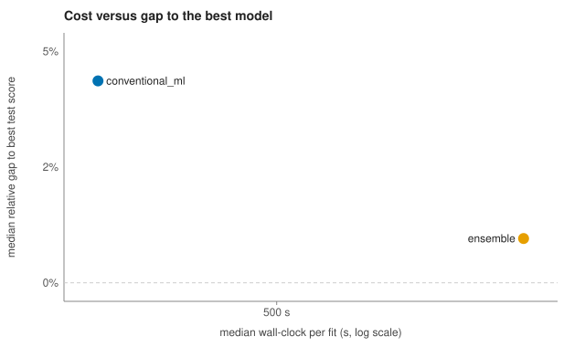
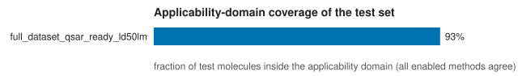

# QSARena run report

- Output directory: `benchmark_results\acute_ld50lm_qsar_ready_quick_20261007`
- Generated: 2026-10-07 17:32:10 with qsarena 0.1.0
- Mode: single; profile: quick; GPU: no
- 1 dataset(s): 1 completed
- Config signature: `584af2c2e526de93c98f09b06aa74b5edf99f8a74472f436abdaadfed6b716f6`

## Warnings

- **full_dataset_qsar_ready_ld50lm**: 1 SMILES (0.0%) cannot be parsed by RDKit and will be dropped. *Remedy:* Fix them in the CSV, or pass --no-drop-unparseable to stop instead of dropping.
- **full_dataset_qsar_ready_ld50lm**: 6.9% of parsed rows repeat a structure already present. *Remedy:* Merge them with --deduplicate canonical_smiles so one molecule cannot sit in both train and test.

## Datasets

| Dataset | Status | Task | Rows used | Unparseable SMILES dropped | Primary metric | Error / remedy |
|---|---|---|---|---|---|---|
| full_dataset_qsar_ready_ld50lm | completed | regression | 6954 | 1 | RMSE |  |

## Best model per dataset

Selection protocol: **both**. *Test-selected* picks the best held-out score, which is optimistic because the test set chooses. *CV-selected* picks the best cross-validated training score (only models that report one) and then shows its untouched test score: the honest estimate.

CV scores are computed on the training split after train-only feature selection on that same split, so they are optimistic in absolute terms: use them to rank models, and quote the test score of the CV-selected model.

| Dataset | Selected by | Best model | Family | Primary metric | CV score | Test score | Test RMSE | Test MAE | Test R2 | Test Spearman |
|---|---|---|---|---|---|---|---|---|---|---|
| full_dataset_qsar_ready_ld50lm | test (optimistic) | Ensemble (OOF Stacking (RidgeCV, 5-fold)) | ensemble | RMSE | – | 0.579 | 0.579 | 0.417 | 0.580 | 0.724 |
| full_dataset_qsar_ready_ld50lm | CV (honest) | Extra trees | conventional_ml | RMSE | 0.564 | 0.594 | 0.594 | 0.429 | 0.559 | 0.705 |


## Leaderboard / rank table

No dataset in this run has a leaderboard reference (ranks exist only for the curated benchmark datasets).

## Plots


Which model family produced each dataset's best model.



Each point is a model family: its median fitting time against its median relative gap to the best test score of the same dataset (0% = it was the best). Lower-left is cheap and competitive.



Share of each dataset's test molecules that every enabled applicability-domain method places inside the domain.

## Model failures and skipped stages

No model failed.

Skipped by design:

- full_dataset_qsar_ready_ld50lm / CFA (Combinatorial Fusion): skipped_insufficient_models

## What to do next

- On 1 dataset(s) the test-selected winner differs from the CV-selected one (full_dataset_qsar_ready_ld50lm). Choosing on the test set is optimistic; report the CV-selected model and its test score as the honest estimate.
- All scores come from one train/test split and one seed. Estimate split-to-split variance by repeating the run with other seeds.

  ```bash
  qsarena-benchmark --config "benchmark_results\acute_ld50lm_qsar_ready_quick_20261007/run_config.yaml" --random-seed 1 --output-dir "benchmark_results\acute_ld50lm_qsar_ready_quick_20261007_seed1"
  ```

- This was a quick-profile run (scikit-learn models only). Run the full model library once the data look right.

  ```bash
  qsarena-benchmark --config "benchmark_results\acute_ld50lm_qsar_ready_quick_20261007/run_config.yaml" --benchmark-profile cost_optimized --output-dir "benchmark_results\acute_ld50lm_qsar_ready_quick_20261007_full"
  ```

- Check new molecules against the training set's applicability domain before trusting their predictions.

  ```bash
  qsarena-applicability-domain --train_csv TRAIN.csv --smiles_col smiles --target_col target --query_smiles "CCO"
  ```


## Resolved configuration

Rerun exactly this configuration with `qsarena-benchmark --config run_config.yaml` (in this directory).

```yaml
run:
  mode: auto
  output_dir: "C:\\Users\\Scott.Coffin\\OneDrive - California OEHHA\\R_new\\AutoQSAR\\benchmark_results\\acute_ld50lm_qsar_ready_quick_20261007"
  resume: true
  overwrite: false
  verbosity: normal
  dry_run: false
  n_jobs: 12
  parallel_datasets: 1
  dataset_names: []
input:
  path: "C:\\Users\\Scott.Coffin\\Downloads\\full_dataset_qsar_ready_ld50lm.csv"
  smiles_col: QSAR_READY_SMILES
  target_col: LD50_LM
  id_col: null
  task: regression
  classification_threshold: null
  target_transform: raw
  minimum_rows: 20
  row_limit: 0
standardize:
  drop_unparseable: true
  strip_salts: false
  normalize_charges: false
  normalize_tautomers: false
  deduplicate: "none"
features:
  families: [morgan, ecfp6, fcfp6, layered, atom_pair, topological_torsion, rdk_path, maccs, rdkit]
  maplight_classic: true
  fingerprint_bits: 1024
  cache: true
  persistent_store: true
split:
  strategy: target_quartile
  test_fraction: 0.2
  seed: 13
  cv_folds: 5
  predefined_split_col: null
feature_selection:
  method: elasticnetcv
  variance_threshold: 1e-08
  binary_prevalence_range: [0.005, 0.995]
  drop_duplicate_columns: true
  max_selected_features: 0
  auto_rf_by_dataset_size: true
  elasticnet_timeout_seconds: 7200.0
  deterministic: false
  load_from: null
  cv_selection: outer
models:
  profile: quick
  enable_families:
    conventional_ml: true
    gradient_boosting: false
    deep_tabular: false
    graph_nn: false
    pretrained_3d: false
    maplight_gnn: false
    fusion: true
    ensemble: true
  disable_models: []
  only_models: []
  admetboost_xgboost: false
ga_tuning:
  mode: "off"
  estimators: [elastic_net, catboost]
  generations: 12
  population_size: 16
  time_budget_min: null
  max_configs: null
deep:
  use_gpu: auto
  chemprop:
    variants: []
    epochs: 15
    ensemble_size: 1
    batch_size: 32
    seed: 42
  unimol:
    v1: "false"
    v2: "false"
    v2_size: 84m
    epochs: 10
    lr: 0.0001
    batch_size: 32
    early_stopping_patience: 5
  chemml:
    pytorch: false
    tensorflow: false
    epochs: 80
  tabpfn: false
  tabpfn_max_features: 0
  cnn: false
fusion:
  cfa_score: true
  cfa_rank: true
  optimize_metric: mae
ensemble:
  oof_stacking: true
  inverse_rmse_average: true
  simple_average: false
  member_selection_metric: oof
  oof_folds: 5
  oof_scope: all
  oof_allow_api_refits: false
  oof_source_run: null
  exclude_negative_test_r2_members: true
  drop_correlated_members: true
  max_member_correlation: 0.995
  stacking_cv_folds: 5
applicability_domain:
  method: both
  confidence_threshold: 0.5
  knn_quantile: 0.95
evaluation:
  regression_metrics: [rmse, mae, r2, spearman]
  classification_metrics: [roc_auc, auprc, balanced_accuracy, mcc]
  primary_metric: auto
selection:
  protocol: both
report:
  formats: [html, md]
  include_plots: true
  what_next: true
  machine_readable_manifest: true
batch:
  source: null
  mode: auto
  continue_on_error: true
  aggregate_summary: true
multiseed:
  enabled: false
  seeds: 5
caching:
  granularity: [dataset, stage]
  validate_against_config_signature: true
  atomic_writes: true
```

## Files

- `run_config.json`
- `run_config.yaml`
- `environment_manifest.json`
- `dataset_summary.csv`
- `summary_metrics.csv`
- `predictions.csv`
- `run.log`
- `events.jsonl`
- `preflight.json`
