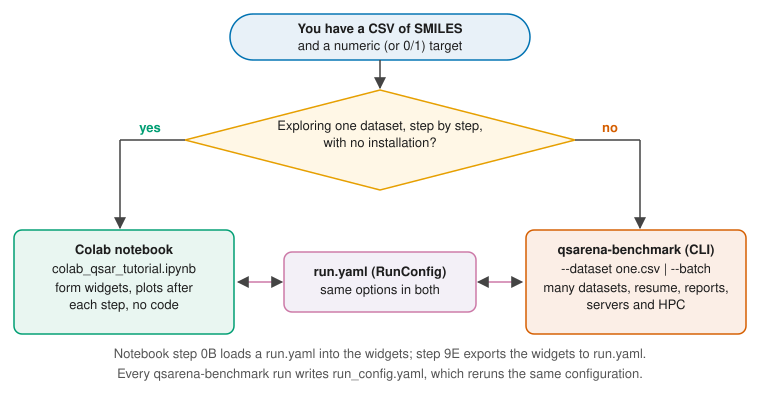
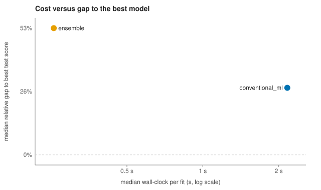

# QSARena: a guided installation and usage tutorial

This tutorial takes you from installation to a finished, reported QSAR model, first on one dataset and then
on many. Every command in it is copied from an automated test (`tests/docs/test_tutorial_runs.py`) that
runs the commands on the small example datasets shipped with QSARena and checks the printed output. If a
command or output here stops matching the software, that test fails.

**How to read the commands.** Commands are written for a POSIX shell (Linux, macOS, WSL, Git Bash, or a
Colab cell prefixed with `!`). In Windows PowerShell, put a command that is split over several lines onto
one line, or replace each trailing `\` with a backtick (`` ` ``). Output shown after a command is a
trimmed excerpt: `...` stands for text that varies between machines (timings, paths, scores) or for lines
left out.

> **The example data are synthetic.** The molecules are real structures, but every target value in the
> tutorial files was generated from a fixed formula of RDKit descriptors plus noise. They exist to show
> how the software behaves, not to model any real property.

## 1. Overview and choosing an entry point

QSARena turns a table of SMILES strings and a measured property into a compared set of models: it
standardizes the structures, builds molecular features, splits the data, selects features on the
training split only, trains a library of conventional, deep and pretrained models, optionally fuses and
ensembles them, and reports which one to trust and how much.

There are two ways in, and they share one set of options:

- **The Colab notebook** (`colab_qsar_tutorial.ipynb`) is for exploring one dataset without installing
  anything. Each step is a form with widgets and shows its plots as it goes.
- **The command-line runner** (`qsarena-benchmark`) is for everything that should be repeatable: one
  dataset or hundreds, runs that resume after an interruption, runs on a server or HPC node, and the
  HTML/Markdown reports.

Both read the same configuration schema, `RunConfig`. A `run.yaml` file written for one works in the
other (Section 4), so you can explore in the notebook and then run the same choices in batch.



## 2. Installation

### 2a. Google Colab (no installation)

Open the notebook from the badge in the repository README, or directly:
<https://colab.research.google.com/github/ScottCoffin/QSARena/blob/main/portable_colab_qsar_bundle/colab_qsar_tutorial.ipynb>.
Step 0 installs what it needs into the Colab session (a runtime restart may be requested once). Nothing is
installed on your own computer.

### 2b. pip

QSARena needs Python 3.10 or newer. The core install is CPU-only and resolves on any platform with RDKit
wheels:

<!-- doctest: skip reason="installs packages; CI installs the package itself" -->
```bash
python -m pip install qsarena
```

Heavier model families are optional extras. Install only what you need: preflight lists every missing
backend with its install command, the affected models are skipped or recorded as failed with a remedy,
and the rest of the run continues.

| Extra | Adds | Install when you want |
|---|---|---|
| `boosting` | XGBoost, LightGBM, CatBoost | gradient-boosted trees and MapLight CatBoost (recommended) |
| `deep` | PyTorch, TensorFlow | the ChemML MLP and the tabular CNN |
| `graph` | Chemprop v2 and helpers | Chemprop graph neural networks |
| `foundation` | TabPFN, Uni-Mol tools | TabPFN and the Uni-Mol pretrained 3D models (GPU recommended) |
| `benchmarks` | openpyxl, pyarrow, python-dotenv | the Parquet feature store and workbook inputs |
| `notebook` | Jupyter, ipywidgets, plotting | running the notebook locally |
| `tdc` | PyTDC | the curated TDC benchmark datasets (Python 3.10-3.12 only) |
| `all` | everything above except `tdc` and `chemml` | a full CPU installation |

<!-- doctest: skip reason="installs packages" -->
```bash
python -m pip install "qsarena[boosting]"
python -m pip install "qsarena[all]"
```

MapLight + GNN additionally needs `dgl` and `dgllife`, which are not on PyPI for most platforms; the
README section "Installation via pip" gives the wheel index. To work on the source instead, clone the
repository and install it in editable mode:

<!-- doctest: skip reason="needs network access and a git clone" -->
```bash
git clone https://github.com/ScottCoffin/QSARena.git
cd QSARena
python -m pip install -e ".[boosting]"
```

### 2c. Exact reproduction of the published environment

The repository pins the environment used for the paper: `requirements-cpu.txt` / `requirements-cuda.txt`
for pip and `environment-cpu.yml` / `environment-cuda.yml` for conda. Use them when you need the same
package versions as the deposited benchmark, not for everyday use.

<!-- doctest: skip reason="creates a conda environment" -->
```bash
conda env create -f environment-cpu.yml
python -m pip install -r requirements-cpu.txt
```

### 2d. Checking the installation

<!-- doctest: run id=version -->
```bash
qsarena-benchmark --version
```

<!-- expect: version -->
```text
qsarena ...
```

`qsarena-benchmark --help` lists every option, grouped into the fifteen decision groups of Section 4:

<!-- doctest: run id=help -->
```bash
qsarena-benchmark --help
```

<!-- expect: help -->
```text
usage: qsarena-benchmark [-h] [--version] ...
...
1. Input & columns:
...
15. Execution:
...
```

### 2e. GPU or CPU

Everything runs on a CPU. A CUDA GPU speeds up the deep models and is required for Uni-Mol V2. By
default (`--use-gpu auto`) QSARena detects a GPU and, when there is none, skips Uni-Mol and runs Chemprop
and the other deep models on the CPU; the preflight check says so before any model is trained.
`--use-gpu false` hides a GPU on purpose (useful on a shared machine); `--use-gpu true` treats one as
present.

## 3. Quickstart: one dataset in five minutes

`qsarena-examples` copies the tutorial datasets into a folder. Run the rest of the tutorial from inside it.

<!-- doctest: run id=examples -->
```bash
qsarena-examples qsarena_tutorial
cd qsarena_tutorial
```

<!-- expect: examples -->
```text
Wrote 8 file(s) to ...qsarena_tutorial
solubility.csv
bbb.csv
broken.csv
batch_manifest.csv
batch_dir/permeability.csv
batch_dir/lipophilicity.csv
typo_run.yaml
run.yaml
```

`solubility.csv` has an identifier column, a SMILES column and two targets:

<!-- doctest: run id=peek -->
```bash
cat solubility.csv
```

<!-- expect: peek -->
```text
compound_id,smiles,logS,logD
SOL-001,...
...
SOL-046,this_is_not_a_smiles,-3.0000,1.0000
...
```

One command trains and compares the models. `--benchmark-profile quick` keeps only the fast scikit-learn
model families so this finishes in a few minutes on a laptop; leave it out to use the full default
library.

<!-- doctest: run id=quickstart timeout=1200 -->
```bash
qsarena-benchmark --dataset solubility.csv --target-col logS --id-col compound_id \
    --benchmark-profile quick --output-dir runs/quickstart
```

<!-- expect: quickstart -->
```text
Preflight checks:
- solubility: 47 rows, parse rate 97.9% (1 unparseable, 0 missing), duplicates 2.2%, task=regression
[preflight] warning solubility: 1 SMILES (2.1%) cannot be parsed by RDKit and will be dropped. -> Fix them in the CSV, or pass --no-drop-unparseable to stop instead of dropping.
[preflight] warning solubility: 46 usable rows: the test split will hold about 10 molecules, so test metrics are noisy. -> ...
...
Run mode: single (1 dataset(s))
...
[1/1] solubility | stage 1/13: loading ...
...
[1/1] solubility | stage 4/13: conventional model ElasticNetCV | ...
...
[1/1] solubility | stage 13/13: ensemble (2 method(s)) | ...
[overall 1/1] status=completed | ...
...
Dataset summary: 1 completed (see dataset_summary.csv)
Wrote benchmark outputs to runs...quickstart
...
Reports written: report.html and report.md in runs...quickstart
```

What happened, in order:

1. **Preflight** read the file before any training: 47 rows, one SMILES that RDKit cannot parse (it will
   be dropped and reported), 2.2% duplicated structures, and a regression task. With 46 usable
   molecules the test split is tiny, and preflight says what that means for the scores.
2. **Stages 1-3** standardized the structures, built the molecular features and split the data (80/20,
   stratified on target quartiles), then selected features using the training split only.
3. **Stages 4 onward** trained one model per stage. The progress line shows the stage, elapsed time and
   an ETA for the dataset.
4. The run wrote its outputs and the two reports.

The output directory holds everything:

<!-- doctest: run id=tour -->
```bash
ls runs/quickstart
ls runs/quickstart/solubility
```

<!-- expect: tour -->
```text
artifact_manifest.csv
dataset_summary.csv
environment_manifest.json
events.jsonl
...
preflight.json
report.html
report.md
report_assets/
report_data.json
run.log
run_config.json
run_config.yaml
...
solubility/
summary_metrics.csv
...
applicability_domain.csv
...
metrics.csv
predictions.csv
run_status.json
selected_features.csv
...
```

| File | What it is |
|---|---|
| `report.html`, `report.md` | The run report (Section 7). Open `report.html` in a browser; it is self-contained. |
| `dataset_summary.csv` | One row per dataset: status, best model by test and by CV, error and remedy. |
| `solubility/metrics.csv` | One row per model: train/CV/test metrics, runtime, parameters, split hashes. |
| `solubility/predictions.csv` | Every train and test prediction, with your `compound_id` in the `id` column. |
| `solubility/applicability_domain.csv` | Per test molecule: in or out of the applicability domain (Section 8). |
| `run_config.yaml` | The fully resolved configuration; reruns this exact run (Section 9). |
| `run.log`, `events.jsonl` | The console transcript and a machine-readable event stream (Section 7). |

**The same in the notebook (three clicks).** Open the notebook in Colab (Section 2a), choose
*Runtime > Run all*, and it works through its built-in example dataset step by step. Some optional
deep-learning steps install packages and may ask for one runtime restart; run again from step 0 afterwards.
For your own data, set `data_source` to `Upload CSV/XLSX (Colab only)` in step 1A.

## 4. The decision reference

Every choice QSARena makes is one option of `RunConfig`, in one of fifteen groups. You can set an option
in three places, and the most specific wins:

1. a command-line flag, such as `--test-fraction 0.25`;
2. a key in a `run.yaml` passed with `--config`, such as `split: {test_fraction: 0.25}`;
3. the built-in default.

The notebook widget that makes the same choice is listed next to each option; options without a widget
are available on the command line and in `run.yaml` only. The complete, commented `run.yaml` with every
default is at the end of this section, `docs/options_reference.md` repeats every option with its full
description, and a mistyped key or value is rejected with the allowed values:

<!-- doctest: run id=badconfig exit=2 -->
```bash
cat typo_run.yaml
qsarena-benchmark --config typo_run.yaml
```

<!-- expect: badconfig -->
```text
...
split:
  strategy: scafold
models:
  profle: quick
[error] configuration: 2 problem(s) in typo_run.yaml:
- split.strategy: 'scafold' is not one of target_quartile, random, scaffold, predefined. Did you mean 'scaffold'?
- models.profle: unknown option in typo_run.yaml. Did you mean 'models.profile'? See docs/options_reference.md for every key.
```

The starter `run.yaml` written by `qsarena-examples` sets a handful of options and leaves the rest at
their defaults:

<!-- doctest: run id=runyaml -->
```bash
cat run.yaml
```

<!-- expect: runyaml -->
```text
...
run:
  output_dir: runs/solubility_config
input:
  path: solubility.csv
...
standardize:
  strip_salts: true
  deduplicate: canonical_smiles
models:
  profile: quick
...
```

<!-- doctest: run id=configrun timeout=1200 -->
```bash
qsarena-benchmark --config run.yaml
```

<!-- expect: configrun -->
```text
...
Config file: ...run.yaml (11 key(s) set; CLI flags override them)
...
[info] solubility: dropped 1 unparseable SMILES.
[info] solubility: deduplicate=canonical_smiles removed 2 row(s).
...
Dataset summary: 1 completed (see dataset_summary.csv)
```

Paths inside a `run.yaml` are relative to the file itself. Any flag added to the command overrides the
file, for example `qsarena-benchmark --config run.yaml --test-fraction 0.3`.

### 4.1 Input & columns

*What it controls:* which file(s) to read, which columns hold the SMILES, the target and an identifier, and
whether the task is regression or classification. *Defaults:* the SMILES and target columns are
auto-detected from common names (`smiles`, `SMILES`, `canonical_smiles`, `target`, `TARGET`, ...); the
task is `auto` (a target with exactly two values is classification). *When to change:* name the columns
whenever auto-detection guesses wrong or your file has several candidate columns; give `--id-col` to carry
compound IDs into `predictions.csv`; list several targets (`--target-col t1 --target-col t2`, or
`target_col: [t1, t2]`) to model each separately; binarize a continuous measurement with
`--classification-threshold` (values at or above the threshold become 1). `target_transform: auto`
log10-transforms a user regression target only when every value is positive; use `raw` to keep the scale.
`minimum_rows` (default 20) skips datasets too small to split.

<!-- BEGIN GENERATED: options-group 1 -->
| Key | Default | Allowed values | CLI flag | Notebook widget |
|------------------------|----------------|------------------------|--------------------|----------------|
| `input.path` | `null` | path/name or list | `--dataset` | CLI / run.yaml only |
| `input.smiles_col` | `null` (auto-detect (QSAR_READY_SMILES, canonical_smiles, SMILES, smiles, Smiles)) | text | `--smiles-col` | `smiles_column` |
| `input.target_col` | `null` (auto-detect (TARGET, target, Target, ...)) | path/name or list | `--target-col` | `target_column` |
| `input.id_col` | `null` | text | `--id-col` | CLI / run.yaml only |
| `input.task` | `auto` | `auto`, `regression`, `classification` | `--task` | CLI / run.yaml only |
| `input.classification_threshold` | `null` | float | `--classification-threshold` | CLI / run.yaml only |
| `input.target_transform` | `auto` | `auto`, `raw`, `log10` | `--target-transform` | CLI / run.yaml only |
| `input.minimum_rows` | `20` | int (>= 2) | `--minimum-rows` | CLI / run.yaml only |
| `input.row_limit` | `0` | int (>= 0) | `--row-limit` | CLI / run.yaml only |
<!-- END GENERATED -->

### 4.2 Standardization

*What it controls:* what happens to each structure before featurization. *Default:* unparseable SMILES are
dropped and counted; nothing else is changed. *When to change:* turn on `strip_salts` for data exported
from registration systems (counter-ions otherwise become features), `normalize_charges` when the same
compound appears in several protonation states, and `deduplicate: canonical_smiles` whenever a structure
can appear more than once, so that one molecule cannot end up in both the training and the test split
(preflight warns above 5% duplicates). `--no-drop-unparseable` stops the dataset instead of dropping rows,
for pipelines where silently losing data is unacceptable (see Section 10).

<!-- BEGIN GENERATED: options-group 2 -->
| Key | Default | Allowed values | CLI flag | Notebook widget |
|------------------------|----------------|------------------------|--------------------|----------------|
| `standardize.drop_unparseable` | `true` | true / false | `--drop-unparseable / --no-drop-unparseable` | CLI / run.yaml only |
| `standardize.strip_salts` | `false` | true / false | `--strip-salts / --no-strip-salts` | CLI / run.yaml only |
| `standardize.normalize_charges` | `false` | true / false | `--normalize-charges / --no-normalize-charges` | CLI / run.yaml only |
| `standardize.normalize_tautomers` | `false` | true / false | `--normalize-tautomers / --no-normalize-tautomers` | CLI / run.yaml only |
| `standardize.deduplicate` | `"none"` | `none`, `exact`, `canonical_smiles` | `--deduplicate` | `collapse_duplicate_canonical_smiles` |
<!-- END GENERATED -->

### 4.3 Featurization

*What it controls:* the molecular representations concatenated into the feature matrix: nine fingerprint
and descriptor families plus the MapLight-classic composite (Morgan counts, Avalon counts, ErG and a panel
of RDKit descriptors). *Default:* all ten, 1024-bit fingerprints, with feature caching on. *When to
change:* drop families to make runs faster or to test which representation carries the signal; turn the
caches off only to measure featurization time. Caches are keyed by the molecules and the settings, so
they are always safe to reuse.

<!-- BEGIN GENERATED: options-group 3 -->
| Key | Default | Allowed values | CLI flag | Notebook widget |
|------------------------|----------------|------------------------|--------------------|----------------|
| `features.families` | `[morgan, ecfp6, fcfp6, layered, atom_pair, topological_torsion, rdk_path, maccs, rdkit]` | list of `morgan`, `ecfp6`, `fcfp6`, `layered`, `atom_pair`, `topological_torsion`, `rdk_path`, `maccs`, `rdkit`, `maplight` | `--feature-families` | `use_morgan_features`, `use_ecfp6_features`, `use_fcfp6_features`, `use_layered_features`, `use_atom_pair_features`, `use_topological_torsion_features`, `use_rdk_path_features`, `use_maccs_keys`, `use_rdkit_descriptors` |
| `features.maplight_classic` | `true` | true / false | `--maplight-classic / --no-maplight-classic` | `use_maplight_classic` |
| `features.fingerprint_bits` | `1024` | int (>= 64) | `--fingerprint-bits` | `fingerprint_bits` |
| `features.cache` | `true` | true / false | `--enable-shared-feature-matrix-cache / --reuse-shared-feature-matrix-cache` | CLI / run.yaml only |
| `features.persistent_store` | `true` | true / false | `--enable-persistent-feature-store / --reuse-persistent-feature-store` | `enable_persistent_feature_store`, `reuse_persistent_feature_store` |
<!-- END GENERATED -->

### 4.4 Splitting

*What it controls:* how the held-out test set is chosen. *Default:* a random 80/20 split stratified on
target quartiles, seed 13, 5-fold CV inside the training split. *When to change:* use `scaffold` to test
extrapolation to new chemical series (harder and more realistic for prospective use), `random` for
classification or when quartile stratification is impossible, and `predefined` with
`--predefined-split-col` when your file already marks train/test rows. The curated benchmark datasets
always keep their published split.

<!-- BEGIN GENERATED: options-group 4 -->
| Key | Default | Allowed values | CLI flag | Notebook widget |
|------------------------|----------------|------------------------|--------------------|----------------|
| `split.strategy` | `target_quartile` | `target_quartile`, `random`, `scaffold`, `predefined` | `--split-strategy` | `data_split_strategy` |
| `split.test_fraction` | `0.2` | float (>= 0.05, <= 0.5) | `--test-fraction` | `test_fraction` |
| `split.seed` | `13` | int | `--random-seed` | `model_random_seed` |
| `split.cv_folds` | `5` | int (>= 2) | `--cv-folds` | `cv_folds` |
| `split.predefined_split_col` | `null` | text | `--predefined-split-col` | CLI / run.yaml only |
<!-- END GENERATED -->

### 4.5 Feature selection

*What it controls:* the train-only filtering and selection that turns thousands of features into a few
hundred. *Default:* drop constant and near-constant columns, rare or near-universal bits and exact
duplicate columns, then keep the features with non-zero ElasticNetCV coefficients (at most 10% of the
training rows), falling back to random-forest importance for very large datasets or on a timeout. *When
to change:* `rf_fallback` skips ElasticNetCV (fast; used by the tests); `none` keeps every column (useful
for models that do their own selection, but slower and noisier).

<!-- BEGIN GENERATED: options-group 5 -->
| Key | Default | Allowed values | CLI flag | Notebook widget |
|------------------------|----------------|------------------------|--------------------|----------------|
| `feature_selection.method` | `elasticnetcv` | `elasticnetcv`, `rf_fallback`, `none` | `--selector-method` | `feature_selector_method` |
| `feature_selection.variance_threshold` | `1e-08` | float (>= 0.0) | `--variance-threshold` | CLI / run.yaml only |
| `feature_selection.binary_prevalence_range` | `[0.005, 0.995]` | [low, high] | `--binary-prevalence-range` | CLI / run.yaml only |
| `feature_selection.drop_duplicate_columns` | `true` | true / false | `--drop-duplicate-columns / --no-drop-duplicate-columns` | CLI / run.yaml only |
| `feature_selection.max_selected_features` | `0` | int (>= 0) | `--max-selected-features` | CLI / run.yaml only |
| `feature_selection.auto_rf_by_dataset_size` | `null` (profile default (on for cost_optimized/quick, off for full)) | true / false | `--selector-auto-rf-by-dataset-size / --no-selector-auto-rf-by-dataset-size` | CLI / run.yaml only |
| `feature_selection.elasticnet_timeout_seconds` | `7200.0` | float (>= 1.0) | `--selector-elasticnet-timeout-seconds` | CLI / run.yaml only |
<!-- END GENERATED -->

### 4.6 Model library

*What it controls:* which models are trained. *Default:* the `cost_optimized` profile, which leaves out
variants that were expensive and rarely helped in the paper's benchmark. `full` restores them; `quick`
keeps only the scikit-learn family plus fusion and ensembles. *When to change:* use `quick` for a first
look or a smoke test, `full` for a final comparison; switch whole families off with
`--disable-model-families` (for example `graph_nn,pretrained_3d` on a laptop) or single models with
`--disable-model "Tabular CNN"`.

<!-- BEGIN GENERATED: options-group 6 -->
| Key | Default | Allowed values | CLI flag | Notebook widget |
|------------------------|----------------|------------------------|--------------------|----------------|
| `models.profile` | `cost_optimized` | `cost_optimized`, `full`, `quick` | `--benchmark-profile` | CLI / run.yaml only |
| `models.enable_families` | all `true` | mapping of `conventional_ml`, `gradient_boosting`, `deep_tabular`, `graph_nn`, `pretrained_3d`, `maplight_gnn`, `fusion`, `ensemble` to true/false | `--disable-model-families` | `run_maplight_gnn` |
| `models.disable_models` | `[]` | text | `--disable-model` | CLI / run.yaml only |
| `models.only_models` | `[]` | text | `--only-model-names` | CLI / run.yaml only |
<!-- END GENERATED -->

### 4.7 GA tuning

*What it controls:* an optional genetic-algorithm hyperparameter search for elastic-net and CatBoost, scored
by cross-validation on the training split. *Default:* off. *When to change:* `--ga-models on` tunes the
estimators in `--ga-estimators`; `auto` tunes only estimators that won or improved in your most recent
comparable run. `--ga-time-budget-minutes` and `--ga-max-configs` cap the cost.

<!-- BEGIN GENERATED: options-group 7 -->
| Key | Default | Allowed values | CLI flag | Notebook widget |
|------------------------|----------------|------------------------|--------------------|----------------|
| `ga_tuning.mode` | `"off"` | `off`, `on`, `auto` | `--ga-models off\|on\|auto` | CLI / run.yaml only |
| `ga_tuning.estimators` | `[elastic_net, catboost]` | list of `elastic_net`, `catboost` | `--ga-estimators` | `tune_elasticnet`, `tune_catboost` |
| `ga_tuning.generations` | `12` | int (>= 1) | `--ga-generations` | `ga_generations` |
| `ga_tuning.population_size` | `16` | int (>= 2) | `--ga-population-size` | `ga_population_size` |
| `ga_tuning.time_budget_min` | `null` (no limit) | float (>= 0.0) | `--ga-time-budget-minutes` | CLI / run.yaml only |
| `ga_tuning.max_configs` | `null` (no limit) | int (>= 1) | `--ga-max-configs` | CLI / run.yaml only |
<!-- END GENERATED -->

### 4.8 Deep / pretrained backends

*What it controls:* the ChemML MLP, the tabular CNN, TabPFN, Chemprop v2 graph networks and the Uni-Mol
pretrained 3D models. *Default:* decided by the profile and by GPU detection (Uni-Mol runs only with a
GPU). *When to change:* choose Chemprop variants and epochs explicitly for a final model, lower batch sizes
when a GPU runs out of memory, and set `--use-gpu false` to keep a shared GPU free. Each backend needs its
extra from Section 2b; preflight lists what is missing and how to install it.

<!-- BEGIN GENERATED: options-group 8 -->
| Key | Default | Allowed values | CLI flag | Notebook widget |
|------------------------|----------------|------------------------|--------------------|----------------|
| `deep.use_gpu` | `auto` | auto / true / false | `--use-gpu` | CLI / run.yaml only |
| `deep.chemprop.variants` | `null` (profile default (cost_optimized: attentivefp + selected_features; full: all five)) | list of `dmpnn`, `dmpnn_rdkit2d`, `selected_features`, `cmpnn`, `attentivefp` | `--run-chemprop-*` | CLI / run.yaml only |
| `deep.chemprop.epochs` | `null` (profile default (15; full: 40)) | int (>= 1) | `--chemprop-epochs` | CLI / run.yaml only |
| `deep.chemprop.ensemble_size` | `null` (profile default (1; full: 3)) | int (>= 1) | `--chemprop-ensemble-size` | CLI / run.yaml only |
| `deep.chemprop.batch_size` | `32` | int (>= 1) | `--chemprop-batch-size` | CLI / run.yaml only |
| `deep.chemprop.seed` | `42` | int | `--chemprop-random-seed` | CLI / run.yaml only |
| `deep.unimol.v1` | `auto` | auto / true / false | `--run-unimol-v1 / --no-run-unimol-v1` | CLI / run.yaml only |
| `deep.unimol.v2` | `auto` | auto / true / false | `--run-unimol-v2 / --no-run-unimol-v2` | CLI / run.yaml only |
| `deep.unimol.v2_size` | `84m` | `84m`, `164m`, `310m` | `--unimol-model-size` | CLI / run.yaml only |
| `deep.unimol.epochs` | `null` (10 on CPU, 20 when a GPU is detected) | int (>= 1) | `--unimol-epochs` | CLI / run.yaml only |
| `deep.unimol.lr` | `0.0001` | float (>= 0.0) | `--unimol-learning-rate` | CLI / run.yaml only |
| `deep.unimol.batch_size` | `null` (32 on CPU; 32/64/128 by detected GPU memory) | int (>= 1) | `--unimol-batch-size` | CLI / run.yaml only |
| `deep.unimol.early_stopping_patience` | `5` | int (>= 1) | `--unimol-early-stopping` | CLI / run.yaml only |
| `deep.chemml.pytorch` | `true` | true / false | `--run-chemml-pytorch / --no-run-chemml-pytorch` | `run_chemml_pytorch` |
| `deep.chemml.tensorflow` | `null` (profile default (off; full: on)) | true / false | `--run-chemml-tensorflow / --no-run-chemml-tensorflow` | `run_chemml_tensorflow` |
| `deep.chemml.epochs` | `80` | int (>= 1) | `--chemml-training-epochs` | `chemml_training_epochs` |
| `deep.tabpfn` | `null` (profile default (on; quick: off)) | true / false | `--run-tabpfn / --no-run-tabpfn` | CLI / run.yaml only |
| `deep.cnn` | `null` (profile default (on; quick: off)) | true / false | `--run-cnn / --no-run-cnn` | CLI / run.yaml only |
<!-- END GENERATED -->

### 4.9 Fusion

*What it controls:* combinatorial fusion analysis (CFA), which combines the best model of each workflow
family by score or rank. *Default:* on, with rank combinations. CFA needs at least two workflow families,
so in the quick profile it is recorded as skipped. *When to change:* rarely; turn it off to save time
when you do not need the fused model.

<!-- BEGIN GENERATED: options-group 9 -->
| Key | Default | Allowed values | CLI flag | Notebook widget |
|------------------------|----------------|------------------------|--------------------|----------------|
| `fusion.cfa_score` | `true` | true / false | `--run-cfa / --no-run-cfa` | CLI / run.yaml only |
| `fusion.cfa_rank` | `true` | true / false | `--cfa-include-rank-combinations / --no-cfa-include-rank-combinations` | CLI / run.yaml only |
| `fusion.optimize_metric` | `mae` | `mae`, `rmse`, `roc_auc`, `auprc`, `balanced_accuracy`, `mcc`, `accuracy` | `--cfa-optimize-metric` | CLI / run.yaml only |
<!-- END GENERATED -->

### 4.10 Ensembles

*What it controls:* the ensembles built from the trained models: out-of-fold stacking with RidgeCV and an
average weighted by inverse training RMSE (a simple average is optional). *Default:* both, with members
admitted using training-split predictions only (`member_selection_metric: cv`), which keeps the test set
out of every decision. `test` reproduces the originally deposited benchmark run and is optimistically
biased; use it only for exact reproduction.

<!-- BEGIN GENERATED: options-group 10 -->
| Key | Default | Allowed values | CLI flag | Notebook widget |
|------------------------|----------------|------------------------|--------------------|----------------|
| `ensemble.oof_stacking` | `true` | true / false | `--ensemble-methods` | CLI / run.yaml only |
| `ensemble.inverse_rmse_average` | `true` | true / false | `--ensemble-methods` | CLI / run.yaml only |
| `ensemble.simple_average` | `false` | true / false | `--ensemble-methods` | CLI / run.yaml only |
| `ensemble.member_selection_metric` | `oof` | `oof`, `cv`, `test` | `--ensemble-member-selection-split` | CLI / run.yaml only |
| `ensemble.oof_folds` | `5` | int (>= 2) | `--ensemble-oof-folds` | CLI / run.yaml only |
| `ensemble.oof_scope` | `all` | `all`, `cpu` | `--ensemble-oof-scope` | CLI / run.yaml only |
| `ensemble.oof_allow_api_refits` | `false` | true / false | `--ensemble-oof-allow-api-refits / --no-ensemble-oof-allow-api-refits` | CLI / run.yaml only |
| `ensemble.oof_source_run` | `null` (look only in this run) | text | `--ensemble-oof-source-run` | CLI / run.yaml only |
| `ensemble.exclude_negative_test_r2_members` | `true` | true / false | `--ensemble-exclude-negative-test-r2-members / --no-ensemble-exclude-negative-test-r2-members` | CLI / run.yaml only |
| `ensemble.drop_correlated_members` | `true` | true / false | `--ensemble-drop-highly-correlated-members / --no-ensemble-drop-highly-correlated-members` | CLI / run.yaml only |
| `ensemble.max_member_correlation` | `0.995` | float (>= 0.0, <= 1.0) | `--ensemble-max-train-correlation` | CLI / run.yaml only |
| `ensemble.stacking_cv_folds` | `5` | int (>= 2) | `--ensemble-stacking-cv-folds` | CLI / run.yaml only |
<!-- END GENERATED -->

### 4.11 Applicability domain

*What it controls:* a per-test-molecule flag saying whether the model is interpolating or extrapolating
(Section 8). *Default:* `both` (descriptor standardization and a confidence measure). It never changes a
metric. *When to change:* `off` saves a few seconds on very large test sets.

<!-- BEGIN GENERATED: options-group 11 -->
| Key | Default | Allowed values | CLI flag | Notebook widget |
|------------------------|----------------|------------------------|--------------------|----------------|
| `applicability_domain.method` | `both` | `standardization`, `confidence`, `both`, `off` | `--ad-method` | CLI / run.yaml only |
| `applicability_domain.confidence_threshold` | `0.5` | float (>= 0.0, <= 1.0) | `--ad-confidence-threshold` | CLI / run.yaml only |
| `applicability_domain.knn_quantile` | `0.95` | float (>= 0.5, <= 0.999) | `--ad-knn-quantile` | CLI / run.yaml only |
<!-- END GENERATED -->

### 4.12 Evaluation

*What it controls:* the primary metric used to rank models and the metrics shown in the report. *Default:*
the benchmark's leaderboard metric for curated datasets, otherwise RMSE (regression) or AUROC
(classification); every metric is always written to `metrics.csv`. *When to change:* use
`--primary-metric auprc` or `balanced_accuracy` for imbalanced classes (preflight suggests this), or
`mae` when large errors should not dominate.

<!-- BEGIN GENERATED: options-group 12 -->
| Key | Default | Allowed values | CLI flag | Notebook widget |
|------------------------|----------------|------------------------|--------------------|----------------|
| `evaluation.regression_metrics` | `[rmse, mae, r2, spearman]` | list of `rmse`, `mae`, `r2`, `spearman` | `--report-regression-metrics` | CLI / run.yaml only |
| `evaluation.classification_metrics` | `[roc_auc, auprc, balanced_accuracy, mcc]` | list of `roc_auc`, `auprc`, `balanced_accuracy`, `mcc` | `--report-classification-metrics` | CLI / run.yaml only |
| `evaluation.primary_metric` | `auto` | `auto`, `rmse`, `mae`, `r2`, `spearman`, `pearson`, `roc_auc`, `auprc`, `balanced_accuracy`, `mcc`, `accuracy` | `--primary-metric` | CLI / run.yaml only |
<!-- END GENERATED -->

### 4.13 Model-selection protocol

*What it controls:* how the report names each dataset's best model. The **test-selected** winner has the
best held-out score, which is optimistic because the test set did the choosing. The **CV-selected**
winner has the best cross-validated training score, and its test score is an honest estimate of future
performance. *Default:* `both`, side by side. When they disagree, quote the CV-selected model.

<!-- BEGIN GENERATED: options-group 13 -->
| Key | Default | Allowed values | CLI flag | Notebook widget |
|------------------------|----------------|------------------------|--------------------|----------------|
| `selection.protocol` | `both` | `test`, `cv`, `both` | `--selection-protocol` | CLI / run.yaml only |
<!-- END GENERATED -->

### 4.14 Outputs, reporting & caching

*What it controls:* where results go, how chatty the run is, which report sections are written, and how
resume treats cached work (Section 6). Both report formats are always written. `--verbosity quiet` shows
only warnings and the final summary (the full transcript still goes to `run.log`); `verbose` adds
stage-level events to `events.jsonl` and echoes backend commands.

<!-- BEGIN GENERATED: options-group 14 -->
| Key | Default | Allowed values | CLI flag | Notebook widget |
|------------------------|----------------|------------------------|--------------------|----------------|
| `run.output_dir` | `null` (benchmark_results/qsarena_benchmark_<timestamp>) | text | `--output-dir` | CLI / run.yaml only |
| `run.resume` | `true` | true / false | `--resume / --no-resume` | CLI / run.yaml only |
| `run.overwrite` | `false` | true / false | `--fresh` | CLI / run.yaml only |
| `run.verbosity` | `normal` | `quiet`, `normal`, `verbose`, `debug` | `--verbosity` | CLI / run.yaml only |
| `report.formats` | `[html, md]` | list of `html`, `md` | (fixed) | CLI / run.yaml only |
| `report.include_plots` | `true` | true / false | `--report-plots / --no-report-plots` | CLI / run.yaml only |
| `report.what_next` | `true` | true / false | `--report-what-next / --no-report-what-next` | CLI / run.yaml only |
| `report.machine_readable_manifest` | `true` | true / false | `--report-manifest / --no-report-manifest` | CLI / run.yaml only |
| `caching.granularity` | `[dataset, stage]` | list of `dataset`, `stage` | `--resume-granularity` | CLI / run.yaml only |
| `caching.validate_against_config_signature` | `true` | true / false | `--validate-resume-signature / --no-validate-resume-signature` | CLI / run.yaml only |
| `caching.atomic_writes` | `true` | true / false | `--atomic-writes / --no-atomic-writes` | CLI / run.yaml only |
<!-- END GENERATED -->

### 4.15 Execution

*What it controls:* single versus batch mode, how many CPU cores and parallel datasets to use, dry runs,
and the multi-seed re-evaluation of the official TDC benchmark datasets. `--dry-run` runs the preflight
checks and prints the plan and an estimated cost without training anything:

<!-- doctest: run id=dryrun -->
```bash
qsarena-benchmark --dataset solubility.csv --target-col logS --output-dir runs/plan --dry-run
```

<!-- expect: dryrun -->
```text
Preflight checks:
...
Planned model stages (datasets x models):
- solubility: ... planned, ... skipped; est. ~...
planned: ElasticNetCV, SVR, Random forest, ...
...
Estimated total wall-clock: ~... (order of magnitude; method in preflight.json)
Dry run complete: no model was fitted. Plan written to runs...plan...dry_run_plan.md
```

The estimate scales the median fitting time of each model family measured in the paper's A100 benchmark
run with the size of your dataset (and assumes GPU families are slower without a GPU). Treat it as an
order of magnitude.

<!-- BEGIN GENERATED: options-group 15 -->
| Key | Default | Allowed values | CLI flag | Notebook widget |
|------------------------|----------------|------------------------|--------------------|----------------|
| `run.mode` | `auto` | `auto`, `single`, `batch`, `benchmark` | `--run-mode` | CLI / run.yaml only |
| `run.dry_run` | `false` | true / false | `--dry-run` | CLI / run.yaml only |
| `run.n_jobs` | `0` | int | `--n-jobs` | CLI / run.yaml only |
| `run.parallel_datasets` | `1` | int (>= 1) | `--parallel-datasets` | CLI / run.yaml only |
| `run.dataset_names` | `[]` | text | `--dataset-name` | CLI / run.yaml only |
| `batch.source` | `null` | path/name or list | `--batch` | CLI / run.yaml only |
| `batch.mode` | `auto` | `auto`, `manifest`, `directory`, `list` | `--batch-mode` | CLI / run.yaml only |
| `batch.continue_on_error` | `true` | true / false | `--continue-on-error / --no-continue-on-error` | CLI / run.yaml only |
| `batch.aggregate_summary` | `true` | true / false | `--aggregate-summary / --no-aggregate-summary` | CLI / run.yaml only |
| `multiseed.enabled` | `true` | true / false | `--run-tdc22-multiseed-best / --no-run-tdc22-multiseed-best` | CLI / run.yaml only |
| `multiseed.seeds` | `5` | int or list of int | `--tdc22-multiseed-seeds` | CLI / run.yaml only |
<!-- END GENERATED -->

### 4.16 The complete run.yaml

This is `configs/run.example.yaml`: every option with its default and a comment. Copy it, delete the
lines you do not need, and change the rest.

<!-- BEGIN GENERATED: run.example.yaml -->
```yaml
# ============================================================================================
# QSARena run configuration (generated from qsarena/config.py; do not edit by hand)
# Use:        qsarena-benchmark --config run.yaml
# Precedence: command-line flags > this file > built-in defaults
# Every value below is the built-in default. Delete the lines you do not want to change.
# Full reference: docs/options_reference.md
# ============================================================================================

# ---------- 14. Outputs, reporting & caching, 15. Execution ----------
run:
  # single = one or more CSVs given by input.path; batch = batch.source; benchmark = the
  # curated benchmark collection; auto picks batch if batch.source is set, else single if
  # input.path is set, else benchmark. Choices: auto, single, batch, benchmark. CLI:
  # --run-mode.
  mode: auto
  # Directory that receives every artifact and the report. null =
  # benchmark_results/qsarena_benchmark_<timestamp>. CLI: --output-dir.
  output_dir: null
  # Reuse completed datasets and stages already in output_dir when their config signature
  # matches. CLI: --resume / --no-resume.
  resume: true
  # Ignore everything in output_dir and recompute. The old directory is renamed to
  # <name>_superseded_<timestamp>, never deleted. CLI: --fresh.
  overwrite: false
  # Console detail and the minimum level written to events.jsonl. run.log always keeps the
  # full console transcript. Choices: quiet, normal, verbose, debug. CLI: --verbosity.
  verbosity: normal
  # Run preflight checks, print the resolved plan and a cost estimate, write
  # dry_run_plan.{json,md}, then exit without fitting any model. CLI: --dry-run.
  dry_run: false
  # CPU workers for parallel-capable estimators. 0 or negative uses every detected core.
  # CLI: --n-jobs.
  n_jobs: 0
  # Datasets processed concurrently (process pool). n_jobs is divided between workers.
  # CLI: --parallel-datasets.
  parallel_datasets: 1
  # Benchmark mode only: restrict the curated collection to these dataset names (list them
  # with --dry-run). CLI: --dataset-name.
  dataset_names: []

# ---------- 1. Input & columns ----------
input:
  # CSV file (or list of CSV files) for single mode. Each file becomes one dataset named
  # after it. CLI: --dataset.
  path: null
  # Column holding the SMILES strings. null = auto-detect (QSAR_READY_SMILES,
  # canonical_smiles, SMILES, smiles, Smiles). CLI: --smiles-col.
  smiles_col: null
  # Target column. A list runs one dataset per target (named <file>__<target>). null =
  # auto-detect (TARGET, target, Target, ...). CLI: --target-col.
  target_col: null
  # Optional identifier column, copied into the per-dataset predictions.csv. CLI: --id-
  # col.
  id_col: null
  # auto treats a target with exactly two values as classification and anything else as
  # regression. Choices: auto, regression, classification. CLI: --task.
  task: auto
  # Binarize a continuous target: value >= threshold becomes 1, otherwise 0. Implies task:
  # classification. CLI: --classification-threshold.
  classification_threshold: null
  # auto keeps curated benchmark datasets on their raw scale and log10-transforms a user
  # regression target when every value is positive. Classification targets are never
  # transformed. Choices: auto, raw, log10. CLI: --target-transform.
  target_transform: auto
  # Skip a dataset with fewer valid rows than this after cleanup (small-dataset
  # guardrail). CLI: --minimum-rows.
  minimum_rows: 20
  # Deterministic random subsample of this many rows (0 = use every row). Meant for smoke
  # tests. CLI: --row-limit.
  row_limit: 0

# ---------- 2. Standardization ----------
standardize:
  # true drops rows RDKit cannot parse and reports how many. false stops the dataset with
  # an error listing the unparseable rows, so nothing is dropped silently. CLI: --drop-
  # unparseable / --no-drop-unparseable.
  drop_unparseable: true
  # Keep only the largest organic fragment (RDKit LargestFragmentChooser). CLI: --strip-
  # salts / --no-strip-salts.
  strip_salts: false
  # Neutralize charges where possible (RDKit Uncharger). CLI: --normalize-charges / --no-
  # normalize-charges.
  normalize_charges: false
  # Replace each molecule with RDKit's canonical tautomer. Slower, and can change the
  # drawn structure. CLI: --normalize-tautomers / --no-normalize-tautomers.
  normalize_tautomers: false
  # none keeps every row; exact drops rows repeating both the input SMILES and the target;
  # canonical_smiles merges rows with the same canonical structure (mean target for
  # regression, majority label for classification). Choices: none, exact,
  # canonical_smiles. CLI: --deduplicate.
  deduplicate: "none"

# ---------- 3. Featurization ----------
features:
  # Molecular feature families concatenated into the model matrix. 'maplight' (the
  # MapLight-classic composite) is normally switched by features.maplight_classic;
  # 'avalon' and 'erg' exist only inside that composite and are accepted as aliases for
  # it. Choices: morgan, ecfp6, fcfp6, layered, atom_pair, topological_torsion, rdk_path,
  # maccs, rdkit, maplight. CLI: --feature-families.
  families: [morgan, ecfp6, fcfp6, layered, atom_pair, topological_torsion, rdk_path, maccs, rdkit]
  # Add the MapLight-classic composite (Morgan counts + Avalon counts + ErG + RDKit
  # descriptor panel). CLI: --maplight-classic / --no-maplight-classic.
  maplight_classic: true
  # Bit length of the hashed fingerprint families. CLI: --fingerprint-bits.
  fingerprint_bits: 1024
  # Cache whole feature matrices (content-addressed by SMILES, families and bits) and
  # reuse them across datasets and runs. CLI: --enable-shared-feature-matrix-cache /
  # --reuse-shared-feature-matrix-cache.
  cache: true
  # Per-SMILES Parquet feature store so only new molecules are featurized. CLI: --enable-
  # persistent-feature-store / --reuse-persistent-feature-store.
  persistent_store: true

# ---------- 4. Splitting ----------
split:
  # target_quartile stratifies the random split on target quartiles (falls back to random
  # when that is impossible); scaffold keeps Bemis-Murcko scaffolds together; predefined
  # reads split.predefined_split_col. Curated benchmark datasets keep their published
  # split. Choices: target_quartile, random, scaffold, predefined. CLI: --split-strategy.
  strategy: target_quartile
  # Held-out test fraction. CLI: --test-fraction.
  test_fraction: 0.2
  # Seed for the split, CV folds and every seeded model. CLI: --random-seed.
  seed: 13
  # Cross-validation folds on the training split (CV metrics, OOF stacking, CV selection).
  # CLI: --cv-folds.
  cv_folds: 5
  # Column whose values are train/test (or training/holdout); used when strategy is
  # predefined. CLI: --predefined-split-col.
  predefined_split_col: null

# ---------- 5. Feature selection ----------
feature_selection:
  # Train-only selection. elasticnetcv falls back to random-forest importance on timeout;
  # rf_fallback uses random-forest importance directly; none keeps every column. Choices:
  # elasticnetcv, rf_fallback, none. CLI: --selector-method.
  method: elasticnetcv
  # Drop columns whose training variance is at or below this value. CLI: --variance-
  # threshold.
  variance_threshold: 1e-08
  # Keep a 0/1 column only if its training prevalence lies inside [low, high]. CLI:
  # --binary-prevalence-range.
  binary_prevalence_range: [0.005, 0.995]
  # Drop feature columns identical to an earlier column on the training rows. CLI: --drop-
  # duplicate-columns / --no-drop-duplicate-columns.
  drop_duplicate_columns: true
  # 0 caps the selection at ceil(10% of training rows); a positive value overrides. CLI:
  # --max-selected-features.
  max_selected_features: 0
  # Switch to random-forest importance up front when ElasticNetCV is predicted to exceed
  # its time limit. null = profile default (on for cost_optimized/quick, off for full).
  # CLI: --selector-auto-rf-by-dataset-size / --no-selector-auto-rf-by-dataset-size.
  auto_rf_by_dataset_size: null
  # Wall-clock limit for the ElasticNetCV selector before falling back to random forest.
  # CLI: --selector-elasticnet-timeout-seconds.
  elasticnet_timeout_seconds: 7200.0

# ---------- 6. Model library ----------
models:
  # cost_optimized (default) drops historically low-value expensive variants; full
  # restores them; quick keeps only the scikit-learn families plus fusion and ensembles
  # (minutes on a laptop). Choices: cost_optimized, full, quick. CLI: --benchmark-profile.
  profile: cost_optimized
  # Master switch per model family: conventional_ml = scikit-learn models:
  # ElasticNetCV/LogisticRegression, SVR/SVC, random forest, extra trees,
  # HistGradientBoosting, KNN+SVM voting, AdaBoost, tabular MLP (and their GA-tuned
  # versions); gradient_boosting = XGBoost, LightGBM, CatBoost and MapLight CatBoost
  # (needs qsarena[boosting]); deep_tabular = ChemML MLP (PyTorch/TensorFlow), tabular CNN
  # (TensorFlow) and TabPFN (needs qsarena[deep] / qsarena[foundation]); graph_nn =
  # Chemprop v2 graph variants (needs qsarena[graph]); pretrained_3d = Uni-Mol V1/V2
  # pretrained 3D models (needs qsarena[foundation]; V2 needs a GPU); maplight_gnn =
  # MapLight + GNN (CatBoost on MapLight features plus GIN embeddings; needs dgl/dgllife);
  # fusion = CFA combinatorial fusion; ensemble = OOF stacking / weighted / simple-average
  # ensembles. CLI: --disable-model-families.
  enable_families:
    conventional_ml: true
    gradient_boosting: true
    deep_tabular: true
    graph_nn: true
    pretrained_3d: true
    maplight_gnn: true
    fusion: true
    ensemble: true
  # Model labels to skip, exactly as they appear in metrics.csv (e.g. "Tabular CNN"). CLI:
  # --disable-model.
  disable_models: []
  # If non-empty, run only these model labels (plus the ensemble when 'Ensemble' is
  # listed). CLI: --only-model-names.
  only_models: []

# ---------- 7. GA tuning ----------
ga_tuning:
  # off skips GA tuning; on tunes every estimator listed; auto tunes only the estimators
  # that won or improved in the most recent comparable run. Choices: off, on, auto. CLI:
  # --ga-models off|on|auto.
  mode: "off"
  # Estimators tuned when mode is on (classification tunes elastic-net logistic
  # regression). Choices: elastic_net, catboost. CLI: --ga-estimators.
  estimators: [elastic_net, catboost]
  # GA generations. CLI: --ga-generations.
  generations: 12
  # Individuals per generation. CLI: --ga-population-size.
  population_size: 16
  # Stop starting new generations once this many minutes have elapsed for one estimator.
  # null = no limit. CLI: --ga-time-budget-minutes.
  time_budget_min: null
  # Stop after this many distinct hyperparameter configurations have been cross-validated.
  # null = no limit. CLI: --ga-max-configs.
  max_configs: null

# ---------- 8. Deep / pretrained backends ----------
deep:
  # auto detects a CUDA GPU; false hides any GPU (CPU only); true treats a GPU as present
  # and warns if none is detected. CLI: --use-gpu.
  use_gpu: auto
  chemprop:
    # Chemprop v2 variants. An empty list switches Chemprop off. Choices: dmpnn,
    # dmpnn_rdkit2d, selected_features, cmpnn, attentivefp. null = profile default
    # (cost_optimized: attentivefp + selected_features; full: all five). CLI: --run-
    # chemprop-*.
    variants: null
    # Training epochs. null = profile default (15; full: 40). CLI: --chemprop-epochs.
    epochs: null
    # Independently initialised Chemprop models averaged per variant. null = profile
    # default (1; full: 3). CLI: --chemprop-ensemble-size.
    ensemble_size: null
    # Mini-batch size. CLI: --chemprop-batch-size.
    batch_size: 32
    # Chemprop seed. CLI: --chemprop-random-seed.
    seed: 42
  unimol:
    # auto runs Uni-Mol V1 only when a GPU is detected. CLI: --run-unimol-v1 / --no-run-
    # unimol-v1.
    v1: auto
    # auto runs Uni-Mol V2 only when a GPU is detected (V2 always needs a GPU). CLI:
    # --run-unimol-v2 / --no-run-unimol-v2.
    v2: auto
    # Uni-Mol V2 checkpoint size. Choices: 84m, 164m, 310m. CLI: --unimol-model-size.
    v2_size: 84m
    # Fine-tuning epochs. null = 10 on CPU, 20 when a GPU is detected. CLI: --unimol-
    # epochs.
    epochs: null
    # Learning rate. CLI: --unimol-learning-rate.
    lr: 0.0001
    # Mini-batch size. null = 32 on CPU; 32/64/128 by detected GPU memory. CLI: --unimol-
    # batch-size.
    batch_size: null
    # Epochs without improvement before stopping. CLI: --unimol-early-stopping.
    early_stopping_patience: 5
  chemml:
    # ChemML-style dense MLP on the selected descriptors (PyTorch). CLI: --run-chemml-
    # pytorch / --no-run-chemml-pytorch.
    pytorch: true
    # The same MLP in TensorFlow. null = profile default (off; full: on). CLI: --run-
    # chemml-tensorflow / --no-run-chemml-tensorflow.
    tensorflow: null
    # Training epochs. CLI: --chemml-training-epochs.
    epochs: 80
  # TabPFN tabular foundation model (local package on GPU, else the Prior Labs API
  # client). null = profile default (on; quick: off). CLI: --run-tabpfn / --no-run-tabpfn.
  tabpfn: null
  # 1-D CNN on the selected descriptors (needs TensorFlow). null = profile default (on;
  # quick: off). CLI: --run-cnn / --no-run-cnn.
  cnn: null

# ---------- 9. Fusion ----------
fusion:
  # Run CFA combinatorial fusion (score combinations) over the best model of each
  # workflow. CLI: --run-cfa / --no-run-cfa.
  cfa_score: true
  # Also try CFA rank combinations (AC/WCP/WCDS). Has no effect when cfa_score is false.
  # CLI: --cfa-include-rank-combinations / --no-cfa-include-rank-combinations.
  cfa_rank: true
  # Training-side metric used to choose the CFA candidate (classification uses the primary
  # metric when a regression metric is given). Choices: mae, rmse, roc_auc, auprc,
  # balanced_accuracy, mcc, accuracy. CLI: --cfa-optimize-metric.
  optimize_metric: mae

# ---------- 10. Ensembles ----------
ensemble:
  # RidgeCV stacker fitted on the members' out-of-fold training predictions. CLI:
  # --ensemble-methods.
  oof_stacking: true
  # Average weighted by inverse member error (out-of-fold under member_selection_metric
  # oof). CLI: --ensemble-methods.
  inverse_rmse_average: true
  # Unweighted average of the members. CLI: --ensemble-methods.
  simple_average: false
  # Which predictions drive ensemble membership, weights and the stacking meta-model. oof
  # refits each member on K folds of the training split and uses its out-of-fold
  # predictions: leakage-free and not biased toward models that memorise the training set.
  # cv (alias train) uses in-sample training predictions and favours overfit members; it
  # only reproduces the qsarena_benchmark_chemprop_fixed run. test reproduces the
  # originally deposited benchmark run and is optimistically biased. Choices: oof, cv,
  # test. CLI: --ensemble-member-selection-split.
  member_selection_metric: oof
  # Folds for the out-of-fold member predictions (member_selection_metric oof). Same fold
  # geometry as cross-validation. CLI: --ensemble-oof-folds.
  oof_folds: 5
  # Which members may be refitted per fold for out-of-fold predictions. Uni-Mol reuses its
  # saved internal-fold predictions (cv.data) and is not refitted. all also refits
  # Chemprop per fold on the GPU; cpu refits only CPU models, and Chemprop is then left
  # out of the ensemble. Choices: all, cpu. CLI: --ensemble-oof-scope.
  oof_scope: all
  # Allow out-of-fold refits of members that call a metered remote API (TabPFN via the
  # Prior Labs client; K extra fits per dataset, billed as credits). Off: such members are
  # left out of the ensemble unless they already have out-of-fold predictions. CLI:
  # --ensemble-oof-allow-api-refits / --no-ensemble-oof-allow-api-refits.
  oof_allow_api_refits: false
  # Earlier run directory searched for saved Uni-Mol model folders (cv.data) when building
  # out-of-fold predictions. null = look only in this run. CLI: --ensemble-oof-source-run.
  oof_source_run: null
  # Drop members with negative R2 on the member-selection split (train when
  # member_selection_metric is cv, so the default is leakage-free). CLI: --ensemble-
  # exclude-negative-test-r2-members / --no-ensemble-exclude-negative-test-r2-members.
  exclude_negative_test_r2_members: true
  # Drop one member of each pair whose training predictions are nearly identical. CLI:
  # --ensemble-drop-highly-correlated-members / --no-ensemble-drop-highly-correlated-
  # members.
  drop_correlated_members: true
  # Correlation above which two members count as redundant. CLI: --ensemble-max-train-
  # correlation.
  max_member_correlation: 0.995
  # Folds for the out-of-fold stacking predictions. CLI: --ensemble-stacking-cv-folds.
  stacking_cv_folds: 5

# ---------- 11. Applicability domain ----------
applicability_domain:
  # Per-test-molecule domain flags written to applicability_domain.csv. standardization =
  # Roy et al. (2015) descriptor-range rule on the selected features; confidence =
  # predicted-probability confidence |2p-1| of the selected model for classification, and
  # k-nearest-neighbour Tanimoto similarity to the training set for regression.
  # Diagnostics only: no metric changes. Choices: standardization, confidence, both, off.
  # CLI: --ad-method.
  method: both
  # Classification: a prediction is in-domain when |2p-1| >= this value (0.5 means p <=
  # 0.25 or p >= 0.75). CLI: --ad-confidence-threshold.
  confidence_threshold: 0.5
  # Regression: in-domain when the mean Tanimoto distance to the 5 nearest training
  # molecules is at most this quantile of the training set's own leave-one-out distances.
  # CLI: --ad-knn-quantile.
  knn_quantile: 0.95

# ---------- 12. Evaluation ----------
evaluation:
  # Metrics shown in the report tables for regression datasets. metrics.csv always
  # contains all of them. Choices: rmse, mae, r2, spearman. CLI: --report-regression-
  # metrics.
  regression_metrics: [rmse, mae, r2, spearman]
  # Metrics shown in the report tables for classification datasets. Choices: roc_auc,
  # auprc, balanced_accuracy, mcc. CLI: --report-classification-metrics.
  classification_metrics: [roc_auc, auprc, balanced_accuracy, mcc]
  # Metric used to rank models, drive GA tuning and pick the best model. auto = the
  # benchmark's leaderboard metric, else rmse (regression) or roc_auc (classification).
  # Choices: auto, rmse, mae, r2, spearman, pearson, roc_auc, auprc, balanced_accuracy,
  # mcc, accuracy. CLI: --primary-metric.
  primary_metric: auto

# ---------- 13. Model-selection protocol ----------
selection:
  # How the report names each dataset's best model. test = best held-out score
  # (optimistic: the test set chooses); cv = best cross-validated training score (honest;
  # only models with CV metrics are eligible); both = report both side by side. Choices:
  # test, cv, both. CLI: --selection-protocol.
  protocol: both

# ---------- 14. Outputs, reporting & caching ----------
report:
  # Locked: every run and batch writes both report.html and report.md. Choices: html, md.
  formats: [html, md]
  # Won-by-family, cost-vs-gap and AD-coverage plots (SVG, no plotting library needed).
  # CLI: --report-plots / --no-report-plots.
  include_plots: true
  # Actionable "what to do next" section. CLI: --report-what-next / --no-report-what-next.
  what_next: true
  # Write report_data.json alongside the reports. CLI: --report-manifest / --no-report-
  # manifest.
  machine_readable_manifest: true

# ---------- 15. Execution ----------
batch:
  # A manifest CSV (one row per dataset), a directory of CSVs, a .txt file listing CSV
  # paths, or a list of CSV paths. CLI: --batch.
  source: null
  # How to read batch.source. auto: directory -> directory; .txt -> list; CSV with a
  # 'path' column -> manifest; several paths -> list. Choices: auto, manifest, directory,
  # list. CLI: --batch-mode.
  mode: auto
  # Record a failing dataset (status failed + error + remedy) and continue with the next
  # one. CLI: --continue-on-error / --no-continue-on-error.
  continue_on_error: true
  # Write dataset_summary.csv with one row per dataset (status, best model, metric,
  # error). CLI: --aggregate-summary / --no-aggregate-summary.
  aggregate_summary: true

# ---------- 15. Execution ----------
multiseed:
  # After the run, re-evaluate the selected model of each official TDC ADMET Benchmark
  # Group dataset over several seeds. Datasets outside that group are skipped. CLI: --run-
  # tdc22-multiseed-best / --no-run-tdc22-multiseed-best.
  enabled: true
  # Number of seeds (n means seeds 1..n) or an explicit list of seeds. CLI:
  # --tdc22-multiseed-seeds.
  seeds: 5

# ---------- 14. Outputs, reporting & caching ----------
caching:
  # dataset reuses fully completed datasets; stage also reuses the split/feature-selection
  # cache and completed model stages inside an interrupted dataset. Choices: dataset,
  # stage. CLI: --resume-granularity.
  granularity: [dataset, stage]
  # Recompute any cached model stage whose recorded config signature differs from the
  # current one. CLI: --validate-resume-signature / --no-validate-resume-signature.
  validate_against_config_signature: true
  # Write every artifact to a temporary file and rename it into place, so an interrupted
  # run never leaves a half-written file. CLI: --atomic-writes / --no-atomic-writes.
  atomic_writes: true
```
<!-- END GENERATED -->

## 5. Batch mode on any number of datasets

`--batch` runs many datasets in one command. Each dataset gets its own subdirectory, a dataset that fails
is recorded with its error and a remedy while the others continue, and `dataset_summary.csv` plus the
report compare them all. There is no limit on the number of datasets. A batch source is one of:

- a **manifest CSV** with one row per dataset (below);
- a **directory**: every `*.csv` in it, with columns auto-detected;
- a **list**: a `.txt` file with one CSV path per line, or several `--batch` paths.

A manifest needs a `path` column. `dataset_name` is optional (the file name is used otherwise), and any
other column overrides a setting for that row only. Empty cells keep the run-level value.

| Column | Sets | Example |
|---|---|---|
| `dataset_name` | the output folder and report name | `solubility` |
| `path` | the CSV (relative to the manifest) | `solubility.csv` |
| `smiles_col`, `target_col`, `id_col` | columns (`target_col` may list several, separated by `;`) | `logS` |
| `task`, `classification_threshold`, `target_transform`, `minimum_rows` | Section 4.1 | `classification` |
| `split`, `test_fraction`, `seed`, `cv_folds`, `predefined_split_col` | Section 4.4 | `scaffold` |
| `primary_metric` | Section 4.12 | `auprc` |
| any dotted `RunConfig` key | that option (lists separated by `;`) | `models.disable_models` |

The example manifest lists three datasets. The third, `broken.csv`, has no SMILES column on purpose:

<!-- doctest: run id=manifest -->
```bash
cat batch_manifest.csv
```

<!-- expect: manifest -->
```text
dataset_name,path,smiles_col,target_col,id_col,task,split,test_fraction
solubility,solubility.csv,smiles,logS,compound_id,regression,random,0.25
bbb,bbb.csv,smiles,bbb_penetrant,molecule,classification,random,
broken,broken.csv,,,,,,
```

<!-- doctest: run id=batch timeout=1800 -->
```bash
qsarena-benchmark --batch batch_manifest.csv --benchmark-profile quick --output-dir runs/batch
```

<!-- expect: batch -->
```text
Batch source: 3 dataset(s) from batch_manifest.csv
[fail] broken (batch_manifest.csv row 4): broken.csv: could not infer the SMILES column ...
...
- solubility: 47 rows, parse rate 97.9% (1 unparseable, 0 missing), duplicates 2.2%, task=regression
...
- bbb: 44 rows, parse rate 100.0% (0 unparseable, 0 missing), duplicates 0.0%, task=classification, classes={'0': 16, '1': 28}
...
Run mode: batch (2 dataset(s), 1 failed to load)
...
[overall 2/2] status=completed | ...
...
Dataset summary: 2 completed, 1 failed (see dataset_summary.csv)
```

The run finishes with exit status 0 even though one dataset failed; check `dataset_summary.csv` (or the
report) to see which datasets need attention:

<!-- doctest: run id=summary -->
```bash
cat runs/batch/dataset_summary.csv
```

<!-- expect: summary -->
```text
dataset,status,task,n_rows,primary_metric,best_by_test,best_by_test_test_value,best_by_cv,best_by_cv_test_value,best_by_cv_cv_value,n_models_ok,n_models_failed,ad_in_domain_fraction,elapsed_seconds,error,remedy,source
solubility,completed,regression,46,rmse,...
bbb,completed,classification,44,roc_auc,...
broken,failed,...could not infer the SMILES column...,Name the column with --smiles-col COLUMN.,...
```

The manifest's overrides were applied per dataset: `solubility` used a 25% test split (12 of 46
molecules), `bbb` the run-level 20% (9 of 44), and both kept their identifiers in `predictions.csv`.

A directory works the same way without a manifest; its files must have auto-detectable column names (here
`smiles` and `target`):

<!-- doctest: run id=batchdir timeout=1800 -->
```bash
qsarena-benchmark --batch batch_dir --benchmark-profile quick --output-dir runs/batch_dir
```

<!-- expect: batchdir -->
```text
Batch source: 2 dataset(s) from batch_dir
...
Dataset summary: 2 completed (see dataset_summary.csv)
```

For large batches, `--parallel-datasets N` runs N datasets at once (CPU cores are shared between them) and
`--no-continue-on-error` stops at the first failure instead of recording it.

## 6. Resume

A long run can be stopped at any time (Ctrl+C, a closed laptop, a killed HPC job) and continued by running
**the same command again**. Nothing that finished is recomputed.

Three levels of work are cached in the output directory:

1. **Completed datasets.** A dataset whose `run_status.json` says `completed` is reused as a whole.
2. **The split and feature selection** (`stage23_resume_cache.pkl`), keyed by the data, the split and the
   feature and selection settings.
3. **Each completed model.** Every row of `metrics.csv` carries a `stage_config_signature`.

Running the quickstart command again reuses everything:

<!-- doctest: run id=resume -->
```bash
qsarena-benchmark --dataset solubility.csv --target-col logS --id-col compound_id \
    --benchmark-profile quick --output-dir runs/quickstart
```

<!-- expect: resume -->
```text
...
Resume execution plan: 0/1 dataset(s) require model execution; 1 dataset(s) can be reused as-completed.
...
[1/1] solubility: already completed in ...; reusing saved outputs
[overall 1/1] status=resumed | ...
```

**A changed setting recomputes only what it affects.** Here only an ensemble option changes, so the
features, the split and the eight models are reused and only the two ensembles are rebuilt:

<!-- doctest: run id=resumechange -->
```bash
qsarena-benchmark --dataset solubility.csv --target-col logS --id-col compound_id \
    --benchmark-profile quick --output-dir runs/quickstart --ensemble-max-train-correlation 0.99
```

<!-- expect: resumechange -->
```text
[resume] solubility: configuration or input changed since this dataset completed; re-validating each cached stage against the new config signature.
...
[resume] solubility: config signature changed for 2 cached model stage(s) (Ensemble (OOF Stacking (RidgeCV, 5-fold)), Ensemble (Weighted average (inverse train RMSE))); recomputing them.
...
[resume] solubility: stage 2/3 cache hit (signature match); reusing split + selected feature matrices.
...
[1/1] solubility | stage 4/13: conventional model ElasticNetCV (cached) | ...
...
[1/1] solubility | stage 13/13: ensemble (2 method(s)) | ...
```

Changing the data, the split, the features or the feature selection invalidates the split cache and every
model; changing a model family's own settings (for example `--chemprop-epochs`) invalidates only that
family, plus fusion and the ensembles, which are built from its predictions.

**Starting over.** `--fresh` ignores everything in the output directory. The old directory is renamed, not
deleted, so earlier results are never lost:

<!-- doctest: run id=fresh timeout=1200 -->
```bash
qsarena-benchmark --dataset solubility.csv --target-col logS --id-col compound_id \
    --benchmark-profile quick --output-dir runs/quickstart --fresh
```

<!-- expect: fresh -->
```text
--fresh: moved the previous contents of runs...quickstart to runs...quickstart_superseded_...
...
Dataset summary: 1 completed (see dataset_summary.csv)
```

**Why an interruption is safe.** Every file is written to a temporary name and then renamed into place, so
a killed run leaves either the previous complete file or the new complete file, never half of one. On
restart, the interrupted model is trained again and everything before it is reused (the test suite kills
runs mid-model and mid-batch and checks that the resumed results are identical).

`caching.granularity` limits reuse to whole datasets (`dataset`) or also allows reuse of stages inside an
interrupted dataset (`stage`, the default); `--no-validate-resume-signature` turns the signature checks
off (not recommended).

## 7. Understanding the reports

Every run and every batch writes `report.html` (self-contained: open it in any browser, attach it to an
email) and `report.md` (the same content as plain text, with the plots as SVG files in `report_assets/`).
Their sections are:

- **Warnings**: every actionable warning of the run, each with a remedy (small datasets, dropped SMILES,
  missing backends, failed models, molecules outside the applicability domain, coarse leaderboard ranks).
- **Datasets**: status, task, rows used, SMILES dropped, the primary metric, and the error and remedy of a
  failed dataset.
- **Best model per dataset**: the test-selected and CV-selected winners side by side (Section 4.13), with
  the metrics chosen in Section 4.12. CV scores are computed after feature selection on the same training
  split, so they are optimistic in absolute terms: use them to rank models, and quote the test score of
  the CV-selected model.
- **Leaderboard / rank table**: for curated benchmark datasets only, the estimated rank of our best model
  against the cached published top 10. Ranks are leaderboard-equivalent only on official splits, and the
  table warns when a leaderboard has fewer than ten entries.
- **Plots** (from the batch run in Section 5):





- **Model failures and skipped stages**: every failed model with its error and remedy, and the stages
  skipped by design (for example CFA with a single workflow family).
- **What to do next**: concrete follow-ups with commands, for example repeating the run with other seeds,
  fixing a failed dataset, or running the full model library after a quick run.
- **Resolved configuration**: the complete `run_config.yaml`.

The machine-readable versions sit next to the reports: `report_data.json` (every number in the reports),
`dataset_summary.csv`, `run_config.json` (the resolved configuration and its signature), `preflight.json`,
and `events.jsonl`, one JSON object per line:

<!-- doctest: run id=events -->
```bash
cat runs/batch/events.jsonl
```

<!-- expect: events -->
```text
{"time": "...", "elapsed_seconds": ..., "level": "info", "event": "run_started", "mode": "batch", ...}
...
{"time": "...", "elapsed_seconds": ..., "level": "info", "event": "dataset_started", "dataset": "solubility", "position": 1, "total": 2}
...
{"time": "...", "elapsed_seconds": ..., "level": "info", "event": "run_completed", "status_counts": {"completed": 2, "failed": 1}}
```

## 8. Applicability domain and reliability

A model is only trustworthy for molecules that resemble its training data. QSARena answers this in two
places.

**Inside every run** (`applicability_domain.method`, default `both`), each test molecule is flagged in
`<dataset>/applicability_domain.csv`:

- *standardization* (Roy, Kar and Ambure, 2015): each selected descriptor of the molecule is standardized
  with the training mean and standard deviation; the molecule is outside the domain when its descriptors
  sit far outside the training range;
- *confidence*: for classification, the confidence `|2p - 1|` of the selected model's predicted
  probability (in the domain when it is at least `confidence_threshold`, default 0.5); for regression,
  the mean Tanimoto distance to the five nearest training molecules, compared with the 95th percentile of
  the same distance within the training set.

A molecule is in the domain when every enabled method agrees (`in_domain` column). The dataset's
`run_status.json` records the in-domain fraction and, for regression, the mean absolute error of the
selected model inside and outside the domain, so you can see whether the flag separates good predictions
from poor ones on your data:

<!-- doctest: run id=adstatus -->
```bash
cat runs/quickstart/solubility/run_status.json
```

<!-- expect: adstatus -->
```text
...
"applicability_domain": {
"method": "both",
"n_test": 10,
"in_domain_fraction": ...,
...
"mae_in_domain": ...,
...
```

The report plots the coverage and warns when more than 20% of a test set lies outside.

**For new molecules**, `qsarena-applicability-domain` checks one query structure against a training file
with three methods (standardization, kNN distance, Mahalanobis distance) and a consensus label:

<!-- doctest: run id=adcli timeout=600 -->
```bash
qsarena-applicability-domain --train_csv solubility.csv --smiles_col smiles --target_col logS \
    --query_smiles "c1ccccc1C(=O)O" --output_csv ad_result.csv
```

<!-- expect: adcli -->
```text
Applicability domain result
...
c1ccccc1C(=O)O ...Moderate concern ... AD methods marked this molecule in-domain...
...
Saved AD result to: ad_result.csv
```

`Low concern` means most methods place the molecule inside the domain, `Moderate concern` mixed support,
and `High concern` little support. Treat predictions for `High concern` molecules as extrapolations.
`--use_mastml` adds the MAST-ML/MADML kernel-density domain (install it with `--install_mastml_if_missing`).

## 9. Reproducibility

Everything needed to repeat a run is written next to its results:

- **Seeds.** `split.seed` (default 13) fixes the split, the CV folds and every seeded model; Chemprop and
  the MapLight parity mode have their own fixed seeds (Section 4.8).
- **The configuration.** `run_config.yaml` holds the fully resolved configuration and reruns the run:

<!-- doctest: run id=rerun timeout=1200 -->
```bash
qsarena-benchmark --config runs/quickstart/run_config.yaml --output-dir runs/quickstart_rerun
```

<!-- expect: rerun -->
```text
...
Config file: ...run_config.yaml (... key(s) set; CLI flags override them)
...
Dataset summary: 1 completed (see dataset_summary.csv)
```

- **Signatures and hashes.** `run_config.json` records `run_config_signature`, a SHA-256 hash of every
  option that can change a result (paths, verbosity and report switches excluded), so two runs with the
  same signature used the same settings. Every row of `metrics.csv` carries `split_train_hash` and
  `split_test_hash` (SHA-256 of the SMILES in each split) and its `stage_config_signature`.
- **The environment.** `environment_manifest.json` lists the Python and package versions, the full list of
  installed distributions, the git commit and branch when the working directory is a git checkout, and the
  hardware (CPU count, GPU model).
- **A SHA-256 manifest.** `artifact_manifest.csv` gives the size and SHA-256 hash of every file of the run,
  so a copy can be checked byte for byte.

For the paper itself, every table, figure and number is regenerated from the deposited benchmark run with
one command in a source checkout; `verify_manuscript_numbers.py` then fails on any drift:

<!-- doctest: skip reason="needs the source checkout with the deposited benchmark_results" -->
```bash
python portable_colab_qsar_bundle/render_manuscript_assets.py
python portable_colab_qsar_bundle/verify_manuscript_numbers.py
```

## 10. Troubleshooting and FAQ

**"could not infer the SMILES column" / "could not infer the target column".** The file's columns have
unusual names. Name them: `--smiles-col COLUMN --target-col COLUMN` (or `smiles_col`/`target_col` in a
manifest row).

**Some SMILES cannot be parsed.** By default they are dropped and counted (preflight, the log and the
report all say how many). If dropping rows silently is not acceptable, make it an error instead:

<!-- doctest: run id=strict exit=1 -->
```bash
qsarena-benchmark --dataset solubility.csv --target-col logS --no-drop-unparseable \
    --benchmark-profile quick --output-dir runs/strict
```

<!-- expect: strict -->
```text
[preflight] error solubility: 1 SMILES cannot be parsed and --no-drop-unparseable is set; the dataset will fail. -> Fix the SMILES or allow dropping with --drop-unparseable.
...
[warn] solubility: failed during run: ValueError: solubility: 1 SMILES could not be parsed by RDKit (row 47: 'this_is_not_a_smiles'). ...
...
Dataset summary: 1 failed (see dataset_summary.csv)
```

The row number refers to the line in the CSV file, counting the header as line 1.

**Tiny datasets.** Below 20 usable rows a dataset is skipped (`--minimum-rows`). Below 100, preflight warns
that the test split is too small for stable metrics: prefer the CV-selected model, and repeat the run with
two or three other `--random-seed` values to see how much the ranking moves.

**"classification needs exactly two target values".** The target has more than two values. Binarize it
with `--classification-threshold VALUE`, or use `--task regression`.

**A model family is missing or failed.** Preflight lists missing backends with the install command, and the
report maps every failure to a remedy. The most common ones:

| Message | Remedy |
|---|---|
| `xgboost, lightgbm, catboost not installed` | `pip install "qsarena[boosting]"` |
| `Chemprop not installed` | `pip install "qsarena[graph]"`, or `--disable-model-families graph_nn` |
| `GPU not detected: Uni-Mol V1/V2 are skipped` | run on a CUDA machine with `qsarena[foundation]`, or force V1 on CPU with `--run-unimol-v1` |
| `dgl/dgllife not installed` | install them from the DGL wheel index (README), or `--disable-model-families maplight_gnn` |
| CUDA out of memory | lower `--unimol-batch-size` / `--chemprop-batch-size`, or use a larger GPU |
| TabPFN token or authentication error | set `PRIORLABS_API_KEY`, install local `tabpfn` on a GPU, or `--no-run-tabpfn` |

**Memory.** Large datasets with all ten feature families need several GB of RAM. Reduce the feature
families (`--feature-families morgan,rdkit`), keep `--parallel-datasets 1`, and limit threads with
`--n-jobs`. `--row-limit 500` runs a quick subsample to check a configuration before the full run.

**How long will it take?** Run with `--dry-run` first (Section 4.15). As a guide from the paper's benchmark:
conventional models take seconds per dataset, Chemprop and Uni-Mol minutes to hours per dataset on a GPU
and much longer on a CPU. The `quick` profile finishes a few hundred molecules in minutes on a laptop;
`cost_optimized` drops the variants that rarely paid for their cost.

**Enabling Chemprop and Uni-Mol.** Install `qsarena[graph]` (Chemprop) and `qsarena[foundation]` (Uni-Mol)
on a machine with a CUDA GPU, then run without `--benchmark-profile quick`. Chemprop is on by default in the
`cost_optimized` and `full` profiles; Uni-Mol starts automatically when a GPU is detected.

**Where do I report a problem?** Open an issue on the GitHub repository with the `run.log`, `run_config.yaml`
and `environment_manifest.json` of the run.
