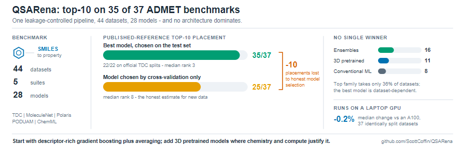
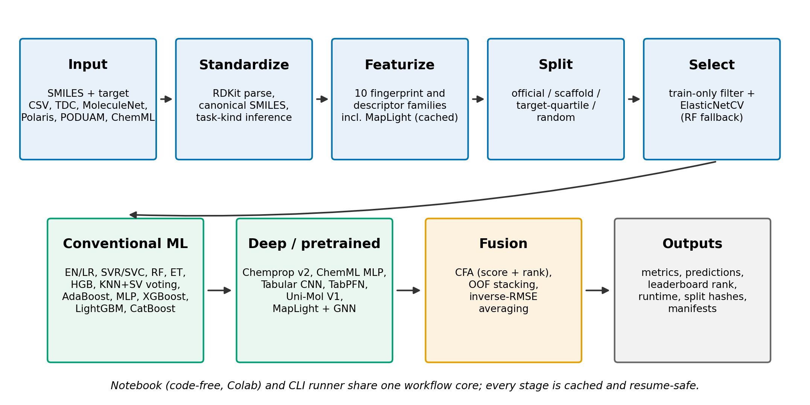
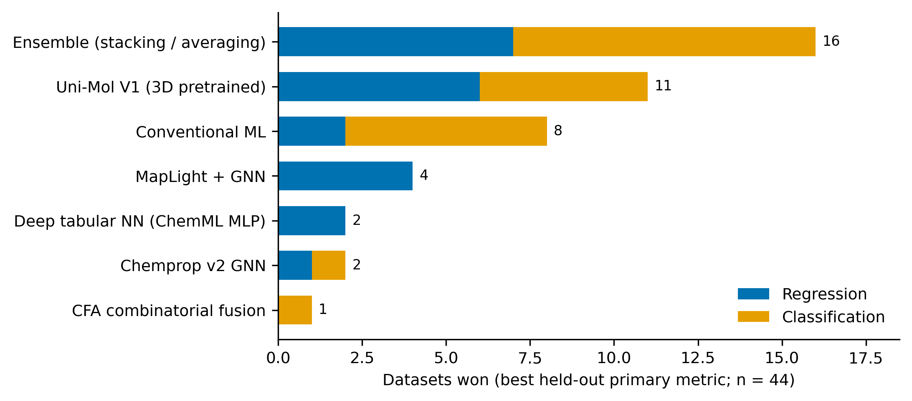
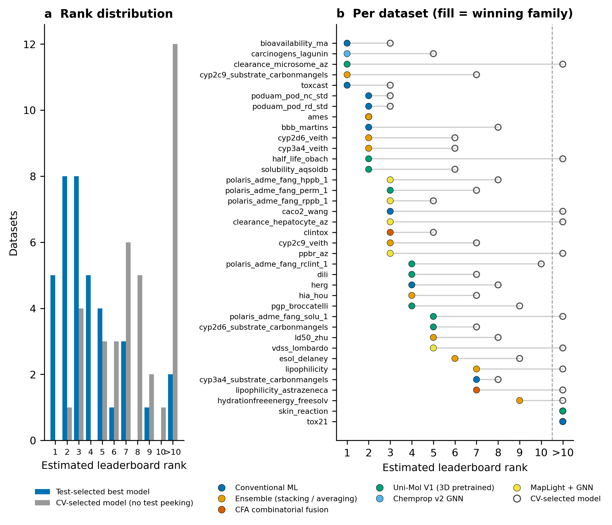
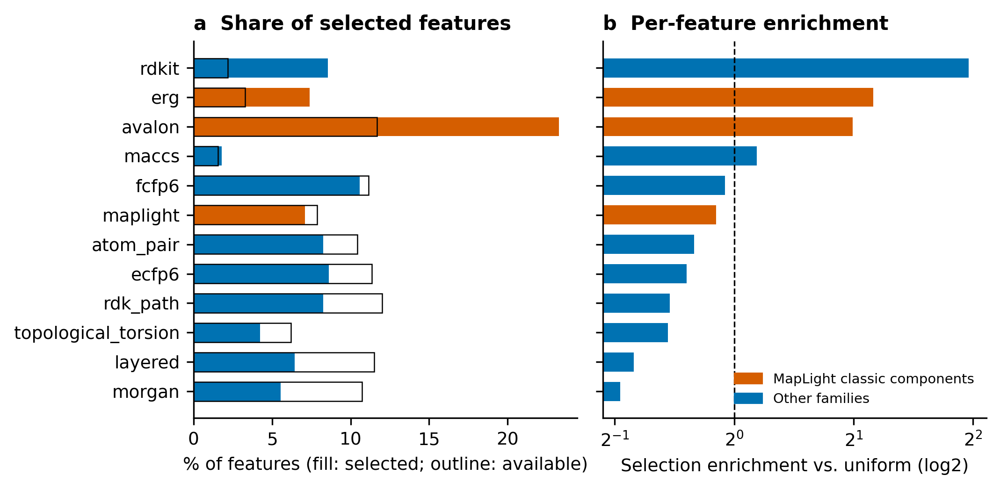
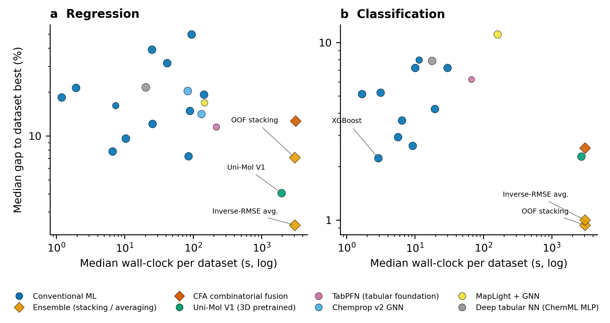
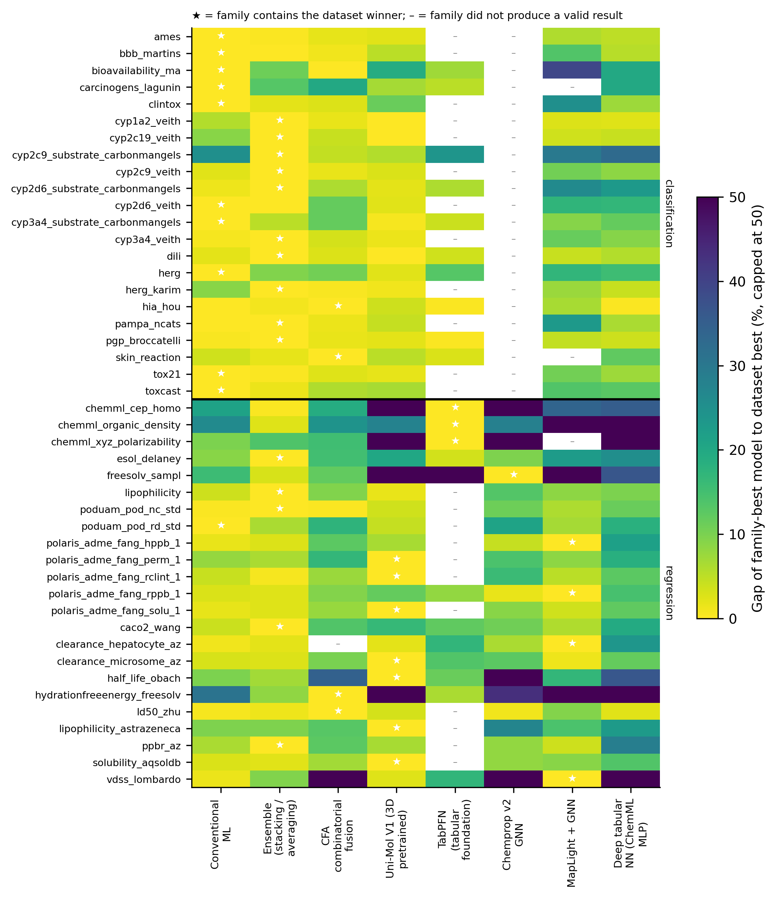

# No Single Model Family Dominates: Ensembles and Conventional Machine Learning Perform Comparably to Pretrained Molecular Models Across 44 Property-Prediction Benchmarks

**Running title:** QSARena: an accessible, leakage-controlled AutoML workspace for molecular property prediction

**Author:** Scott Coffin1

1 California Office of Environmental Health Hazard Assessment, 1001 I Street, Sacramento, CA 95814, USA

**Corresponding author:** Scott Coffin (scott.l.coffin@gmail.com)

> **Author checklist before submission.** Items still requiring author action are flagged inline with **[AUTHOR]**. They are: the ORCID identifier; the Zenodo DOI for the artifact archive; the repository release tag; and the small number of literature references flagged for final verification.

---

## Graphical abstract

**Graphical abstract.** QSARena evaluates conventional, ensemble and pretrained molecular models under one leakage-controlled pipeline across 44 benchmarks. No model family wins more than 36% of datasets; the best model per dataset reaches the estimated published top ten on 35 of 37 comparable datasets, falling to 25 of 37 when the model is chosen without consulting held-out data.

## Abstract

**Background.** ADMET property prediction is dominated by ever-larger pretrained models, whose compute cost and reproducibility limit adoption in academic, regulatory and small-laboratory settings. Whether that scale is warranted has not been tested across benchmark suites under one leakage-controlled pipeline.

**Implementation.** QSARena predicts molecular properties from SMILES through one reproducible workflow: RDKit standardization, ten fingerprint and descriptor families including a MapLight-style composite, train-only ElasticNetCV selection, and a 28-model library spanning conventional ML, gradient boosting, deep tabular and graph networks, 3D pretrained Uni-Mol V1/V2, and ensembles. It is delivered two ways from one core: a **code-free notebook running in Google Colab with no installation and no local hardware**, and a resume-safe command-line runner.

**Results.** Across 44 datasets from five suites (22 regression, 22 classification; 837 model–dataset evaluations) run under a **single fixed configuration with no per-dataset tuning**, QSARena reached the estimated published top ten on 35 of 37 leaderboard-comparable datasets, median rank 3, including all 22 TDC datasets under official `admet_group` splits; selecting by cross-validation alone reduces this to 25 of 37, median rank 8. A matched-candidate-set control attributes 7 of those 10 placements to model-library breadth and only 3 to honest selection, which nonetheless removes every estimated first place. No family dominated: ensembles won 16 datasets, 3D pretrained models 11 and conventional machine learning 8, none exceeding 36%; message-passing graph networks are under-represented, four of five Chemprop variants having failed (valid on 6 of 44). Ensembles were most consistent (within 5% of best on 75% of datasets) against 70% for 3D pretrained models at ~55× the cost. On a consumer laptop GPU the best score moved by a median of −0.2% across 37 identically split datasets.

**Conclusions.** A GPU-optional AutoML pipeline delivers competitive ADMET prediction out of the box, without tuning, installation or specialized hardware; optimal architecture is dataset-dependent. Results are single-split, so close margins are provisional.

**Scientific Contribution.** We report the broadest cross-suite, leakage-controlled ADMET benchmark we are aware of: five suites, 44 datasets, 28 models and 837 model–dataset evaluations under one fixed pipeline. We decompose apparent leaderboard standing into model-library breadth (7 of 37 placements) and selection on held-out data (3 of 37, plus every first place), an inflation affecting any comparably selected entry but rarely reported. We show this needs no datacentre hardware and no expert iteration: a consumer GPU reproduces it within 0.2%, and the pipeline runs code-free in a browser.

**Keywords:** QSAR; ADMET; AutoML; molecular property prediction; benchmarking; reproducibility; data leakage; ensemble learning; foundation models; open-source software; accessibility

## 1. Background

Unfavourable ADMET properties remain among the most consequential causes of failure in drug development. Approximately 90% of drug candidates that enter clinical testing fail across phases I–III and the subsequent approval process; the dominant causes are lack of clinical efficacy and unmanageable toxicity, with poor drug-like properties — including unfavourable pharmacokinetics — contributing a smaller but material share, having fallen from 30–40% of failures in the 1990s to 10–15% today [44]. The value of screening such liabilities early is well established: inappropriate pharmacokinetics and bioavailability accounted for roughly 40% of clinical attrition in the early 1990s, a share that fell to about 10% by 2000 as the industry adopted routine early ADME profiling [45]. Because experimental ADMET assays are slow, costly and hard to scale to the growing number of synthesized and virtual compounds, *in silico* prediction of ADMET endpoints from chemical structure has become an indispensable complement to laboratory screening [1, 3].

Standardized public benchmarks have driven much of this progress. MoleculeNet established curated datasets and evaluation protocols for molecular machine learning [4], and the Therapeutics Data Commons (TDC) consolidated a large collection of ADMET datasets into a benchmark group with fixed splits, per-task metrics and a public leaderboard enabling direct comparison [5]. More recent resources such as Polaris have emphasized immutable, standardized benchmarks as a route to reproducible comparison. These resources catalysed rapid methodological progress, but also fostered a leaderboard culture in which incremental gains are pursued through increasingly elaborate architectures.

A prominent expression of this trend is the turn toward large pretrained "foundation" models. Graph-based models such as MolE, pretrained on roughly 842 million molecules [6], and MolGPS, scaled to three billion parameters with the aid of phenomics data [7], have established state-of-the-art results on subsets of the TDC ADMET tasks, and parameter-efficient successors such as MiniMol have continued this line of work [8]. Three-dimensional pretrained models such as Uni-Mol, which learns from conformer geometry rather than 2D topology alone, represent a distinct and comparatively cheap point on this spectrum [9]. While impressive, the largest of these models require very large pretraining corpora, specialized hardware and substantial engineering expertise, placing them out of practical reach for many of the settings in which ADMET prediction is most needed.

Critically, the assumption that architectural scale translates into superior ADMET prediction is not well supported. In the most comprehensive benchmark of its kind, Xia et al. evaluated twelve representative models — three non-deep and nine deep — and found that deep models generally fail to outperform non-deep ones, with gradient-boosted trees and random forests on molecular fingerprints tending to perform best, because tree models suit the non-smooth target functions characteristic of molecular property prediction [10]. A review in the *Annual Review of Biomedical Data Science* reached a concordant conclusion: a substantial and consistent advantage of deep learning over standard machine learning across diverse datasets and properties has not been demonstrated, and success in compound-property prediction does not necessarily scale with model complexity [11]. These observations are borne out on the TDC leaderboard itself, where gradient boosting on combined fingerprint and descriptor representations remains highly competitive: extreme gradient boosting (ADMETboost) [12]; CatBoost paired with ECFP, Avalon and ErG fingerprints plus ~200 molecular properties, which achieved top-3 performance on 16 of 22 benchmarks (the MapLight submission) [13]; AutoML over descriptor sets (CaliciBoost) [14]; and automatic feature-combination frameworks built on simple learners (MaxQsaring, ranked first on 19 of 22 TDC tasks) [15]. Systematic representation studies reinforce this: the choice of molecular representation is often more decisive than model architecture, and optimal choices are strongly dataset-dependent [16].

Compounding the questionable returns of architectural complexity is a deepening concern over reproducibility. Across the quantitative sciences, data leakage has been identified as a pervasive and often invisible cause of over-optimistic results, affecting at least 294 papers across 17 disciplines in one survey [17]. Cheminformatics is not exempt: leakage through structure duplication, preprocessing on combined train–test data, and feature selection performed before cross-validation systematically inflates QSAR performance estimates, and reproducibility, interpretability and generalizability deficits have hindered regulatory uptake of ML-based toxicity models [18]. A recent critical assessment of the TDC ADMET leaderboard found that only three top-ranked entries — CaliciBoost, MapLight and MapLight + GNN — passed all reproducibility checks, with most leading submissions exhibiting unavailable code, non-reproducible environments or methodological flaws [19]. Headline rankings therefore frequently fail to reflect either genuine methodological progress or deployable models.

A less-discussed form of the same problem concerns model *selection*. Benchmark suites report the performance of a chosen model on a held-out test set, but when the choice among many candidate models is itself made by comparing test-set scores, the reported number is an optimistic maximum over candidates rather than an estimate of what a practitioner would obtain on new data. This affects AutoML systems especially, since their value proposition is precisely that they search over many models. We treat it here as a first-class result rather than a caveat.

These problems are aggravated by a persistent accessibility gap. Many academic drug-discovery efforts founder in the preclinical "death valley" in part because researchers lack access to commercial ADME prediction software owing to high licensing fees [3]. Open tools have begun to address this, and the peer group is now substantial. ADMET-AI holds the highest average rank on the TDC ADMET leaderboard using a single Chemprop-RDKit architecture trained across 41 TDC datasets, served through a web interface and a command-line tool; its hosted service predicts from pretrained models, though the open-source release also ships training scripts [20]. Among AutoML frameworks, QSARtuna automates the comparison of molecular representations and learners with Optuna, with uncertainty quantification and explainability by design [51]; ZairaChem provides a fully automated, low-resource AutoML pipeline reported to reach state-of-the-art performance out of the box on the TDC ADMET binary classification tasks [52]; QSPRpred offers a flexible open QSPR toolkit with standardized serialization for reproducibility [53]; DeepMol delivered competitive, fully reproducible pipelines across 22 TDC ADMET datasets [21]; DeepPurpose exposes 15 encoders and more than 50 architectures in a few lines of code, though it is drug–target-interaction-centric and used mainly as a TDC baseline [54]; and Auto-ADMET coupled grammar-based genetic programming with a Bayesian network to produce interpretable pipelines [22]. Code-light tools such as ChemXploreML have separately sought to lower the barrier for non-specialists through a desktop GUI, validated on physicochemical rather than ADMET endpoints [23].

Each individual capability of the present work therefore already exists somewhere in this landscape. What no single tool combines is a code-free interface, breadth across model families, uniform leakage-controlled evaluation across multiple benchmark suites, and feasibility on consumer hardware. That combination, rather than any one feature, is what we claim (§3.12).

Here we present QSARena, a portable QSAR modelling and benchmarking workspace designed to close these gaps. QSARena couples a code-free, GPU-optional notebook with a resume-safe command-line benchmark runner, both calling a shared workflow core that enforces train-only feature filtering and selection. The same pipeline spans conventional machine learning, gradient boosting, deep tabular and graph neural networks, 3D pretrained models, descriptor–graph hybrids, and combinatorial-fusion and stacking ensembles, and is evaluated uniformly across 44 datasets from five benchmark collections. We claim breadth on the cross-suite and model-family axes rather than on raw dataset count: ADMET-AI evaluates 41 TDC ADMET datasets and holds the highest average rank on that leaderboard [19], and DeepMol reports competitive pipelines across 22 [20], so the distinguishing features here are the number of suites and model families compared under one pipeline, combined with a code-free interface. Our contribution is therefore a unifying, leakage-controlled benchmarking framework and an architecture-agnostic empirical result, rather than a claim to leading accuracy. Using the framework we show that no single family dominates, that ensembles and conventional machine learning perform comparably to pretrained models on most benchmarks at a small fraction of the compute, and that the apparent margin between an AutoML system and a published leaderboard depends heavily on whether model selection is honest about held-out data. We are explicit in §3.12 that we do not claim accuracy leadership: several systems report stronger per-endpoint results, and against the leading open tool the comparison is untested rather than lost, because our ADMET-AI-equivalent backend ran on only a fraction of the suite. The finding, the breadth and the accessibility are the contribution. Equally important for practitioners, every result reported here was obtained under one fixed configuration with no per-dataset tuning, from a tool that can be run without installing anything: the accessibility and the accuracy are not in tension.

**A note on naming.** The name *AutoQSAR* is used by an established commercial product from Schrödinger, introduced in 2016 as an automated tool for best-practice QSAR modelling [41] and since extended as DeepAutoQSAR. The tool described here is unrelated to that product and is named QSARena to avoid confusion. We compare against both it and the earlier QSAR Workbench [42] in §3.12.

---

## 2. Implementation

### 2.1 Software architecture

QSARena is designed so that a user with a CSV of SMILES and measured values can obtain a benchmarked model without writing code, installing software or owning hardware. It predicts molecular properties directly from SMILES strings and is distributed with two interoperable entry points sharing a common workflow core: `colab_qsar_tutorial.ipynb`, an interactive widget-driven Jupyter/Colab notebook for code-free model building on built-in or user-supplied data; and `run_qsarena_benchmarks.py`, a command-line runner for resume-safe model comparison across curated dataset collections. Both call the same feature-generation, splitting, fusion and evaluation library (`qsar_workflow_core.py`), so interactive and batch results are produced by identical code paths (Figure 1).

The notebook path is deliberately zero-friction: it is a single self-contained file that opens in Google Colab, installs its own dependencies in the hosted runtime, and exposes dataset choice, SMILES and target columns, split strategy and model selection through form widgets. The user edits no code. Because Colab supplies the compute, no local CPU, GPU or Python environment is required, which removes the installation and hardware barriers that limit uptake of ADMET tooling in the settings described in the Background. The command-line runner targets the opposite case -- long, resumable, many-dataset campaigns on a workstation or HPC allocation -- and both paths call identical code, so a result obtained in the browser can be reproduced in batch without change.

**Figure 1.** The QSARena workflow. Data ingestion and standardization, featurization, splitting and train-only feature selection are followed by a model library spanning conventional machine learning, deep and pretrained models, and fusion; every stage writes cached, resumable artifacts. The code-free notebook and the command-line runner share this core.

For each dataset the runner executes a fixed sequence: build molecular features; apply the train/test split and train-only ElasticNetCV feature selection; evaluate conventional models; optionally run a genetic-algorithm tuning pass; run deep workflows (ChemML backends, Chemprop v2 variants, Uni-Mol V1, MapLight + GNN); optionally run combinatorial fusion over all successful predictions; build ensembles over available members; and write cross-dataset performance tables. Optional families are skipped gracefully when dependencies, hardware or dataset-size guardrails are unmet, allowing the rest of a run to continue. The model inventory and its per-dataset availability are given in Table 1.

<!-- TABLE:table1_model_inventory -->
| Model family | Model | Valid regression datasets | Valid classification datasets | Wins | Datasets attempted |
|---|---|---|---|---|---|
| CFA combinatorial fusion | CFA (Combinatorial Fusion) | 22 | 22 | 1 | 44 |
| Chemprop v2 GNN | Chemprop v2 (AttentiveFP, ensemble=3) | 2 | 4 | 1 | 44 |
| Chemprop v2 GNN | Chemprop v2 (CMPNN, ensemble=3) | 2 | 4 | 0 | 44 |
| Chemprop v2 GNN | Chemprop v2 (D-MPNN + RDKit2D, ensemble=3) | 2 | 4 | 1 | 44 |
| Chemprop v2 GNN | Chemprop v2 (D-MPNN + Selected descriptors, ensemble=3) | 2 | 4 | 0 | 44 |
| Chemprop v2 GNN | Chemprop v2 (D-MPNN, ensemble=3) | 2 | 4 | 0 | 44 |
| Conventional ML | AdaBoost | 22 | 22 | 2 | 44 |
| Conventional ML | CatBoost | 22 | 22 | 1 | 44 |
| Conventional ML | ElasticNetCV | 20 | 0 | 0 | 22 |
| Conventional ML | Extra trees | 22 | 22 | 0 | 44 |
| Conventional ML | HistGradientBoosting | 22 | 22 | 1 | 44 |
| Conventional ML | LogisticRegression | 0 | 22 | 0 | 22 |
| Conventional ML | MapLight CatBoost (Strict Parity) | 22 | 0 | 0 | 22 |
| Conventional ML | Random forest | 22 | 22 | 4 | 44 |
| Conventional ML | SVC | 0 | 22 | 0 | 22 |
| Conventional ML | SVR | 22 | 0 | 0 | 22 |
| Conventional ML | Tabular CNN | 22 | 0 | 0 | 22 |
| Conventional ML | Tabular MLP | 22 | 22 | 0 | 44 |
| Conventional ML | Voting Classifier (KNN, SVM) | 0 | 22 | 0 | 22 |
| Conventional ML | Voting Regressor (KNN, SVM) | 22 | 0 | 0 | 22 |
| Conventional ML | XGBoost | 22 | 22 | 0 | 44 |
| Deep tabular NN (ChemML MLP) | ChemML MLP (PyTorch) | 22 | 22 | 1 | 44 |
| Deep tabular NN (ChemML MLP) | ChemML MLP (TensorFlow) | 22 | 22 | 1 | 44 |
| Ensemble (stacking / averaging) | Ensemble (OOF Stacking (RidgeCV, 5-fold)) | 22 | 22 | 7 | 44 |
| Ensemble (stacking / averaging) | Ensemble (Weighted average (inverse train RMSE)) | 22 | 22 | 9 | 44 |
| MapLight + GNN | MapLight + GNN (CatBoost, Strict Parity) | 22 | 22 | 4 | 44 |
| Uni-Mol (3D pretrained) | Uni-Mol V1 | 22 | 22 | 7 | 44 |
| Uni-Mol (3D pretrained) | Uni-Mol V2 (84m) | 10 | 7 | 4 | 44 |
<!-- /TABLE -->

**Table 1.** Model inventory. "Valid" datasets are those on which the model produced a metric without an error; differences from 44 reflect task-type applicability (regression-only or classification-only estimators), dataset-size guardrails, or backend failures (Section 3.9).

### 2.2 Datasets and curation

Benchmark datasets were drawn from five public collections through dedicated loaders: ChemML bundled examples (`cep_homo`, `organic_density`, `xyz_polarizability`); TDC single-prediction ADME and Tox tasks; MoleculeNet physicochemical datasets (ESOL [24], FreeSolv [25], Lipophilicity); Polaris ADME benchmark mirrors; and the PODUAM point-of-departure datasets [26]. Each dataset is represented internally by a `DatasetSpec` recording the SMILES column, target column, recommended split, recommended metric, benchmark suite and any leaderboard reference metadata.

All molecules were standardized before featurization. Canonicalization coerced the target to numeric, removed rows with missing or non-finite SMILES or target values, and parsed each SMILES with RDKit [27]; molecules that failed to parse were dropped and the remainder re-encoded as canonical SMILES. For datasets carrying a predefined split column, rows missing the split assignment were removed.

Target transformation followed a suite-aware policy. Under the default `auto` mode, datasets from the TDC, MoleculeNet, Polaris, literature and PFAS auxiliary suites were kept on their native scale, while other datasets used a base-10 logarithmic transform when all target values were positive; non-positive targets disabled the transform.

For TDC datasets, official splits were preferred over generic resampling. Where PyTDC exposes an official `admet_group` entry, the runner uses that train_val/test split in preference to legacy single-prediction cache entries; official split frames are cached under `data/_qsarena_cache` and stale entries lacking an official split are refreshed automatically. This distinction matters for interpretation and we preserve it throughout: 22 TDC datasets and 5 Polaris datasets used official predefined splits, while the remaining 18 used locally generated scaffold, random or target-quartile splits and are therefore *not* directly leaderboard-equivalent (Section 3.4).

Task kind was inferred automatically rather than taken from catalog metadata: strict binary 0/1 targets were routed to the classification workflow and all other numeric targets to regression. This inference overrides several catalog entries that record a regression metric for what are in fact binary endpoints (for example the CYP inhibition tasks), and the inferred kind is what all analyses below use.

### 2.3 Molecular representations

Ten configurable feature families were implemented on RDKit, all returning fixed-width numeric matrices. Circular and path-based fingerprints were generated at 1024 bits by default. Morgan fingerprints [28] used radius 2; ECFP6 and FCFP6 were generated with the RDKit MorganGenerator at radius 3, FCFP6 using feature-based atom invariants; RDKit layered, atom-pair, topological-torsion and RDKit path fingerprints were each computed at 1024 bits, the path fingerprint spanning path lengths 1–7. MACCS keys [29] were generated at their native 167-bit width, and the full RDKit 2D descriptor set was computed from `Descriptors._descList`.

The "MapLight classic" family reproduces the feature construction of the MapLight TDC submission [13]: a hashed Morgan count fingerprint (radius 2, 1024 bits), an Avalon count fingerprint (1024 bits) [30], the extended reduced graph (ErG) fingerprint [31], and a curated panel of approximately 200 RDKit descriptors spanning connectivity and shape indices (BalabanJ, BertzCT, Chi and Kappa indices), VSA-family descriptors, physicochemical properties (ExactMolWt, MolLogP, TPSA, FractionCSP3), hydrogen-bonding and ring counts, functional-group fragment counts, and the QED drug-likeness score. In the feature-selection analyses below, this composite appears as its three constituent families (`avalon`, `erg` and the `maplight` descriptor panel), and we report both the components and their sum.

After assembly, every feature matrix passed a common finalization step: infinities replaced with missing values, all columns coerced to numeric, values exceeding the float32 range masked, remaining gaps imputed with the per-column median (falling back to zero), and the matrix cast to float32.

### 2.4 Persistent feature store

To avoid recomputing expensive descriptors across datasets and runs, features were cached in a persistent, content-addressed store writing Parquet shards where `pyarrow` or `fastparquet` is available and CSV otherwise. Each representation is identified by a key derived from a SHA-256 hash of a canonical JSON payload listing the selected feature families, Morgan radius and fingerprint bit width, so distinct configurations never collide. A schema file records the representation payload and column order; a mismatch raises an error rather than silently mixing definitions. Feature rows are keyed by canonical SMILES, so only molecules absent from the cache are computed on a given run, and cached and new rows are merged back into the exact requested row order. Additional caches store assembled benchmark feature matrices and tuned conventional models.

### 2.5 Splitting and cross-validation

Four splitting strategies were supported — random, target-quartile, scaffold and predefined — selected per dataset with a benchmark-aware default. Command-line defaults set target-quartile stratification, a test fraction of 0.2 and random seed 13.

Scaffold splitting used Bemis–Murcko scaffolds [32] computed after removing stereochemistry, with explicit fallbacks for molecules that failed scaffold perception or yielded no scaffold. Molecules were grouped by scaffold and assigned to the test set by a greedy, seeded procedure that packs whole scaffold groups until the target test fraction is reached, guaranteeing that no scaffold appears in both partitions. Target-quartile splitting binned the continuous target into quartiles with `pd.qcut` and stratified on those bins, reverting to random splitting when a dataset was too small or too low in target variance to form at least two populated bins per fold. For TDC benchmark datasets the official partition was used directly, with deterministic reassignment by SMILES so that the same molecule is never placed in both train and test.

Cross-validation mirrored the split geometry: scaffold runs used `GroupKFold` over scaffold groups, target-quartile runs `StratifiedKFold` over quartile bins, and random runs shuffled `KFold`, each with a configurable fold count and a defined fallback to random folds when group or bin constraints could not be satisfied.

### 2.6 Feature filtering and selection

Before model fitting, a leak-free pre-filter removed degenerate and redundant columns using statistics computed on the training partition only and applied identically to the held-out set: near-constant columns below a variance threshold of 1 × 10⁻⁸ were dropped, binary columns whose positive prevalence fell outside 0.005–0.995 were removed, and exact-duplicate columns were pruned.

Selection was then performed train-only with a cross-validated elastic net. The ElasticNetCV selector was fit in an isolated subprocess with a wall-clock timeout over a configurable L1-ratio grid and log-spaced alpha grid, using folds matched to the active split strategy. Features were retained when the absolute coefficient exceeded a threshold, with at least one feature always kept and the retained set capped at the larger of one feature or 10% of the training-row count. To bound runtime, the selector used a dataset-size runtime model: when predicted elastic-net runtime exceeded a configurable threshold (default 7200 s), or when the elastic net timed out or failed, selection fell back to RandomForest importance ranking. Selected features, coefficients and diagnostics were written per dataset.

### 2.7 Model library

**Conventional machine learning.** For regression: elastic-net regression with internal cross-validated alpha/L1 search, support vector regression (C = 10, ε = 0.1, RBF kernel), random forests (400 trees), extremely randomized trees (500 trees), histogram gradient boosting (learning rate 0.05, up to 500 iterations, max depth 8), a soft-voting KNN+SVR regressor with adaptively chosen neighbour count, AdaBoost (500 estimators, learning rate 0.05), and a tabular multilayer perceptron (hidden layers 512 and 256, ReLU, Adam, L2 1 × 10⁻⁴, up to 300 iterations), all via scikit-learn [33]. Gradient-boosting libraries were added when installed: XGBoost (400 trees, depth 6, learning rate 0.05, subsample and column-sample 0.9) [34], LightGBM (500 trees, learning rate 0.05, 63 leaves) [35] and CatBoost (400 iterations, depth 6, learning rate 0.05) [36]. Numeric pipelines were preceded by median imputation and standardization where appropriate. The classification table substituted the analogous estimators (logistic regression, SVC with probability estimates, random forest, extra trees, histogram gradient boosting, soft-voting KNN+SVC, AdaBoost, tabular MLP and the gradient-boosting classifiers) with classification losses and metrics.

**Specialized tabular and graph models.** A compact one-dimensional convolutional regressor treats each standardized feature vector as a 1D signal and applies two same-padded ReLU convolutional blocks (64 filters, kernel size 5), global max pooling, a 128-unit dense layer with dropout and a linear output, trained with Adam and early stopping; it is intentionally small enough to run on CPU. The MapLight + GNN workflow fits a CatBoost model on the union of MapLight classic features and pretrained graph isomorphism network (GIN) fingerprints where the supporting DGL/PyTorch stack is available; a strict leaderboard-parity variant of the MapLight CatBoost model uses mean-absolute-error optimization, target scaling and five-seed averaging to reproduce the published protocol [13]. Graph neural networks were provided through Chemprop v2 [37, 38, 48] with configured directed message-passing (D-MPNN), CMPNN-style and AttentiveFP-style architectures; optional variants augment the graph encoder with train-only selected tabular descriptors or an RDKit-2D featurizer. Uni-Mol V1 and V2 [9, 47] were included as 3D pretrained baselines, running automatically when a GPU was detected. The configuration that produced the deposited results was 20 epochs, learning rate 1 × 10⁻⁴, batch size 32, early stopping patience 5, a random internal validation split, a 64-atom cap and the 84m checkpoint, with automatic mixed precision enabled under an otherwise fp32 precision mode. These values are recorded in `run_config.json` and in the per-model `unimol_*` columns of every `metrics.csv`. The TabPFN tabular foundation model [39] was available for regression and classification, gated by a 1000-row training guardrail consistent with its design constraints.

**Genetic-algorithm tuning (available but not evaluated).** An optional stage tunes a small set of estimators (elastic net and CatBoost for regression; elastic-net-penalized logistic regression and CatBoost for classification). It is disabled by default unless explicitly requested or unless an `auto` mode finds prior evidence that a tuned family is worth rerunning. **It was disabled throughout the benchmark reported here** (recorded resolution: mode `disabled`, reason `empty_ga_models`), so no GA-tuned model appears in any result. We therefore draw no conclusion about what evolutionary tuning would or would not add: the capability exists in the software and is simply untested in this study. Every result below comes from the fixed model library.

### 2.8 Combinatorial fusion and ensembling

After base models produced aligned train and test prediction vectors, QSARena optionally fused them by combinatorial fusion analysis (CFA) [40] in both score and rank spaces. To control combinatorial growth, inputs were first reduced to the best model per workflow and the subset search bounded by a budget guardrail. For each candidate subset the algorithm computed a performance strength as the inverse of the base model's training error and a diversity strength from the mean pairwise distance between normalized, sorted score profiles, then evaluated three score-space weightings (equal, performance-weighted, diversity-weighted) plus the corresponding rank-space variants. Rank-space combinations were linearly calibrated back to the target scale and given a small metric discount when subset diversity exceeded a threshold, so that diverse rank fusions were preferred only when genuinely complementary. Candidates were ranked by the adjusted training metric and the best fused predictor returned with its selected models, weights and a candidate-diagnostics table. For regression, fusion minimized mean absolute error.

Three further ensemble strategies were available over the same prediction pool: out-of-fold stacking with a RidgeCV meta-model (logistic for classification), an inverse-training-RMSE weighted average (weighting by the primary classification metric for classification), and a simple average. Ensemble construction supported optional member filtering, including removal of highly correlated members and exclusion of members with negative held-out R². We return to the implications of that last option in Section 3.3 and in the Limitations, because it consults held-out data.

### 2.9 Evaluation metrics

Regression performance was summarized by RMSE, mean absolute error, R² and Spearman rank correlation, computed separately on training and held-out sets; classification by AUROC, AUPRC, balanced accuracy and the Matthews correlation coefficient. Each dataset carries a primary metric: for cross-dataset ranking we used RMSE for regression and, for classification, the dataset's designated primary metric, following the TDC leaderboard's per-dataset assignments rather than a blanket rule. AUPRC is the primary metric on exactly five datasets — `tdc_cyp2c9_veith`, `tdc_cyp2d6_veith`, `tdc_cyp3a4_veith`, `tdc_cyp2c9_substrate_carbonmangels` and `tdc_cyp2d6_substrate_carbonmangels` — and AUROC is the primary metric on every other classification dataset, including `tdc_cyp3a4_substrate_carbonmangels`, which is a CYP substrate task but is scored by AUROC on the leaderboard. Four binary datasets (`tdc_cyp1a2_veith`, `tdc_cyp2c19_veith`, `tdc_herg_karim` and `tdc_pampa_ncats`) are mislabelled as regression tasks in our dataset catalog; the runner records a regression primary metric for them, but the analysis infers classification from strictly binary targets and uses the classification metrics throughout. The per-dataset assignment actually used is recorded in the `primary_metric` column of every `metrics.csv` and is listed in Table S1. For comparisons against published leaderboards we re-selected the best model per dataset under the *leaderboard's* metric, which is MAE or Spearman rather than RMSE for several TDC regression tasks; the best model under RMSE and under the leaderboard metric therefore sometimes differ, and both are reported (Tables S1 and 4).

Because absolute metric differences are not comparable across datasets with different target units — an RMSE gap of 1.0 is negligible for hepatocyte clearance and fatal for log-solubility — all cross-dataset summaries of how close a model came to the per-dataset best use a **relative** gap, |score − best| / |best|.

### 2.10 Leaderboard comparison

Where curated leaderboard references existed, the best QSARena model was compared against published values using a normalized metric-matching procedure. Comparisons were made only when the leaderboard metric matched the dataset's primary metric and a numeric reference value was available; the framework then computed the signed gap to the top-1 reference, the gap to the top-10 cutoff, and an estimated rank relative to the published entries. Reference rows were aggregated from TDC, MoleculeNet and Polaris leaderboards together with a manually curated set of TDC ADMET reference values and, for ESOL and Lipophilicity, current literature values in place of the 2017-era MoleculeNet baselines, which are no longer representative of the state of the art.

Two limits of this procedure should be kept in view. First, "estimated rank" reflects the references available for a dataset, not a live leaderboard submission; a dataset with few references yields an optimistic-looking rank. Second, ranks are only leaderboard-equivalent where the split protocol matches, which is true for the 22 TDC `admet_group` datasets and the 5 Polaris datasets but not for the 10 comparable datasets evaluated on locally generated splits. We report results stratified by this distinction throughout.

### 2.11 Model selection protocols

We report every headline result under two selection protocols.

**Test-selected.** The best model per dataset is the one with the best held-out primary metric. This is the protocol used by AutoML leaderboard submissions generally, and it is what Sections 3.2–3.4 report as the primary analysis for comparability with published entries.

**Cross-validation-selected.** The model is chosen per dataset solely by its cross-validated primary metric on the training partition, and its held-out score is then read off without further choice. This estimates what a practitioner obtains when the test set is genuinely untouched. It is available for the models that emit cross-validated metrics — the conventional estimators, TabPFN and the ChemML MLP — but not for Chemprop, Uni-Mol, MapLight + GNN or the fusion methods, so it is a conservative lower bound on what a fully CV-driven QSARena would achieve.

### 2.12 Reproducibility, caching and computing environment

The runner is designed for long, resumable runs. Completed datasets and compatible intermediates are reused on resume, and each run records a configuration signature, per-dataset run-status manifests, split-signature hashes and per-stage runtime diagnostics. Two cost profiles are provided: a default cost-optimized profile that disables historically low-value expensive variants, and a full profile restoring the broader model set. Each dataset directory retains metrics, predictions, selected features, a feature-deduplication report, the CFA candidate table and ensemble weights, supporting independent verification of every reported result.

The workflow targets Python 3.11 and runs on Windows, macOS, Linux or Google Colab. The core workflow runs CPU-only; GPU availability primarily affects runtime and whether optional backends such as local TabPFN and Uni-Mol are practical. Pinned conda and pip/uv specifications are distributed with the repository, alongside an Apptainer/Singularity definition, Slurm submission scripts for NSF ACCESS HPC clusters, and an OpenStack orchestration path for Jetstream2 [41, 42] that routes GPU-dependent workflows to A100-backed instances and the remaining workflows to CPU instances under a tracked service-unit budget.

The benchmark reported here was executed on NSF ACCESS Jetstream2 [41, 42] under allocation CIS261142, on a `g3.large` instance providing one NVIDIA A100-SXM4-40GB GPU (39.5 GB device memory, 108 streaming multiprocessors, compute capability 8.0) and 32 CPU cores, running Linux with all timestamps in UTC. The device inventory, CPU count, parallelism settings and `fp32` precision mode are recorded in the run's `run_timing.json` and `run_config.json` and are reproduced in the deposited artifacts. Section 3.11 additionally reports the same benchmark executed on a consumer laptop GPU, as a direct test of whether the results depend on datacentre hardware.

All figures, tables and numerical claims in this paper are regenerated from committed benchmark artifacts by a single command, `python portable_colab_qsar_bundle/render_manuscript_assets.py`, which re-executes the analysis notebook and writes `manuscript_assets/` (figures, tables and a `manuscript_numbers.json` containing every headline number quoted in the text).

---

## 3. Results and discussion

### 3.1 Benchmark coverage

We executed QSARena across the full benchmark suite under a single fixed configuration (`full` profile, random seed 13, Chemprop seed 42) on an NVIDIA A100-SXM4-40GB GPU with 32 CPU cores, provided by NSF ACCESS Jetstream2. Of 45 datasets attempted, 43 completed; `tdc_herg_central`, the largest task attempted, was abandoned after running more than 24 hours without completing, and `polaris_adme_fang_hppb_1` was interrupted when the run ended but had already produced a full model table and is retained. The 44 analysed datasets comprise 22 regression and 22 classification tasks drawn from five collections: TDC (32), Polaris ADME (5), MoleculeNet (3), ChemML (2) and PODUAM (2). They span 280 to 13,445 molecules (median 1,605; 156,052 in total) and four split protocols (27 predefined, 12 scaffold, 4 target-quartile, 1 random). Twenty-eight models produced at least one valid result, yielding 837 valid model–dataset evaluations. The dataset catalog, with each dataset's estimated leaderboard rank and the best published value it is measured against, is given in Table S6.

### 3.2 No single model family dominates

The central finding is that no model family won across the benchmark (Figure 2, Table 2). Stacking and averaging ensembles produced the most outright wins (16 of 44 datasets: 9 classification, 7 regression), followed by the 3D pretrained Uni-Mol models (11: 5 classification, 6 regression), conventional machine learning (8: 6 classification, 2 regression), the MapLight + GNN descriptor–graph hybrid (4, all regression), deep tabular networks and Chemprop v2 (2 each) and combinatorial fusion (1). The largest single share is 36% of datasets. We flag immediately that the ensemble row is not a like-for-like competitor: ensembles are built *from* the other families' predictions, and under the configuration used here their member filtering consults held-out R², so their lead should be read as "the pipeline's output is reliably near-best" rather than as evidence that stacking is intrinsically superior to its members (§3.3, §3.5).

**Figure 2.** Datasets won by each model family, split by task kind. A win is the best held-out primary metric on that dataset among all 28 models. *Single split and single seed: individual placements are provisional and no variance is estimated (see Limitations).*

The distribution of winners is more even than in our earlier consumer-GPU run (§3.10), and one difference is worth stating explicitly because it reverses a conclusion we drew from that run: with a longer training schedule (20 epochs, batch size 32, mixed precision) and the addition of Uni-Mol V2, the 3D pretrained family won five classification datasets (`tdc_cyp2d6_substrate_carbonmangels`, `tdc_dili`, `tdc_pampa_ncats`, `tdc_pgp_broccatelli`, `tdc_skin_reaction`) as well as six regression datasets. Conformer-based pretraining is therefore not a regression-only tool, and any claim that it categorically fails on classification is an artifact of undertraining it. The regression datasets it won remain chemically coherent — permeability, clearance, lipophilicity and aqueous solubility — properties for which conformational and shape information is mechanistically plausible as signal that 2D descriptors capture only indirectly.

Per-dataset winners, including the corresponding cross-validation-selected model, are listed in Table S1, and the full dataset × family landscape is shown in Figure 6. These are single-split, single-seed outcomes: an unknown fraction of individual winners would change under a different seed, so we read Figure 2 as a distribution of capability across families rather than as a precise ranking, and we base the claim below on its breadth rather than on any one dataset's result (see Limitations).

### 3.3 Consistency versus peak performance

Win counts reward only the single best model per dataset and understate the reliability of models that are consistently near-best without winning. Table 2 therefore reports, for each family, the median relative gap to the per-dataset best, the fraction of datasets on which the family's best member landed within 5% of the best result, and the median rank that member achieved.

<!-- TABLE:table3_architecture_families -->
| Model family | Models | Datasets with valid results | Wins (regression) | Wins (classification) | Median gap to best, regression (%) | Median gap to best, classification (%) | Within 5% of best (% of datasets) | Median rank of family-best model |
|---|---|---|---|---|---|---|---|---|
| Ensemble (stacking / averaging) | 2 | 44 | 7 | 9 | 1.6 | 0.3 | 75.0 | 2.0 |
| Uni-Mol (3D pretrained) | 2 | 44 | 6 | 5 | 3.8 | 1.7 | 70.5 | 4.0 |
| Conventional ML | 15 | 44 | 2 | 6 | 2.8 | 1.5 | 65.9 | 3.0 |
| MapLight + GNN | 1 | 44 | 4 | 0 | 7.5 | 11.1 | 27.3 | 8.5 |
| Chemprop v2 GNN | 5 | 6 | 1 | 1 | 10.1 | 1.0 | 83.3 | 2.0 |
| Deep tabular NN (ChemML MLP) | 2 | 44 | 2 | 0 | 18.2 | 7.5 | 25.0 | 12.5 |
| CFA combinatorial fusion | 1 | 44 | 0 | 1 | 6.2 | 1.8 | 63.6 | 4.5 |
<!-- /TABLE -->

**Table 2.** Model-family coverage and consistency. Gaps are relative to the per-dataset best primary metric. "Within 5% of best" counts datasets where the family's best member fell within 5% of the dataset winner. Families evaluated on fewer than 44 datasets were limited by task applicability, size guardrails or backend failures (Table S4); their percentages are computed over the datasets on which they ran, which makes the Chemprop row in particular not comparable with the others. All values derive from a single split and seed, so adjacent rows are not separated. *Single split and single seed: individual placements are provisional and no variance is estimated (see Limitations).*

Ensembles were within 5% of the best on 75% of datasets with a median rank of 2; the 3D pretrained family followed closely at 70% and median rank 4, and conventional machine learning at 66% and median rank 3. The gap between these three is not resolvable at single-seed resolution, and we do not claim an ordering among them. Further back, MapLight + GNN (27% within 5%, median rank 8.5) and the deep tabular networks (25%, median rank 12.5) were markedly less consistent despite MapLight + GNN winning four datasets outright — a bimodal profile in which a model is either the best available or well down the table.

Chemprop v2 shows the highest within-5% rate in the table (83%) and a median rank of 2, but on only 6 of 44 datasets, because four of its five configured variants failed on most tasks (§3.8). That number says Chemprop is strong where it ran, not that it is the most consistent family; it is the one row in Table 2 that should not be compared with the others.

Three further cautions apply. Families with more models have more chances to produce a near-best member, so the 15-model conventional family is flattered relative to single-model families; the ensemble row is not a like-for-like competitor, because ensembles are built *from* the other families' predictions and, under the configuration used here, their member filtering consults held-out R²; and the ensemble family's apparent consistency should therefore be read as "the pipeline's output is reliably near-best", not as evidence that stacking is intrinsically superior to its members. Section 3.5 quantifies how much the fusion layer actually adds.

### 3.4 Leaderboard competitiveness, and the cost of honest model selection

Across the leaderboard-comparison layer, 37 datasets could be compared against 430 published reference values. The best QSARena model per dataset placed within the estimated top ten on 35 of 37 datasets, with a median estimated rank of 3 and five estimated first places (`tdc_bioavailability_ma`, `tdc_carcinogens_lagunin`, `tdc_clearance_microsome_az`, `tdc_cyp2c9_substrate_carbonmangels`, `tdc_toxcast`). The two datasets below the top ten were `tdc_skin_reaction` and `tdc_tox21`, both evaluated on locally generated scaffold splits that are harder than the references they are scored against.

**Figure 3.** Estimated leaderboard placement across 37 comparable datasets. (a) Rank distribution for the test-selected best model and for the model selected by cross-validation alone. (b) Per-dataset ranks; filled markers are the test-selected model coloured by model family, open markers the cross-validation-selected model. The dashed line marks the top-ten boundary. *Single split and single seed: individual placements are provisional and no variance is estimated (see Limitations).*

Comparability varies by dataset, and the aggregate obscures it. Restricted to the 22 TDC datasets evaluated on official `admet_group` splits — the only subset directly comparable to the public TDC leaderboard — the test-selected model placed in the top ten on **all 22**, with a median rank of 3 and three estimated first places. On the 5 Polaris datasets it placed in the top ten on all 5, median rank 3. The remaining 10 comparable datasets used locally generated splits and are *not* leaderboard-equivalent; both sub-top-ten results and two of the five first places fall in this group, and those should be read as "competitive with published values under a comparable but not identical protocol", not as leaderboard claims. Table 3 gives the breakdown by comparison class; per-dataset detail, including both selection protocols and the reference counts behind each rank, is given in Table S7.

<!-- TABLE:table4_leaderboard_summary -->
| Comparison class | n | Top-10 test | Median rank test | Top-10 CV | Median rank CV |
|---|---|---|---|---|---|
| TDC ADMET Group (official) | 22 | 22 | 3.000 | 15 | 8.000 |
| Polaris ADME (official) | 5 | 5 | 3.000 | 4 | 8.000 |
| Local splits (not leaderboard-equivalent) | 10 | 8 | 4.500 | 6 | 7.000 |
| All comparable datasets | 37 | 35 | 3.000 | 25 | 8.000 |
<!-- /TABLE -->

**Table 3.** Rank among curated published reference values, by comparison class. Only the 27 datasets with official predefined splits — 22 TDC ADMET Benchmark Group and 5 Polaris ADME — are directly comparable to a public leaderboard; the remaining 10 are scored against published values under a comparable but not identical protocol and are reported separately rather than pooled. Columns: "n" is the number of datasets in the class; "test" selects the best model per dataset on held-out data; "CV" selects by cross-validation only. Per-dataset detail is in Table S7. Single split and single seed, so individual placements are provisional.

That headline, however, is produced by choosing the best of 28 models using held-out scores. Under the stricter protocol in which the model is chosen by cross-validation alone (§2.11), top-ten placement falls from 35 to 25 of 37 datasets, first places from five to none, and the median estimated rank from 3 to 8 (Figure 3). On the official TDC subset the fall is from 22 of 22 to 15 of 22. Across all 44 datasets, the cross-validation-selected model was never the overall winner and sat a median of 16.1% above the per-dataset best.

**That ten-dataset gap has two causes, and separating them changes its interpretation.** Cross-validation selection is restricted to models that emit cross-validated metrics, which in this run excludes Chemprop, the Uni-Mol models, MapLight + GNN and the fusion methods. The comparison above therefore confounds the cost of not peeking at the test set with the cost of losing those candidate families. To separate them we added a third protocol that holds the candidate set fixed at the cross-validation-eligible models and selects among them on the test metric:

| Protocol | Candidate set | Top ten | First places | Median rank |
|---|---|---|---|---|
| Test-selected | full 28-model library | 35 / 37 | 5 | 3 |
| Test-selected | cross-validation-eligible only | 28 / 37 | 3 | 6 |
| Cross-validation-selected | cross-validation-eligible only | 25 / 37 | 0 | 8 |

Read down the table, **7 of the 10 lost placements come from narrowing the candidate set and only 3 from honest selection**; the median rank moves from 3 to 6 on library breadth and from 6 to 8 on selection protocol. Both effects are real and neither is small, but they are different claims. The breadth of the model library is worth about seven leaderboard placements, which is the strongest available argument for running many model families rather than one well-tuned architecture. The cost of honest model selection is about three placements and, more strikingly, every one of the five first places: **no protocol that refuses test-set information produced a single estimated rank of 1.** We previously reported the whole ten-dataset gap as the cost of honest selection; that attribution was wrong, and the corrected decomposition is the more useful result.

Both protocols rest on a single split and seed, so the individual ranks in Figure 3 carry unquantified seed variance and the aggregate counts are the more trustworthy quantity (see Limitations). That caveat does not soften the direction of the effect: the shift is large and one-sided, and it would take implausibly favourable seed variance to erase a ten-dataset gap. This gap is, in our view, the most practically important number in this paper. It is not a defect specific to QSARena: any leaderboard entry that selects among candidate models or configurations using test-set feedback carries the same inflation, and the reproducibility audit of the TDC leaderboard [19] suggests that such selection is rarely documented. We report both protocols rather than only the favourable one, and we take the cross-validation-selected result — top ten on roughly two-thirds of comparable datasets — as the honest estimate of what a practitioner should expect. The cross-validation protocol is also a conservative bound here, since Chemprop, the Uni-Mol models, MapLight + GNN and the fusion methods do not emit cross-validated metrics in this run and were therefore ineligible for cross-validation-based selection; extending CV metrics to those backends is the single most valuable change we can make to the runner.

**The reference set is itself imperfect, and this biases the comparison.** The audit we cite above [18] examined the top-ranked TDC ADMET entries and found that only three — CaliciBoost, MapLight and MapLight + GNN — passed all reproducibility and leakage checks, reporting direct or indirect data leakage in several others and noting that deliberate or accidental test-set tuning can elevate mediocre models to top-tier leaderboard standing. Our estimated ranks are computed against exactly those published values. The consequence is a bias against QSARena of unknown size: a cross-validation-selected model is being ranked against a reference population that includes entries inflated by the very selection effect we measure in this section. This cuts in a specific direction — it makes our test-selected numbers *less* impressive than they appear relative to honest competitors, and our cross-validation-selected numbers *more* conservative than a like-for-like comparison would give. We therefore treat the gap between the two protocols, which is internal to our own run and free of this contamination, as the more trustworthy quantity, and we recommend that future leaderboard-relative claims be scored against an audit-verified subset once one is maintained.

Two datasets warrant specific comment. For ESOL and Lipophilicity we deliberately replaced the public MoleculeNet leaderboard — whose only entries are a 2020-dated GCN and random forest — with current literature values, because scoring against the older baselines produced spurious first places in an earlier analysis of this work. Against contemporary references QSARena reaches RMSE 0.617 on ESOL and 0.589 on Lipophilicity. These are competitive results and we make no state-of-the-art claim for either.

### 3.5 What the pipeline's components contribute

Because fusion and ensembling add computational cost and interpretive complexity, we asked what each layer of the pipeline actually buys (Table 4).

<!-- TABLE:table5_ensemble_value_add -->
| Fusion method | Task | Datasets | Overall wins | Top-3 | Beats best base | Loses to best base | Median rank | Median rel. change vs best base |
|---|---|---|---|---|---|---|---|---|
| OOF stacking | classification | 22 | 6 | 13 | 8 | 14 | 3.000 | -0.003 |
| Inverse-RMSE weighted average | classification | 22 | 3 | 10 | 7 | 15 | 4.000 | -0.008 |
| CFA fusion | classification | 22 | 1 | 10 | 5 | 17 | 4.000 | -0.009 |
| Inverse-RMSE weighted average | regression | 22 | 6 | 16 | 7 | 15 | 2.500 | -0.016 |
| OOF stacking | regression | 22 | 1 | 6 | 4 | 18 | 6.000 | -0.050 |
| CFA fusion | regression | 22 | 0 | 5 | 1 | 21 | 6.000 | -0.051 |
<!-- /TABLE -->

**Table 4.** Ensemble and fusion value-add against the best single base model available on the same dataset, under each dataset's primary metric.

Taking the best fusion method per dataset, some fusion beat the best single model on 10 of 22 classification datasets, with a median relative improvement of 0.8% where it won, and on 7 of 22 regression datasets, with a median improvement of 2.4% where it won. Across all datasets the typical fusion result was slightly worse than the best single model (median −0.1% for classification, −1.4% for regression), because fusion also loses on the datasets where it does not win. The directional conclusion is that fusion is worth its cost roughly half the time on classification and a third of the time on regression, and that a practitioner who can afford to run it should, but should not expect it to win by default. These margins are the smallest quantities we report — median relative changes below 3% on a single split and seed — and are correspondingly the most fragile.

A staged ablation over the same artifacts (Table S2) tells a consistent story: starting from conventional machine learning alone, adding MapLight classic features improved the achievable result on 10 of 44 datasets, adding the neural and pretrained backends improved 26, adding CFA improved 6, and adding the ensemble layer improved 16. The deep and pretrained backends are therefore the single largest source of incremental accuracy — worth stating plainly, since it cuts against a purely "conventional models are enough" reading of Figure 2 — while the fusion layers contribute more modestly. What Figure 2 and Table 2 add is that this incremental accuracy is not free (§3.7) and does not make any pretrained family a reliable default.

### 3.6 Feature representations

We quantified which representation families the leak-free elastic-net selector actually retained, relative to a uniform-selection baseline (Figure 4, Table S3). Of 12,137 selected features across all datasets, the three components of the MapLight classic composite accounted for 46.2%, against 22.9% of the available feature pool — a clear enrichment for the composite as a whole.

**Figure 4.** Feature-family representation among selected features. (a) Share of selected features (filled) against share of available features (outlined). (b) Per-feature selection enrichment relative to a uniform baseline, log2 scale. Components of the MapLight classic composite are highlighted.

On a per-feature basis the ordering is more informative. The compact RDKit 2D descriptor panel was by far the most enriched family (5.16× uniform), followed by ErG (2.86×) and Avalon (2.54×); MACCS keys were marginally enriched (1.18×); and the large hashed circular and path fingerprints were all *de*-enriched, including FCFP6 (0.73×). In other words, a few hundred interpretable physicochemical descriptors earn selection far above their numerical weight, while thousands of hashed fingerprint bits earn it below theirs. Avalon's large absolute share (29.7% of selected features) reflects its size as much as its per-feature value.

This nuance matters for how the MapLight result is usually described. The composite's value comes substantially from its two compact, chemically interpretable components — the ErG pharmacophore fingerprint and the RDKit descriptor panel — rather than from its hashed Morgan block. For practitioners with limited compute, the practical implication is that the RDKit descriptor panel plus one compact pharmacophore representation captures most of the selectable signal, a conclusion consistent with representation-focused benchmarks reporting that descriptor sets outperform fingerprints as standalone representations [16]. This is consistent with a systematic study of molecular property prediction reporting that fixed representations lead on most datasets, that SVMs remain competitive with neural networks, and that dataset size is a key bottleneck for representation-learning models [46].

### 3.7 Computational cost

A core motivation for QSARena is that competitive accuracy should not require GPU-scale compute. The complete benchmark consumed 111.8 hours of recorded wall-clock time across 44 datasets (median 1.89 h per dataset; maximum 11.2 h for `tdc_herg_karim`, 13,445 molecules) on the A100 node. We report per-model cost as each model's own incremental wall-clock time, computed as the difference between consecutive entries of the runner's cumulative per-session clock; fusion methods are additionally charged the summed cost of the base-model pool they consume, since a fusion result cannot be obtained without it.

**Figure 5.** Median wall-clock time per dataset against median relative gap to the per-dataset best, by model, separately for regression (a) and classification (b). Both axes are logarithmic; diamonds mark fusion methods, which are charged the summed cost of the base-model pool they consume in addition to their own, since a fusion result cannot be obtained without it.

Per-family median cost spans more than three orders of magnitude (Table 5): 0.3 s for CFA and 0.6 s for the ensemble meta-models (excluding their base pool), 6.8 s for conventional machine learning, 39.8 s for the deep tabular networks, 137 s for MapLight + GNN, 269 s for Chemprop v2 and 374 s for the Uni-Mol models. The 3D pretrained family therefore costs roughly 55 times the median conventional model per dataset, in exchange for 11 wins out of 44 and a median rank of 4. That is a far better trade than the same comparison made under the shorter training schedule of our consumer-GPU run, and it is the clearest argument in this paper for spending GPU time — but it remains a trade to make deliberately, not a default.

<!-- TABLE:table6_cost -->
| Model family | Model-dataset fits timed | Median own wall-clock (s) | IQR own wall-clock (s) | Median cost incl. base pool (s) | Median trainable parameters | Notes |
|---|---|---|---|---|---|---|
| CFA combinatorial fusion | 44.0 | 0.3 | 0–0 | 1,378 |  | fusion over fitted base-model predictions |
| Ensemble (stacking / averaging) | 87.0 | 0.6 | 0–1 | 1,378 |  | fusion over fitted base-model predictions |
| Conventional ML | 440.0 | 6.8 | 3–20 |  | 157,953 | measured in this run |
| Deep tabular NN (ChemML MLP) | 88.0 | 39.8 | 27–94 |  | 90,369 | measured in this run |
| MapLight + GNN | 44.0 | 137.4 | 126–160 |  |  | measured in this run |
| Chemprop v2 GNN | 25.0 | 268.6 | 229–274 |  | 325,552 | measured in this run |
| Uni-Mol (3D pretrained) | 61.0 | 373.5 | 170–1285 |  | 47,331,652 | measured in this run |
| MolGPS (published) |  |  |  |  |  | ~3B parameters; GPU pretraining/inference reported in literature |
| MolE (published) |  |  |  |  |  | ~100M parameters; GPU pretraining reported in literature |
| ADMET-AI (published) |  |  |  |  |  | Chemprop-RDKit; exact parameter count not recorded here; GPU-capable Chemprop-RDKit deployment |
<!-- /TABLE -->

**Table 5.** Per-family computational cost and model size in this benchmark, with published comparators. Wall-clock times are per model per dataset on the A100 run hardware.

Recorded model sizes underline the accessibility argument. The models that won most of our datasets — gradient-boosted trees and the linear meta-models over them — carry no pretraining corpus at all, against published comparators MolE (~100 M parameters, pretrained on ~842 M molecules) [6] and MolGPS (~3 B parameters) [7].

Feature selection scaled sub-linearly with dataset size in this run: a log–log fit of selector time against dataset size gives a slope of 0.77 (Pearson r = 0.58 across 44 datasets), with a median of 295 s and a maximum of 1,003 s on `tdc_herg_karim`. This run disabled the dataset-size RandomForest fallback (§2.6), so every dataset used the full elastic-net selector; the flatter scaling relative to our consumer-GPU run reflects 32-way parallelism rather than a change in the algorithm.

### 3.8 Model coverage and backend failures

Not every model ran on every dataset, and we report the gaps rather than silently analysing only successes (Table S4). Four sources account for nearly all of them. Task applicability: regression-only and classification-only estimators are valid on at most 22 datasets each. Configuration: TabPFN was disabled in this run, so the tabular foundation model is absent from the comparison entirely. Guardrails and capacity: Uni-Mol V2 produced valid results on 17 of 44 datasets at the 84 M-parameter size, and its 164 M and 310 M variants produced none, so the V2 results here are a partial view of that architecture. Backend failures: four of the five configured Chemprop v2 variants failed on most datasets, leaving all Chemprop variants valid on only 6 of 44.

The Chemprop coverage is the most consequential gap for interpretation. Chemprop's two wins and its high within-5% rate (Table 2) are measured over those 6 datasets; a working Chemprop path across the full suite could change its standing substantially in either direction. We flag this as the largest known threat to the completeness of Figure 2 and as the first thing to fix before any follow-up benchmark, together with restoring TabPFN and diagnosing the larger Uni-Mol V2 variants.

**Figure 6.** Relative gap of each family's best model to the per-dataset best (%, capped at 50), for every dataset. Stars mark the family containing the dataset winner; dashes mark families that produced no valid result for that dataset. Classification datasets are shown above the rule, regression below.

### 3.9 Reproducibility

Every reported result is backed by a complete artifact trail. Each analysed dataset retains metrics, selected-feature records, selector coefficients, split-signature hashes, per-stage runtimes, CFA candidate tables and ensemble weights; the run recorded a configuration signature, fixed seeds (random seed 13, Chemprop seed 42), a `full` benchmark profile, `fp32` precision and a GPU inventory identifying the A100 device; and a SHA-256 manifest covers repository-level and per-dataset artifacts. The benchmark artifacts analysed here were committed in repository revision `bbfb188`. All figures, tables and quoted numbers in this paper regenerate from those artifacts with one command (§2.12), which also writes a machine-readable record of every headline number, and a companion script asserts that the manuscript text still matches it.

One limitation of the reproducibility claim should be stated: per-molecule prediction files are excluded from the repository for size reasons, so prediction-level diagnostics (for example inter-model prediction diversity) cannot be reproduced from the public artifacts alone. These are included in the archived release described under Availability of data and materials.

### 3.10 Hardware sensitivity: datacentre GPU versus consumer laptop GPU

Because accessibility is a central claim of this work, we repeated the analysis on an earlier execution of the same benchmark performed on a consumer laptop GPU (NVIDIA GeForce RTX 4060 Laptop GPU, Windows, `cost_optimized` profile) and compared the two runs dataset by dataset under identical analysis code (Table S5).

Thirty-seven of the 44 datasets used byte-identical held-out partitions across the two runs, verified by split-signature hash; the other seven were re-split from random or target-quartile to scaffold splits in the A100 run and are therefore not directly comparable. On those 37 directly comparable datasets, the best available model changed the primary metric by a median of **−0.19%** — the consumer-GPU run was better on 21 datasets and the A100 run on 15. In other words, the two hardware configurations are indistinguishable in accuracy at this resolution.

What the A100 bought was not accuracy but capacity and throughput: a `full` rather than cost-optimized model profile, a longer Chemprop schedule (40 epochs, 3-model ensembles versus 15 epochs and single models), a longer Uni-Mol schedule with mixed precision, the addition of Uni-Mol V2 and a TensorFlow deep tabular backend, 32-way parallel feature selection, and a complete run in 112 hours rather than 155. Those changes are what produced the shifts in *which family wins* reported in §3.2 — most notably the 3D pretrained family's five classification wins, which did not occur under the shorter schedule.

The practical implication for readers is favourable to the accessibility argument. A practitioner with a laptop GPU can expect the same accuracy from this pipeline as one with an A100; what they lose is the ability to train the most expensive backends to convergence, and the wall-clock headroom to search as widely. The headline leaderboard placement in §3.4 does not depend on datacentre hardware.

### 3.11 Effort required of the user

Two properties of the benchmark design bear directly on what a practitioner should expect, and we report them here because they are results of this study rather than claims about the software.

First, **every number in this paper was produced under a single fixed configuration**. The same profile, seeds, feature families, selector and model library were applied to all 44 datasets, spanning five suites, two task types and a 48-fold range of dataset size. No dataset received bespoke feature engineering, model choice or hyperparameter tuning, and the optional genetic-algorithm search was disabled throughout (§2.7). The estimated top-ten placement on 35 of 37 leaderboard-comparable datasets was therefore obtained without per-dataset iteration. For a practitioner this is the operative number: it estimates what one run on a new dataset yields, not what an expert reaches after a tuning campaign. The honest counterpart remains the cross-validation-selected protocol of §3.4 — top ten on 25 of 37 — which additionally removes the benefit of picking the winner on held-out data.

Second, **obtaining that result requires no local installation or hardware**. The notebook entry point runs end-to-end in Google Colab on the free tier, where the user supplies a CSV of SMILES and targets and selects columns through form widgets; no code is written or edited, no environment is configured, and no local GPU or CPU is used. The command-line runner is the same workflow core for batch or HPC use, and §3.10 shows that accuracy does not depend on which of these paths is taken or on the class of hardware underneath.

We note the limits of this claim. The fixed configuration was chosen before the benchmark was run, but it was informed by our own earlier development on overlapping datasets, so it is not a blind default in the strictest sense. Datasets far outside the size and endpoint range sampled here may need attention that these 44 did not. And the code-free path exposes a deliberately narrow set of choices; users wanting unusual splits, custom featurization or new backends will need the command-line interface and a local environment.

### 3.12 Comparison with existing automated QSAR platforms

Automating the QSAR model-building loop is not a new idea, and QSARena should be positioned against the two most directly comparable prior systems rather than only against single-model leaderboard entries.

**QSAR Workbench** [42] is the closest intellectual ancestor. Built on Pipeline Pilot, it systematically explores combinations of descriptor sets, learners and train/test splits, generating on the order of 600 models in under an hour, and it reports performance equivalent to published state-of-the-art approaches on its demonstration data. Its authors are explicit that the system has no built-in competitive model selection and that choosing among the generated models requires human judgement. That is precisely the step QSARena automates and then audits: the per-dataset winner is selected programmatically, and §3.4 quantifies how much of the resulting apparent performance is an artifact of making that selection on held-out data. QSAR Workbench is commercial, depends on a proprietary workflow engine, and was demonstrated on two datasets (209 and ~670 compounds); QSARena is MIT-licensed, depends only on open Python packages, and is evaluated here on 44 datasets spanning 280 to 13,445 molecules.

**Schrödinger AutoQSAR** [41] and its successor DeepAutoQSAR occupy the same application area as this work. AutoQSAR automates model building, validation and deployment, runs on Windows, macOS and Linux through either a command line or the Maestro GUI, and is distributed as closed-source software within the commercial Schrödinger Suite. Schrödinger has published a benchmark of DeepAutoQSAR against ChemProp and DeepPurpose on the ADMET subset of the Therapeutics Data Commons [43], reporting that DeepAutoQSAR ranked among the top performers on 20 of 22 cases and clearly outperformed the comparators on 9 of them.

A direct accuracy comparison against that study is not possible, and we do not attempt one. The white paper defines "top performer" and "clearly outperforming" qualitatively rather than as a numerical criterion, does not report per-dataset metric values, and does not release per-molecule predictions, so its results cannot be re-scored under our protocol or ours under theirs. What can be compared is summarized in Table 6, and it is less than it first appears. DeepAutoQSAR's "top performer on 20 of 22" is its standing against two named comparators, ChemProp and DeepPurpose, not a position on the TDC leaderboard; QSARena's 22 of 22 is a rank among curated published reference values. The two numbers are not commensurable and we do not treat them as such. What the two systems can be compared on is every axis that governs who can actually use them, and there they differ sharply.

Three differences deserve emphasis. On **cost and access**, the Schrödinger tools require a commercial licence and QSAR Workbench requires a Pipeline Pilot licence, whereas QSARena is free, MIT-licensed, installable with `pip`, and runnable without any installation at all in a hosted notebook (§3.11). On **transparency**, the comparators' benchmark evidence is a vendor white paper and a demonstration study respectively; QSARena's is a deposited artifact trail from which every number in this paper regenerates, together with a script that fails if the text and the artifacts disagree. On **breadth**, both prior systems are single-suite; QSARena is evaluated across five.

We also note what the commercial tools plausibly do better. Neither the QSAR Workbench nor the Schrödinger products carry the coverage gaps we report in §3.8, both are professionally supported, and DeepAutoQSAR's benchmark reflects sustained engineering investment in a single well-tuned engine rather than the broad-but-shallow sweep we perform. A reader whose priority is a supported production pipeline on one endpoint class may reasonably prefer them; a reader who needs auditability, cross-suite breadth, or zero cost should prefer this work.

**MetaQSAR** [57] is a third, more recent system and the closest comparator for a regulatory audience. It is a standalone Java desktop application, free to download after registration, with fully automated and manual modes. It computes PaDEL descriptors and fingerprints, selects features by genetic algorithm, stepwise and filter methods, fits multiple linear regression, partial least squares, linear discriminant analysis, random forest and support-vector models, and ships two applicability-domain methods — a descriptor standardization approach [60] and a posterior-probability confidence approach for classifiers — with explicit alignment to OECD and ECHA good-practice guidance. Its published evidence is four endpoint case studies, mostly environmental toxicity, in which its models matched or exceeded previously reported QSAR models on the same data, rather than public leaderboards. QSARena is complementary: where MetaQSAR is GUI-first, classical-descriptor-based and case-study-validated, QSARena is programmatic and code-free through a hosted notebook, spans deep, 3D-pretrained and fusion architectures, and is evaluated uniformly across five public benchmark suites. MetaQSAR's regulatory framing is the one QSARena previously lacked, and §3.13 adopts it.

**Relationship to ADMET-AI, stated precisely.** ADMET-AI is the reference open tool in this space, and the relationship is easy to misread, so we set it out exactly. ADMET-AI is *not* one of the 28 models evaluated here; it appears only as a cited comparator. What QSARena integrates is the package ADMET-AI is built on: our `Chemprop v2 (D-MPNN + RDKit2D)` variant concatenates a Chemprop graph representation with RDKit physicochemical descriptors, which is essentially ADMET-AI's recipe, but it is a reimplementation through Chemprop v2 rather than ADMET-AI's own code, package or trained weights.

That path largely failed in this run. All five configured Chemprop variants, including the ADMET-AI-equivalent one, produced valid results on only 6 of 44 datasets (§3.8). **We therefore cannot claim either to reproduce or to beat ADMET-AI: parity is untested, not lost.** We ran no head-to-head comparison against it, and none should be inferred from the estimated ranks reported here. The same applies to the title's claim that conventional and ensemble methods "perform comparably to pretrained molecular models": that claim is supported for the pretrained models we did run to convergence (Uni-Mol V1 and V2), and is *not* established for ADMET-AI specifically. Repairing the Chemprop backend so the D-MPNN + RDKit2D variant runs across all 44 datasets would turn it into a genuine like-for-like ADMET-AI proxy, and is the single most valuable change we can make to the comparison (§4).

**Where QSARena does not lead, and how we know.** Comparing against published ADMET systems is harder than the literature makes it appear, and getting it right changed our own conclusions, so we set out the procedure. Published rankings are almost always each paper's rank *at its own publication date*. Our curated reference table inherits that convention: it contains 64 rows claiming first place across 28 datasets, and `caco2_wang` alone carries four different models recorded as rank 1. Such figures cannot be compared with one another, and none of MaxQsaring, ADMETboost, ADMET-AI, Auto-ADMET or DeepAutoQSAR appears in the TDC leaderboard snapshots we captured, so no head-to-head measurement against them exists.

We therefore re-scored every reference value in the honest direction for its metric, producing one consistent ranking per dataset. This is a materially different picture from the published claims. MaxQsaring, whose paper reports first place on 19 of 22 TDC tasks [15], holds 7 first places under joint re-scoring but is top-3 on 19 of 22 with a median rank of 2 — the strongest system in the reference set, and the fairer way to state its lead. ADMETboost's reported 18 first places [12] reduce to **zero**: it was genuinely first in 2022 and has since been overtaken on all 22 datasets, which is a caution about citing leaderboard positions as though they were durable. MapLight's top-3 placement on 16 of 22 [13] is an author self-report we cannot re-score, and DeepAutoQSAR's "top performer on 20 of 22" [43] is best-of-three against ChemProp and DeepPurpose in a vendor white paper rather than a leaderboard position at all — the two figures were never in competition. We also corrected three reference values that were on the wrong scale, all from a model reporting normalised targets (for example a PPBR MAE of 0.679 against a leaderboard best of 7.440).

Against that corrected reference set, QSARena's best model per dataset reaches a median rank of 3 on the 22 official TDC tasks under test-based selection, and falls to a median rank of 8 under cross-validation-only selection (§3.7). MaxQsaring's median rank of 2 is therefore better than ours under either protocol. We make no claim to accuracy leadership: the contribution is the framework, the finding about selection protocol, and the access.

The same landscape view explains why "rigorous benchmarking" is a credibility differentiator rather than a market one. The most widely used tools in this space — SwissADME [55], pkCSM [56] and ADMETlab [1] — are free, fixed-model web services that do not report on the TDC leaderboard at all, and they are popular precisely because they are convenient. Users are won on accessibility, not on leaderboard position. QSARena is designed to offer both, and we separate the two claims rather than conflating them.

**Table 6.** Positioning of QSARena relative to representative open-source, commercial and web-based molecular property-prediction tools. Performance entries report each tool's **own published results** and are **not** head-to-head comparisons: rows use different splits, seeds and selection protocols, and "—" indicates no public TDC leaderboard results. Where a published claim could be re-scored against the full reference set we give both, because they differ substantially: ADMETboost's 18 reported first places become 0 once all reference values are ranked together, and MaxQsaring's 19 become 7. None of the tools in this table appears in the TDC leaderboard snapshots we captured, so every performance entry is publication-reported. ADMET-AI's "highest average rank" is a 2024 self-reported aggregate, not per-endpoint supremacy. QSARena reuses ADMET-AI's Chemprop-RDKit architecture through its `Chemprop v2 (D-MPNN + RDKit2D)` variant but does not integrate ADMET-AI itself, and in this run that variant produced valid results on only 6 of 44 datasets, so parity with ADMET-AI is untested. "Code-free" means usable without scripting; "retrain" means the user can fit models on their own data; "suites" counts distinct benchmark collections the tool has been evaluated on in its own publications.

| Tool | Access / licence | Code-free | Retrain | Architecture breadth | Suites | Published TDC ADMET performance |
|---|---|---|---|---|---|---|
| **QSARena (this work)** | Open, MIT | Yes (Colab notebook + CLI) | Yes | 28 models, 7 families | 5 | Est. top-10 on 22/22 (test-selected); 15/22, median rank 8 under CV-only selection |
| ADMET-AI [20] | Open, MIT | Partial (web + CLI) | Yes (via training scripts) | 1 (Chemprop-RDKit) | 1 (41 datasets) | Highest average rank on TDC ADMET leaderboard (self-reported, 2024) |
| MaxQsaring [15] | Open, MIT | No (Python + CLI) | Yes | Multi-fingerprint feature selection + boosting | 1 (22 datasets) | Reported first on 19/22; **re-scored: 7 first places, top-3 on 19/22, median rank 2** |
| ADMETboost [12] | Open | No (Python) | Yes | 1 (XGBoost on multi-fingerprint features) | 1 (22 datasets) | Reported first on 18/22 (2022); **re-scored: 0 first places, top-3 on 6/22** |
| Schrödinger AutoQSAR / DeepAutoQSAR [41, 43] | Commercial | Yes (Maestro GUI + CLI) | Yes | Multi-method ML + GNN | 1 | Top of three on 20/22, clearly best on 9/22 — a three-way vendor comparison vs ChemProp and DeepPurpose, not a leaderboard rank |
| QSARtuna [51] | Open, Apache-2.0 | No (Python + CLI) | Yes | Representations × learners via Optuna; + Chemprop; UQ | 0 (illustrative) | — |
| ZairaChem [52] | Open, GPL-3.0 | No (CLI) | Yes | AutoML ensemble + distillation | 1 (classification only) | State of the art out of the box on TDC classification tasks |
| QSPRpred [53] | Open | No (Python library) | Yes | Flexible descriptors × learners | 0 (framework) | — |
| DeepMol [21] | Open, Apache | No (Python) | Yes | AutoML over many models | 1 (22 datasets) | Competitive pipelines across 22 TDC datasets |
| DeepPurpose [54] | Open | No (Python) | Yes | 15 encoders, 50+ models | TDC loader | Used as TDC baselines |
| ChemXploreML [23] | Open | Yes (desktop GUI) | Yes | Embeddings + tree ensembles | 0 (physicochemical) | — |
| MetaQSAR [57] | Free (registration); standalone Java GUI | Yes (desktop GUI) | Yes | Classical: MLR, PLS, LDA, RF, SVM on PaDEL descriptors; 2 AD methods | 0 (4 endpoint case studies) | — |
| QSAR Workbench [42] | Commercial (Pipeline Pilot) | Yes (protocols) | Yes | Descriptor × learner grid | 0 (2 CAESAR datasets) | — |
| ADMET Predictor (Simulations Plus) | Commercial | Yes (GUI + CLI) | Yes | Proprietary, ~100 endpoints | Proprietary validation | — |
| StarDrop / Auto-Modeller (Optibrium) | Commercial | Yes (GUI) | Yes | PLS, RF, SVM, GP | Proprietary validation | — |
| SwissADME [55] | Free web | Yes (web) | No (fixed) | Fixed in-house models | n/a | — |
| pkCSM [56] | Free web | Yes (web) | No (fixed) | Graph-based signatures | n/a | — |
| ADMETlab 3.0 [1] | Free web | Yes (web) | No (fixed) | Multi-task graph attention | Internal validation | — |

### 3.13 Regulatory alignment with the OECD (Q)SAR principles

Regulatory use changes the burden of evidence. The OECD validation principles ask for a defined endpoint, an unambiguous algorithm, a defined applicability domain, appropriate measures of goodness of fit, robustness and predictivity, and, where possible, a mechanistic interpretation [58]. The OECD (Q)SAR Assessment Framework turns those principles into a structured reliability check for individual predictions [59]. QSARena now records the information needed for such an audit: dataset and split provenance for the endpoint, full run configuration and environment manifests for the algorithm, applicability-domain labels, held-out and cross-validation metrics, and model-specific feature attributions or an explicit "not available" status for architectures that do not expose per-feature explanations.

To quantify the third and fourth principles directly, we ran a supplementary reliability study on the 22 official TDC ADMET Benchmark Group splits (Table S8). This study is intentionally separate from the headline benchmark: it fits one fixed reference model, a random forest with 300 trees on Morgan radius-2 fingerprints plus RDKit 2D descriptors, with 20% of each training partition reserved for conformal calibration. It is not the per-dataset selected QSARena model and it is not a multi-seed result.

The structural applicability-domain results were mixed. Roy's descriptor-standardization rule [60] covered a median of 95.7% of test compounds (range 92.6-99.5%), but after requiring at least five compounds on both sides of the boundary it separated higher out-of-domain error on only 8 of 17 evaluable datasets, with a median out/in error ratio of 0.91 (8.6% lower outside the domain overall). The regression subset behaved more as expected, with median out-of-domain error 34.8% higher, but the classifier subset did not. A k-nearest-neighbour Tanimoto domain was more useful: median coverage was 89.7%, out-of-domain error was higher on 13 of 21 evaluable datasets, and the median out/in error ratio was 1.15 (15.3% higher). Requiring both structural rules to agree yielded 87.0% median coverage, 14 of 22 datasets with higher out-of-domain error, and a median ratio of 1.08 (7.9% higher).

Prediction-reliability flags separated errors more strongly than structural domain membership. Low-confidence predictions, defined by conformal interval width for regression and posterior-probability margin for classification, covered a median of 51.2% of test compounds and had higher error on all 22 datasets, with a median out/in error ratio of 3.30 (230.3% higher; 108.0% for regression and 382.1% for classification). Split-conformal calibration was close to its nominal 90% target at the median: regression interval coverage was 93.2% and classification prediction-set coverage was 90.9%, with median classifier ECE 0.065 and Brier score 0.137.

The regulatory conclusion is therefore narrower than "QSARena is QMRF-ready" but stronger than the earlier manuscript allowed. The workflow can emit the artifacts needed to map a model to the five OECD principles, and a reference-model audit shows that reliability and conformal-calibration signals identify high-error predictions across the official TDC-22 splits. At the same time, simple structural applicability-domain flags barely separate error on scaffold and official benchmark splits, and the audit covers a reference random forest rather than the broad selected-model library used for the leaderboard results.

## 4. Limitations

**Single split and single seed: the principal limitation of this work.** Every result reported here derives from one split and one random seed per dataset. The TDC convention is to report mean plus/minus standard deviation over five independent seeds, and we do not meet it. Multi-seed evaluation over the official TDC splits is implemented in the runner (`--run-tdc22-multiseed-best`) and was enabled in this run's configuration, but the stage executes only after all datasets finish and the run was interrupted before reaching it; repeating the full benchmark five times was in any case beyond the computational budget available for this study, since the single-seed run alone consumed 112 hours of A100 time (§3.7), implying roughly 560 hours for a five-seed replication.

The consequences should be stated plainly rather than minimized. We report no variance estimates, no confidence intervals and no significance tests, and we therefore cannot distinguish a genuine difference between two models from seed-to-seed noise. Concretely: (i) the per-dataset "winner" in Figure 2, Table S7 and Table S1 is the winner *on this split*, and an unknown fraction of the 44 winners would change under a different seed, so the win counts in Figure 2 should be read as a coarse distribution across families rather than as a precise ranking; (ii) the family orderings in Table 2 are indicative, and the top three rows — ensembles at 75%, 3D pretrained at 70% and conventional machine learning at 66% within 5% of best — should be treated as a single indistinguishable group; (iii) the ensemble and fusion margins in Table 4 and §3.5 are small in absolute terms (median relative changes below 3%) and are the results most vulnerable to seed variance, so the conclusion we draw from them is directional rather than quantitative; and (iv) estimated leaderboard ranks (§3.4) inherit the same instability, which compounds the model-selection effect quantified there.

The hardware comparison in §3.10 gives an empirical sense of the noise floor: across 37 datasets with identical splits, changing the entire execution environment moved the best score by a median of 0.19%. Differences between models smaller than roughly a percent should not be interpreted.

What we believe survives this limitation is the leaderboard placement and the breadth of the winner distribution, because neither rests on close margins: top-ten placement on 35 of 37 comparable datasets (and 22 of 22 on the official TDC subset) clears the top-ten cutoff by a wide margin on most datasets; no family won more than 36% of datasets; the model-selection gap is large and one-sided; and the cost differences in Table 5 are orders of magnitude rather than percentages. Readers should treat every specific model-to-model comparison in this paper as provisional pending multi-seed replication, which we regard as the necessary next step for this work and the first thing any user of QSARena should run on a dataset that matters to them.

**Model selection.** As quantified in §3.4, the test-selected headline is an optimistic maximum over 28 models. The cross-validation-selected protocol is the honest comparator but is itself incomplete, since the Chemprop, Uni-Mol, MapLight + GNN and fusion families do not emit cross-validated metrics in this run.

**Self-benchmarking asymmetry.** Competitors were not re-run under our pipeline; every comparison in §3.4 sets our single controlled run against other groups' best published effort on the same dataset. The bias runs against us on tasks where a published entry reflects extensive tuning we did not perform, and in our favour wherever a published entry was itself selected on test data (see the reference-quality discussion in §3.4). We cannot quantify the net direction, and we do not claim the comparison is symmetric.

**Estimated ranks are not submissions.** Ranks are computed against curated reference values of varying density (2 to 30 references per dataset) rather than by submitting to a live leaderboard, and 10 of the 37 comparable datasets use locally generated splits that are not leaderboard-equivalent.

**Incomplete backend coverage.** Four of five Chemprop variants failed, TabPFN was disabled in this run, and the two larger Uni-Mol V2 variants produced no valid results, so Figure 2 is not a fully balanced tournament (§3.8).

**Two datasets incomplete.** `tdc_herg_central` was abandoned after more than 24 hours without completing, and `polaris_adme_fang_hppb_1` was interrupted when the run ended, though the latter had already produced a full model table and is retained.

**Ensemble member filtering consults held-out data.** The `exclude_negative_test_r2_members` option, enabled in this run, drops ensemble members by held-out R², and the correlated-member tie-break uses a held-out metric. Ensemble results are therefore mildly optimistic relative to a strictly blinded implementation; this is a configuration default we intend to change rather than a limitation of the method.

**One target per task.** Multi-label datasets (Tox21, ToxCast) were reduced to a single label, so results on those datasets are not comparable to multi-task leaderboard entries.

**Applicability domain and calibration.** Section 3.13 reports applicability-domain and calibration diagnostics for a fixed reference random forest on the 22 official TDC splits, not for every model family or for the per-dataset selected winners. Those diagnostics are useful for regulatory auditability, but they do not prove that the leaderboard-selected QSARena models are calibrated or inside-domain on individual predictions. Regulatory use should therefore run the reliability workflow on the final chosen model and dataset, not rely on the aggregate benchmark alone.

## 5. Conclusions

Across 44 molecular property benchmarks from five suites evaluated under one leakage-controlled pipeline, QSARena's best model per dataset reached estimated top-ten placement on 35 of 37 leaderboard-comparable datasets, including all 22 TDC datasets evaluated under official benchmark-group splits, with a median estimated rank of 3. This is achieved by an open-source pipeline that requires no bespoke architecture and no pretraining corpus.

No model family dominated. Ensembles over conventional learners won the most datasets (16 of 44) and were the most consistent; 3D pretrained models were a close second on both measures at roughly 55 times the median compute cost; conventional machine learning was third. Rich but compact molecular descriptors — the RDKit 2D panel and pharmacophore fingerprints — were selected far above their numerical share, while large hashed fingerprints were selected below theirs. Genetic-algorithm tuning was available but disabled throughout, so its value is untested here; the breadth of the fixed model library was sufficient on its own.

Two results bear on how such benchmarks should be read. First, top-ten placement falls from 35 of 37 to 25 of 37 when the model is chosen without consulting held-out data, and on the official TDC subset from 22 of 22 to 15 of 22 — but a matched-candidate-set control shows that 7 of those 10 placements are the value of a broad model library and only 3 are the cost of honest selection. Honest selection nonetheless removed every estimated first place. We regard the cross-validation-selected figure as the number practitioners should plan around, and we encourage the field to report both together with the candidate set each protocol saw, because a selection-protocol difference is easily mistaken for a model difference. Second, repeating the benchmark on a consumer laptop GPU changed the best score by a median of 0.19% across datasets with identical splits: the accuracy reported here does not depend on datacentre hardware, which bought throughput and backend coverage instead.

These conclusions rest on a single split and seed per dataset, a limitation imposed by the computational cost of the benchmark and discussed in full in Section 4. The claims we advance are accordingly those that survive that limitation — the leaderboard placement, the breadth of the winner distribution, the one-sided model-selection effect and the order-of-magnitude cost differences — rather than any close model-to-model comparison. Multi-seed replication remains the necessary next step.

A fourth result is about effort rather than accuracy. Every number above was produced under one fixed configuration, applied unchanged to all 44 datasets with no per-dataset feature engineering, architecture choice or hyperparameter tuning, and with evolutionary search disabled. Near-state-of-the-art placement is therefore what a single run yields, not the endpoint of a tuning campaign — and it is reachable from a browser, since the code-free notebook entry point runs end-to-end in Google Colab with no installation and no local hardware (§3.11). For domains such as regulatory toxicology, where the binding constraint is often expertise and infrastructure rather than algorithmic novelty, we regard this as the most consequential property of the tool.

QSARena delivers these results through a code-free notebook and a resume-safe command-line runner that share one workflow core, run without specialized hardware, and emit the complete artifact trail needed to verify every number reported here. For practitioners who can run only one configuration, our results support a specific default: a MapLight-style descriptor panel with gradient-boosted trees, ensembled by inverse-error averaging, adding a 3D pretrained model where the compute budget allows and the endpoint plausibly depends on molecular shape.

## Availability of data and materials

**Project name:** QSARena
**Project home page:** https://github.com/ScottCoffin/QSARena
**Operating systems:** Windows, macOS, Linux, Google Colab
**Programming language:** Python 3.11
**Installation:** `pip install qsarena` (console scripts `qsarena-benchmark`, `qsarena-applicability-domain` and `qsarena-examples`), or clone the repository and run the scripts directly; the code-free notebook requires no installation at all and runs in Google Colab. A step-by-step installation and usage tutorial, in which every command is executed by an automated test on bundled example data, is provided as Additional file 2
**Other requirements:** RDKit, scikit-learn, pandas, NumPy, SciPy, joblib, PyYAML; heavy backends are optional extras (`qsarena[boosting]`, `[deep]`, `[graph]`, `[foundation]`, `[notebook]`). Exact versions for reproducing the benchmark are pinned in `requirements-cpu.txt` / `requirements-cuda.txt` and the conda environment files, which should be used in preference to the pip extras for exact reproduction
**License:** See `LICENSE` in the repository
**Any restrictions to use by non-academics:** None beyond the repository license

The repository contains the workflow core, the notebook builder, the benchmark runner, the dataset registry, the leaderboard reference tables, the complete benchmark artifacts analysed here (`benchmark_results/autoqsar_benchmark_20260623_153839/`, with the consumer-GPU comparison run in `benchmark_results/benchmark_name_date/`), the analysis notebook (`portable_colab_qsar_bundle/benchmark_results_summary.ipynb`) and the one-command regeneration script for all figures, tables and reported numbers (`portable_colab_qsar_bundle/render_manuscript_assets.py`) and the script that verifies the manuscript text against them (`verify_manuscript_numbers.py`). Pinned conda and pip environment specifications, an Apptainer definition and Slurm submission scripts are included for reproduction on HPC.

All benchmark datasets are public: TDC via PyTDC, MoleculeNet, Polaris, the PODUAM point-of-departure datasets [26] and the ChemML bundled examples.

**[AUTHOR]** A Zenodo archive of the benchmark artifacts, including the per-molecule prediction files excluded from the repository for size, will be deposited and its DOI cited here. A tagged release from a clean working tree should be created and cited alongside it.

## Declarations

**Ethics approval and consent to participate:** Not applicable.
**Consent for publication:** Not applicable.
**Competing interests:** The author declares no competing interests.

**Funding:** This work was supported by the California Office of Environmental Health Hazard Assessment (OEHHA). The funder had no role in study design, data collection and analysis, decision to publish, or preparation of the manuscript.

**Authors' contributions:** SC conceived the study, developed the software, designed and executed the benchmark, analysed the results and wrote the manuscript. The author read and approved the final manuscript.

**Acknowledgements:** This work used Jetstream2 GPU at Indiana University through allocation CIS261142 from the Advanced Cyberinfrastructure Coordination Ecosystem: Services & Support (ACCESS) program, which is supported by U.S. National Science Foundation grants #2138259, #2138286, #2138307, #2137603, and #2138296 [41, 42]. Jetstream2 is supported by the National Science Foundation under Grant 2005506. Any opinions, findings, and conclusions or recommendations expressed in this material are those of the authors and do not necessarily reflect the views of the National Science Foundation. **[AUTHOR]** Remaining acknowledgements to be completed.

**Disclaimer:** The views expressed are those of the authors and do not necessarily represent those of the California Environmental Protection Agency or the Office of Environmental Health Hazard Assessment.

---

## References

*DOIs and author lists below were verified during preparation except where explicitly flagged as requiring final confirmation.*

1. Fu L, Shi S, Yi J, Wang N, He Y, Wu Z, Peng J, Deng Y, Wang W, Wu C, Lyu A, Zeng X, Zhao W, Hou T, Cao D. ADMETlab 3.0: an updated comprehensive online ADMET prediction platform enhanced with broader coverage, improved performance, API functionality and decision support. *Nucleic Acids Research*. 2024;52(W1):W422–W431. https://doi.org/10.1093/nar/gkae236

2. Tsaioun K, Bottlaender M, Mabondzo A. ADDME – Avoiding Drug Development Mistakes Early: central nervous system drug discovery perspective. *BMC Neurology*. 2009;9(Suppl 1):S1. https://doi.org/10.1186/1471-2377-9-S1-S1

3. Komura H, Watanabe R, Mizuguchi K. The trends and future prospective of in silico models from the viewpoint of ADME evaluation in drug discovery. *Pharmaceutics*. 2023;15(11):2619. https://doi.org/10.3390/pharmaceutics15112619

4. Wu Z, Ramsundar B, Feinberg EN, Gomes J, Geniesse C, Pappu AS, Leswing K, Pande V. MoleculeNet: a benchmark for molecular machine learning. *Chemical Science*. 2018;9(2):513–530. https://doi.org/10.1039/C7SC02664A

5. Huang K, Fu T, Gao W, Zhao Y, Roohani Y, Leskovec J, Coley CW, Xiao C, Sun J, Zitnik M. Therapeutics Data Commons: machine learning datasets and tasks for drug discovery and development. *Proceedings of the NeurIPS Datasets and Benchmarks Track*. 2021. arXiv:2102.09548

6. Méndez-Lucio O, Nicolaou CA, Earnshaw B. MolE: a foundation model for molecular graphs using disentangled attention. *Nature Communications*. 2024;15:9431. https://doi.org/10.1038/s41467-024-53751-y

7. Sypetkowski M, Wenkel F, Poursafaei F, Dickson N, Suri K, Fradkin P, Beaini D. On the scalability of GNNs for molecular graphs (MolGPS). *Advances in Neural Information Processing Systems 37*. 2024.

8. Kläser K, Banaszewski B, Maddrell-Mander S, McLean C, Müller L, Parviz A, Huang S, Fitzgibbon A. MiniMol: a parameter-efficient foundation model for molecular learning. 2024. arXiv:2404.14986

9. Zhou G, Gao Z, Ding Q, Zheng H, Xu H, Wei Z, Zhang L, Ke G. Uni-Mol: a universal 3D molecular representation learning framework. *International Conference on Learning Representations (ICLR)*. 2023.

10. Xia J, Zhang L, Zhu X, Liu Y, Gao Z, Hu B, Tan C, Zheng J, Li S, Li SZ. Understanding the limitations of deep models for molecular property prediction: insights and solutions. *Advances in Neural Information Processing Systems 36*. 2023.

11. Rodriguez-Perez R, Miljkovic F, Bajorath J. Machine learning in chemoinformatics and medicinal chemistry. *Annual Review of Biomedical Data Science*. 2022;5:43–65. https://doi.org/10.1146/annurev-biodatasci-122120-124216

12. Tian H, Ketkar R, Tao P. ADMETboost: a web server for accurate ADMET prediction. *Journal of Molecular Modeling*. 2022;28:408. https://doi.org/10.1007/s00894-022-05373-8

13. Notwell JH, Wood MW. ADMET property prediction through combinations of molecular fingerprints. 2023. arXiv:2310.00174

14. Le HV, Ren W, Kim J, Yun Y, Park YB, Kim YJ, Han BK, Choi I, Park JI, Yun HY, Choi JM. CaliciBoost: performance-driven evaluation of molecular representations for Caco-2 permeability prediction. 2025. arXiv:2506.08059

15. Xu C, Xu Y, Hu Z, Zhao X, Xie W, Chen W, Pei J. Unveiling optimal molecular features for hERG insights with automatic machine learning (MaxQsaring). *Journal of Pharmaceutical Analysis*. 2025;15(12):101411. https://doi.org/10.1016/j.jpha.2025.101411

16. Kamuntavičius G, Paquet T, Bastas O, Šalkauskas D, Prat A, Abdel Aty H, Pabrinkis A, Norvaišas P, Tal R. Benchmarking ML in ADMET predictions: the practical impact of feature representations in ligand-based models. *Journal of Cheminformatics*. 2025;17:108. https://doi.org/10.1186/s13321-025-01041-0

17. Kapoor S, Narayanan A. Leakage and the reproducibility crisis in machine-learning-based science. *Patterns*. 2023;4(9):100804. https://doi.org/10.1016/j.patter.2023.100804

18. Belfield SJ, Cronin MTD, Enoch SJ, Firman JW. Guidance for good practice in the application of machine learning in development of toxicological quantitative structure-activity relationships (QSARs). *PLOS ONE*. 2023;18(5):e0282924. https://doi.org/10.1371/journal.pone.0282924

19. Koleiev I, Stratiichuk R, Shevchuk N, Melnychenko M, Nyporko O, Todoryshyn D, Husak V, Starosyla S, Yesylevskyy S, Nafiiev A. An end-user audit of reproducibility, data leakage, and overfitting of the top-ranked ADMET prediction models in TDC leaderboards. *Journal of Chemical Information and Modeling*. 2026. https://doi.org/10.1021/acs.jcim.6c00819

20. Swanson K, Walther P, Leitz J, Mukherjee S, Wu JC, Shivnaraine RV, Zou J. ADMET-AI: a machine learning ADMET platform for evaluation of large-scale chemical libraries. *Bioinformatics*. 2024;40(7):btae416. https://doi.org/10.1093/bioinformatics/btae416

21. Correia J, Capela J, Rocha M. DeepMol: an automated machine and deep learning framework for computational chemistry. *Journal of Cheminformatics*. 2024;16(1):136. https://doi.org/10.1186/s13321-024-00937-7

22. de Sá AGC, Ascher DB. Auto-ADMET: an effective and interpretable AutoML method for chemical ADMET property prediction. 2025. arXiv:2502.16378

23. Marimuthu AN, McGuire BA. Machine learning pipeline for molecular property prediction using ChemXploreML. *Journal of Chemical Information and Modeling*. 2025;65(11):5424–5437. https://doi.org/10.1021/acs.jcim.5c00516

24. Delaney JS. ESOL: estimating aqueous solubility directly from molecular structure. *Journal of Chemical Information and Computer Sciences*. 2004;44(3):1000–1005. https://doi.org/10.1021/ci034243x

25. Mobley DL, Guthrie JP. FreeSolv: a database of experimental and calculated hydration free energies, with input files. *Journal of Computer-Aided Molecular Design*. 2014;28(7):711–720. https://doi.org/10.1007/s10822-014-9747-x

26. von Borries K, Beckwith KV, Goodman JM, Chiu WA, Jolliet O, Fantke P. Uncertainty-aware machine learning to predict non-cancer human toxicity for the global chemicals market. *Nature Communications*. 2026;17:647. https://doi.org/10.1038/s41467-025-67374-4 Software: https://github.com/kejbo/PODUAM

27. Landrum G. RDKit: open-source cheminformatics. https://www.rdkit.org

28. Rogers D, Hahn M. Extended-connectivity fingerprints. *Journal of Chemical Information and Modeling*. 2010;50(5):742–754. https://doi.org/10.1021/ci100050t

29. Durant JL, Leland BA, Henry DR, Nourse JG. Reoptimization of MDL keys for use in drug discovery. *Journal of Chemical Information and Computer Sciences*. 2002;42(6):1273–1280. https://doi.org/10.1021/ci010132r

30. Gedeck P, Rohde B, Bartels C. QSAR — how good is it in practice? Comparison of descriptor sets on an unbiased cross section of corporate data sets. *Journal of Chemical Information and Modeling*. 2006;46(5):1924–1936. https://doi.org/10.1021/ci050413p

31. Stiefl N, Watson IA, Baumann K, Zaliani A. ErG: 2D pharmacophore descriptions for scaffold hopping. *Journal of Chemical Information and Modeling*. 2006;46(1):208–220. https://doi.org/10.1021/ci050457y

32. Bemis GW, Murcko MA. The properties of known drugs. 1. Molecular frameworks. *Journal of Medicinal Chemistry*. 1996;39(15):2887–2893. https://doi.org/10.1021/jm9602928

33. Pedregosa F, Varoquaux G, Gramfort A, Michel V, Thirion B, Grisel O, et al. Scikit-learn: machine learning in Python. *Journal of Machine Learning Research*. 2011;12:2825–2830.

34. Chen T, Guestrin C. XGBoost: a scalable tree boosting system. *Proceedings of the 22nd ACM SIGKDD International Conference on Knowledge Discovery and Data Mining*. 2016:785–794. https://doi.org/10.1145/2939672.2939785

35. Ke G, Meng Q, Finley T, Wang T, Chen W, Ma W, Ye Q, Liu TY. LightGBM: a highly efficient gradient boosting decision tree. *Advances in Neural Information Processing Systems 30*. 2017.

36. Prokhorenkova L, Gusev G, Vorobev A, Dorogush AV, Gulin A. CatBoost: unbiased boosting with categorical features. *Advances in Neural Information Processing Systems 31*. 2018.

37. Yang K, Swanson K, Jin W, Coley C, Eiden P, Gao H, et al. Analyzing learned molecular representations for property prediction. *Journal of Chemical Information and Modeling*. 2019;59(8):3370–3388. https://doi.org/10.1021/acs.jcim.9b00237

38. Heid E, Greenman KP, Chung Y, Li SC, Graff DE, Vermeire FH, et al. Chemprop: a machine learning package for chemical property prediction. *Journal of Chemical Information and Modeling*. 2024;64(1):9–17. https://doi.org/10.1021/acs.jcim.3c01250

39. Hollmann N, Müller S, Eggensperger K, Hutter F. TabPFN: a transformer that solves small tabular classification problems in a second. *International Conference on Learning Representations (ICLR)*. 2023. arXiv:2207.01848

40. Hsu DF, Chung YS, Kristal BS. Combinatorial fusion analysis: methods and practices of combining multiple scoring systems. In: *Advanced Data Mining Technologies in Bioinformatics*. IGI Global; 2006:32–62.

41. Hancock DY, Fischer J, Lowe JM, Snapp-Childs W, Pierce M, Marru S, Coulter JE, Vaughn M, Beck B, Merchant N, Skidmore E, Jacobs G. Jetstream2: accelerating cloud computing via Jetstream. In: *Practice and Experience in Advanced Research Computing (PEARC '21)*, July 18–22, 2021, Boston, MA, USA. ACM, New York, NY, USA. https://doi.org/10.1145/3437359.3465565

42. Boerner TJ, Deems S, Furlani TR, Knuth SL, Towns J. ACCESS: Advancing Innovation: NSF's Advanced Cyberinfrastructure Coordination Ecosystem: Services & Support. In: *Practice and Experience in Advanced Research Computing (PEARC '23)*, July 23–27, 2023, Portland, OR, USA. ACM, New York, NY, USA. https://doi.org/10.1145/3569951.3597559

---

41. Dixon SL, Duan J, Smith E, Von Bargen CD, Sherman W, Repasky MP. AutoQSAR: an automated machine learning tool for best-practice quantitative structure-activity relationship modeling. *Future Medicinal Chemistry*. 2016;8(15):1825–1839. https://doi.org/10.4155/fmc-2016-0093

42. Cox R, Green DVS, Luscombe CN, Malcolm N, Pickett SD. QSAR workbench: automating QSAR modeling to drive compound design. *Journal of Computer-Aided Molecular Design*. 2013;27(4):321–336. https://doi.org/10.1007/s10822-013-9648-4

43. Kaplan Z, Ehrlich S, Leswing K. Benchmark study of DeepAutoQSAR, ChemProp and DeepPurpose on the ADMET subset of the Therapeutics Data Commons. Schrödinger, Inc. white paper; 2022. https://www.schrodinger.com/life-science/learn/white-papers/benchmark-study-deepautoqsar-chemprop-and-deeppurpose-admet-subset-therapeutic-data/ (accessed 2026-09-25)

44. Sun D, Gao W, Hu H, Zhou S. Why 90% of clinical drug development fails and how to improve it? *Acta Pharmaceutica Sinica B*. 2022;12(7):3049–3062. https://doi.org/10.1016/j.apsb.2022.02.002

45. Kola I, Landis J. Can the pharmaceutical industry reduce attrition rates? *Nature Reviews Drug Discovery*. 2004;3(8):711–715. https://doi.org/10.1038/nrd1470

46. Deng J, Yang Z, Wang H, Ojima I, Samaras D, Wang F. A systematic study of key elements underlying molecular property prediction. *Nature Communications*. 2023;14(1):6395. https://doi.org/10.1038/s41467-023-41948-6

47. Ji X, Wang Z, Gao Z, Zheng H, Zhang L, Ke G, E W. Uni-Mol2: exploring molecular pretraining model at scale. *Advances in Neural Information Processing Systems 37*. 2024. arXiv:2406.14969

48. Graff DE, Morgan NK, Burns JW, Doner AC, Li B, Li S-C, Manu J, Menon A, Pang H-W, Wu H, Zalte AS, Zheng JW, Coley CW, Green WH, Greenman KP. Chemprop v2: an efficient, modular machine learning package for chemical property prediction. *Journal of Chemical Information and Modeling*. 2026;66(1):28–33. https://doi.org/10.1021/acs.jcim.5c02332

49. Ash JR, Wognum C, Rodríguez-Pérez R, Aldeghi M, Cheng AC, Clevert D-A, Engkvist O, Fang C, Price DJ, Hughes-Oliver JM, Walters WP. Practically significant method comparison protocols for machine learning in small molecule drug discovery. *Journal of Chemical Information and Modeling*. 2025;65(18):9398–9411. https://doi.org/10.1021/acs.jcim.5c01609

50. Wognum C, et al. polaris-hub/polaris. Zenodo. 2025. https://doi.org/10.5281/zenodo.15610218

51. Mervin L, Voronov A, Kabeshov M, Engkvist O. QSARtuna: an automated QSAR modeling platform for molecular property prediction in drug design. *Journal of Chemical Information and Modeling*. 2024;64(14):5365–5374. https://doi.org/10.1021/acs.jcim.4c00457

52. Turon G, Hlozek J, Woodland JG, Kumar A, Chibale K, Duran-Frigola M. First fully-automated AI/ML virtual screening cascade implemented at a drug discovery centre in Africa. *Nature Communications*. 2023;14:5736. https://doi.org/10.1038/s41467-023-41512-2

53. van den Maagdenberg HW, Šícho M, Alencar Araripe D, Luukkonen S, Schoenmaker L, Jespers M, Béquignon OJM, Gorostiola González M, van den Broek RL, Bernatavicius A, van Hasselt JGC, van der Graaf PH, van Westen GJP. QSPRpred: a flexible open-source quantitative structure-property relationship modelling tool. *Journal of Cheminformatics*. 2024;16(1):128. https://doi.org/10.1186/s13321-024-00908-y

54. Huang K, Fu T, Glass LM, Zitnik M, Xiao C, Sun J. DeepPurpose: a deep learning library for drug–target interaction prediction. *Bioinformatics*. 2020;36(22–23):5545–5547. https://doi.org/10.1093/bioinformatics/btaa1005

55. Daina A, Michielin O, Zoete V. SwissADME: a free web tool to evaluate pharmacokinetics, drug-likeness and medicinal chemistry friendliness of small molecules. *Scientific Reports*. 2017;7:42717. https://doi.org/10.1038/srep42717

56. Pires DEV, Blundell TL, Ascher DB. pkCSM: predicting small-molecule pharmacokinetic and toxicity properties using graph-based signatures. *Journal of Medicinal Chemistry*. 2015;58(9):4066–4072. https://doi.org/10.1021/acs.jmedchem.5b00104

57. Ambure P, Serrano-Candelas E, Bhat-Ambure J, Gozalbes R. MetaQSAR: a comprehensive tool for automated QSAR modeling. In: Roy K, Banerjee A, editors. *Cheminformatic Modeling and Data Gap Filling for a Green and Sustainable Environment*. Elsevier; 2026. p. 993–1019. https://doi.org/10.1016/B978-0-443-36474-7.00003-X

58. Organisation for Economic Co-operation and Development. OECD principles for the validation, for regulatory purposes, of (quantitative) structure–activity relationship models. Agreed at the 37th Joint Meeting of the Chemicals Committee and Working Party on Chemicals, Pesticides and Biotechnology; 2004. https://www.oecd.org/content/dam/oecd/en/topics/policy-sub-issues/assessment-of-chemicals/oecd-principles-for-the-validation-for-regulatory-purposes-of-quantitative-structure-activity-relationship-models.pdf

59. Organisation for Economic Co-operation and Development. (Q)SAR Assessment Framework: guidance for the regulatory assessment of (quantitative) structure activity relationship models and predictions. OECD Series on Testing and Assessment. Paris: OECD Publishing; 2023. https://doi.org/10.1787/d96118f6-en

60. Roy K, Kar S, Ambure P. On a simple approach for determining applicability domain of QSAR models. *Chemometrics and Intelligent Laboratory Systems*. 2015;145:22–29. https://doi.org/10.1016/j.chemolab.2015.04.013

## Additional files

**Additional file 1.** Supplementary tables S1–S8: per-dataset winning models with cross-validation-selected comparators (S1), staged component ablation (S2), feature-family selection summary (S3), model coverage (S4), hardware comparison (S5), dataset catalog (S6), leaderboard comparison (S7), and applicability-domain/calibration audit (S8). They are reproduced below under *Supplementary tables*.

**Additional file 2.** Guided installation and usage tutorial: choosing between the notebook and the command-line runner, installation, a single-dataset quickstart, a reference for all fifteen groups of workflow options, batch mode over any number of datasets, resume, the HTML/Markdown run reports, applicability domain, reproducibility, and troubleshooting. Every command in the tutorial is executed on the bundled example data by an automated test. Source: `docs/tutorial.md`; PDF: `submission/additional_file_2_qsarena_tutorial.pdf`.

## Supplementary tables

<!-- TABLE:tableS1_dataset_winners -->
| dataset | suite | task_kind | family | model | analysis_metric | analysis_metric_value | cv_selected_model | cv_selected_family | cv_selected_gap_to_best |
|---|---|---|---|---|---|---|---|---|---|
| tdc_ames | TDC | classification | Ensemble (stacking / averaging) | Ensemble (OOF Stacking (RidgeCV, 5-fold)) | test_roc_auc | 0.876 | Extra trees | Conventional ML | 0.577 |
| tdc_bbb_martins | TDC | classification | Conventional ML | Random forest | test_roc_auc | 0.925 | Tabular MLP | Conventional ML | 2.943 |
| tdc_bioavailability_ma | TDC | classification | Conventional ML | CatBoost | test_roc_auc | 0.777 | LogisticRegression | Conventional ML | 7.943 |
| tdc_carcinogens_lagunin | TDC | classification | Chemprop v2 GNN | Chemprop v2 (AttentiveFP, ensemble=3) | test_roc_auc | 0.929 | Voting Classifier (KNN, SVM) | Conventional ML | 9.918 |
| tdc_clintox | TDC | classification | CFA combinatorial fusion | CFA (Combinatorial Fusion) | test_roc_auc | 0.974 | LogisticRegression | Conventional ML | 8.005 |
| tdc_cyp1a2_veith | TDC | classification | Ensemble (stacking / averaging) | Ensemble (Weighted average (inverse train RMSE)) | test_roc_auc | 0.971 | ChemML MLP (TensorFlow) | Deep tabular NN (ChemML MLP) | 1.432 |
| tdc_cyp2c19_veith | TDC | classification | Ensemble (stacking / averaging) | Ensemble (Weighted average (inverse train RMSE)) | test_roc_auc | 0.923 | XGBoost | Conventional ML | 8.976 |
| tdc_cyp2c9_substrate_carbonmangels | TDC | classification | Ensemble (stacking / averaging) | Ensemble (OOF Stacking (RidgeCV, 5-fold)) | test_auprc | 0.466 | SVC | Conventional ML | 35.513 |
| tdc_cyp2c9_veith | TDC | classification | Ensemble (stacking / averaging) | Ensemble (OOF Stacking (RidgeCV, 5-fold)) | test_auprc | 0.814 | AdaBoost | Conventional ML | 13.326 |
| tdc_cyp2d6_substrate_carbonmangels | TDC | classification | Uni-Mol (3D pretrained) | Uni-Mol V1 | test_auprc | 0.652 | AdaBoost | Conventional ML | 4.966 |
| tdc_cyp2d6_veith | TDC | classification | Ensemble (stacking / averaging) | Ensemble (OOF Stacking (RidgeCV, 5-fold)) | test_auprc | 0.734 | AdaBoost | Conventional ML | 16.154 |
| tdc_cyp3a4_substrate_carbonmangels | TDC | classification | Conventional ML | Random forest | test_auprc | 0.706 | LogisticRegression | Conventional ML | 2.791 |
| tdc_cyp3a4_veith | TDC | classification | Ensemble (stacking / averaging) | Ensemble (OOF Stacking (RidgeCV, 5-fold)) | test_auprc | 0.884 | AdaBoost | Conventional ML | 9.750 |
| tdc_dili | TDC | classification | Uni-Mol (3D pretrained) | Uni-Mol V1 | test_roc_auc | 0.922 | LogisticRegression | Conventional ML | 19.151 |
| tdc_herg | TDC | classification | Conventional ML | AdaBoost | test_roc_auc | 0.848 | LogisticRegression | Conventional ML | 16.386 |
| tdc_herg_karim | TDC | classification | Ensemble (stacking / averaging) | Ensemble (Weighted average (inverse train RMSE)) | test_roc_auc | 0.905 | ChemML MLP (PyTorch) | Deep tabular NN (ChemML MLP) | 3.672 |
| tdc_hia_hou | TDC | classification | Ensemble (stacking / averaging) | Ensemble (OOF Stacking (RidgeCV, 5-fold)) | test_roc_auc | 0.988 | LogisticRegression | Conventional ML | 0.500 |
| tdc_pampa_ncats | TDC | classification | Uni-Mol (3D pretrained) | Uni-Mol V1 | test_roc_auc | 0.763 | LogisticRegression | Conventional ML | 26.281 |
| tdc_pgp_broccatelli | TDC | classification | Uni-Mol (3D pretrained) | Uni-Mol V2 (84m) | test_roc_auc | 0.933 | LogisticRegression | Conventional ML | 6.966 |
| tdc_skin_reaction | TDC | classification | Uni-Mol (3D pretrained) | Uni-Mol V2 (84m) | test_roc_auc | 0.658 | Voting Classifier (KNN, SVM) | Conventional ML | 23.497 |
| tdc_tox21 | TDC | classification | Conventional ML | AdaBoost | test_roc_auc | 0.556 | SVC | Conventional ML | 15.985 |
| tdc_toxcast | TDC | classification | Conventional ML | HistGradientBoosting | test_roc_auc | 0.716 | LogisticRegression | Conventional ML | 16.900 |
| chemml_cep_homo | ChemML | regression | Ensemble (stacking / averaging) | Ensemble (Weighted average (inverse train RMSE)) | test_rmse | 0.099 | ElasticNetCV | Conventional ML | 22.270 |
| chemml_organic_density | ChemML | regression | Chemprop v2 GNN | Chemprop v2 (D-MPNN + RDKit2D, ensemble=3) | test_rmse | 0.005 | ElasticNetCV | Conventional ML | 34.525 |
| esol_delaney | MoleculeNet | regression | Ensemble (stacking / averaging) | Ensemble (Weighted average (inverse train RMSE)) | test_rmse | 0.617 | ElasticNetCV | Conventional ML | 17.596 |
| freesolv_sampl | MoleculeNet | regression | Deep tabular NN (ChemML MLP) | ChemML MLP (PyTorch) | test_rmse | 0.993 | CatBoost | Conventional ML | 115.432 |
| lipophilicity | MoleculeNet | regression | Ensemble (stacking / averaging) | Ensemble (Weighted average (inverse train RMSE)) | test_rmse | 0.589 | ElasticNetCV | Conventional ML | 15.769 |
| poduam_pod_nc_std | PODUAM | regression | Conventional ML | Random forest | test_rmse | 0.720 | ElasticNetCV | Conventional ML | 9.929 |
| poduam_pod_rd_std | PODUAM | regression | Conventional ML | Random forest | test_rmse | 0.572 | ElasticNetCV | Conventional ML | 22.906 |
| polaris_adme_fang_hppb_1 | Polaris | regression | MapLight + GNN | MapLight + GNN (CatBoost, Strict Parity) | test_rmse | 0.448 | ElasticNetCV | Conventional ML | 22.177 |
| polaris_adme_fang_perm_1 | Polaris | regression | Uni-Mol (3D pretrained) | Uni-Mol V1 | test_rmse | 0.399 | ChemML MLP (PyTorch) | Deep tabular NN (ChemML MLP) | 15.413 |
| polaris_adme_fang_rclint_1 | Polaris | regression | Uni-Mol (3D pretrained) | Uni-Mol V1 | test_rmse | 0.522 | ElasticNetCV | Conventional ML | 15.664 |
| polaris_adme_fang_rppb_1 | Polaris | regression | MapLight + GNN | MapLight + GNN (CatBoost, Strict Parity) | test_rmse | 0.493 | ElasticNetCV | Conventional ML | 21.893 |
| polaris_adme_fang_solu_1 | Polaris | regression | Uni-Mol (3D pretrained) | Uni-Mol V2 (84m) | test_rmse | 0.551 | ChemML MLP (PyTorch) | Deep tabular NN (ChemML MLP) | 16.215 |
| tdc_caco2_wang | TDC | regression | Ensemble (stacking / averaging) | Ensemble (Weighted average (inverse train RMSE)) | test_rmse | 0.342 | ElasticNetCV | Conventional ML | 22.979 |
| tdc_clearance_hepatocyte_az | TDC | regression | Ensemble (stacking / averaging) | Ensemble (Weighted average (inverse train RMSE)) | test_rmse | 43.841 | CatBoost | Conventional ML | 12.399 |
| tdc_clearance_microsome_az | TDC | regression | Uni-Mol (3D pretrained) | Uni-Mol V2 (84m) | test_rmse | 33.507 | XGBoost | Conventional ML | 16.477 |
| tdc_half_life_obach | TDC | regression | Ensemble (stacking / averaging) | Ensemble (Weighted average (inverse train RMSE)) | test_rmse | 18.541 | Random forest | Conventional ML | 21.086 |
| tdc_hydrationfreeenergy_freesolv | TDC | regression | Ensemble (stacking / averaging) | Ensemble (OOF Stacking (RidgeCV, 5-fold)) | test_rmse | 1.112 | ElasticNetCV | Conventional ML | 18.818 |
| tdc_ld50_zhu | TDC | regression | Deep tabular NN (ChemML MLP) | ChemML MLP (TensorFlow) | test_rmse | 0.828 | XGBoost | Conventional ML | 2.079 |
| tdc_lipophilicity_astrazeneca | TDC | regression | Uni-Mol (3D pretrained) | Uni-Mol V1 | test_rmse | 0.617 | ChemML MLP (PyTorch) | Deep tabular NN (ChemML MLP) | 17.583 |
| tdc_ppbr_az | TDC | regression | MapLight + GNN | MapLight + GNN (CatBoost, Strict Parity) | test_rmse | 11.356 | ChemML MLP (PyTorch) | Deep tabular NN (ChemML MLP) | 27.931 |
| tdc_solubility_aqsoldb | TDC | regression | Uni-Mol (3D pretrained) | Uni-Mol V1 | test_rmse | 1.007 | XGBoost | Conventional ML | 1.814 |
| tdc_vdss_lombardo | TDC | regression | MapLight + GNN | MapLight + GNN (CatBoost, Strict Parity) | test_rmse | 4.670 | Extra trees | Conventional ML | 50.704 |
<!-- /TABLE -->

**Table S1.** Per-dataset winning model under the ranking metric, with the corresponding cross-validation-selected model and its relative gap to the dataset best (%).

<!-- TABLE:tableS2_component_ablation -->
| stage_order | stage | datasets_evaluated | datasets_improved_vs_previous | improvement_fraction |
|---|---|---|---|---|
| 1 | Conventional ML only | 44 | 0 | 0.000 |
| 2 | + MapLight classic features | 44 | 10 | 0.227 |
| 3 | + neural/deep backends | 44 | 26 | 0.591 |
| 4 | + CFA fusion | 44 | 6 | 0.136 |
| 5 | Full pipeline incl. ensembles | 44 | 16 | 0.364 |
<!-- /TABLE -->

**Table S2.** Staged component ablation: datasets whose best achievable primary metric improved when each pipeline stage was added, computed from the existing model results.

<!-- TABLE:tableS3_feature_families -->
| Feature family | Datasets selected | Available (sum) | Selected (sum) | % of selected | Enrichment vs uniform |
|---|---|---|---|---|---|
| rdkit | 40 | 8261 | 1362 | 11.22 | 5.16 |
| erg | 38 | 12552 | 1146 | 9.44 | 2.86 |
| avalon | 43 | 44384 | 3603 | 29.69 | 2.54 |
| maccs | 38 | 5962 | 224 | 1.85 | 1.18 |
| maplight | 41 | 30068 | 854 | 7.04 | 0.89 |
| fcfp6 | 43 | 42500 | 998 | 8.22 | 0.73 |
| atom_pair | 41 | 39651 | 830 | 6.84 | 0.66 |
| rdk_path | 40 | 45036 | 896 | 7.38 | 0.62 |
| topological_torsion | 40 | 23653 | 421 | 3.47 | 0.56 |
| ecfp6 | 37 | 43299 | 731 | 6.02 | 0.53 |
| layered | 40 | 43642 | 674 | 5.55 | 0.48 |
| morgan | 38 | 40827 | 398 | 3.28 | 0.31 |
<!-- /TABLE -->

**Table S3.** Feature-family selection summary across all datasets, sorted by per-feature enrichment relative to a uniform-selection baseline.

<!-- TABLE:tableS4_model_coverage -->
| model | datasets_attempted | datasets_valid |
|---|---|---|
| Uni-Mol V2 (164m) | 4 | 0 |
| Uni-Mol V2 (310m) | 8 | 0 |
| Chemprop v2 (CMPNN, ensemble=3) | 44 | 6 |
| Chemprop v2 (D-MPNN + RDKit2D, ensemble=3) | 44 | 6 |
| Chemprop v2 (D-MPNN, ensemble=3) | 44 | 6 |
| Chemprop v2 (D-MPNN + Selected descriptors, ensemble=3) | 44 | 6 |
| Chemprop v2 (AttentiveFP, ensemble=3) | 44 | 6 |
| Uni-Mol V2 (84m) | 44 | 17 |
| ElasticNetCV | 22 | 20 |
| SVR | 22 | 22 |
| SVC | 22 | 22 |
| Voting Classifier (KNN, SVM) | 22 | 22 |
| MapLight CatBoost (Strict Parity) | 22 | 22 |
| Tabular CNN | 22 | 22 |
| LogisticRegression | 22 | 22 |
| Voting Regressor (KNN, SVM) | 22 | 22 |
| HistGradientBoosting | 44 | 44 |
| Extra trees | 44 | 44 |
| Ensemble (Weighted average (inverse train RMSE)) | 44 | 44 |
| Ensemble (OOF Stacking (RidgeCV, 5-fold)) | 44 | 44 |
| ChemML MLP (PyTorch) | 44 | 44 |
| CatBoost | 44 | 44 |
| CFA (Combinatorial Fusion) | 44 | 44 |
| ChemML MLP (TensorFlow) | 44 | 44 |
| AdaBoost | 44 | 44 |
| Tabular MLP | 44 | 44 |
| MapLight + GNN (CatBoost, Strict Parity) | 44 | 44 |
| Random forest | 44 | 44 |
| Uni-Mol V1 | 44 | 44 |
| XGBoost | 44 | 44 |
<!-- /TABLE -->

**Table S4.** Model coverage: datasets attempted and datasets yielding a valid metric, per model.

<!-- TABLE:tableS5_run_comparison -->
| Dataset | Task | Same split | A100 best model | A100 value | RTX 4060 best model | RTX 4060 value | Change (%) |
|---|---|---|---|---|---|---|---|
| tdc_ames | classification | yes | Ensemble (OOF Stacking (RidgeCV, 5-fold)) | 0.876 | XGBoost | 0.875 | 0.142 |
| tdc_bbb_martins | classification | yes | Random forest | 0.925 | Random forest | 0.932 | -0.788 |
| tdc_bioavailability_ma | classification | yes | CatBoost | 0.777 | CatBoost | 0.777 | 0.000 |
| tdc_cyp1a2_veith | classification | yes | Ensemble (Weighted average (inverse train RMSE)) | 0.971 | Ensemble (Weighted average (inverse train RMSE)) | 0.970 | 0.091 |
| tdc_cyp2c19_veith | classification | yes | Ensemble (Weighted average (inverse train RMSE)) | 0.923 | Ensemble (Weighted average (inverse train RMSE)) | 0.921 | 0.194 |
| tdc_cyp2c9_substrate_carbonmangels | classification | yes | Ensemble (OOF Stacking (RidgeCV, 5-fold)) | 0.466 | Ensemble (OOF Stacking (RidgeCV, 5-fold)) | 0.482 | -3.140 |
| tdc_cyp2c9_veith | classification | yes | Ensemble (OOF Stacking (RidgeCV, 5-fold)) | 0.814 | Ensemble (OOF Stacking (RidgeCV, 5-fold)) | 0.810 | 0.481 |
| tdc_cyp2d6_substrate_carbonmangels | classification | yes | Uni-Mol V1 | 0.652 | Ensemble (Weighted average (inverse train RMSE)) | 0.673 | -3.096 |
| tdc_cyp2d6_veith | classification | yes | Ensemble (OOF Stacking (RidgeCV, 5-fold)) | 0.734 | XGBoost | 0.722 | 1.565 |
| tdc_cyp3a4_substrate_carbonmangels | classification | yes | Random forest | 0.706 | LogisticRegression | 0.717 | -1.494 |
| tdc_cyp3a4_veith | classification | yes | Ensemble (OOF Stacking (RidgeCV, 5-fold)) | 0.884 | Ensemble (OOF Stacking (RidgeCV, 5-fold)) | 0.890 | -0.637 |
| tdc_dili | classification | yes | Uni-Mol V1 | 0.922 | Ensemble (OOF Stacking (RidgeCV, 5-fold)) | 0.915 | 0.760 |
| tdc_herg | classification | yes | AdaBoost | 0.848 | AdaBoost | 0.861 | -1.437 |
| tdc_herg_karim | classification | yes | Ensemble (Weighted average (inverse train RMSE)) | 0.905 | Ensemble (Weighted average (inverse train RMSE)) | 0.902 | 0.355 |
| tdc_hia_hou | classification | yes | Ensemble (OOF Stacking (RidgeCV, 5-fold)) | 0.988 | CFA (Combinatorial Fusion) | 0.990 | -0.187 |
| tdc_pgp_broccatelli | classification | yes | Uni-Mol V2 (84m) | 0.933 | Ensemble (Weighted average (inverse train RMSE)) | 0.929 | 0.423 |
| chemml_cep_homo | regression | yes | Ensemble (Weighted average (inverse train RMSE)) | 0.099 | TabPFNRegressor | 0.086 | -15.648 |
| chemml_organic_density | regression | yes | Chemprop v2 (D-MPNN + RDKit2D, ensemble=3) | 0.005 | TabPFNRegressor | 0.005 | -1.200 |
| esol_delaney | regression | yes | Ensemble (Weighted average (inverse train RMSE)) | 0.617 | Ensemble (Weighted average (inverse train RMSE)) | 0.592 | -4.220 |
| freesolv_sampl | regression | yes | ChemML MLP (PyTorch) | 0.993 | Chemprop v2 (AttentiveFP, ensemble=1) | 1.080 | 8.015 |
| lipophilicity | regression | yes | Ensemble (Weighted average (inverse train RMSE)) | 0.589 | Ensemble (Weighted average (inverse train RMSE)) | 0.582 | -1.272 |
| poduam_pod_nc_std | regression | yes | Random forest | 0.720 | Ensemble (Weighted average (inverse train RMSE)) | 0.699 | -3.062 |
| poduam_pod_rd_std | regression | yes | Random forest | 0.572 | XGBoost | 0.551 | -3.896 |
| polaris_adme_fang_hppb_1 | regression | yes | MapLight + GNN (CatBoost, Strict Parity) | 0.448 | MapLight + GNN (CatBoost, Strict Parity) | 0.449 | 0.188 |
| polaris_adme_fang_perm_1 | regression | yes | Uni-Mol V1 | 0.399 | Uni-Mol V1 | 0.399 | -0.040 |
| polaris_adme_fang_rclint_1 | regression | yes | Uni-Mol V1 | 0.522 | Uni-Mol V1 | 0.512 | -1.976 |
| polaris_adme_fang_rppb_1 | regression | yes | MapLight + GNN (CatBoost, Strict Parity) | 0.493 | MapLight + GNN (CatBoost, Strict Parity) | 0.494 | 0.170 |
| polaris_adme_fang_solu_1 | regression | yes | Uni-Mol V2 (84m) | 0.551 | Uni-Mol V1 | 0.575 | 4.202 |
| tdc_caco2_wang | regression | yes | Ensemble (Weighted average (inverse train RMSE)) | 0.342 | Ensemble (Weighted average (inverse train RMSE)) | 0.336 | -1.531 |
| tdc_clearance_hepatocyte_az | regression | yes | Ensemble (Weighted average (inverse train RMSE)) | 43.841 | MapLight + GNN (CatBoost, Strict Parity) | 43.976 | 0.308 |
| tdc_clearance_microsome_az | regression | yes | Uni-Mol V2 (84m) | 33.507 | Uni-Mol V1 | 35.888 | 6.634 |
| tdc_half_life_obach | regression | yes | Ensemble (Weighted average (inverse train RMSE)) | 18.541 | Uni-Mol V1 | 17.222 | -7.656 |
| tdc_ld50_zhu | regression | yes | ChemML MLP (TensorFlow) | 0.828 | CFA (Combinatorial Fusion) | 0.834 | 0.687 |
| tdc_lipophilicity_astrazeneca | regression | yes | Uni-Mol V1 | 0.617 | Uni-Mol V1 | 0.587 | -5.135 |
| tdc_ppbr_az | regression | yes | MapLight + GNN (CatBoost, Strict Parity) | 11.356 | Ensemble (Weighted average (inverse train RMSE)) | 11.014 | -3.108 |
| tdc_solubility_aqsoldb | regression | yes | Uni-Mol V1 | 1.007 | Uni-Mol V1 | 0.989 | -1.796 |
| tdc_vdss_lombardo | regression | yes | MapLight + GNN (CatBoost, Strict Parity) | 4.670 | MapLight + GNN (CatBoost, Strict Parity) | 4.668 | -0.035 |
| tdc_carcinogens_lagunin | classification | no | Chemprop v2 (AttentiveFP, ensemble=3) | 0.929 | AdaBoost | 0.863 | 7.656 |
| tdc_clintox | classification | no | CFA (Combinatorial Fusion) | 0.974 | CatBoost | 0.949 | 2.644 |
| tdc_pampa_ncats | classification | no | Uni-Mol V1 | 0.763 | Ensemble (Weighted average (inverse train RMSE)) | 0.806 | -5.258 |
| tdc_skin_reaction | classification | no | Uni-Mol V2 (84m) | 0.658 | CFA (Combinatorial Fusion) | 0.769 | -14.470 |
| tdc_tox21 | classification | no | AdaBoost | 0.556 | XGBoost | 0.812 | -31.520 |
| tdc_toxcast | classification | no | HistGradientBoosting | 0.716 | CatBoost | 0.791 | -9.562 |
| tdc_hydrationfreeenergy_freesolv | regression | no | Ensemble (OOF Stacking (RidgeCV, 5-fold)) | 1.112 | CFA (Combinatorial Fusion) | 0.556 | -99.848 |
<!-- /TABLE -->

**Table S5.** Run-to-run comparison: the canonical NSF ACCESS Jetstream2 A100 benchmark against the earlier consumer-GPU (RTX 4060) run, analysed identically. "Same split" marks datasets where both runs used the identical held-out partition; the remainder were re-split to scaffold splits in the A100 run and are not directly comparable. Change is relative and metric-direction aware (positive favours the A100 run).

<!-- TABLE:table2_dataset_catalog -->
| Dataset | Suite | Task | Molecules | Train | Test | Split | Target scale | Ranking metric | Best model | Best value | Leaderboard metric | QSARena (lb metric) | Est. rank | Best published | Best published model |
|---|---|---|---|---|---|---|---|---|---|---|---|---|---|---|---|
| tdc_ames | TDC | classification | 7278 | 5821 | 1457 | predefined | raw | roc_auc | Ensemble (OOF Stacking (RidgeCV, 5-fold)) | 0.876 | ROC_AUC | 0.876 | 2 | 0.912 | QW-MTL |
| tdc_bbb_martins | TDC | classification | 2030 | 1624 | 406 | predefined | raw | roc_auc | Random forest | 0.925 | ROC_AUC | 0.925 | 2 | 0.941 | MolGPS (3B) |
| tdc_bioavailability_ma | TDC | classification | 640 | 512 | 128 | predefined | raw | roc_auc | CatBoost | 0.777 | ROC_AUC | 0.777 | 1 | 0.748 | MaxQsaring |
| tdc_carcinogens_lagunin | TDC | classification | 280 | 223 | 57 | scaffold | raw | roc_auc | Chemprop v2 (AttentiveFP, ensemble=3) | 0.929 | ROC_AUC | 0.929 | 1 | 0.848 | FATE-Tox (MTL) |
| tdc_clintox | TDC | classification | 1478 | 1180 | 298 | scaffold | raw | roc_auc | CFA (Combinatorial Fusion) | 0.974 | ROC_AUC | 0.974 | 3 | 0.996 | PrismNet |
| tdc_cyp1a2_veith | TDC | classification | 12579 | 10061 | 2518 | scaffold | raw | roc_auc | Ensemble (Weighted average (inverse train RMSE)) | 0.971 |  |  |  |  |  |
| tdc_cyp2c19_veith | TDC | classification | 12665 | 10131 | 2534 | scaffold | raw | roc_auc | Ensemble (Weighted average (inverse train RMSE)) | 0.923 |  |  |  |  |  |
| tdc_cyp2c9_substrate_carbonmangels | TDC | classification | 669 | 534 | 135 | predefined | raw | auprc | Ensemble (OOF Stacking (RidgeCV, 5-fold)) | 0.466 | AUPRC | 0.466 | 1 | 0.450 | MaxQsaring |
| tdc_cyp2c9_veith | TDC | classification | 12092 | 9673 | 2419 | predefined | raw | auprc | Ensemble (OOF Stacking (RidgeCV, 5-fold)) | 0.814 | AUPRC | 0.814 | 3 | 0.877 | MaxQsaring |
| tdc_cyp2d6_substrate_carbonmangels | TDC | classification | 667 | 532 | 135 | predefined | raw | auprc | Uni-Mol V1 | 0.652 | AUPRC | 0.652 | 5 | 0.766 | MaxQsaring |
| tdc_cyp2d6_veith | TDC | classification | 13130 | 10504 | 2626 | predefined | raw | auprc | Ensemble (OOF Stacking (RidgeCV, 5-fold)) | 0.734 | AUPRC | 0.734 | 2 | 0.811 | MaxQsaring |
| tdc_cyp3a4_substrate_carbonmangels | TDC | classification | 670 | 535 | 135 | predefined | raw | auprc | Random forest | 0.706 | ROC_AUC | 0.655 | 7 | 0.692 | MolE |
| tdc_cyp3a4_veith | TDC | classification | 12328 | 9861 | 2467 | predefined | raw | auprc | Ensemble (OOF Stacking (RidgeCV, 5-fold)) | 0.884 | AUPRC | 0.884 | 2 | 0.923 | MaxQsaring |
| tdc_dili | TDC | classification | 475 | 379 | 96 | predefined | raw | roc_auc | Uni-Mol V1 | 0.922 | ROC_AUC | 0.922 | 4 | 0.945 | Meta-model (NIST) |
| tdc_herg | TDC | classification | 655 | 523 | 132 | predefined | raw | roc_auc | AdaBoost | 0.848 | ROC_AUC | 0.848 | 4 | 0.880 | MaxQsaring |
| tdc_herg_karim | TDC | classification | 13445 | 10755 | 2690 | scaffold | raw | roc_auc | Ensemble (Weighted average (inverse train RMSE)) | 0.905 |  |  |  |  |  |
| tdc_hia_hou | TDC | classification | 578 | 461 | 117 | predefined | raw | roc_auc | Ensemble (OOF Stacking (RidgeCV, 5-fold)) | 0.988 | ROC_AUC | 0.988 | 4 | 0.994 | MiniMol (GINE) |
| tdc_pampa_ncats | TDC | classification | 2034 | 1626 | 408 | scaffold | raw | roc_auc | Uni-Mol V1 | 0.763 |  |  |  |  |  |
| tdc_pgp_broccatelli | TDC | classification | 1218 | 973 | 245 | predefined | raw | roc_auc | Uni-Mol V2 (84m) | 0.933 | ROC_AUC | 0.933 | 4 | 0.994 | MiniMol (GINE) |
| tdc_skin_reaction | TDC | classification | 404 | 289 | 115 | scaffold | raw | roc_auc | Uni-Mol V2 (84m) | 0.658 | ROC_AUC | 0.658 | >10 | 0.741 | FATE-Tox (MTL) |
| tdc_tox21 | TDC | classification | 7258 | 5797 | 1461 | scaffold | raw | roc_auc | AdaBoost | 0.556 | ROC_AUC | 0.556 | >10 | 0.867 | PrismNet |
| tdc_toxcast | TDC | classification | 1731 | 1357 | 374 | scaffold | raw | roc_auc | HistGradientBoosting | 0.716 | ROC_AUC | 0.716 | 1 | 0.714 | PrismNet |
| chemml_cep_homo | ChemML | regression | 500 | 400 | 100 | target_quartiles | raw | rmse | Ensemble (Weighted average (inverse train RMSE)) | 0.099 |  |  |  |  |  |
| chemml_organic_density | ChemML | regression | 500 | 400 | 100 | target_quartiles | log10 | rmse | Chemprop v2 (D-MPNN + RDKit2D, ensemble=3) | 0.005 |  |  |  |  |  |
| esol_delaney | MoleculeNet | regression | 1128 | 874 | 254 | scaffold | raw | rmse | Ensemble (Weighted average (inverse train RMSE)) | 0.617 | RMSE | 0.617 | 6 | 0.558 | GCN |
| freesolv_sampl | MoleculeNet | regression | 642 | 513 | 129 | random | raw | rmse | ChemML MLP (PyTorch) | 0.993 |  |  |  |  |  |
| lipophilicity | MoleculeNet | regression | 4200 | 3357 | 843 | scaffold | raw | rmse | Ensemble (Weighted average (inverse train RMSE)) | 0.589 | RMSE | 0.589 | 7 | 0.549 | GCN |
| poduam_pod_nc_std | PODUAM | regression | 1842 | 1473 | 369 | target_quartiles | raw | rmse | Random forest | 0.720 | RMSE | 0.720 | 2 | 0.550 | PODUAM BNN (PODnc) |
| poduam_pod_rd_std | PODUAM | regression | 2355 | 1884 | 471 | target_quartiles | raw | rmse | Random forest | 0.572 | RMSE | 0.572 | 2 | 0.410 | PODUAM BNN (PODrd) |
| polaris_adme_fang_hppb_1 | Polaris | regression | 1808 | 1446 | 362 | predefined | raw | rmse | MapLight + GNN (CatBoost, Strict Parity) | 0.448 | MSE | 0.201 | 3 | 0.143 | 1B_MPNN_LargeMix-and-Phenomics |
| polaris_adme_fang_perm_1 | Polaris | regression | 2642 | 2113 | 529 | predefined | raw | rmse | Uni-Mol V1 | 0.399 | MSE | 0.159 | 3 | 0.113 | 1B_MPNN_MolGPS-ens_LargeMix |
| polaris_adme_fang_rclint_1 | Polaris | regression | 3054 | 2443 | 611 | predefined | raw | rmse | Uni-Mol V1 | 0.522 | MSE | 0.273 | 4 | 0.216 | 1B_MPNN_MolGPS-ens_LargeMix |
| polaris_adme_fang_rppb_1 | Polaris | regression | 885 | 708 | 177 | predefined | raw | rmse | MapLight + GNN (CatBoost, Strict Parity) | 0.493 | MSE | 0.243 | 3 | 0.230 | 1B_MPNN_LargeMix-and-Phenomics |
| polaris_adme_fang_solu_1 | Polaris | regression | 2173 | 1738 | 435 | predefined | raw | rmse | Uni-Mol V2 (84m) | 0.551 | MSE | 0.304 | 5 | 0.222 | 1B_MPNN_MolGPS-ens_LargeMix |
| tdc_caco2_wang | TDC | regression | 910 | 728 | 182 | predefined | raw | rmse | Ensemble (Weighted average (inverse train RMSE)) | 0.342 | MAE | 0.272 | 3 | 0.256 | CaliciBoost |
| tdc_clearance_hepatocyte_az | TDC | regression | 1213 | 970 | 243 | predefined | raw | rmse | Ensemble (Weighted average (inverse train RMSE)) | 43.841 | SPEARMAN | 0.516 | 3 | 0.633 | CFA |
| tdc_clearance_microsome_az | TDC | regression | 1102 | 881 | 221 | predefined | raw | rmse | Uni-Mol V2 (84m) | 33.507 | SPEARMAN | 0.678 | 1 | 0.652 | MapLight + GNN |
| tdc_half_life_obach | TDC | regression | 667 | 532 | 135 | predefined | raw | rmse | Ensemble (Weighted average (inverse train RMSE)) | 18.541 | SPEARMAN | 0.597 | 2 | 0.649 | CFA |
| tdc_hydrationfreeenergy_freesolv | TDC | regression | 642 | 490 | 152 | scaffold | raw | rmse | Ensemble (OOF Stacking (RidgeCV, 5-fold)) | 1.112 | RMSE | 1.112 | 9 | 0.654 | PrismNet |
| tdc_ld50_zhu | TDC | regression | 7385 | 5907 | 1478 | predefined | raw | rmse | ChemML MLP (TensorFlow) | 0.828 | MAE | 0.575 | 5 | 0.292 | BaseBoosting KyQVZ6b2 |
| tdc_lipophilicity_astrazeneca | TDC | regression | 4200 | 3360 | 840 | predefined | raw | rmse | Uni-Mol V1 | 0.617 | MAE | 0.470 | 7 | 0.406 | MiniMol |
| tdc_ppbr_az | TDC | regression | 2790 | 2231 | 559 | predefined | raw | rmse | MapLight + GNN (CatBoost, Strict Parity) | 11.356 | MAE | 7.306 | 3 | 0.679 | Gradient Boost |
| tdc_solubility_aqsoldb | TDC | regression | 9980 | 7985 | 1995 | predefined | raw | rmse | Uni-Mol V1 | 1.007 | MAE | 0.710 | 2 | 0.557 | MiniMol |
| tdc_vdss_lombardo | TDC | regression | 1130 | 904 | 226 | predefined | raw | rmse | MapLight + GNN (CatBoost, Strict Parity) | 4.670 | SPEARMAN | 0.680 | 5 | 0.942 | MapLight + GNN |
<!-- /TABLE -->

**Table S6.** Dataset catalog. "Ranking metric" is the metric used for cross-dataset model ranking (RMSE for regression; the dataset's designated primary classification metric otherwise). The final four columns give the leaderboard view: the leaderboard's own metric, QSARena's best value under that metric, its estimated rank against published results, and the best published value with the model achieving it. Blank leaderboard cells indicate datasets with no curated reference.

<!-- TABLE:table4_leaderboard_comparison -->
| Dataset | Metric | QSARena best model (test-selected) | QSARena value | Reference top-1 | Reference top-10 cutoff | References (n) | Est. rank | CV-selected model | CV-selected value | CV-selected est. rank |
|---|---|---|---|---|---|---|---|---|---|---|
| tdc_bioavailability_ma | ROC_AUC | CatBoost | 0.777 | 0.748 | 0.640 | 8 | 1 | LogisticRegression | 0.715 | 3 |
| tdc_carcinogens_lagunin | ROC_AUC | Chemprop v2 (AttentiveFP, ensemble=3) | 0.929 | 0.848 | 0.795 | 20 | 1 | Voting Classifier (KNN, SVM) | 0.837 | 5 |
| tdc_clearance_microsome_az | SPEARMAN | Uni-Mol V2 (84m) | 0.678 | 0.652 | 0.599 | 17 | 1 | XGBoost | 0.305 | >10 |
| tdc_cyp2c9_substrate_carbonmangels | AUPRC | Ensemble (OOF Stacking (RidgeCV, 5-fold)) | 0.466 | 0.450 | 0.360 | 6 | 1 | SVC | 0.301 | 7 |
| tdc_toxcast | ROC_AUC | HistGradientBoosting | 0.716 | 0.714 | 0.714 | 2 | 1 | LogisticRegression | 0.595 | 3 |
| poduam_pod_nc_std | RMSE | Random forest | 0.720 | 0.550 | 0.730 | 2 | 2 | ElasticNetCV | 0.792 | 3 |
| poduam_pod_rd_std | RMSE | Random forest | 0.572 | 0.410 | 0.630 | 2 | 2 | ElasticNetCV | 0.703 | 3 |
| tdc_ames | ROC_AUC | Ensemble (OOF Stacking (RidgeCV, 5-fold)) | 0.876 | 0.912 | 0.834 | 7 | 2 | Extra trees | 0.871 | 2 |
| tdc_bbb_martins | ROC_AUC | Random forest | 0.925 | 0.941 | 0.903 | 7 | 2 | Tabular MLP | 0.898 | 8 |
| tdc_cyp2d6_veith | AUPRC | Ensemble (OOF Stacking (RidgeCV, 5-fold)) | 0.734 | 0.811 | 0.464 | 6 | 2 | AdaBoost | 0.615 | 6 |
| tdc_cyp3a4_veith | AUPRC | Ensemble (OOF Stacking (RidgeCV, 5-fold)) | 0.884 | 0.923 | 0.750 | 6 | 2 | AdaBoost | 0.798 | 6 |
| tdc_half_life_obach | SPEARMAN | Uni-Mol V1 | 0.597 | 0.649 | 0.485 | 16 | 2 | Random forest | 0.108 | >10 |
| tdc_solubility_aqsoldb | MAE | Uni-Mol V1 | 0.710 | 0.557 | 0.776 | 17 | 2 | XGBoost | 0.744 | 6 |
| polaris_adme_fang_hppb_1 | MSE | MapLight + GNN (CatBoost, Strict Parity) | 0.201 | 0.143 | 0.383 | 10 | 3 | ElasticNetCV | 0.300 | 8 |
| polaris_adme_fang_perm_1 | MSE | Uni-Mol V1 | 0.159 | 0.113 | 0.257 | 10 | 3 | ChemML MLP (PyTorch) | 0.212 | 7 |
| polaris_adme_fang_rppb_1 | MSE | MapLight + GNN (CatBoost, Strict Parity) | 0.243 | 0.230 | 0.634 | 10 | 3 | ElasticNetCV | 0.361 | 5 |
| tdc_caco2_wang | MAE | MapLight CatBoost (Strict Parity) | 0.272 | 0.256 | 0.288 | 20 | 3 | ElasticNetCV | 0.345 | >10 |
| tdc_clearance_hepatocyte_az | SPEARMAN | MapLight + GNN (CatBoost, Strict Parity) | 0.516 | 0.633 | 0.440 | 16 | 3 | CatBoost | 0.224 | >10 |
| tdc_clintox | ROC_AUC | CFA (Combinatorial Fusion) | 0.974 | 0.996 | 0.889 | 12 | 3 | LogisticRegression | 0.896 | 5 |
| tdc_cyp2c9_veith | AUPRC | Ensemble (OOF Stacking (RidgeCV, 5-fold)) | 0.814 | 0.877 | 0.770 | 6 | 3 | AdaBoost | 0.705 | 7 |
| tdc_ppbr_az | MAE | MapLight + GNN (CatBoost, Strict Parity) | 7.306 | 0.679 | 7.914 | 16 | 3 | ChemML MLP (PyTorch) | 9.741 | >10 |
| polaris_adme_fang_rclint_1 | MSE | Uni-Mol V1 | 0.273 | 0.216 | 0.403 | 10 | 4 | ElasticNetCV | 0.365 | 10 |
| tdc_dili | ROC_AUC | Uni-Mol V1 | 0.922 | 0.945 | 0.852 | 6 | 4 | LogisticRegression | 0.745 | 7 |
| tdc_herg | ROC_AUC | AdaBoost | 0.848 | 0.880 | 0.806 | 7 | 4 | LogisticRegression | 0.709 | 8 |
| tdc_hia_hou | ROC_AUC | Ensemble (OOF Stacking (RidgeCV, 5-fold)) | 0.988 | 0.994 | 0.976 | 8 | 4 | LogisticRegression | 0.983 | 7 |
| tdc_pgp_broccatelli | ROC_AUC | Uni-Mol V2 (84m) | 0.933 | 0.994 | 0.911 | 8 | 4 | LogisticRegression | 0.868 | 9 |
| polaris_adme_fang_solu_1 | MSE | Uni-Mol V2 (84m) | 0.304 | 0.222 | 0.329 | 10 | 5 | ChemML MLP (PyTorch) | 0.410 | >10 |
| tdc_cyp2d6_substrate_carbonmangels | AUPRC | Uni-Mol V1 | 0.652 | 0.766 | 0.570 | 7 | 5 | AdaBoost | 0.620 | 7 |
| tdc_ld50_zhu | MAE | Ensemble (Weighted average (inverse train RMSE)) | 0.575 | 0.292 | 0.605 | 16 | 5 | XGBoost | 0.588 | 8 |
| tdc_vdss_lombardo | SPEARMAN | MapLight + GNN (CatBoost, Strict Parity) | 0.680 | 0.942 | 0.582 | 16 | 5 | Extra trees | 0.368 | >10 |
| esol_delaney | RMSE | Ensemble (Weighted average (inverse train RMSE)) | 0.617 | 0.558 | 0.743 | 30 | 6 | ElasticNetCV | 0.726 | 9 |
| lipophilicity | RMSE | Ensemble (Weighted average (inverse train RMSE)) | 0.589 | 0.549 | 0.610 | 27 | 7 | ElasticNetCV | 0.682 | >10 |
| tdc_cyp3a4_substrate_carbonmangels | ROC_AUC | Voting Classifier (KNN, SVM) | 0.655 | 0.692 | 0.651 | 7 | 7 | LogisticRegression | 0.624 | 8 |
| tdc_lipophilicity_astrazeneca | MAE | CFA (Combinatorial Fusion) | 0.470 | 0.406 | 0.515 | 17 | 7 | ChemML MLP (PyTorch) | 0.542 | >10 |
| tdc_hydrationfreeenergy_freesolv | RMSE | Ensemble (OOF Stacking (RidgeCV, 5-fold)) | 1.112 | 0.654 | 1.211 | 12 | 9 | ElasticNetCV | 1.321 | >10 |
| tdc_skin_reaction | ROC_AUC | Uni-Mol V2 (84m) | 0.658 | 0.741 | 0.677 | 21 | >10 | Voting Classifier (KNN, SVM) | 0.503 | >10 |
| tdc_tox21 | ROC_AUC | AdaBoost | 0.556 | 0.867 | 0.840 | 12 | >10 | SVC | 0.467 | >10 |
<!-- /TABLE -->

**Table S7.** Per-dataset leaderboard comparison, sorted by estimated rank. "References (n)" is the number of published values available for that dataset and metric; ranks from sparse reference sets are correspondingly uncertain. The `tdc_ppbr_az` top-1 reference (MAE 0.679) is inconsistent in scale with the rest of that dataset's references (top-10 cutoff 7.914) and its top-1 gap should be disregarded. *Single split and single seed: individual placements are provisional and no variance is estimated (see Limitations).*

| Dataset | Task | n test | Std. coverage | Std. ratio | kNN coverage | kNN ratio | Reliability ratio | Conformal coverage | ECE |
|---|---|---:|---:|---:|---:|---:|---:|---:|---:|
| `caco2_wang` | reg. | 182 | 0.99 | -- | 0.74 | 0.75 | 1.38 | 0.95 | -- |
| `clearance_hepatocyte_az` | reg. | 243 | 0.94 | 1.09 | 0.88 | 1.26 | 1.75 | 0.94 | -- |
| `clearance_microsome_az` | reg. | 221 | 0.99 | -- | 0.97 | 1.32 | 2.08 | 0.93 | -- |
| `half_life_obach` | reg. | 135 | 0.95 | 1.36 | 0.94 | 0.87 | 3.60 | 0.94 | -- |
| `ld50_zhu` | reg. | 1478 | 0.95 | 1.16 | 0.82 | 1.24 | 2.11 | 0.82 | -- |
| `lipophilicity_astrazeneca` | reg. | 840 | 0.99 | 2.33 | 0.94 | 1.55 | 1.47 | 0.88 | -- |
| `ppbr_az` | reg. | 559 | 0.99 | 1.35 | 0.91 | 1.05 | 3.01 | 0.93 | -- |
| `solubility_aqsoldb` | reg. | 1995 | 0.95 | 1.45 | 0.86 | 1.15 | 1.59 | 0.89 | -- |
| `vdss_lombardo` | reg. | 226 | 0.94 | 0.49 | 0.86 | 1.22 | 8.26 | 0.95 | -- |
| `ames` | cls. | 1457 | 0.96 | 0.91 | 0.84 | 1.71 | 2.67 | 0.89 | 0.07 |
| `bbb_martins` | cls. | 406 | 0.96 | 0.00 | 0.78 | 1.19 | 9.30 | 0.91 | 0.06 |
| `bioavailability_ma` | cls. | 128 | 0.98 | -- | 0.96 | 0.72 | 3.72 | 0.91 | 0.08 |
| `cyp2c9_substrate_carbonmangels` | cls. | 135 | 0.93 | 0.68 | 0.95 | 0.00 | 2.15 | 0.81 | 0.11 |
| `cyp2c9_veith` | cls. | 2419 | 0.96 | 0.53 | 0.88 | 0.62 | 5.21 | 0.91 | 0.05 |
| `cyp2d6_substrate_carbonmangels` | cls. | 135 | 0.96 | 0.65 | 0.98 | -- | 4.82 | 0.89 | 0.06 |
| `cyp2d6_veith` | cls. | 2626 | 0.96 | 0.90 | 0.84 | 0.89 | 5.29 | 0.91 | 0.06 |
| `cyp3a4_substrate_carbonmangels` | cls. | 135 | 0.95 | 2.08 | 0.94 | 1.80 | 1.47 | 0.93 | 0.06 |
| `cyp3a4_veith` | cls. | 2467 | 0.98 | 0.91 | 0.94 | 0.93 | 4.88 | 0.89 | 0.07 |
| `dili` | cls. | 96 | 0.95 | 3.64 | 0.95 | 0.00 | 2.16 | 0.95 | 0.17 |
| `herg` | cls. | 132 | 0.99 | -- | 0.92 | 1.10 | 4.71 | 0.86 | 0.10 |
| `hia_hou` | cls. | 117 | 0.97 | -- | 0.82 | 4.57 | 6.13 | 0.91 | 0.09 |
| `pgp_broccatelli` | cls. | 245 | 0.94 | 0.75 | 0.84 | 1.21 | 5.04 | 0.88 | 0.06 |

**Table S8.** Applicability-domain and calibration audit on the 22 official TDC ADMET Benchmark Group splits, for a fixed reference model (random forest, 300 trees, on Morgan radius-2 2048-bit fingerprints plus RDKit 2D descriptors). Coverage is the fraction of test compounds inside the domain. Error ratios compare mean test error outside versus inside the domain, using MAE for regression and 0/1 error for classification; values above 1 indicate worse predictions outside the domain. "Std." is the Roy descriptor-standardization approach, kNN is the 5-nearest-neighbour Tanimoto domain, and reliability is the conformal-width or posterior-confidence flag. Conformal coverage reports empirical coverage of nominal 90% split-conformal intervals or prediction sets. Results describe the reference model, not the benchmark-selected model; single seed.
