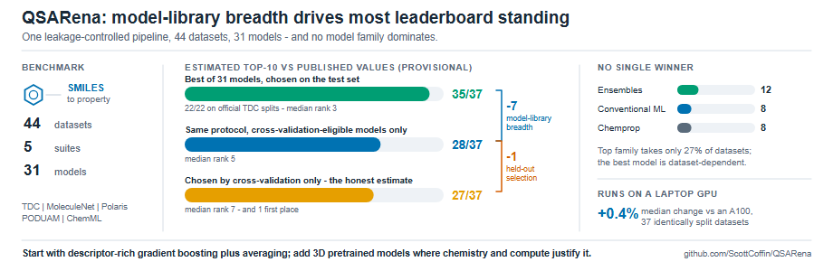
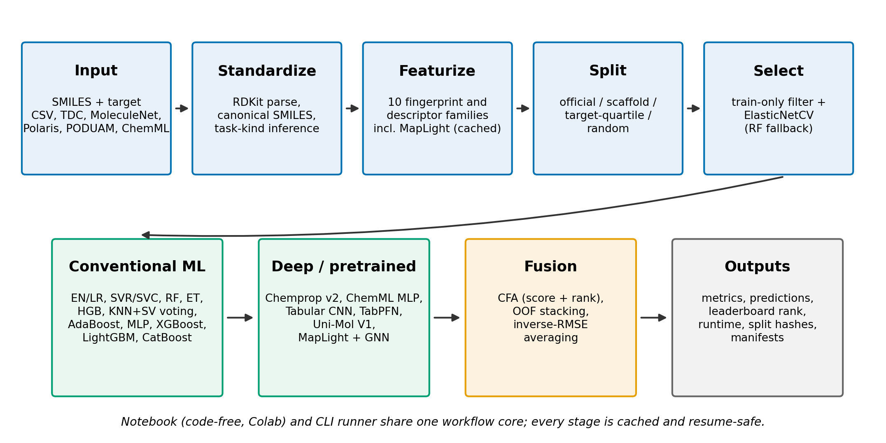
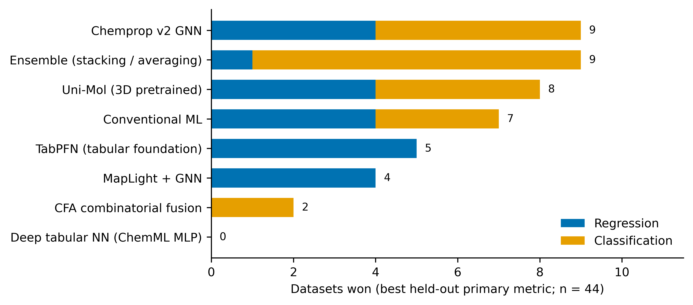
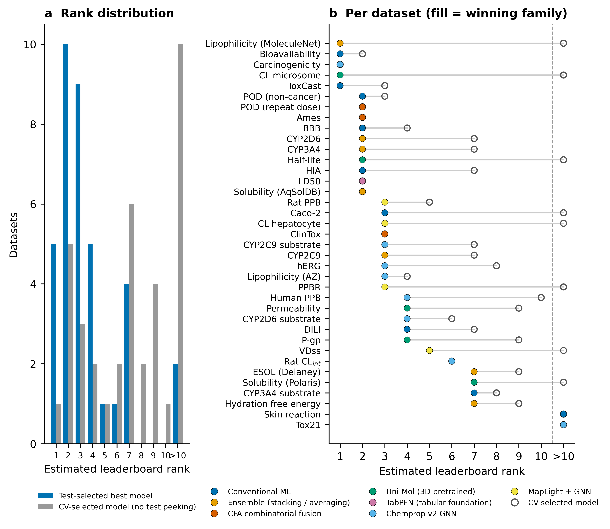
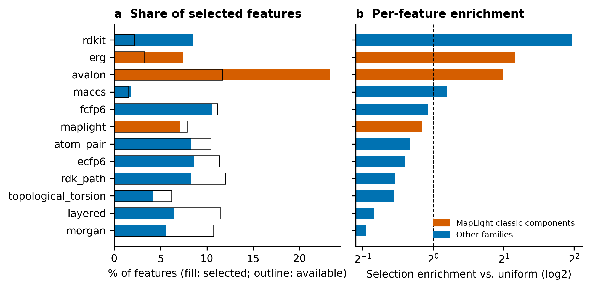
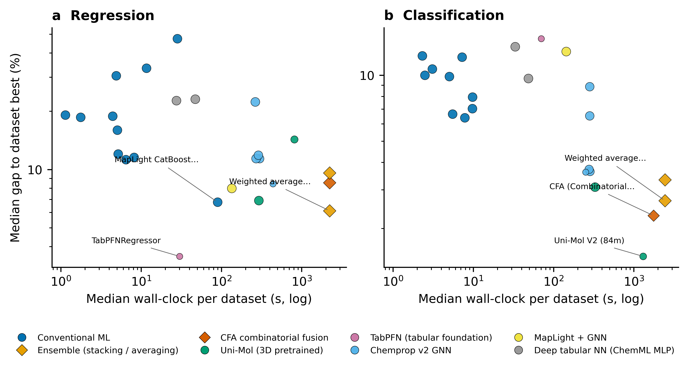
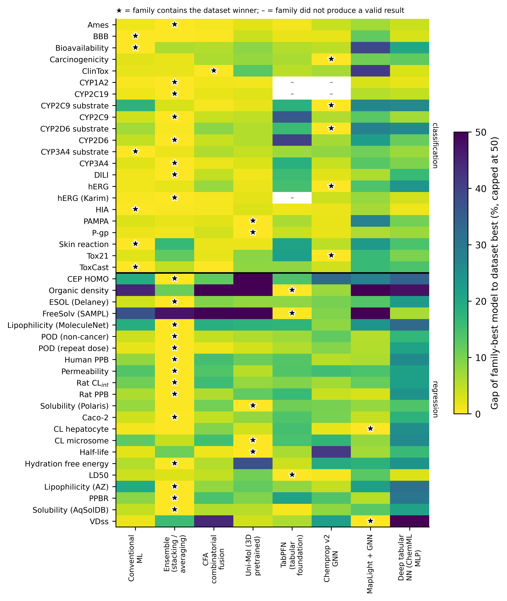
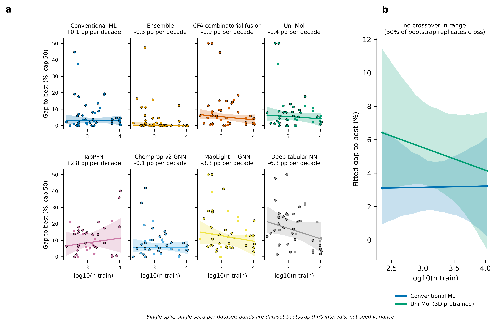
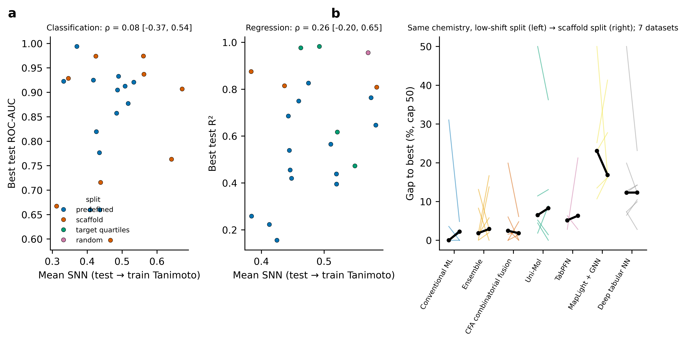
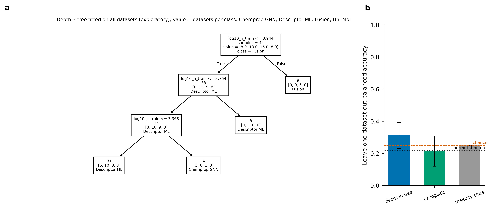

<!-- TITLE ALTERNATIVES (author to choose; revision R1, 2026-10):
  - QSARena: a leakage-controlled, code-free benchmark of 31 molecular property-prediction models across 44 datasets and five suites
  - No model family dominates — and how much of a leaderboard rank is library breadth versus test-selection: a unified benchmark (QSARena)
  - (author's title of 2026-10-06) Ensembles Across Model Families Outperform Any Single Architecture: A Single-Configuration, Leakage-Controlled Benchmark of 31 Molecular Property Models Across 44 Datasets
-->
# QSARena: separating model-library breadth from held-out selection in a leakage-controlled, cross-suite benchmark of molecular property-prediction models

**Running title:** QSARena: an accessible, leakage-controlled AutoML workspace for molecular property prediction

**Author:** Scott Coffin1 (ORCID [0000-0002-7035-1282](https://orcid.org/0000-0002-7035-1282))

1 California Office of Environmental Health Hazard Assessment, 1001 I Street, Sacramento, CA 95814, USA

**Corresponding author:** Scott Coffin (scott.l.coffin@gmail.com)

<!-- Author checklist before submission: open items are marked TODO(author) in comments here and in submission/*.tex, and listed in REVISION_NOTES.md (Zenodo DOI and release tag, other AI assistants, agency disclaimer wording, remaining acknowledgements, suggested reviewers). -->

---

## Graphical abstract

**Graphical abstract.** QSARena evaluates conventional, ensemble and pretrained molecular models under one leakage-controlled pipeline across 44 benchmarks. No single model family wins more than 6 of 44 datasets; out-of-fold ensembles built from them win 22. Choosing the model by cross-validation instead of on held-out data costs 8 of 35 estimated top-ten placements against published values: 7 reflect the breadth of the model library and 1 the selection protocol. Absolute ranks are provisional.

## Abstract

**Background.** ADMET prediction is dominated by ever-larger pretrained models, whose compute cost and reproducibility limit adoption in academic, regulatory and small laboratories. Recent benchmarks report that added scale rarely translates into accuracy but rarely ask how much of a model's leaderboard standing comes from library breadth and from selecting among candidates on held-out data. Neither has been tested across benchmark suites under one fixed, leakage-controlled pipeline.

**Methods.** QSARena, a code-free notebook and command-line runner, evaluated 31 models on 44 datasets from five suites (22 regression, 22 classification; 1094 model-dataset evaluations) under one fixed configuration without per-dataset tuning, with feature selection nested inside cross-validation.

**Results.** Nested feature selection cut median cross-validation optimism from 15.9% to 3.4%; cross-validation selection then picked the per-dataset winner on 4 datasets and sat a median 7.7% from the test-selected best. Against published values, estimated top-ten placement fell from 35 to 27 of 37 comparable datasets under cross-validation selection; a matched-candidate-set control attributes 7 of those 8 lost placements to library breadth and 1 to held-out selection. As recently reported, no single family dominated: conventional machine learning won 6 datasets, Chemprop and 3D pretrained models 5 each and TabPFN 3, while out-of-fold ensembles of these families won 22 and were most consistent (within 5% of best on 84% of datasets). Ranks are provisional, as some references have documented leakage; a consumer-laptop GPU changed the best single-model score by a median of +0.5%.

**Conclusions.** Library breadth drives most leaderboard standing; held-out selection still contributes measurable optimism. Added model scale was not required for competitive accuracy, and no tuning, installation or specialized hardware is needed. Results derive from a single split and seed, so close margins are provisional.

**Scientific Contribution.** We report a uniform, leakage-controlled benchmark across five suites (44 datasets, 31 models) under one fixed configuration. We decompose the gap between test-selected and cross-validation-selected standing into library breadth (7 of 37 placements) and held-out selection (1 of 37), an inflation affecting any comparably selected entry but rarely reported. Both protocols share one run and reference set, so the decomposition is less sensitive to reference quality than absolute ranks.

**Keywords:** QSAR; ADMET; AutoML; molecular property prediction; benchmarking; reproducibility; data leakage; ensemble learning; foundation models; open-source software; accessibility

## 1. Introduction

Unfavourable ADMET properties remain among the most consequential causes of failure in drug development. Approximately 90% of drug candidates that enter clinical testing fail across phases I–III and the subsequent approval process; the dominant causes are lack of clinical efficacy and unmanageable toxicity, with poor drug-like properties — including unfavourable pharmacokinetics — contributing a smaller but material share, having fallen from 30–40% of failures in the 1990s to 10–15% today [44]. The value of screening such liabilities early is well established: inappropriate pharmacokinetics and bioavailability accounted for roughly 40% of clinical attrition in the early 1990s, a share that fell to about 10% by 2000 as the industry adopted routine early ADME profiling [45]. Because experimental ADMET assays are slow, costly and hard to scale to the growing number of synthesized and virtual compounds, *in silico* prediction of ADMET endpoints from chemical structure has become an indispensable complement to laboratory screening [1, 3].

Standardized public benchmarks have driven much of this progress. MoleculeNet established curated datasets and evaluation protocols for molecular machine learning [4], and the Therapeutics Data Commons (TDC) consolidated a large collection of ADMET datasets into a benchmark group with fixed splits, per-task metrics and a public leaderboard enabling direct comparison [5]. More recent resources such as Polaris have emphasized immutable, standardized benchmarks as a route to reproducible comparison. These resources catalysed rapid methodological progress, but also fostered a leaderboard culture in which incremental gains are pursued through increasingly elaborate architectures.

A prominent expression of this trend is the turn toward large pretrained "foundation" models. Graph-based models such as MolE, pretrained on roughly 842 million molecules [6], and MolGPS, scaled to three billion parameters with the aid of phenomics data [7], have established state-of-the-art results on subsets of the TDC ADMET tasks, and parameter-efficient successors such as MiniMol have continued this line of work [8]. Three-dimensional pretrained models such as Uni-Mol, which learns from conformer geometry rather than 2D topology alone, represent a distinct and comparatively cheap point on this spectrum [9]. While impressive, the largest of these models require very large pretraining corpora, specialized hardware and substantial engineering expertise, placing them out of practical reach for many of the settings in which ADMET prediction is most needed.

Critically, the assumption that architectural scale translates into superior ADMET prediction is not well supported. In the most comprehensive benchmark of its kind, Xia et al. evaluated twelve representative models — three non-deep and nine deep — and found that deep models generally fail to outperform non-deep ones, with gradient-boosted trees and random forests on molecular fingerprints tending to perform best, because tree models suit the non-smooth target functions characteristic of molecular property prediction [10]. A review in the *Annual Review of Biomedical Data Science* reached a concordant conclusion: a substantial and consistent advantage of deep learning over standard machine learning across diverse datasets and properties has not been demonstrated, and success in compound-property prediction does not necessarily scale with model complexity [11]. Cross-suite studies since have reinforced this picture rather than overturned it: across diverse real-world datasets the best method is dataset-dependent, and engineered features with classical learners often match or exceed deep models [72]; a 2026 systematic survey identifies reproducibility limits in current splitting and evaluation protocols [73]; and a large reliability study found that the tabular foundation model TabPFNv2 often generalised better than customized molecular foundation models in few-shot and out-of-distribution settings [71].

These observations are borne out on the TDC leaderboard itself, where gradient boosting on combined fingerprint and descriptor representations remains highly competitive: extreme gradient boosting (ADMETboost) [12]; CatBoost paired with ECFP, Avalon and ErG fingerprints plus ~200 molecular properties, which achieved top-3 performance on 16 of 22 benchmarks (the MapLight submission) [13]; AutoML over descriptor sets (CaliciBoost) [14]; and automatic feature-combination frameworks built on simple learners (MaxQsaring, ranked first on 19 of 22 TDC tasks) [15]. Systematic representation studies reinforce this: the choice of molecular representation is often more decisive than model architecture, and optimal choices are strongly dataset-dependent; with formal significance testing, RDKit descriptors were among the strongest single representations across ADMET tasks [16]. Under out-of-distribution evaluation, classical learners and graph neural networks behaved alike: both coped with scaffold splits and both degraded most on chemical-similarity cluster splits [74].

Compounding the questionable returns of architectural complexity is a deepening concern over reproducibility. Across the quantitative sciences, data leakage has been identified as a pervasive and often invisible cause of over-optimistic results, affecting at least 294 papers across 17 disciplines in one survey [17]. Cheminformatics is not exempt: leakage through structure duplication, preprocessing on combined train–test data, and feature selection performed before cross-validation systematically inflates QSAR performance estimates, and reproducibility, interpretability and generalizability deficits have hindered regulatory uptake of ML-based toxicity models [18]. A recent critical assessment of the TDC ADMET leaderboard found that only three top-ranked entries — CaliciBoost, MapLight and MapLight + GNN — passed all reproducibility checks, with most leading submissions exhibiting unavailable code, non-reproducible environments or methodological flaws [19]. Headline rankings therefore frequently fail to reflect either genuine methodological progress or deployable models.

A less-discussed form of the same problem concerns model *selection*. Benchmark suites report the performance of a chosen model on a held-out test set, but when the choice among many candidate models is itself made by comparing test-set scores, the reported number is an optimistic maximum over candidates rather than an estimate of what a practitioner would obtain on new data. This affects AutoML systems especially, since their value proposition is precisely that they search over many models. We treat it here as a result in its own right.

These problems are aggravated by a persistent accessibility gap. Many academic drug-discovery efforts founder in the preclinical "death valley" in part because researchers lack access to commercial ADME prediction software owing to high licensing fees [3]. Open tools have begun to address this, and the peer group is now substantial. ADMET-AI holds the highest average rank on the TDC ADMET leaderboard using a single Chemprop-RDKit architecture trained across 41 TDC datasets, served through a web interface and a command-line tool; its hosted service predicts from pretrained models, though the open-source release also ships training scripts [20]. Among AutoML frameworks, QSARtuna automates the comparison of molecular representations and learners with Optuna, with uncertainty quantification and explainability by design [51]; ZairaChem provides a fully automated, low-resource AutoML pipeline reported to reach state-of-the-art performance out of the box on the TDC ADMET binary classification tasks [52]; QSPRpred offers a flexible open QSPR toolkit with standardized serialization for reproducibility [53]; DeepMol delivered competitive, fully reproducible pipelines across 22 TDC ADMET datasets [21]; DeepPurpose exposes 15 encoders and more than 50 architectures in a few lines of code, though it is drug–target-interaction-centric and used mainly as a TDC baseline [54]; and Auto-ADMET coupled grammar-based genetic programming with a Bayesian network to produce interpretable pipelines [22]. Code-light tools such as ChemXploreML have separately sought to lower the barrier for non-specialists through a desktop GUI, validated on physicochemical rather than ADMET endpoints [23].

Most of the capabilities in the present work already exist in this landscape, and several closely related tools should be distinguished explicitly. DeepChem offers a broader model and featurizer library than QSARena, with standardized MoleculeNet loaders and a unified load–featurize–split–train–evaluate API [61]; it is a programming library, and it does not report a uniform cross-suite evaluation of its own model zoo. QSPRpred, published in this journal, overlaps with QSARena on modularity and reproducibility, offering descriptor × learner model building, hyperparameter optimization and a standardized serialization scheme through a CLI and a Python API [53]; it is a modelling toolkit, not a benchmark, and it has no published cross-suite results. OCHEM [62] and ChemSAR [63] already provide code-free web pipelines that run many QSAR methods, including descriptor selection, validation and, in OCHEM, applicability-domain assessment, so a code-free interface with many methods is not new either. ADMET-AI is the natural accuracy comparator [20]; it is a single, well-tuned Chemprop-RDKit architecture trained on 41 TDC datasets, and it does not compare model families.

Two questions follow, and this paper addresses both. First, whether the scale of modern pretrained models is warranted for molecular property prediction when every model is run under one fixed configuration across several benchmark suites. Second, how much of an automated system's apparent leaderboard standing comes from the breadth of its candidate library and from selecting among candidates on held-out data, rather than from any single model. What the tools above do not report is a single fixed configuration applied across several benchmark suites with train-only feature selection, or an accounting of how much of an AutoML system's apparent leaderboard standing comes from selecting among candidates on held-out data. These two things are the scientific contribution of this paper. The first is a uniform, leakage-controlled benchmark: one pipeline, one configuration and no per-dataset tuning across 44 datasets from five collections, spanning conventional machine learning, gradient boosting, deep tabular and graph neural networks, 3D pretrained models, descriptor–graph hybrids, and fusion and stacking ensembles. The second is a decomposition of the gap between test-selected and cross-validation-selected standing into the value of a broad model library and the cost of honest selection (§3.5). Because both protocols come from the same run, this decomposition is less exposed to the known problems of the published reference set than any absolute rank. All results derive from a single split and seed per dataset, so claims that rest on close margins are reported as provisional; the conclusions we emphasize — the breadth of the winner distribution, the one-sided selection effect and the order-of-magnitude cost differences — do not. The estimated leaderboard ranks themselves are a secondary, provisional analysis, and we do not claim accuracy leadership: several systems report stronger per-endpoint results (§3.12), and parity with ADMET-AI is untested.

The software that produced these results is QSARena, a portable QSAR modelling and benchmarking workspace. It couples a code-free, GPU-optional notebook with a resume-safe command-line runner, both calling a shared workflow core that enforces train-only feature filtering and selection. We treat the code-free notebook as a usability feature. It matters for the regulatory and small-laboratory users described above, but OCHEM and ChemSAR show that it is not by itself a scientific advance.

**A note on naming.** The name *AutoQSAR* is used by an established commercial product from Schrödinger, introduced in 2016 as an automated tool for best-practice QSAR modelling [41] and since extended as DeepAutoQSAR. The tool described here is unrelated to that product and is named QSARena to avoid confusion. We compare against both it and the earlier QSAR Workbench [42] in §3.12.

---

## 2. Methods

### 2.1 Software architecture

QSARena predicts molecular properties directly from SMILES strings and is designed so that a user with a CSV of SMILES and measured values can obtain a benchmarked model without writing code, installing software or owning hardware. It has two entry points that share one workflow core (Figure 1): a widget-driven Jupyter/Colab notebook for code-free model building on built-in or user-supplied data, and a resume-safe command-line runner for many-dataset campaigns on a workstation or HPC allocation. The notebook opens in Google Colab, installs its own dependencies in the hosted runtime and exposes dataset, column, split and model choices through form widgets, so no local CPU, GPU or Python environment is needed. Both paths call identical code for feature generation, splitting, fusion, out-of-fold ensembling and evaluation, so a result obtained in the browser can be reproduced in batch without change. The notebook ensemble draws only on conventional, tuned conventional and Uni-Mol members, because an interactive session has no out-of-fold predictions for the other deep backends unless the runner has produced them.

**Figure 1.** The QSARena workflow. Data ingestion and standardization, featurization, splitting and train-only feature selection are followed by a model library spanning conventional machine learning, deep and pretrained models, and fusion; every stage writes cached, resumable artifacts. The code-free notebook and the command-line runner share this core.

For each dataset the runner executes a fixed sequence: build molecular features; apply the train/test split and train-only feature selection; evaluate the conventional models; run the deep and pretrained workflows; run combinatorial fusion over all successful predictions; build out-of-fold ensembles; and write cross-dataset performance tables. Optional families are skipped gracefully when dependencies, hardware or dataset-size guardrails are unmet, so the rest of a run continues. The 31 models fall into eight families (Table 1); every model and its per-dataset availability are listed in Additional file 1, Table S12.

### 2.2 Datasets and curation

Benchmark datasets were drawn from five public collections through dedicated loaders: ChemML bundled examples [64]; TDC single-prediction ADME and Tox tasks [5]; MoleculeNet physicochemical datasets (ESOL [24], FreeSolv [25], Lipophilicity); Polaris ADME benchmarks; and the PODUAM point-of-departure datasets [26]. Each dataset is represented internally by a specification recording the SMILES column, target column, recommended split, recommended metric, benchmark suite and any leaderboard reference metadata.

All molecules were standardized before featurization: the target was coerced to numeric, rows with missing or non-finite SMILES or target values were removed, and each SMILES was parsed with RDKit [27]; molecules that failed to parse were dropped and the remainder re-encoded as canonical SMILES. Targets from the TDC, MoleculeNet, Polaris, literature and PFAS auxiliary suites were kept on their native scale, and other datasets used a base-10 logarithmic transform when all target values were positive.

For TDC datasets, the official `admet_group` train/test split was used wherever PyTDC provides one. This distinction matters for interpretation and we preserve it throughout: 22 TDC datasets and 5 Polaris datasets used official predefined splits, while the remaining 17 used locally generated scaffold, random or target-quartile splits and are therefore *not* directly leaderboard-equivalent (Section 3.5). Task kind was inferred from the targets rather than from catalog metadata, strict binary 0/1 targets being routed to classification, so four binary datasets that the dataset catalog listed with a regression metric when the benchmark ran (corrected since) are analysed as classification throughout.

### 2.3 Molecular representations

Ten configurable feature families were computed with RDKit: Morgan [28], ECFP6 and FCFP6 circular fingerprints, RDKit path, layered, atom-pair and topological-torsion fingerprints, MACCS keys [29], the full RDKit 2D descriptor set, and the "MapLight classic" composite that reproduces the MapLight TDC submission [13]: Morgan and Avalon count fingerprints [30], the extended reduced graph (ErG) pharmacophore fingerprint [31] and a curated panel of about 200 RDKit descriptors. In the feature-selection analyses this composite appears as its three constituent families (`avalon`, `erg` and the `maplight` descriptor panel). Every matrix was finalized identically (infinite and float32-overflowing values masked, gaps imputed with the training-column median, cast to float32) and cached in a content-addressed feature store keyed by canonical SMILES and a hash of the representation settings, so only new molecules are computed on later runs. Bit widths, radii, the descriptor panel and the store's design are given in Additional file 1, Note S2.

### 2.4 Splitting and cross-validation

Four splitting strategies were supported — random, target-quartile, scaffold and predefined — selected per dataset with a benchmark-aware default, with a test fraction of 0.2 and random seed 13. Scaffold splits grouped molecules by stereochemistry-free Bemis–Murcko scaffold [32] and assigned whole scaffold groups to the test set by a greedy, seeded procedure, so that no scaffold appears in both partitions. Target-quartile splits stratified on quartiles of the target, reverting to random splitting when a dataset could not populate at least two bins per fold. Official TDC partitions were used directly, with deterministic reassignment by SMILES so that no molecule appears in both train and test. Cross-validation mirrored the split geometry (`GroupKFold` over scaffold groups, `StratifiedKFold` over quartile bins, shuffled `KFold` otherwise), with a defined fallback to random folds when group or bin constraints could not be met.

### 2.5 Feature filtering and selection

Before model fitting, a leak-free pre-filter removed degenerate and redundant columns using statistics computed on the training partition only and applied identically to the held-out set: near-constant columns below a variance threshold of 1 × 10⁻⁸ were dropped, binary columns whose positive prevalence fell outside 0.005–0.995 were removed, and exact-duplicate columns were pruned.

Selection was then performed train-only with a cross-validated elastic net, fitted in an isolated subprocess over an L1-ratio grid and a log-spaced alpha grid with folds matched to the active split strategy. Features were retained when the absolute coefficient exceeded a threshold, with at least one feature always kept and the retained set capped at 10% of the training-row count. To bound runtime, selection fell back to random-forest importance ranking when the elastic net exceeded a wall-clock limit (default 7,200 s) or failed. Because that limit makes the selection depend on the speed of the machine (see Limitations), the runner also has a deterministic selection mode, which removes the time limit, runs the selector single-threaded, and can load a previously deposited selection instead of refitting it. The A100 selection used for every result in this paper is deposited with the artifacts.

<!-- META:methods_nested_selection -->
**Feature selection inside cross-validation.** Selecting features on the whole training split and then cross-validating models on the selected columns lets every held-out fold influence the selection, which inflates cross-validated scores. Selection was therefore refitted inside every cross-validation fold, on that fold's training rows only and with the method pinned to the one recorded for the full training split. These fold-specific selections produce both the cross-validated metrics of every model that uses the selected features and their out-of-fold ensemble predictions (§2.12); §3.4 reports the bias they remove. Where TabPFN's local fold refits did not fit the GPU, its cross-validated scores are withdrawn rather than reported from the leaky protocol.
<!-- /META -->

### 2.6 Model library

**Conventional machine learning.** For regression, the library holds elastic net with internal cross-validated regularization, support vector regression, random forest, extremely randomized trees, histogram gradient boosting, a soft-voting KNN + SVR ensemble, AdaBoost and a tabular multilayer perceptron from scikit-learn [33], a compact one-dimensional convolutional network over the feature vector, and the XGBoost [34] and CatBoost [36] gradient-boosting libraries; classification used the analogous estimators with classification losses. One further model, XGBoost on the full, unselected ADMETboost feature set (MACCS, ECFP4 and PubChem fingerprints, Mol2Vec embeddings, and Mordred and RDKit 2D descriptors), bypasses feature selection; it joined the library after the main run (Section 2.12). Every hyperparameter was fixed in advance and is listed in Additional file 1, Note S2.

**Deep, graph and pretrained models.** Two ChemML multilayer perceptrons (PyTorch and TensorFlow backends) form the deep tabular family. MapLight + GNN fits CatBoost on MapLight classic features plus pretrained graph isomorphism network (GIN) embeddings, and a strict leaderboard-parity MapLight CatBoost reproduces the published protocol [13]. Graph neural networks came from Chemprop v2 [37, 38, 48]: D-MPNN, CMPNN-style and AttentiveFP-style encoders, and D-MPNN variants augmented with the selected descriptors or an RDKit 2D featurizer, each trained as a three-model ensemble. Uni-Mol V1 and V2 [9, 47] were the 3D pretrained models and TabPFN [39] the tabular foundation model. The training settings of every backend are recorded in the run configuration and listed in Additional file 1, Note S2.

**Genetic-algorithm tuning.** An optional stage tunes elastic-net and CatBoost models by genetic algorithm. It was disabled throughout this benchmark, so no GA-tuned model appears in any result and its value is untested here.

### 2.7 Combinatorial fusion and ensembling

After base models produced aligned train and test prediction vectors, QSARena fused them by combinatorial fusion analysis (CFA) [40] in both score and rank spaces. Inputs were reduced to the best model per workflow, and for each candidate subset equal, performance-weighted and diversity-weighted combinations were evaluated in score and rank space, the best by training metric being returned (Additional file 1, Note S2).

Three further ensemble strategies were available over the same prediction pool: out-of-fold stacking with a RidgeCV meta-model (logistic for classification), a weighted average with weights proportional to each member's inverse out-of-fold error, and a simple average. Member selection, weighting and the stacking meta-model read only out-of-fold predictions on the training split (Section 2.12); held-out test predictions are never consulted. Two optional member filters read the same out-of-fold predictions: one removes members with non-positive out-of-fold R², the other drops one member of each highly correlated pair. For regression, member predictions are clipped to the range of the training targets before they are combined, so that a member which extrapolates wildly on a few molecules cannot dominate an average or a stack; this uses no test-split labels. CFA outputs and members without out-of-fold predictions are excluded and listed in each ensemble's notes. TabPFN is also excluded, because most of its full-fit predictions came from the Prior Labs API while its fold refits used the local package.

### 2.8 Evaluation metrics

Regression performance was summarized by RMSE, mean absolute error, R² and Spearman rank correlation; classification by AUROC, AUPRC, balanced accuracy and the Matthews correlation coefficient. For cross-dataset ranking we used RMSE for regression and, for classification, each dataset's designated primary metric, following the TDC leaderboard's per-dataset assignments: AUPRC on five CYP datasets and AUROC on every other classification dataset (Additional file 1, Table S1). For comparisons against published leaderboards we re-selected the best model per dataset under the *leaderboard's* metric, which is MAE or Spearman rather than RMSE for several TDC regression tasks, so the best model under RMSE and under the leaderboard metric sometimes differ; both are reported (Additional file 1, Tables S1 and S7).

Because absolute metric differences are not comparable across datasets with different target units — an RMSE gap of 1.0 is negligible for hepatocyte clearance and fatal for log-solubility — all cross-dataset summaries of how close a model came to the per-dataset best use a **relative** gap, |score − best| / |best|.

### 2.9 Leaderboard comparison

Where curated leaderboard references existed, the best QSARena model was compared against published values whose metric matched the dataset's leaderboard metric, giving the gap to the top-1 reference, the gap to the top-10 cutoff and an estimated rank among the published entries. Reference rows were aggregated from TDC, MoleculeNet and Polaris leaderboards together with a manually curated set of TDC ADMET reference values and, for ESOL and Lipophilicity, current literature values in place of the 2017-era MoleculeNet baselines.

Three limits of this procedure should be kept in view. First, "estimated rank" reflects the references available for a dataset, not a live leaderboard submission; a dataset with few references yields an optimistic-looking rank. Second, ranks are only leaderboard-equivalent where the split protocol matches, which is true for the 22 TDC `admet_group` datasets and the 5 Polaris datasets but not for the 10 comparable datasets evaluated on locally generated splits. Third, the published values include self-reported ranks from different dates and entries with documented leakage (Sections 3.5 and 3.12). We therefore treat every estimated rank as a provisional, secondary analysis.

### 2.10 Model selection protocols

We report every headline result under two selection protocols.

**Test-selected.** The best model per dataset is the one with the best held-out primary metric. This is the protocol used by AutoML leaderboard submissions generally, and it is what Sections 3.2–3.3 and the first half of Section 3.5 report for comparability with published entries.

**Cross-validation-selected.** The model is chosen per dataset solely by its cross-validated primary metric on the training partition, and its held-out score is then read off without further choice. This estimates what a practitioner obtains when the test set is genuinely untouched. It is available for the models that emit cross-validated metrics — the conventional estimators, TabPFN and the ChemML MLPs — but not for Chemprop, Uni-Mol, MapLight + GNN or the fusion methods, so it is a conservative lower bound on what a fully CV-driven QSARena would achieve. Its cross-validated scores come from feature selection refitted inside each fold (Section 2.5).

### 2.11 Reproducibility and computing environment

The runner is designed for long, resumable runs: completed datasets and compatible intermediates are reused on resume, and each run records a configuration signature, per-dataset status manifests, split-signature hashes and per-stage runtimes. Each dataset directory retains metrics, selected features and selector coefficients, a feature-deduplication report, the CFA candidate table and ensemble weights, and a SHA-256 manifest covers the repository-level and per-dataset artifacts. The workflow targets Python 3.11 on Windows, macOS, Linux or Google Colab; the core runs on CPU, and a GPU mainly affects runtime and whether local TabPFN and Uni-Mol are practical. Pinned conda and pip specifications, an Apptainer definition, Slurm scripts for NSF ACCESS clusters and an orchestration path for Jetstream2 are distributed with the repository.

The base benchmark ran on NSF ACCESS Jetstream2 [75, 76] on one NVIDIA A100-SXM4-40GB GPU with 32 CPU cores under Linux, in fp32 precision; the device inventory and configuration are recorded with the deposited artifacts, and the wall-clock and cost figures in this paper come from that run. All figures, tables and quoted numbers regenerate from the deposited artifacts with one command, which also writes a machine-readable record of every headline number, and a companion script fails if the manuscript text and the artifacts disagree. Per-molecule prediction files are excluded from the repository for size, so prediction-level diagnostics such as inter-model prediction diversity cannot be reproduced from it alone; they are included in the archived release (see Availability of data and materials).

### 2.12 Benchmark runs and ensemble reconstruction

The reported results combine three runs that share one data, split, feature and feature-selection configuration, which the runner verifies through stage signatures: the base benchmark, in which a text-encoding fault in the Chemprop harness discarded most Chemprop results and TabPFN was disabled; a repair run that trained only what was missing (the five Chemprop variants, TabPFN and one interrupted dataset); and a rebuild of every ensemble from out-of-fold predictions, with feature selection nested inside each cross-validation fold (Section 2.5). No base model was retrained, with two documented exceptions: ten conventional and gradient-boosting models were retrained with probability outputs on four binary datasets on which they had saved hard class labels, and TabPFN's label-based results on three of those datasets were withdrawn because neither the local package nor the metered API could rerun them. The descriptor model of Section 2.6 was added to the library after it performed well in an exploratory analysis, which can flatter test-selected comparisons; Section 3.2 bounds its effect. Additional file 1, Note S1 gives the full provenance, including the two earlier ensemble protocols that this rebuild replaced.

### 2.13 Use of large language models

Large language model (LLM) assistants were used during software development, analysis and manuscript preparation; as the journal requires, that use is documented here. Anthropic's Claude models (Claude Sonnet 4.6, Claude Opus 5 and Claude Opus 5.5), accessed through the Claude Code coding assistant, were used to (i) write, refactor, test and debug parts of the QSARena code base and its test suite; (ii) write and run analysis scripts, monitor long-running benchmark jobs and diagnose their failures; and (iii) draft and edit manuscript text and supplementary documentation. The author specified the study design, the benchmark protocol and every analytical decision, reviewed and validated all AI-assisted code and text, and takes full responsibility for the content. No LLM is an author. LLMs did not generate data or results: every reported number is computed by scripted pipelines from the benchmark artifacts and checked against them automatically, and the code is covered by unit, integration and tutorial tests. All figures, including the graphical abstract, are rendered by code directly from benchmark outputs; no AI image-generation tools were used.
<!-- TODO(author): add any other assistants used (for example ChatGPT or GitHub Copilot), or confirm that Claude was the only one. -->

## 3. Results and discussion

### 3.1 Benchmark coverage

We executed QSARena across 44 datasets[^1] under a single fixed configuration (full model profile, random seed 13, Chemprop seed 42). They comprise 22 regression and 22 classification tasks drawn from five collections: TDC (32), Polaris ADME (5), MoleculeNet (3), ChemML (2) and PODUAM (2). They span 280 to 13,445 molecules (median 1,605; 156,052 in total) and four split protocols (27 predefined, 12 scaffold, 4 target-quartile, 1 random). Thirty-one models produced at least one valid result, yielding 1094 valid model–dataset evaluations. The dataset catalog, with each dataset's estimated leaderboard rank and the best published value it is measured against, is given in Additional file 1, Table S6.

### 3.2 No single model family dominates

Consistent with the cross-suite studies cited in the Introduction, no single model family won across the benchmark (Figure 2, Table 1). Stacking and averaging ensembles built from the other families produced the most outright wins (22 of 44 datasets: 14 regression, 8 classification), followed by conventional machine learning (6), Chemprop v2 and the 3D pretrained Uni-Mol models (5 each), TabPFN (3), the MapLight + GNN descriptor–graph hybrid (2, both regression), combinatorial fusion (1) and deep tabular networks (0). No single model family won more than 14% (6 of 44). The ensemble row is not a like-for-like competitor: ensembles are built *from* the other families' predictions, although their member selection and weights use only out-of-fold predictions, so the row estimates what the pipeline can obtain from honest training-set predictions rather than what stacking can gain by consulting the final test set.

**Figure 2.** Datasets won by each model family, split by task kind. A win is the best held-out primary metric on that dataset among all 31 models. *Single split and single seed: individual placements are provisional and no variance is estimated (see Limitations).*

Three of conventional machine learning's six wins come from the descriptor model added after the main run (Section 2.12). With that model removed as a candidate, conventional machine learning wins 3 datasets, the ensembles 24 and Uni-Mol 6, and no single family wins more than 6 (Additional file 1, Table S14); the ensemble rows still contain it as a member, so this bounds only its direct effect. The 3D pretrained family won two classification datasets as well as three regression datasets (aqueous solubility, microsomal clearance and half-life, properties for which conformational and shape information is mechanistically plausible as signal), so conformer-based pretraining is not a regression-only tool; under the shorter training schedule of our earlier consumer-GPU run it won no classification dataset (Section 3.10).

Per-dataset winners, with the corresponding cross-validation-selected model, are listed in Additional file 1, Table S1, and the full dataset × family landscape is shown in Figure 6. These are single-split, single-seed outcomes: an unknown fraction of individual winners would change under a different seed, so we read Figure 2 as a distribution of capability across families and base the claim on that breadth (see Limitations).

### 3.3 Consistency versus peak performance

Win counts reward only the single best model per dataset and understate the reliability of models that are consistently near-best without winning. Table 1 therefore reports, for each family, the median relative gap to the per-dataset best, the fraction of datasets on which the family's best member landed within 5% of the best result, and the median rank that member achieved.

<!-- TABLE:table3_architecture_families -->
| Model family | Models | Datasets with valid results | Wins (regression) | Wins (classification) | Median gap to best, regression (%) | Median gap to best, classification (%) | Within 5% of best (% of datasets) | Median rank of family-best model |
|---|---|---|---|---|---|---|---|---|
| Ensemble (stacking / averaging) | 2 | 44 | 14 | 8 | 0.0 | 0.8 | 84.1 | 1.5 |
| Conventional ML | 16 | 44 | 0 | 6 | 7.0 | 1.3 | 65.9 | 3.5 |
| Uni-Mol (3D pretrained) | 2 | 44 | 3 | 2 | 8.1 | 2.7 | 47.7 | 6.5 |
| Chemprop v2 GNN | 5 | 42 | 0 | 5 | 9.7 | 2.9 | 47.6 | 7.0 |
| TabPFN (tabular foundation) | 2 | 41 | 3 | 0 | 9.0 | 8.3 | 22.0 | 11.0 |
| MapLight + GNN | 1 | 44 | 2 | 0 | 9.8 | 12.9 | 11.4 | 16.5 |
| CFA combinatorial fusion | 1 | 44 | 0 | 1 | 10.1 | 1.7 | 50.0 | 5.5 |
| Deep tabular NN (ChemML MLP) | 2 | 44 | 0 | 0 | 23.5 | 9.8 | 18.2 | 17.5 |
<!-- /TABLE -->

**Table 1.** Model-family coverage and consistency. Gaps are relative to the per-dataset best primary metric. "Within 5% of best" counts datasets where the family's best member fell within 5% of the dataset winner. Families evaluated on fewer than 44 datasets were limited by task applicability, size guardrails or backend failures (Additional file 1, Table S4); their percentages are computed over the datasets on which they ran. All values derive from a single split and seed, so adjacent rows are not separated (see Limitations).

The out-of-fold ensembles were the most consistent (within 5% of the best on 84% of datasets) and conventional machine learning the most consistent single family (66%); every other family was within 5% on at most half of the datasets. Two cautions apply. Families with more models have more chances to produce a near-best member, so the 15-model conventional family is flattered relative to single-model families; and the ensemble row is not a like-for-like competitor, as noted above. Section 3.6 quantifies how much the fusion layer actually adds.

Uneven coverage does not drive these orderings. Chemprop v2 produced valid results on 38 to 42 of the 44 datasets depending on variant, TabPFN on 41 and Uni-Mol V2 on 17 (Section 3.9). Restricted to the 41 datasets on which all eight families produced a result, the single families keep their win counts (conventional machine learning 6, Chemprop and Uni-Mol 5 each, TabPFN 3), the ensembles win 19, and conventional machine learning keeps the smallest median gap of any single family (3.7%, against 5.8% for Uni-Mol and 5.9% for Chemprop); on the 17 datasets on which Uni-Mol V2 ran, Uni-Mol wins 4 and conventional machine learning 2 (Additional file 1, Table S13). The comparison between conventional and pretrained families therefore does not depend on which datasets each family covered.

<!-- META:results_nested_selection -->
### 3.4 Nested feature selection removes most cross-validation optimism

Fitting feature selection once on the whole training split and then cross-validating on the selected columns lets every validation fold help choose its own features. A controlled comparison on 9 datasets, with identical features, models and folds and selection fitted either outside or inside the folds, isolated this effect: fitting selection outside the folds raised the overstatement of cross-validated over test RMSE by a median of 22.7 percentage points for ElasticNetCV, 6.1 for random forest and 2.5 for SVR, and raised it in 26 of 27 dataset-model pairs (sign test, p < 0.001).

Across the benchmark, on datasets with predefined or scaffold test splits, nesting the selection (§2.5) cut the median overstatement of cross-validated over test scores from 15.9% to 3.4% across 462 model-dataset pairs (lower in 96% of them). That is the level shown by fixed-configuration models trained without feature selection on the same folds (3.4%), so the optimism that remains reflects the gap between training-set folds and harder held-out splits rather than leakage (see Limitations). Test-set results are unchanged by construction: the deployed models and their selected features are the same. The correction matters in two places downstream. The cross-validation-selected protocol of §3.5 now rests on unbiased cross-validated scores, and the out-of-fold ensembles no longer over-weight members whose fold predictions benefited from the leak.
<!-- /META -->

Nesting the selection also changed the ensembles, because the leak had inflated the out-of-fold predictions of members that use selected features and the stacker over-weighted them. It improved the best ensemble on 39 of the 44 datasets (median error reduction 4.9% for regression; median AUROC gain 0.7% for classification), while no base model's test result changed. Under the out-of-fold protocol with nested feature selection, ensembles won 22 datasets (14 regression, 8 classification), against 16 (7 and 9) under the leaky first protocol and 12 (6 and 6) when their out-of-fold predictions came from the outer feature selection (Additional file 1, Note S1).

### 3.5 Leaderboard competitiveness, and the cost of honest model selection

This section reports two kinds of result: the comparison between selection protocols, which is internal to a single run and is the primary result, and estimated ranks against published values, which are provisional because the reference set contains entries with documented leakage and each rank rests on one split and seed.

Across the leaderboard-comparison layer, 37 datasets could be compared against 430 published reference values. The best QSARena model per dataset placed within the estimated top ten on 35 of 37 datasets, with a median estimated rank of 3 and six estimated first places (Additional file 1, Table S7). The two datasets below the top ten, Tox21 and skin reaction, were both evaluated on locally generated scaffold splits that are harder than the references they are scored against.

**Figure 3.** Estimated leaderboard placement across 37 comparable datasets. (a) Rank distribution for the test-selected best model and for the model selected by cross-validation alone. (b) Per-dataset ranks; filled markers are the test-selected model coloured by model family, open markers the cross-validation-selected model. The dashed line marks the top-ten boundary. *Single split and single seed: individual placements are provisional and no variance is estimated (see Limitations).*

Comparability varies by dataset, and the aggregate obscures it. Restricted to the 22 TDC datasets evaluated on official `admet_group` splits — the only subset directly comparable to the public TDC leaderboard — the test-selected model placed in the top ten on **all 22**, with a median rank of 2.5 and two estimated first places. On the 5 Polaris datasets it placed in the top ten on all 5, median rank 4, with one first place. The remaining 10 comparable datasets used locally generated splits and are *not* leaderboard-equivalent; both sub-top-ten results and three of the six first places fall in this group, and those should be read as "competitive with published values under a comparable but not identical protocol", not as leaderboard claims. Table 2 gives the breakdown by comparison class.

<!-- TABLE:table4_leaderboard_summary -->
| Comparison class | n | Top-10 test | Median rank test | Top-10 CV | Median rank CV |
|---|---|---|---|---|---|
| TDC ADMET Group (official) | 22 | 22 | 2.500 | 16 | 7.000 |
| Polaris ADME (official) | 5 | 5 | 4.000 | 4 | 6.000 |
| Local splits (not leaderboard-equivalent) | 10 | 8 | 2.500 | 7 | 8.500 |
| All comparable datasets | 37 | 35 | 3.000 | 27 | 7.000 |
<!-- /TABLE -->

**Table 2.** Rank among curated published reference values, by comparison class. Only the 27 datasets with official predefined splits — 22 TDC ADMET Benchmark Group and 5 Polaris ADME — are directly comparable to a public leaderboard; the remaining 10 are scored against published values under a comparable but not identical protocol and are reported separately rather than pooled. Columns: "n" is the number of datasets in the class; "test" selects the best model per dataset on held-out data; "CV" selects by cross-validation only. Per-dataset detail is in Additional file 1, Table S7. Single split and single seed, so individual placements are provisional.

That headline, however, is produced by choosing the best of 31 models using held-out scores. Under the stricter protocol in which the model is chosen by cross-validation alone (Section 2.10), top-ten placement falls from 35 to 27 of 37 datasets, first places from six to one, and the median estimated rank from 3 to 7 (Figure 3). On the official TDC subset the fall is from 22 of 22 to 16 of 22. Across all 44 datasets, the cross-validation-selected model was the overall winner on 4 datasets and sat a median of 7.7% above the per-dataset best.

**That eight-dataset gap has two causes, and separating them changes its interpretation.** Cross-validation selection is restricted to models that emit cross-validated metrics, which in this run excludes Chemprop, the Uni-Mol models, MapLight + GNN and the fusion methods. The comparison above therefore confounds the cost of not peeking at the test set with the cost of losing those candidate families. To separate them we added a third protocol that holds the candidate set fixed at the cross-validation-eligible models and selects among them on the test metric:

| Selection | Candidate set | Top ten | First places | Median rank |
|---|---|---|---|---|
| Test metric | Full 31-model library | 35/37 | 5 | 3 |
| Test metric | CV-eligible models only | 28/37 | 3 | 5 |
| Cross-validation | CV-eligible models only | 27/37 | 1 | 7 |

Read down the table, **7 of the 8 lost placements come from narrowing the candidate set and 1 from honest selection**; the median rank moves from 3 to 5 on library breadth and from 5 to 7 on selection protocol. The breadth of the model library is therefore the strongest available argument for running many model families rather than one well-tuned architecture. The cost of honest model selection is smaller but still visible: within the cross-validation-eligible pool it reduces estimated first places from 3 to 1.

The individual ranks in Figure 3 carry unquantified seed variance, but the shift is large and one-sided, and it would take implausibly favourable seed variance to erase an eight-dataset gap. The inflation is not specific to QSARena: any leaderboard entry that selects among candidate models or configurations using test-set feedback carries it, and a reproducibility audit of the TDC leaderboard [19] suggests that such selection is rarely documented. We take the cross-validation-selected result — top ten on nearly three-quarters of comparable datasets — as the honest estimate of what a practitioner should expect, and as a conservative one, since Chemprop, Uni-Mol, MapLight + GNN and the fusion methods were ineligible for it.

**The reference set is itself imperfect.** The same audit found that only three top-ranked TDC ADMET entries — CaliciBoost, MapLight and MapLight + GNN — passed all reproducibility and leakage checks, and reported direct or indirect data leakage in several others. Our cross-validation-selected model is therefore ranked against a reference population that includes entries inflated by the very selection effect measured here, which makes our test-selected numbers less impressive, and our cross-validation-selected numbers more conservative, than a like-for-like comparison would. The gap between the two protocols, internal to our own run and free of this contamination, is the more trustworthy quantity, and future leaderboard-relative claims should be scored against an audit-verified subset once one is maintained.

For ESOL and Lipophilicity we scored against current literature values rather than the dated MoleculeNet leaderboard; the Lipophilicity first place is a nominal margin of 0.001 RMSE, well inside single-split variance, and we make no state-of-the-art claim for either.

### 3.6 What the pipeline's components contribute

Because fusion and ensembling add computational cost and interpretive complexity, we asked what each layer of the pipeline actually buys (Table 3).

<!-- TABLE:table5_ensemble_value_add -->
| Fusion method | Task | Datasets | Overall wins | Top-3 | Beats best base | Loses to best base | Median rank | Median rel. change vs best base |
|---|---|---|---|---|---|---|---|---|
| OOF stacking | classification | 22 | 6 | 15 | 8 | 14 | 2.000 | -0.005 |
| CFA fusion | classification | 22 | 1 | 10 | 4 | 18 | 5.000 | -0.006 |
| Other ensemble | classification | 22 | 2 | 7 | 7 | 15 | 4.500 | -0.018 |
| OOF stacking | regression | 22 | 12 | 18 | 14 | 8 | 1.000 | 0.024 |
| Other ensemble | regression | 22 | 2 | 9 | 5 | 17 | 4.000 | -0.040 |
| CFA fusion | regression | 22 | 0 | 5 | 2 | 20 | 6.500 | -0.067 |
<!-- /TABLE -->

**Table 3.** Ensemble and fusion value-add against the best single base model available on the same dataset, under each dataset's primary metric.

Taking the best fusion method per dataset, some fusion beat the best single model on 9 of 22 classification datasets, with a median relative improvement of 1.4% where it won, and on 14 of 22 regression datasets, with a median improvement of 4.1% where it won. Across all datasets the typical fusion result was better than the best single model for regression (median +3.2%) and slightly worse for classification (median -0.3%), because fusion also loses on the datasets where it does not win. Fusion is therefore worth its cost on most regression datasets and on roughly two classification datasets in five, but should not be expected to win by default on classification. These margins are the smallest quantities we report — median relative changes below 3% on a single split and seed — and are correspondingly the most fragile.

A staged ablation over the same artifacts (Additional file 1, Table S2) tells a consistent story: starting from conventional machine learning alone, adding MapLight classic features improved the achievable result on 9 of 44 datasets, adding the neural and pretrained backends improved 26, adding CFA improved 6, and adding the out-of-fold ensemble layer improved 22. The deep and pretrained backends are therefore the largest single source of incremental accuracy — which cuts against a purely "conventional models are enough" reading of Figure 2 — closely followed by the ensemble layer that combines them, while CFA contributes modestly. That incremental accuracy is not free (Section 3.8) and does not make any pretrained family a reliable default.

### 3.7 Feature representations

We quantified which representation families the leak-free elastic-net selector actually retained, relative to a uniform-selection baseline (Figure 4; Additional file 1, Table S3). Of 12,137 selected features across all datasets, the three components of the MapLight classic composite accounted for 46.2%, against 22.9% of the available feature pool — a clear enrichment for the composite as a whole.

**Figure 4.** Feature-family representation among selected features. (a) Share of selected features (filled) against share of available features (outlined). (b) Per-feature selection enrichment relative to a uniform baseline, log₂ scale. Components of the MapLight classic composite are highlighted.

On a per-feature basis the ordering is more informative. The compact RDKit 2D descriptor panel was by far the most enriched family (5.16× uniform), followed by ErG (2.86×) and Avalon (2.54×); MACCS keys were marginally enriched (1.18×); and the large hashed circular and path fingerprints were all *de*-enriched, including FCFP6 (0.73×). A few hundred interpretable descriptors thus earn selection far above their numerical weight, and thousands of hashed fingerprint bits below theirs (Avalon's large absolute share, 29.7% of selected features, reflects its size as much as its per-feature value), so for practitioners with limited compute the RDKit descriptor panel plus one compact pharmacophore representation captures most of the selectable signal. This is consistent with representation benchmarks reporting that descriptor sets outperform fingerprints as standalone representations [16] and that fixed representations lead on most datasets [46].

### 3.8 Computational cost

A core motivation for QSARena is that competitive accuracy should not require GPU-scale compute. The complete benchmark consumed 111.8 hours of recorded wall-clock time across 44 datasets (median 1.89 h per dataset; maximum 11.2 h for the 13,445-molecule hERG-Karim set) on the A100 node. We report per-model cost as each model's own incremental wall-clock time; fusion methods are additionally charged the summed cost of the base-model pool they consume, since a fusion result cannot be obtained without it.

**Figure 5.** Median wall-clock time per dataset against median relative gap to the per-dataset best, by model, separately for regression (a) and classification (b). Both axes are logarithmic; diamonds mark fusion methods, which are charged the summed cost of the base-model pool they consume in addition to their own, since a fusion result cannot be obtained without it.

Per-family median cost spans more than three orders of magnitude (Table 4): 0.3 s for CFA and 0.6 s for the ensemble meta-models (excluding their base pool), 6.8 s for conventional machine learning, 39.8 s for the deep tabular networks, 137 s for MapLight + GNN, 269 s for Chemprop v2 and 374 s for the Uni-Mol models. The 3D pretrained family therefore costs roughly 55 times the median conventional model per dataset, in exchange for 5 wins and a family median rank of 6.5: a deliberate trade, not a default. The models that won most datasets — gradient-boosted trees and the linear meta-models over them — carry no pretraining corpus at all, against published comparators such as MolE (~100 M parameters, pretrained on ~842 M molecules) [6] and MolGPS (~3 B parameters) [7]. Per-model costs and feature-selection scaling are given in Additional file 1, Note S6.

<!-- TABLE:table6_cost -->
| Model family | Model-dataset fits timed | Median own wall-clock (s) | IQR own wall-clock (s) | Median cost incl. base pool (s) | Median trainable parameters | Notes |
|---|---|---|---|---|---|---|
| CFA combinatorial fusion | 44.0 | 0.3 | 0-0 | 1,378 |  | fusion over fitted base-model predictions; timing from canonical full run |
| Ensemble (stacking / averaging) | 87.0 | 0.6 | 0-1 | 1,378 |  | fusion over fitted base-model predictions; timing from canonical full run |
| Conventional ML | 440.0 | 6.8 | 3-20 |  | 157,953 | measured in canonical full run |
| Deep tabular NN (ChemML MLP) | 88.0 | 39.8 | 27-94 |  | 90,369 | measured in canonical full run |
| MapLight + GNN | 44.0 | 137.4 | 126-160 |  |  | measured in canonical full run |
| Chemprop v2 GNN | 25.0 | 268.6 | 229-274 |  | 325,552 | measured in canonical full run |
| Uni-Mol (3D pretrained) | 61.0 | 373.5 | 170-1285 |  | 47,331,652 | measured in canonical full run |
| MolGPS (published) |  |  |  |  |  | ~3B parameters; GPU pretraining/inference reported in literature |
| MolE (published) |  |  |  |  |  | ~100M parameters; GPU pretraining reported in literature |
| ADMET-AI (published) |  |  |  |  |  | Chemprop-RDKit; exact parameter count not recorded here; GPU-capable Chemprop-RDKit deployment |
<!-- /TABLE -->

**Table 4.** Per-family computational cost and model size in this benchmark, with published comparators. Wall-clock times are per model per dataset on the run hardware.

### 3.9 Model coverage and backend failures

Not every model ran on every dataset, and we report the gaps rather than silently analysing only successes (Additional file 1, Table S4). Beyond task applicability, the main gaps are Uni-Mol V2, which produced valid results on 17 of 44 datasets at 84 M parameters while its 164 M and 310 M variants produced none; Chemprop v2, with 38 to 42 valid datasets per variant; and TabPFN, withdrawn on three large binary datasets (Section 2.12). Section 3.3 shows that restricting the comparison to the datasets covered by every family leaves it unchanged, and Additional file 1, Note S6 details the failures.

**Figure 6.** Relative gap of each family's best model to the per-dataset best (%, capped at 50), for every dataset. Stars mark the family containing the dataset winner; dashes mark families that produced no valid result for that dataset. Classification datasets are shown above the rule, regression below.

### 3.10 Hardware sensitivity: datacentre GPU versus consumer laptop GPU

Because accessibility is a central claim of this work, we compared the A100 run with an earlier execution of the same benchmark on a consumer laptop GPU (NVIDIA GeForce RTX 4060 Laptop GPU, Windows, cost-optimized model profile), under identical analysis code. Thirty-seven of the 44 datasets used byte-identical held-out partitions in both runs, verified by split-signature hash. On those 37, the best single model (ensembles and fusion excluded, because the two runs built them under different protocols) changed the primary metric by a median of +0.50% — the A100 run was better on 22 datasets and the consumer-GPU run on 13 — so at this resolution the two hardware configurations are indistinguishable in accuracy. The A100 bought capacity and throughput rather than accuracy: a broader model profile, longer Chemprop and Uni-Mol training schedules, Uni-Mol V2, 32-way parallel feature selection and a complete run in 112 rather than 155 hours. Those changes, not the hardware class, explain the shifts in which family wins, most notably Uni-Mol's classification wins. Neither the selection-protocol result nor the estimated placements depend on datacentre hardware. The dataset-by-dataset comparison is in Additional file 1, Table S5.

### 3.11 Effort required of the user

Two properties of the benchmark design bear directly on what a practitioner should expect. First, **every number in this paper was produced under a single fixed configuration**: the same profile, seeds, feature families, selector and model library were applied to all 44 datasets, spanning five suites, two task types and a 48-fold range of dataset size, with no bespoke feature engineering, model choice or hyperparameter tuning for any dataset. The results therefore estimate what a single run on a new dataset yields; an expert tuning campaign might do better, and the honest counterpart remains the cross-validation-selected protocol of Section 3.5. Second, **obtaining that result requires no local installation or hardware**: the notebook runs end-to-end in Google Colab on the free tier, where the user supplies a CSV of SMILES and targets and selects columns through form widgets, and Section 3.10 shows that accuracy does not depend on the class of hardware underneath.

These claims have limits: the fixed configuration was informed by our own earlier development on overlapping datasets, so it is not a blind default in the strictest sense; datasets far outside the size and endpoint range sampled here may need more attention; and unusual splits, custom featurization or new backends need the command-line interface and a local environment.

### 3.12 Comparison with existing automated QSAR platforms

The automated QSAR systems closest to QSARena in purpose are QSAR Workbench [42], which generates hundreds of descriptor × learner × split models but leaves the choice among them to human judgement, the step QSARena automates and then audits; Schrödinger AutoQSAR and DeepAutoQSAR [41, 43], closed-source commercial tools whose published TDC benchmark ranks DeepAutoQSAR against two named comparators rather than on the leaderboard; and MetaQSAR [57], a free desktop application with classical learners and two applicability-domain methods aligned with OECD and ECHA guidance. QSARena differs from all three in cost and access (free, MIT-licensed and runnable without installation), in transparency (a deposited artifact trail with a script that fails if the text and the artifacts disagree) and in breadth (five suites rather than one); they offer professional support or regulatory case studies that it lacks. Additional file 1, Note S5 and Table S15 compare QSARena with these and the other tools discussed in the Introduction.

**Relationship to ADMET-AI.** ADMET-AI [20] is not one of the 31 models evaluated here. Our `Chemprop v2 (D-MPNN + RDKit2D)` variant reimplements its Chemprop-RDKit recipe through Chemprop v2 rather than using its code or trained weights, and it produced valid results on 38 of 44 datasets, so parity with ADMET-AI is untested. We ran no head-to-head comparison against ADMET-AI or any other system, and none should be inferred from the estimated ranks reported here.

**Where QSARena does not lead.** Published rankings are almost always each paper's rank *at its own publication date*: our curated reference table contains 64 rows claiming first place across 28 datasets. Re-scoring every reference value jointly gives one consistent ranking per dataset and a materially different picture. MaxQsaring, which reports first place on 19 of 22 TDC tasks [15], holds 7 first places under joint re-scoring but is top-3 on 19 of 22 with a median rank of 2, the strongest system in the reference set; ADMETboost's reported 18 first places [12] fall to zero, because it has been overtaken on all 22 datasets since 2022. We also corrected three reference values that were on the wrong scale. Against that corrected reference set, QSARena's best model per dataset reaches a median rank of 2.5 on the 22 official TDC tasks under test-based selection, and falls to a median rank of 7 under cross-validation-only selection (Section 3.5). MaxQsaring's median rank of 2 is therefore better than ours under either protocol, and we make no claim to accuracy leadership.

**A descriptor model without feature selection.** One library member came from an exploratory analysis run after the main benchmark: fixed-configuration XGBoost on the full, unselected ADMETboost feature set (Section 2.6). In the benchmark it won 3 of the 44 datasets outright (CYP3A4 substrate, HIA and skin reaction). Because it selects no features, its cross-validation scores never needed the nested selection of Section 2.5. Scored on its own against the 22 official TDC splits, it beat the published ADMETboost results on 12 of the 22 datasets and the NIST meta-model on 13, but lost to MaxQsaring on 17. In that exploratory analysis, adding label-free pretrained embeddings (CheMeleon and Uni-Mol) did not improve it: across the 35 datasets with a comparable test metric the median change was -0.04% (Wilcoxon p = 0.30), and the embeddings alone were worse (median -2.42%, p < 0.001). A Chemprop variant initialised from CheMeleon is available in QSARena as an opt-in model and was not used in the benchmark.

### 3.13 Regulatory alignment with the OECD (Q)SAR principles

The OECD validation principles ask for a defined endpoint, an unambiguous algorithm, a defined applicability domain, appropriate measures of goodness of fit, robustness and predictivity, and, where possible, a mechanistic interpretation [58]; the OECD (Q)SAR Assessment Framework turns them into a structured reliability check for individual predictions [59]. QSARena records what such an audit needs: dataset and split provenance for the endpoint; the full run configuration and environment manifests for the algorithm; per-prediction domain labels for the applicability domain; training, cross-validated and held-out metrics for fit, robustness and predictivity; and model-specific feature attributions, or an explicit "not available" status, for interpretation.

To test the third and fourth principles, a supplementary reliability study on the 22 official TDC ADMET splits (Additional file 1, Table S8) fitted one fixed reference model, a random forest on Morgan radius-2 fingerprints plus RDKit 2D descriptors with 20% of each training partition reserved for conformal calibration; it is not the per-dataset selected QSARena model and it is not a multi-seed result. Structural applicability-domain flags were weak. Roy's descriptor-standardization rule [60] covered a median of 95.7% of test compounds (range 92.6–99.5%) but separated higher out-of-domain error on only 8 of 17 evaluable datasets (median out/in error ratio 0.91; 34.8% higher outside the domain for regression); a k-nearest-neighbour Tanimoto domain covered 89.7%, with higher out-of-domain error on 13 of 21 (ratio 1.15, 15.3% higher); and requiring both to agree gave 87.0% coverage and higher error on 14 of 22 (7.9% higher). Prediction-reliability flags were much stronger: low-confidence predictions (conformal interval width for regression, posterior-probability margin for classification) covered a median of 51.2% of test compounds and had higher error on all 22 datasets (median ratio 3.30; 230.3% higher, 108.0% for regression and 382.1% for classification). Split-conformal calibration was close to its nominal 90% target (regression interval coverage 93.2%, classification prediction-set coverage 90.9%; median classifier ECE 0.065, Brier score 0.137). The workflow therefore emits what an OECD-style audit needs, and reliability signals identify high-error predictions, but structural domain flags barely separate error on these splits and the audit covers a reference model rather than the selected ones.

<!-- META:section_meta_summary -->
### 3.14 When does each family win?

Section 3.2 found that no model family dominates. A dataset-property meta-analysis, a form of per-dataset algorithm selection from dataset meta-features [67], asked whether properties of the dataset alone predict which family comes close to the best (Additional file 1, Note S4, Figures S1–S3 and Tables S9–S11). At n = 44 they do not do so reliably. For the pre-registered contrast between conventional ML and the 3D-pretrained Uni-Mol family, the fitted gap curves do not cross inside the observed size range (a crossing occurred in only 30% of dataset-bootstrap replicates); 1 of 48 family × meta-feature correlations survived Benjamini–Hochberg control; a leave-one-dataset-out depth-3 decision tree predicted the best family group with balanced accuracy 0.32 (95% CI 0.23 to 0.41), against 0.25 for the majority class and 0.24 under label permutation (permutation p = 0.138); and a pre-registered regret-based selector picked a family within 5% of the best on 86% of datasets, against 84% for always choosing the family with the best average record (permutation p = 0.099). The per-dataset winner therefore remains an empirical question, which is the case for benchmarking many families on every dataset. These analyses are exploratory and rest on one split and one seed per dataset.
<!-- /META -->

## 4. Limitations

**Single split and single seed: the principal limitation of this work.** Every result reported here derives from one split and one random seed per dataset. The TDC convention is to report mean ± standard deviation over five independent seeds, and we do not meet it; we treat this as a deliberate scope boundary of the study. Multi-seed evaluation over the official TDC splits is implemented in the runner but was never executed for this benchmark: in the base run the stage was scheduled to run after all datasets finished, and that run was interrupted before reaching it. Repeating the full benchmark five times was in any case beyond the computational budget available, since the single-seed run alone consumed 112 hours of A100 time (Section 3.8), implying roughly 560 hours for a five-seed replication.

We report no variance estimates or significance tests for model-to-model comparisons, so we cannot distinguish a genuine difference between two models from seed-to-seed noise: (i) each per-dataset winner is the winner *on this split*, and the win counts are a coarse distribution across families; (ii) adjacent rows of Table 1, such as CFA, Uni-Mol and Chemprop at 48 to 50% within 5% of best, are not separated; (iii) the ensemble and fusion margins of Section 3.6 (median relative changes below 3%) are the results most vulnerable to seed variance; and (iv) estimated leaderboard ranks inherit the same instability. The hardware comparison gives an empirical sense of the noise floor: across the 37 datasets with identical splits, changing the entire execution environment moved the best single-model score by a median of +0.50% (Section 3.10), so differences between models smaller than roughly a percent should not be interpreted.

Three results do not rest on close margins and should survive this limitation: no single model family won more than 6 of 44 datasets; the model-selection gap is large enough to change the leaderboard interpretation; and the cost differences in Table 4 span orders of magnitude. The estimated top-ten placements are less secure, because they also depend on the quality of the published reference set, which seed replication would not fix. Every specific model-to-model comparison here is provisional pending multi-seed replication, the necessary next step for this work and the first thing a user should run on a dataset that matters to them.

**Model selection.** As quantified in Section 3.5, the test-selected headline is an optimistic maximum over 31 models. The cross-validation-selected protocol is the honest comparator but is itself incomplete, since the Chemprop, Uni-Mol, MapLight + GNN and fusion families do not emit cross-validated metrics in this run.

<!-- META:limitation_cvleak -->
**Residual cross-validation optimism.** With feature selection nested inside the folds (§2.5), cross-validated scores still exceed the corresponding test scores by a median of 3.4% on datasets with predefined or scaffold test splits (per-model medians -3.9% to 6.5% across 19 CV-scored models). Fixed-configuration models that select no features show 3.4% on the same folds, so the remainder reflects the gap between training-set folds and harder held-out splits rather than leakage. The cross-validation-selected protocol in §3.5 should be read with that margin in mind.
<!-- /META -->

**Self-benchmarking asymmetry.** Competitors were not re-run under our pipeline, so every leaderboard comparison sets our single controlled run against other groups' best published effort; the bias runs against us where a published entry reflects tuning we did not perform and in our favour where it was itself selected on test data, and its net direction is unknown.

**Estimated ranks are not submissions.** Ranks are computed against curated reference values of varying density (2 to 30 references per dataset), not by submission to a live leaderboard, and are a provisional secondary analysis (Section 2.9).

**Incomplete backend coverage.** Chemprop is incomplete on several datasets, the two larger Uni-Mol V2 variants produced no valid results, and TabPFN is withdrawn on three datasets, so Figure 2 is not a fully balanced tournament (Section 3.9), although restricting the comparison to the datasets every family covered leaves it unchanged (Section 3.3).

**Feature selection is not reproducible across machines by default.** ElasticNetCV feature selection falls back to random-forest importance after its 7,200-second limit, and which datasets reach the limit depends on the hardware. Re-running selection on the RTX 4060 workstation changed the selected features on 6 of the 44 datasets (Tox21, Ames, LD50, ESOL, CYP2C9 and AqSolDB). Every reported model, and the ensemble rebuild, uses the selection from the A100 run, which is deposited with the artifacts; the runner's deterministic selection mode can load it, or remove the time limit for new runs (Section 2.5).

**One target per task.** Multi-label datasets (Tox21, ToxCast) were reduced to a single label, so results on those datasets are not comparable to multi-task leaderboard entries.

**Applicability domain and calibration.** The diagnostics of Section 3.13 describe a fixed reference random forest, not the selected models, so regulatory use should run the reliability workflow on the final chosen model and dataset.

<!-- META:limitation_meta -->
**Meta-analysis.** The meta-analysis (Section 3.14; Additional file 1, Note S4) relates dataset properties to family performance, but it inherits the single-split, single-seed design: individual winners are noisy, which is why it models the continuous gap and bootstraps over datasets, not seeds. With n = 44 datasets the meta-models are kept to four predictors, and the diversity and similarity features depend on the fingerprint used (the ECFP6 sensitivity check preserved the sign of 92% of the fingerprint-dependent correlations). How informative similarity-based domain metrics are itself varies with training-set diversity [69].
<!-- /META -->

## 5. Conclusions

Across 44 molecular property benchmarks from five suites, evaluated under one leakage-controlled pipeline and one fixed configuration, the clearest lessons are about how models are selected and compared, not about which single model is best. Nested, train-only feature selection cut median cross-validation optimism from 15.9% to 3.4%, and decomposing the gap between test-selected and cross-validation-selected leaderboard standing shows that most of it — 7 of 8 top-ten placements — comes from the breadth of the candidate library and only 1 from selecting on held-out rather than cross-validated data, an inflation that applies to any comparably selected entry but is rarely reported. Consistent with recent cross-suite reports, no model family dominated: out-of-fold ensembles over the other families won the most datasets (22 of 44) and were the most consistent, no single family won more than 6, and conventional machine learning was the most consistent single family. Compact descriptors — the RDKit 2D panel and pharmacophore fingerprints — were selected far above their numerical share, and large hashed fingerprints below theirs. Genetic-algorithm tuning was disabled throughout, so its value is untested here. We encourage leaderboard entries to report both selection protocols, together with the candidate set each one saw.

Every number above came from one configuration, with no per-dataset feature engineering, architecture choice or hyperparameter tuning, and from a single split and seed, so conclusions that rest on close margins are provisional. Repeating the benchmark on a consumer laptop GPU moved the best single-model score by a median of +0.50% across identically split datasets, and the code-free notebook runs in Google Colab with no installation (Section 3.11). For practitioners who can run only one configuration, our results support a specific default: a MapLight-style descriptor panel with gradient-boosted trees, ensembled by inverse-error averaging, adding a 3D pretrained model where the compute budget allows and the endpoint plausibly depends on molecular shape.

[^1]: A 45th dataset, `tdc_herg_central`, was abandoned for compute budget after more than 24 hours without completing. `polaris_adme_fang_hppb_1`, interrupted in the base run, was completed by the repair run (Additional file 1, Note S1).

## Availability of data and materials

**Software availability.** Project name: QSARena
**Project home page:** https://github.com/ScottCoffin/QSARena
**Operating systems:** Windows, macOS, Linux, Google Colab
**Programming language:** Python 3.11
**Installation:** `pip install qsarena` (console scripts `qsarena-benchmark`, `qsarena-applicability-domain` and `qsarena-examples`), or clone the repository and run the scripts directly; the code-free notebook requires no installation at all and runs in Google Colab. A step-by-step installation and usage tutorial, in which every command is executed by an automated test on bundled example data, is provided as Additional file 2
**Other requirements:** RDKit, scikit-learn, pandas, NumPy, SciPy, joblib, PyYAML; heavy backends are optional extras (`qsarena[boosting]`, `[deep]`, `[graph]`, `[foundation]`, `[notebook]`). Exact versions for reproducing the benchmark are pinned in `requirements-cpu.txt` / `requirements-cuda.txt` and the conda environment files, which should be used in preference to the pip extras for exact reproduction
**License:** MIT License (OSI-approved); see the `LICENSE` file in the repository
**Any restrictions to use by non-academics:** None beyond the repository license

The repository contains the workflow core, the notebook builder, the benchmark runner, the dataset registry, the leaderboard reference tables, the complete benchmark artifacts analysed here (`benchmark_results/qsarena_benchmark_oof_ensemble/`, from which every reported result is computed, together with the runs it was built from, `benchmark_results/autoqsar_benchmark_20260623_153839/` and `benchmark_results/qsarena_benchmark_chemprop_fixed/`, and the consumer-GPU comparison run in `benchmark_results/benchmark_name_date/`, plus the post-hoc feature-expansion analysis of Section 3.12 in `benchmark_results/qsarena_feature_expansion/`), the analysis notebook (`portable_colab_qsar_bundle/benchmark_results_summary.ipynb`) and the one-command regeneration script for all figures, tables and reported numbers (`portable_colab_qsar_bundle/render_manuscript_assets.py`) and the script that verifies the manuscript text against them (`verify_manuscript_numbers.py`). Pinned conda and pip environment specifications, an Apptainer definition and Slurm submission scripts are included for reproduction on HPC.

The datasets analysed during the current study are available in the following public repositories: the Therapeutics Data Commons ADMET Benchmark Group and single-prediction tasks, via PyTDC (https://tdcommons.ai) [5]; the MoleculeNet ESOL [24], FreeSolv [25] and Lipophilicity (ChEMBL deposition CHEMBL3301361, https://doi.org/10.6019/CHEMBL3301361) [66] datasets, as distributed by MoleculeNet [4]; the Polaris ADME benchmarks (https://polarishub.io) [49, 50], derived from the Biogen ADME dataset [65]; the PODUAM point-of-departure datasets (https://github.com/kejbo/PODUAM) [26]; and the ChemML example datasets [64]. Each dataset's source, version and split are recorded in the dataset registry and in Table S6.

No registration or login is needed to download, install or run QSARena, so reviewers can test it anonymously. The optional Google Colab path requires a Google account; the same notebook also runs in any local Jupyter installation, and Additional file 2 covers local installation step by step.

A versioned release archived on Zenodo, including the per-molecule prediction files excluded from the repository for size, will be deposited before publication and its DOI cited here.
<!-- TODO(author): insert the minted Zenodo version DOI and the release tag (ZENODO.md; archives staged in dist/zenodo/). -->

## Declarations

**Ethics approval and consent to participate:** Not applicable.
**Consent for publication:** Not applicable.
**Competing interests:** The author declares no competing interests.

**Funding:** This work was supported by the California Office of Environmental Health Hazard Assessment (OEHHA). Computing resources for the benchmark were provided in kind through NSF ACCESS allocation CIS261142 on Jetstream2 (see Acknowledgements). The funders had no role in study design, data collection and analysis, decision to publish, or preparation of the manuscript.

**Authors' contributions:** SC conceived the study, developed the software, designed and executed the benchmark, analysed the results and wrote the manuscript. The author read and approved the final manuscript.

**Acknowledgements:** This work used Jetstream2 GPU at Indiana University through allocation CIS261142 from the Advanced Cyberinfrastructure Coordination Ecosystem: Services & Support (ACCESS) program, which is supported by U.S. National Science Foundation grants #2138259, #2138286, #2138307, #2137603, and #2138296 [75, 76]. Jetstream2 is supported by the National Science Foundation under Grant 2005506. Any opinions, findings, and conclusions or recommendations expressed in this material are those of the authors and do not necessarily reflect the views of the National Science Foundation.
<!-- TODO(author): complete the remaining acknowledgements. -->

**Disclaimer:** The views expressed are those of the authors and do not necessarily represent those of the California Environmental Protection Agency or the Office of Environmental Health Hazard Assessment.
<!-- TODO(author): confirm the required OEHHA/CalEPA disclaimer wording. -->

---

## References

*DOIs and author lists below were verified during preparation except where explicitly flagged as requiring final confirmation.*

1. Fu L, Shi S, Yi J, Wang N, He Y, Wu Z, Peng J, Deng Y, Wang W, Wu C, Lyu A, Zeng X, Zhao W, Hou T, Cao D. ADMETlab 3.0: an updated comprehensive online ADMET prediction platform enhanced with broader coverage, improved performance, API functionality and decision support. *Nucleic Acids Research*. 2024;52(W1):W422–W431. https://doi.org/10.1093/nar/gkae236

2. Tsaioun K, Bottlaender M, Mabondzo A, Alzheimer's Drug Discovery Foundation. ADDME – Avoiding Drug Development Mistakes Early: central nervous system drug discovery perspective. *BMC Neurology*. 2009;9(Suppl 1):S1. https://doi.org/10.1186/1471-2377-9-S1-S1

3. Komura H, Watanabe R, Mizuguchi K. The trends and future prospective of in silico models from the viewpoint of ADME evaluation in drug discovery. *Pharmaceutics*. 2023;15(11):2619. https://doi.org/10.3390/pharmaceutics15112619

4. Wu Z, Ramsundar B, Feinberg EN, Gomes J, Geniesse C, Pappu AS, Leswing K, Pande V. MoleculeNet: a benchmark for molecular machine learning. *Chemical Science*. 2018;9(2):513–530. https://doi.org/10.1039/C7SC02664A

5. Huang K, Fu T, Gao W, Zhao Y, Roohani Y, Leskovec J, Coley CW, Xiao C, Sun J, Zitnik M. Therapeutics Data Commons: machine learning datasets and tasks for drug discovery and development. *Proceedings of the NeurIPS Datasets and Benchmarks Track*. 2021. arXiv:2102.09548

6. Méndez-Lucio O, Nicolaou CA, Earnshaw B. MolE: a foundation model for molecular graphs using disentangled attention. *Nature Communications*. 2024;15:9431. https://doi.org/10.1038/s41467-024-53751-y

7. Sypetkowski M, Wenkel F, Poursafaei F, Dickson N, Suri K, Fradkin P, Beaini D. On the scalability of GNNs for molecular graphs (MolGPS). *Advances in Neural Information Processing Systems 37*. 2024.

8. Kläser K, Banaszewski B, Maddrell-Mander S, McLean C, Müller L, Parviz A, Huang S, Fitzgibbon A. MiniMol: a parameter-efficient foundation model for molecular learning. 2024. arXiv:2404.14986

9. Zhou G, Gao Z, Ding Q, Zheng H, Xu H, Wei Z, Zhang L, Ke G. Uni-Mol: a universal 3D molecular representation learning framework. *International Conference on Learning Representations (ICLR)*. 2023.

10. Xia J, Zhang L, Zhu X, Liu Y, Gao Z, Hu B, Tan C, Zheng J, Li S, Li SZ. Understanding the limitations of deep models for molecular property prediction: insights and solutions. *Advances in Neural Information Processing Systems 36*. 2023.

11. Rodriguez-Perez R, Miljkovic F, Bajorath J. Machine learning in chemoinformatics and medicinal chemistry. *Annual Review of Biomedical Data Science*. 2022;5:43–65. https://doi.org/10.1146/annurev-biodatasci-122120-124216

12. Tian H, Ketkar R, Tao P. ADMETboost: a web server for accurate ADMET prediction. *Journal of Molecular Modeling*. 2022;28:408. https://doi.org/10.1007/s00894-022-05373-8

13. Notwell JH, Wood MW. ADMET property prediction through combinations of molecular fingerprints. 2023. arXiv:2310.00174

14. Le HV, Ren W, Kim J, Yun Y, Park YB, Kim YJ, Han BK, Choi I, Park JI, Yun HY, Choi JM. CaliciBoost: performance-driven evaluation of molecular representations for Caco-2 permeability prediction. 2025. arXiv:2506.08059

15. Xu C, Xu Y, Hu Z, Zhao X, Xie W, Chen W, Pei J. Unveiling optimal molecular features for hERG insights with automatic machine learning (MaxQsaring). *Journal of Pharmaceutical Analysis*. 2025;15(12):101411. https://doi.org/10.1016/j.jpha.2025.101411

16. Kamuntavičius G, Paquet T, Bastas O, Šalkauskas D, Prat A, Abdel Aty H, Pabrinkis A, Norvaišas P, Tal R. Benchmarking ML in ADMET predictions: the practical impact of feature representations in ligand-based models. *Journal of Cheminformatics*. 2025;17:108. https://doi.org/10.1186/s13321-025-01041-0

17. Kapoor S, Narayanan A. Leakage and the reproducibility crisis in machine-learning-based science. *Patterns*. 2023;4(9):100804. https://doi.org/10.1016/j.patter.2023.100804

18. Belfield SJ, Cronin MTD, Enoch SJ, Firman JW. Guidance for good practice in the application of machine learning in development of toxicological quantitative structure-activity relationships (QSARs). *PLOS ONE*. 2023;18(5):e0282924. https://doi.org/10.1371/journal.pone.0282924

19. Koleiev I, Stratiichuk R, Shevchuk N, Melnychenko M, Nyporko O, Todoryshyn D, Husak V, Starosyla S, Yesylevskyy S, Nafiiev A. An end-user audit of reproducibility, data leakage, and overfitting of the top-ranked ADMET prediction models in TDC leaderboards. *Journal of Chemical Information and Modeling*. 2026. https://doi.org/10.1021/acs.jcim.6c00819

20. Swanson K, Walther P, Leitz J, Mukherjee S, Wu JC, Shivnaraine RV, Zou J. ADMET-AI: a machine learning ADMET platform for evaluation of large-scale chemical libraries. *Bioinformatics*. 2024;40(7):btae416. https://doi.org/10.1093/bioinformatics/btae416

21. Correia J, Capela J, Rocha M. DeepMol: an automated machine and deep learning framework for computational chemistry. *Journal of Cheminformatics*. 2024;16(1):136. https://doi.org/10.1186/s13321-024-00937-7

22. de Sá AGC, Ascher DB. Auto-ADMET: an effective and interpretable AutoML method for chemical ADMET property prediction. 2025. arXiv:2502.16378

23. Marimuthu AN, McGuire BA. Machine learning pipeline for molecular property prediction using ChemXploreML. *Journal of Chemical Information and Modeling*. 2025;65(11):5424–5437. https://doi.org/10.1021/acs.jcim.5c00516

24. Delaney JS. ESOL: estimating aqueous solubility directly from molecular structure. *Journal of Chemical Information and Computer Sciences*. 2004;44(3):1000–1005. https://doi.org/10.1021/ci034243x

25. Mobley DL, Guthrie JP. FreeSolv: a database of experimental and calculated hydration free energies, with input files. *Journal of Computer-Aided Molecular Design*. 2014;28(7):711–720. https://doi.org/10.1007/s10822-014-9747-x

26. von Borries K, Beckwith KV, Goodman JM, Chiu WA, Jolliet O, Fantke P. Uncertainty-aware machine learning to predict non-cancer human toxicity for the global chemicals market. *Nature Communications*. 2026;17:647. https://doi.org/10.1038/s41467-025-67374-4 Software: https://github.com/kejbo/PODUAM

27. Landrum G. RDKit: open-source cheminformatics. https://www.rdkit.org

28. Rogers D, Hahn M. Extended-connectivity fingerprints. *Journal of Chemical Information and Modeling*. 2010;50(5):742–754. https://doi.org/10.1021/ci100050t

29. Durant JL, Leland BA, Henry DR, Nourse JG. Reoptimization of MDL keys for use in drug discovery. *Journal of Chemical Information and Computer Sciences*. 2002;42(6):1273–1280. https://doi.org/10.1021/ci010132r

30. Gedeck P, Rohde B, Bartels C. QSAR — how good is it in practice? Comparison of descriptor sets on an unbiased cross section of corporate data sets. *Journal of Chemical Information and Modeling*. 2006;46(5):1924–1936. https://doi.org/10.1021/ci050413p

31. Stiefl N, Watson IA, Baumann K, Zaliani A. ErG: 2D pharmacophore descriptions for scaffold hopping. *Journal of Chemical Information and Modeling*. 2006;46(1):208–220. https://doi.org/10.1021/ci050457y

32. Bemis GW, Murcko MA. The properties of known drugs. 1. Molecular frameworks. *Journal of Medicinal Chemistry*. 1996;39(15):2887–2893. https://doi.org/10.1021/jm9602928

33. Pedregosa F, Varoquaux G, Gramfort A, Michel V, Thirion B, Grisel O, et al. Scikit-learn: machine learning in Python. *Journal of Machine Learning Research*. 2011;12:2825–2830.

34. Chen T, Guestrin C. XGBoost: a scalable tree boosting system. *Proceedings of the 22nd ACM SIGKDD International Conference on Knowledge Discovery and Data Mining*. 2016:785–794. https://doi.org/10.1145/2939672.2939785

35. Ke G, Meng Q, Finley T, Wang T, Chen W, Ma W, Ye Q, Liu TY. LightGBM: a highly efficient gradient boosting decision tree. *Advances in Neural Information Processing Systems 30*. 2017.

36. Prokhorenkova L, Gusev G, Vorobev A, Dorogush AV, Gulin A. CatBoost: unbiased boosting with categorical features. *Advances in Neural Information Processing Systems 31*. 2018.

37. Yang K, Swanson K, Jin W, Coley C, Eiden P, Gao H, et al. Analyzing learned molecular representations for property prediction. *Journal of Chemical Information and Modeling*. 2019;59(8):3370–3388. https://doi.org/10.1021/acs.jcim.9b00237

38. Heid E, Greenman KP, Chung Y, Li SC, Graff DE, Vermeire FH, et al. Chemprop: a machine learning package for chemical property prediction. *Journal of Chemical Information and Modeling*. 2024;64(1):9–17. https://doi.org/10.1021/acs.jcim.3c01250

39. Hollmann N, Müller S, Eggensperger K, Hutter F. TabPFN: a transformer that solves small tabular classification problems in a second. *International Conference on Learning Representations (ICLR)*. 2023. arXiv:2207.01848

40. Hsu DF, Chung YS, Kristal BS. Combinatorial fusion analysis: methods and practices of combining multiple scoring systems. In: *Advanced Data Mining Technologies in Bioinformatics*. IGI Global; 2006:32–62.

---

41. Dixon SL, Duan J, Smith E, Von Bargen CD, Sherman W, Repasky MP. AutoQSAR: an automated machine learning tool for best-practice quantitative structure-activity relationship modeling. *Future Medicinal Chemistry*. 2016;8(15):1825–1839. https://doi.org/10.4155/fmc-2016-0093

42. Cox R, Green DVS, Luscombe CN, Malcolm N, Pickett SD. QSAR workbench: automating QSAR modeling to drive compound design. *Journal of Computer-Aided Molecular Design*. 2013;27(4):321–336. https://doi.org/10.1007/s10822-013-9648-4

43. Kaplan Z, Ehrlich S, Leswing K. Benchmark study of DeepAutoQSAR, ChemProp and DeepPurpose on the ADMET subset of the Therapeutics Data Commons. Schrödinger, Inc. white paper; 2022. https://www.schrodinger.com/life-science/learn/white-papers/benchmark-study-deepautoqsar-chemprop-and-deeppurpose-admet-subset-therapeutic-data/ (accessed 2026-09-25)

44. Sun D, Gao W, Hu H, Zhou S. Why 90% of clinical drug development fails and how to improve it? *Acta Pharmaceutica Sinica B*. 2022;12(7):3049–3062. https://doi.org/10.1016/j.apsb.2022.02.002

45. Kola I, Landis J. Can the pharmaceutical industry reduce attrition rates? *Nature Reviews Drug Discovery*. 2004;3(8):711–715. https://doi.org/10.1038/nrd1470

46. Deng J, Yang Z, Wang H, Ojima I, Samaras D, Wang F. A systematic study of key elements underlying molecular property prediction. *Nature Communications*. 2023;14(1):6395. https://doi.org/10.1038/s41467-023-41948-6

47. Ji X, Wang Z, Gao Z, Zheng H, Zhang L, Ke G, E W. Uni-Mol2: exploring molecular pretraining model at scale. *Advances in Neural Information Processing Systems 37*. 2024. arXiv:2406.14969

48. Graff DE, Morgan NK, Burns JW, Doner AC, Li B, Li S-C, Manu J, Menon A, Pang H-W, Wu H, Zalte AS, Zheng JW, Coley CW, Green WH, Greenman KP. Chemprop v2: an efficient, modular machine learning package for chemical property prediction. *Journal of Chemical Information and Modeling*. 2026;66(1):28–33. https://doi.org/10.1021/acs.jcim.5c02332

49. Ash JR, Wognum C, Rodríguez-Pérez R, Aldeghi M, Cheng AC, Clevert D-A, Engkvist O, Fang C, Price DJ, Hughes-Oliver JM, Walters WP. Practically significant method comparison protocols for machine learning in small molecule drug discovery. *Journal of Chemical Information and Modeling*. 2025;65(18):9398–9411. https://doi.org/10.1021/acs.jcim.5c01609

50. Wognum C, et al. polaris-hub/polaris. Zenodo. 2025. https://doi.org/10.5281/zenodo.15610218

51. Mervin L, Voronov A, Kabeshov M, Engkvist O. QSARtuna: an automated QSAR modeling platform for molecular property prediction in drug design. *Journal of Chemical Information and Modeling*. 2024;64(14):5365–5374. https://doi.org/10.1021/acs.jcim.4c00457

52. Turon G, Hlozek J, Woodland JG, Kumar A, Chibale K, Duran-Frigola M. First fully-automated AI/ML virtual screening cascade implemented at a drug discovery centre in Africa. *Nature Communications*. 2023;14:5736. https://doi.org/10.1038/s41467-023-41512-2

53. van den Maagdenberg HW, Šícho M, Alencar Araripe D, Luukkonen S, Schoenmaker L, Jespers M, Béquignon OJM, Gorostiola González M, van den Broek RL, Bernatavicius A, van Hasselt JGC, van der Graaf PH, van Westen GJP. QSPRpred: a flexible open-source quantitative structure-property relationship modelling tool. *Journal of Cheminformatics*. 2024;16(1):128. https://doi.org/10.1186/s13321-024-00908-y

54. Huang K, Fu T, Glass LM, Zitnik M, Xiao C, Sun J. DeepPurpose: a deep learning library for drug–target interaction prediction. *Bioinformatics*. 2020;36(22–23):5545–5547. https://doi.org/10.1093/bioinformatics/btaa1005

55. Daina A, Michielin O, Zoete V. SwissADME: a free web tool to evaluate pharmacokinetics, drug-likeness and medicinal chemistry friendliness of small molecules. *Scientific Reports*. 2017;7:42717. https://doi.org/10.1038/srep42717

56. Pires DEV, Blundell TL, Ascher DB. pkCSM: predicting small-molecule pharmacokinetic and toxicity properties using graph-based signatures. *Journal of Medicinal Chemistry*. 2015;58(9):4066–4072. https://doi.org/10.1021/acs.jmedchem.5b00104

57. Ambure P, Serrano-Candelas E, Bhat-Ambure J, Gozalbes R. MetaQSAR: a comprehensive tool for automated QSAR modeling. In: Roy K, Banerjee A, editors. *Cheminformatic Modeling and Data Gap Filling for a Green and Sustainable Environment*. Elsevier; 2026. p. 993–1019. https://doi.org/10.1016/B978-0-443-36474-7.00003-X

58. Organisation for Economic Co-operation and Development. OECD principles for the validation, for regulatory purposes, of (quantitative) structure–activity relationship models. Agreed at the 37th Joint Meeting of the Chemicals Committee and Working Party on Chemicals, Pesticides and Biotechnology; 2004. https://www.oecd.org/content/dam/oecd/en/topics/policy-sub-issues/assessment-of-chemicals/oecd-principles-for-the-validation-for-regulatory-purposes-of-quantitative-structure-activity-relationship-models.pdf

59. Organisation for Economic Co-operation and Development. (Q)SAR Assessment Framework: guidance for the regulatory assessment of (quantitative) structure activity relationship models and predictions. OECD Series on Testing and Assessment. Paris: OECD Publishing; 2023. https://doi.org/10.1787/d96118f6-en

60. Roy K, Kar S, Ambure P. On a simple approach for determining applicability domain of QSAR models. *Chemometrics and Intelligent Laboratory Systems*. 2015;145:22–29. https://doi.org/10.1016/j.chemolab.2015.04.013

61. Ramsundar B, Eastman P, Walters P, Pande V. *Deep Learning for the Life Sciences: Applying Deep Learning to Genomics, Microscopy, Drug Discovery, and More*. Sebastopol, CA: O'Reilly Media; 2019. ISBN 978-1-4920-3983-9. DeepChem software: https://github.com/deepchem/deepchem

62. Sushko I, Novotarskyi S, Körner R, Pandey AK, Rupp M, Teetz W, et al. Online chemical modeling environment (OCHEM): web platform for data storage, model development and publishing of chemical information. *Journal of Computer-Aided Molecular Design*. 2011;25(6):533–554. https://doi.org/10.1007/s10822-011-9440-2

63. Dong J, Yao Z-J, Zhu M-F, Wang N-N, Lu B, Chen AF, Lu A-P, Miao H, Zeng W-B, Cao D-S. ChemSAR: an online pipelining platform for molecular SAR modeling. *Journal of Cheminformatics*. 2017;9:27. https://doi.org/10.1186/s13321-017-0215-1

64. Haghighatlari M, Vishwakarma G, Altarawy D, Subramanian R, Kota BU, Sonpal A, Setlur S, Hachmann J. ChemML: a machine learning and informatics program package for the analysis, mining, and modeling of chemical and materials data. *WIREs Computational Molecular Science*. 2020;10(4):e1458. https://doi.org/10.1002/wcms.1458

65. Fang C, Wang Y, Grater R, Kapadnis S, Black C, Trapa P, Sciabola S. Prospective validation of machine learning algorithms for absorption, distribution, metabolism, and excretion prediction: an industrial perspective. *Journal of Chemical Information and Modeling*. 2023;63(11):3263–3274. https://doi.org/10.1021/acs.jcim.3c00160

66. AstraZeneca. Experimental in vitro DMPK and physicochemical data on a set of publicly disclosed compounds. ChEMBL deposited dataset CHEMBL3301361; 2015. https://doi.org/10.6019/CHEMBL3301361

67. Olier I, Sadawi N, Bickerton GR, Vanschoren J, Grosan C, Soldatova L, King RD. Meta-QSAR: a large-scale application of meta-learning to drug design and discovery. *Machine Learning*. 2018;107(1):285–311. https://doi.org/10.1007/s10994-017-5685-x

68. Sheridan RP, Feuston BP, Maiorov VN, Kearsley SK. Similarity to molecules in the training set is a good discriminator for prediction accuracy in QSAR. *Journal of Chemical Information and Computer Sciences*. 2004;44(6):1912–1928. https://doi.org/10.1021/ci049782w

69. Sheridan RP. The relative importance of domain applicability metrics for estimating prediction errors in QSAR varies with training set diversity. *Journal of Chemical Information and Modeling*. 2015;55(6):1098–1107. https://doi.org/10.1021/acs.jcim.5b00110

70. Chen J, Chung Y, Tynan J, Cheng C, Yang S, Cheng AC. Data scaling and generalization insights for medicinal chemistry deep learning models. *Journal of Chemical Information and Modeling*. 2025;65(12):5887–5898. https://doi.org/10.1021/acs.jcim.5c00538

71. Zhao D, Zhu Y, Wu Z, Wan Y, Liu X, Li S, Xu H, Hou T, Hsieh CY. Revisiting ADMET prediction reliability under real-world challenges in the foundation model era. *Journal of Cheminformatics*. 2026;18(1):95. https://doi.org/10.1186/s13321-026-01217-2

72. Green J, Cabrera Diaz C, Jakobs MAH, Dimitracopoulos A, van der Wilk M, Greenhalgh RD. Current methods for drug property prediction in the real world. 2023. arXiv:2309.17161

73. Li Z, Chen X, Wen H, Zhang RQ, Li M, Zhang X, Yin H, Yang Q, Lam KY, Lio P, Yiu SM. A systematic survey and benchmark of deep learning for molecular property prediction in the foundation model era. *Journal of Chemical Theory and Computation*. 2026;22(10):4866–4887. https://doi.org/10.1021/acs.jctc.5c02081

74. Fooladi H, Vu TNL, Mathea M, Kirchmair J. Evaluating machine learning models for molecular property prediction: performance and robustness on out-of-distribution data. *Journal of Chemical Information and Modeling*. 2025;65(19):9871–9891. https://doi.org/10.1021/acs.jcim.5c00475

75. Hancock DY, Fischer J, Lowe JM, Snapp-Childs W, Pierce M, Marru S, Coulter JE, Vaughn M, Beck B, Merchant N, Skidmore E, Jacobs G. Jetstream2: accelerating cloud computing via Jetstream. In: *Practice and Experience in Advanced Research Computing (PEARC '21)*, July 18–22, 2021, Boston, MA, USA. ACM, New York, NY, USA. https://doi.org/10.1145/3437359.3465565

76. Boerner TJ, Deems S, Furlani TR, Knuth SL, Towns J. ACCESS: Advancing Innovation: NSF's Advanced Cyberinfrastructure Coordination Ecosystem: Services & Support. In: *Practice and Experience in Advanced Research Computing (PEARC '23)*, July 23–27, 2023, Portland, OR, USA. ACM, New York, NY, USA. https://doi.org/10.1145/3569951.3597559

## Additional files

**Additional file 1.** Supplementary tables S1–S15, notes S1–S6 and figures S1–S3. Tables: per-dataset winning models with cross-validation-selected comparators (S1), staged component ablation (S2), feature-family selection summary (S3), model coverage (S4), hardware comparison (S5), dataset catalog (S6), leaderboard comparison (S7), applicability-domain/calibration audit (S8), dataset meta-feature catalog (S9), family × meta-feature associations (S10), family-selector regret (S11), model inventory (S12), common-subset family comparison (S13), wins without the post-hoc descriptor model (S14) and positioning against other tools (S15). Notes: benchmark runs, ensemble reconstruction and computing environment (S1); representations, feature store and model configurations (S2); sensitivity of the family comparison (S3); the dataset-property meta-analysis, with Figures S1–S3 (S4); comparison with automated QSAR platforms (S5); and coverage, cost and hardware details (S6). They are reproduced below under *Supplementary notes* and *Supplementary tables*.

**Additional file 2.** Guided installation and usage tutorial: choosing between the notebook and the command-line runner, installation, a single-dataset quickstart, a reference for all fifteen groups of workflow options, batch mode over any number of datasets, resume, the HTML/Markdown run reports, applicability domain, reproducibility, and troubleshooting. Every command in the tutorial is executed on the bundled example data by an automated test. Source: `docs/tutorial.md`; PDF: `submission/additional_file_2_qsarena_tutorial.pdf`.

## Supplementary notes

### Supplementary Note S1. Benchmark runs, ensemble reconstruction and computing environment

This note gives the full provenance that main-text Section 2.12 summarizes, including the run directories,
commit and commands, which the main text leaves out.

The benchmark reported here was executed on NSF ACCESS Jetstream2 [75, 76] under allocation CIS261142, on a `g3.large` instance providing one NVIDIA A100-SXM4-40GB GPU (39.5 GB device memory, 108 streaming multiprocessors, compute capability 8.0) and 32 CPU cores, running Linux with all timestamps in UTC. The device inventory, CPU count, parallelism settings and `fp32` precision mode are recorded in the run's `run_timing.json` and `run_config.json` and are reproduced in the deposited artifacts. The Chemprop and TabPFN repair run used the same node; the out-of-fold ensemble rebuild ran on the RTX 4060 workstation (main-text Section 2.12), and the wall-clock and cost figures in this paper come from the original A100 run. Main-text Section 3.10 additionally reports the same benchmark executed on a consumer laptop GPU, as a direct test of whether the results depend on datacentre hardware.

All figures, tables and numerical claims in this paper are regenerated from committed benchmark artifacts by a single command, `python portable_colab_qsar_bundle/render_manuscript_assets.py`, which re-executes the analysis notebook and writes the figures, tables and a `manuscript_numbers.json` containing every headline number quoted in the text. A companion script, `verify_manuscript_numbers.py`, asserts that the manuscript text still matches those artifacts.

Every reported result is backed by a complete artifact trail. Each analysed dataset retains metrics, selected-feature records, selector coefficients, split-signature hashes, per-stage runtimes, CFA candidate tables and ensemble weights; the run recorded a configuration signature, fixed seeds (random seed 13, Chemprop seed 42), a `full` benchmark profile, `fp32` precision and a GPU inventory identifying the A100 device; and a SHA-256 manifest covers repository-level and per-dataset artifacts. The benchmark artifacts analysed here were committed in repository revision `bbfb188`. All figures, tables and quoted numbers in this paper regenerate from those artifacts with one command (main-text Section 2.11), which also writes a machine-readable record of every headline number, and a companion script asserts that the manuscript text still matches it.

The reported results combine three runs that share one data, split, feature and feature-selection configuration, which the runner verifies through stage signatures. (i) The base benchmark ran once on the Jetstream2 A100 node described in main-text Section 2.11 (`benchmark_results/autoqsar_benchmark_20260623_153839`). In that run, a text-encoding fault in the Chemprop harness discarded most Chemprop results, and TabPFN was disabled. (ii) A repair run on the same node (`benchmark_results/qsarena_benchmark_chemprop_fixed`) was seeded with the first run's per-model results and trained only what was missing: the five Chemprop variants, which then produced valid results on 38 to 42 of the 44 datasets, TabPFN (valid on 31 of 44 before the API's daily limit stopped it) and one interrupted dataset. No base model was retrained. (iii) Every ensemble was then rebuilt from out-of-fold predictions (`benchmark_results/qsarena_benchmark_oof_ensemble`, from which all reported results are computed). Each candidate member received an out-of-fold prediction for every training molecule on the training split's five cross-validation folds. Uni-Mol supplied the predictions saved from its own internal five-fold training; every other member was refitted on each fold with its reported configuration, on a workstation with a consumer NVIDIA RTX 4060 laptop GPU. Base-model results are unchanged from the source runs, which the release checks automatically, with the documented exceptions below. (iv) The descriptor model of main-text Section 2.6 was trained into this run with the same configuration as every other model, after it performed well in an exploratory analysis. We flag this because adding a model after seeing results can flatter test-selected comparisons. (v) Four binary datasets are catalogued with a regression metric (CYP1A2, CYP2C19, hERG-Karim and PAMPA). On them, ten conventional and gradient-boosting models saved hard class labels instead of probabilities, so their test AUROC was computed on labels. Those models were retrained on those datasets with probability outputs, which raised their test AUROC by a median of 0.06 to 0.11 per dataset. TabPFN was retrained on PAMPA with the locally installed TabPFN package (version 2.6 weights); on the other three datasets its label-based results are withdrawn, because the local model does not fit the workstation GPU at their size (about 10,000 training molecules and 1,000 selected features). Rerunning them through the Prior Labs API, which produced the other TabPFN results, was not feasible either: the API is metered by tokens (training rows times features times model fits), and the runner's estimate for one run of these datasets with cross-validation is 111 to 127 million tokens each, more than twenty times the API's daily allowance of 5 million tokens per key. TabPFN therefore has no result on these three datasets. (vi) Finally, the cross-validated metrics and out-of-fold predictions of every model that uses the selected features were recomputed with feature selection nested inside each fold (main-text Section 2.5), and every ensemble was rebuilt once over the corrected 31-model pool. TabPFN is not an ensemble member, because most of its full-fit predictions came from the Prior Labs API while its fold refits used the local package. On hERG and bioavailability, the conventional and ChemML models have no saved predictions, so they receive nested cross-validated scores but are not ensemble members there. Combinatorial fusion uses no cross-validated scores and was rebuilt once over the 31-model pool.

The rebuild replaced two earlier ensemble protocols. The first run selected and weighted ensemble members by held-out test metrics, which leaks test information into the ensemble row. A second attempt used in-sample training predictions instead. That removed the leak but rewarded memorisation: tree ensembles that fit the training set almost exactly took nearly all of the stacking weight, and regression ensemble wins fell from 7 to 1. Under the out-of-fold protocol with nested feature selection, ensembles won 22 datasets (14 regression, 8 classification), against 16 (7 and 9) under the leaky first protocol and 12 (6 and 6) when their out-of-fold predictions came from the outer feature selection. The feature-selection leak had also inflated the out-of-fold predictions of the members that use selected features, so the stacker over-weighted them; nesting the selection improved the best ensemble on 39 of the 44 datasets (median error reduction 4.9% for regression; median AUROC gain 0.7% for classification), while no base model's test result changed. The rebuild also fixed two faults that would otherwise have biased the ensembles. Uni-Mol's saved fold predictions are on a normalised target scale, and its scaler file was not among the transferred artifacts, so the scaler is now rebuilt from the training targets. And a few members extrapolated far outside the target range on single molecules, which motivated the clipping described in main-text Section 2.7. Two Chemprop variants still lack out-of-fold predictions on Tox21, where Chemprop cannot featurise one training molecule, and are excluded there.

Two datasets need a note on coverage. A 45th dataset, `tdc_herg_central`, was abandoned for compute
budget after more than 24 hours in the base run without completing, and is not analysed. `polaris_adme_fang_hppb_1`
was interrupted when the base run ended and was completed by the repair run, so all 44 analysed datasets are complete.

### Supplementary Note S2. Molecular representations, feature store and model configurations

Ten configurable feature families were implemented on RDKit, all returning fixed-width numeric matrices. Circular and path-based fingerprints were generated at 1024 bits by default. Morgan fingerprints [28] used radius 2; ECFP6 and FCFP6 were generated with the RDKit MorganGenerator at radius 3, FCFP6 using feature-based atom invariants; RDKit layered, atom-pair, topological-torsion and RDKit path fingerprints were each computed at 1024 bits, the path fingerprint spanning path lengths 1–7. MACCS keys [29] were generated at their native 167-bit width, and the full RDKit 2D descriptor set was computed from `Descriptors._descList`.

The "MapLight classic" family reproduces the feature construction of the MapLight TDC submission [13]: a hashed Morgan count fingerprint (radius 2, 1024 bits), an Avalon count fingerprint (1024 bits) [30], the extended reduced graph (ErG) fingerprint [31], and a curated panel of approximately 200 RDKit descriptors spanning connectivity and shape indices (BalabanJ, BertzCT, Chi and Kappa indices), VSA-family descriptors, physicochemical properties (ExactMolWt, MolLogP, TPSA, FractionCSP3), hydrogen-bonding and ring counts, functional-group fragment counts, and the QED drug-likeness score. In the feature-selection analyses below, this composite appears as its three constituent families (`avalon`, `erg` and the `maplight` descriptor panel), and we report both the components and their sum.

After assembly, every feature matrix passed a common finalization step: infinities replaced with missing values, all columns coerced to numeric, values exceeding the float32 range masked, remaining gaps imputed with the per-column median (falling back to zero), and the matrix cast to float32.

To avoid recomputing expensive descriptors across datasets and runs, features were cached in a persistent, content-addressed store writing Parquet shards where `pyarrow` or `fastparquet` is available and CSV otherwise. Each representation is identified by a key derived from a SHA-256 hash of a canonical JSON payload listing the selected feature families, Morgan radius and fingerprint bit width, so distinct configurations never collide. A schema file records the representation payload and column order; a mismatch raises an error rather than silently mixing definitions. Feature rows are keyed by canonical SMILES, so only molecules absent from the cache are computed on a given run, and cached and new rows are merged back into the exact requested row order. Additional caches store assembled benchmark feature matrices and tuned conventional models.

For TDC datasets, official splits were preferred over generic resampling. Where PyTDC exposes an official `admet_group` entry, the runner uses that train_val/test split in preference to legacy single-prediction cache entries; official split frames are cached under `data/_qsarena_cache` and stale entries lacking an official split are refreshed automatically. This distinction matters for interpretation and we preserve it throughout: 22 TDC datasets and 5 Polaris datasets used official predefined splits, while the remaining 18 used locally generated scaffold, random or target-quartile splits and are therefore *not* directly leaderboard-equivalent (main-text Section 3.5).

Selection was then performed train-only with a cross-validated elastic net. The ElasticNetCV selector was fit in an isolated subprocess with a wall-clock timeout over a configurable L1-ratio grid and log-spaced alpha grid, using folds matched to the active split strategy. Features were retained when the absolute coefficient exceeded a threshold, with at least one feature always kept and the retained set capped at the larger of one feature or 10% of the training-row count. To bound runtime, the selector used a dataset-size runtime model: when predicted elastic-net runtime exceeded a configurable threshold (default 7200 s), or when the elastic net timed out or failed, selection fell back to RandomForest importance ranking. Selected features, coefficients and diagnostics were written per dataset.

**Conventional machine learning.** For regression: elastic-net regression with internal cross-validated alpha/L1 search, support vector regression (C = 10, ε = 0.1, RBF kernel), random forests (400 trees), extremely randomized trees (500 trees), histogram gradient boosting (learning rate 0.05, up to 500 iterations, maximum depth 8), a soft-voting KNN+SVR regressor with adaptively chosen neighbour count, AdaBoost (500 estimators, learning rate 0.05), and a tabular multilayer perceptron (hidden layers 512 and 256, ReLU, Adam, L2 1 × 10⁻⁴, up to 300 iterations), all via scikit-learn [33]. Gradient-boosting libraries were added when installed: XGBoost (400 trees, depth 6, learning rate 0.05, subsample and column-sample 0.9) [34], LightGBM (500 trees, learning rate 0.05, 63 leaves) [35] and CatBoost (400 iterations, depth 6, learning rate 0.05) [36]. Numeric pipelines were preceded by median imputation and standardization where appropriate. The classification table substituted the analogous estimators (logistic regression, SVC with probability estimates, random forest, extra trees, histogram gradient boosting, soft-voting KNN+SVC, AdaBoost, tabular MLP and the gradient-boosting classifiers) with classification losses and metrics. One further gradient-boosting model, XGBoost on the full, unselected ADMETboost feature set (MACCS keys, ECFP4 and PubChem fingerprints, Mol2Vec embeddings, and Mordred 2D and RDKit 2D descriptors; 1,000 trees, learning rate 0.05, maximum depth 6, row and column subsampling 0.8 and 0.5), bypasses feature selection altogether. It joined the library after the main run (main-text Section 2.12).

**Specialized tabular and graph models.** A compact one-dimensional convolutional regressor treats each standardized feature vector as a 1D signal and applies two same-padded ReLU convolutional blocks (64 filters, kernel size 5), global max pooling, a 128-unit dense layer with dropout and a linear output, trained with Adam and early stopping; it is intentionally small enough to run on CPU. The MapLight + GNN workflow fits a CatBoost model on the union of MapLight classic features and pretrained graph isomorphism network (GIN) fingerprints where the supporting DGL/PyTorch stack is available; a strict leaderboard-parity variant of the MapLight CatBoost model uses mean-absolute-error optimization, target scaling and five-seed averaging to reproduce the published protocol [13]. Graph neural networks were provided through Chemprop v2 [37, 38, 48] with configured directed message-passing (D-MPNN), CMPNN-style and AttentiveFP-style architectures; optional variants augment the graph encoder with train-only selected tabular descriptors or an RDKit-2D featurizer. Uni-Mol V1 and V2 [9, 47] were included as 3D pretrained baselines, running automatically when a GPU was detected. The configuration that produced the deposited results was 20 epochs, learning rate 1 × 10⁻⁴, batch size 32, early stopping patience 5, a random internal validation split, a 64-atom cap and the 84m checkpoint, with automatic mixed precision enabled under an otherwise fp32 precision mode. These values are recorded in `run_config.json` and in the per-model `unimol_*` columns of every `metrics.csv`. The TabPFN tabular foundation model [39] was available for regression and classification; most of its results came from the Prior Labs API and some refits from the locally installed package (Note S1).

After base models produced aligned train and test prediction vectors, QSARena optionally fused them by combinatorial fusion analysis (CFA) [40] in both score and rank spaces. To control combinatorial growth, inputs were first reduced to the best model per workflow and the subset search bounded by a budget guardrail. For each candidate subset the algorithm computed a performance strength as the inverse of the base model's training error and a diversity strength from the mean pairwise distance between normalized, sorted score profiles, then evaluated three score-space weightings (equal, performance-weighted, diversity-weighted) plus the corresponding rank-space variants. Rank-space combinations were linearly calibrated back to the target scale and given a small metric discount when subset diversity exceeded a threshold, so that diverse rank fusions were preferred only when genuinely complementary. Candidates were ranked by the adjusted training metric and the best fused predictor returned with its selected models, weights and a candidate-diagnostics table. For regression, fusion minimized mean absolute error.

Table S12 lists every model in the library with its per-dataset availability.

<!-- TABLE:table1_model_inventory -->
| Model family | Model | Valid regression datasets | Valid classification datasets | Wins | Datasets attempted |
|---|---|---|---|---|---|
| CFA combinatorial fusion | CFA (Combinatorial Fusion) | 22 | 22 | 1 | 44 |
| Chemprop v2 GNN | Chemprop v2 (AttentiveFP, ensemble=3) | 20 | 18 | 4 | 44 |
| Chemprop v2 GNN | Chemprop v2 (CMPNN, ensemble=3) | 22 | 20 | 0 | 44 |
| Chemprop v2 GNN | Chemprop v2 (D-MPNN + RDKit2D, ensemble=3) | 20 | 18 | 1 | 44 |
| Chemprop v2 GNN | Chemprop v2 (D-MPNN + Selected descriptors, ensemble=3) | 22 | 20 | 0 | 44 |
| Chemprop v2 GNN | Chemprop v2 (D-MPNN, ensemble=3) | 22 | 20 | 0 | 44 |
| Conventional ML | AdaBoost | 22 | 22 | 0 | 44 |
| Conventional ML | CatBoost | 22 | 22 | 1 | 44 |
| Conventional ML | ElasticNetCV | 20 | 0 | 0 | 22 |
| Conventional ML | Extra trees | 22 | 22 | 0 | 44 |
| Conventional ML | HistGradientBoosting | 22 | 22 | 1 | 44 |
| Conventional ML | LogisticRegression | 0 | 22 | 0 | 22 |
| Conventional ML | MapLight CatBoost (Strict Parity) | 22 | 0 | 0 | 22 |
| Conventional ML | Random forest | 22 | 22 | 1 | 44 |
| Conventional ML | SVC | 0 | 22 | 0 | 22 |
| Conventional ML | SVR | 22 | 0 | 0 | 22 |
| Conventional ML | Tabular CNN | 22 | 0 | 0 | 22 |
| Conventional ML | Tabular MLP | 22 | 22 | 0 | 44 |
| Conventional ML | Voting Classifier (KNN, SVM) | 0 | 22 | 0 | 22 |
| Conventional ML | Voting Regressor (KNN, SVM) | 22 | 0 | 0 | 22 |
| Conventional ML | XGBoost | 22 | 22 | 0 | 44 |
| Conventional ML | XGBoost (ADMETboost features) | 22 | 22 | 3 | 44 |
| Deep tabular NN (ChemML MLP) | ChemML MLP (PyTorch) | 22 | 22 | 0 | 44 |
| Deep tabular NN (ChemML MLP) | ChemML MLP (TensorFlow) | 22 | 22 | 0 | 44 |
| Ensemble (stacking / averaging) | Ensemble (OOF Stacking (RidgeCV, 5-fold)) | 22 | 22 | 18 | 44 |
| Ensemble (stacking / averaging) | Ensemble (Weighted average (inverse OOF error)) | 22 | 22 | 4 | 44 |
| MapLight + GNN | MapLight + GNN (CatBoost, Strict Parity) | 22 | 22 | 2 | 44 |
| TabPFN (tabular foundation) | TabPFNClassifier | 0 | 19 | 0 | 22 |
| TabPFN (tabular foundation) | TabPFNRegressor | 22 | 0 | 3 | 22 |
| Uni-Mol (3D pretrained) | Uni-Mol V1 | 22 | 22 | 2 | 44 |
| Uni-Mol (3D pretrained) | Uni-Mol V2 (84m) | 10 | 7 | 3 | 44 |
<!-- /TABLE -->

**Table S12.** Model inventory. "Valid" datasets are those on which the model produced a metric without an error; differences from 44 reflect task-type applicability (regression-only or classification-only estimators), dataset-size guardrails, or backend failures (main-text Section 3.9).

### Supplementary Note S3. Sensitivity of the family comparison

Both analyses in this note read only the committed per-dataset metric tables of the manuscript run; no model was
retrained. They are produced by `reanalysis_coverage_posthoc.py`, which first reproduces every family's
best model per dataset exactly as the main analysis reports it, and their numbers are checked against the manuscript
by the verification script.

**Common-subset comparison.** Model coverage is uneven (Table S4): Chemprop v2 produced valid results on 38 to 42
of the 44 datasets depending on variant, TabPFN on 41, and Uni-Mol V2 on 17 (Uni-Mol V1 on all 44, so the Uni-Mol
family has a result everywhere). Table S13 recomputes each family's wins, median relative gap to the per-dataset best
and share of datasets within 5% of the best on all 44 datasets, on the 41 datasets on which all eight families
produced a result, and on the 17 datasets on which Uni-Mol V2 ran. Restricting the dataset set does not change any
dataset's winner, which is chosen over all models on that dataset; it changes which datasets are counted. The
single-family win counts are unchanged on the 41-dataset subset, and conventional machine learning keeps the smallest
median gap of any single family on both subsets, so the comparison between conventional and pretrained families does
not depend on which datasets each family covered.

**Post-hoc descriptor model.** XGBoost on the full, unselected ADMETboost feature set joined the library after it
performed well in an exploratory analysis (main-text Section 2.12). Adding a model after seeing results can flatter
test-selected comparisons, so Table S14 recomputes the win tally with that model removed as a candidate. It won three
datasets; without it, two of them go to the out-of-fold stacking ensemble and one to Uni-Mol V2, so conventional
machine learning falls from 6 wins to 3, and no single family wins more than 6. The ensemble rows still contain the
descriptor model as a member on the datasets where it qualified; removing it there would need an ensemble rebuild,
which was not done, so the table bounds only its direct effect.

<!-- TABLE:tableS13_common_subset -->
| Dataset subset | Model family | Datasets | Wins | Median gap to best (%) | Within 5% of best (%) |
|---|---|---|---|---|---|
| All datasets (n = 44) | Ensemble (stacking / averaging) | 44 | 22 | 0.0 | 84.0 |
| All datasets (n = 44) | Conventional ML | 44 | 6 | 3.2 | 66.0 |
| All datasets (n = 44) | Chemprop v2 GNN | 42 | 5 | 5.6 | 48.0 |
| All datasets (n = 44) | Uni-Mol (3D pretrained) | 44 | 5 | 5.4 | 48.0 |
| All datasets (n = 44) | TabPFN (tabular foundation) | 41 | 3 | 8.4 | 22.0 |
| All datasets (n = 44) | MapLight + GNN | 44 | 2 | 12.5 | 11.0 |
| All datasets (n = 44) | CFA combinatorial fusion | 44 | 1 | 5.2 | 50.0 |
| All datasets (n = 44) | Deep tabular NN (ChemML MLP) | 44 | 0 | 16.6 | 18.0 |
| All eight families valid (n = 41) | Ensemble (stacking / averaging) | 41 | 19 | 0.1 | 83.0 |
| All eight families valid (n = 41) | Conventional ML | 41 | 6 | 3.7 | 63.0 |
| All eight families valid (n = 41) | Chemprop v2 GNN | 41 | 5 | 5.9 | 46.0 |
| All eight families valid (n = 41) | Uni-Mol (3D pretrained) | 41 | 5 | 5.8 | 44.0 |
| All eight families valid (n = 41) | TabPFN (tabular foundation) | 41 | 3 | 8.4 | 22.0 |
| All eight families valid (n = 41) | MapLight + GNN | 41 | 2 | 12.8 | 10.0 |
| All eight families valid (n = 41) | CFA combinatorial fusion | 41 | 1 | 5.8 | 46.0 |
| All eight families valid (n = 41) | Deep tabular NN (ChemML MLP) | 41 | 0 | 17.7 | 12.0 |
| Uni-Mol V2 valid (n = 17) | Ensemble (stacking / averaging) | 17 | 8 | 0.2 | 76.0 |
| Uni-Mol V2 valid (n = 17) | Conventional ML | 17 | 2 | 3.7 | 53.0 |
| Uni-Mol V2 valid (n = 17) | Chemprop v2 GNN | 17 | 1 | 7.6 | 47.0 |
| Uni-Mol V2 valid (n = 17) | Uni-Mol (3D pretrained) | 17 | 4 | 5.4 | 47.0 |
| Uni-Mol V2 valid (n = 17) | TabPFN (tabular foundation) | 16 | 2 | 9.5 | 31.0 |
| Uni-Mol V2 valid (n = 17) | MapLight + GNN | 17 | 0 | 13.9 | 12.0 |
| Uni-Mol V2 valid (n = 17) | CFA combinatorial fusion | 17 | 0 | 5.9 | 35.0 |
| Uni-Mol V2 valid (n = 17) | Deep tabular NN (ChemML MLP) | 17 | 0 | 20.1 | 12.0 |
<!-- /TABLE -->

**Table S13.** Common-subset sensitivity of the family comparison: wins, median relative gap of each family's best model to the per-dataset best, and share of datasets within 5% of the best, on all datasets, on the datasets on which all eight families produced a valid result, and on the datasets on which Uni-Mol V2 produced one. Winners are chosen over all models on each dataset, so restricting the dataset set changes which datasets are counted, not any dataset's winner. Single split and single seed.

<!-- TABLE:tableS14_posthoc_descriptor -->
| Model family | Wins with the descriptor model | Wins without it | Change |
|---|---|---|---|
| Ensemble (stacking / averaging) | 22 | 24 | 2 |
| Conventional ML | 6 | 3 | -3 |
| Chemprop v2 GNN | 5 | 5 | 0 |
| Uni-Mol (3D pretrained) | 5 | 6 | 1 |
| TabPFN (tabular foundation) | 3 | 3 | 0 |
| MapLight + GNN | 2 | 2 | 0 |
| CFA combinatorial fusion | 1 | 1 | 0 |
| Deep tabular NN (ChemML MLP) | 0 | 0 | 0 |
<!-- /TABLE -->

**Table S14.** Datasets won by each family with and without the post-hoc descriptor model (XGBoost on the full, unselected ADMETboost feature set) as a candidate. The ensemble rows are unchanged models that still contain it as a member; removing it there would need an ensemble rebuild, so the table bounds only its direct effect.

<!-- META:section_3_14 -->
### Supplementary Note S4. When does each family win? A dataset-property meta-analysis

Section 3.2 of the main text found that no model family dominates. Here we ask when each family comes close to the best, using properties of the dataset alone. This is per-dataset algorithm selection from dataset meta-features, the approach Meta-QSAR applied to thousands of QSAR problems [67], and it addresses the observation that the best ADMET model and representation are strongly dataset-dependent [16]. For each of the 44 datasets we computed meta-features on the exact train/test partition used in the benchmark, verified against the recorded split hashes (Table S9). They are: training-set size, label imbalance or skew, Bemis–Murcko scaffold diversity, internal fingerprint diversity, and train-to-test similarity. Similarity is summarised by SNN, the Tanimoto similarity of each test molecule to its nearest training molecule, which is known to track prediction error [68]. Winners are single-split, single-seed outcomes, so the outcome modelled is the continuous relative gap of main-text Figure 6, never the identity of the winner. Every interval is a 95% percentile bootstrap over datasets.

**Training-set size.** The gap of the best conventional-ML model to the per-dataset best showed no clear monotone trend with training-set size (Spearman ρ = 0.03, 95% CI -0.29 to 0.35, BH q = 0.87). For the pre-registered contrast between conventional ML and the 3D-pretrained Uni-Mol family (Figure S1), the fitted gap curves do not cross inside the observed size range (a crossing occurred in only 30% of dataset-bootstrap replicates). Tuned comparisons of D-MPNN and random forest report crossovers at roughly 500–2,000 training compounds [70], and dataset size is known to govern when representation learning pays off [46]. Under QSARena's single fixed configuration, no such crossover is resolved: neither family's fitted gap overtakes the other within the observed sizes.

**Chemical-space shift.** Mean SNN was not clearly associated with the achievable best held-out metric (within-task rank; Spearman ρ = 0.17, 95% CI -0.14 to 0.48, permutation p = 0.262; Figure S2a). Of the screened properties, the out-of-domain fraction (test molecules with SNN < 0.40) had the strongest association with achievable performance (ρ = -0.26, 95% CI -0.57 to 0.08), although its interval also includes zero. Message-passing models have been reported to generalise to unseen chemical space better than tree-based models [37], and the 7 datasets re-split to scaffold splits between our two runs (main-text Section 3.10) offer a small natural experiment on identical chemistry (Figure S2b). Moving them to scaffold splits changed the median family gap by +1.8 percentage points for conventional ML and +1.1 for Uni-Mol. Families valid in both runs on fewer than 3 of them are not summarised: Chemprop (1 of 7). With 7 datasets, and with the two runs also differing in hardware and model settings, this is descriptive only.

**Family × property grid.** Across 48 family × meta-feature correlations with Benjamini–Hochberg control (Table S10), one survived at q < 0.10, the strongest being Ensemble (stacking / averaging) versus log10 training-set size (ρ = -0.47, 95% CI -0.70 to -0.19, q = 0.06).

**A family recommender.** A leave-one-dataset-out depth-3 decision tree used four meta-features: log10 training-set size, mean SNN, label asymmetry and task. It predicted the best family group (fusion, descriptor-based ML, Uni-Mol or Chemprop) with balanced accuracy 0.32 (95% CI 0.23 to 0.41). The majority-class baseline scored 0.25, and label permutation scored 0.24 (permutation p = 0.138; Figure S3). Its interval overlaps the baselines, so dataset meta-features alone do not reliably identify the winning family at this sample size; the per-dataset winner remains an empirical question, which is the case for benchmarking many families on every dataset.

Predicting the winner's identity is a harsh test, because many datasets have several families within a few percent of each other. Algorithm selection is usually judged instead by regret, the performance given up by the recommended choice [67]. Here regret is the gap of the recommended family, and the selector was designed and fixed before any result was seen. Each held-out dataset's selector was chosen by an inner leave-one-dataset-out loop among 12 variants. These were nearest-dataset and per-family ridge models over size, similarity, chemistry, label-landscape and training-set cross-validation landmark features. Nested selection did not reliably beat the single best family (mean regret 3.1% versus 3.3% for always choosing the family with the best average record (difference 0.2 percentage points, 95% CI -0.9 to 1.3; permutation p = 0.099)). Both lose little: a randomly chosen valid family would cost 10.7% on average. The picked family was within 5% of the best on 86% of datasets, against 84% for the single best family. The inner loop most often chose the nearest-datasets model on F0+F3 (66% of held-out datasets; all variants in Table S11).

Diversity metrics depend on the fingerprint. Recomputed with ECFP6 at 4,096 bits, the fingerprint-dependent correlations kept their sign in 92% of cells and their significance classification in 100%. These relationships are exploratory. They rest on one split and one seed per dataset and on n = 44 datasets, so they generate hypotheses for a multi-seed or learning-curve study; they do not establish selection rules.

**Figure S1.** (a) Relative gap of each family's best model to the per-dataset best versus log10 training-set size, with Theil–Sen fits and dataset-bootstrap 95% bands (gaps capped at 50% for display). (b) Fitted gap curves for conventional ML and Uni-Mol; the dashed line and grey span mark the estimated crossover and its bootstrap CI when one exists. Single split and single seed per dataset: bands reflect dataset resampling, not seed variance.

**Figure S2.** (a) Achievable best held-out metric versus mean test-to-train nearest-neighbour Tanimoto (SNN), by task and split protocol. (b) Family gaps on the 7 datasets that were re-split from random or target-quartile splits to scaffold splits between the RTX 4060 and A100 runs (main-text Section 3.10); thin lines are datasets, thick lines are medians.

**Figure S3.** (a) Depth-3 decision tree over four meta-features, fitted on all datasets for display. (b) Leave-one-dataset-out balanced accuracy of the tree and an L1-penalised multinomial logistic model against the majority-class baseline (grey), the label-permutation null (dotted) and chance (dashed), with dataset-bootstrap 95% CIs. Exploratory: n = 44.
<!-- /META -->

### Supplementary Note S5. Comparison with existing automated QSAR platforms

This note gives the full comparison that main-text Section 3.12 summarizes.

Automating the QSAR model-building loop is not a new idea. The main-text Introduction distinguished QSARena from DeepChem, QSPRpred, OCHEM, ChemSAR and ADMET-AI; here we compare it with the automated QSAR systems closest to it in purpose.

**QSAR Workbench** [42] is the closest intellectual ancestor. Built on Pipeline Pilot, it systematically explores combinations of descriptor sets, learners and train/test splits, generating on the order of 600 models in under an hour, and it reports performance equivalent to published state-of-the-art approaches on its demonstration data. Its authors are explicit that the system has no built-in competitive model selection and that choosing among the generated models requires human judgement. That is precisely the step QSARena automates and then audits: the per-dataset winner is selected programmatically, and main-text Section 3.5 quantifies how much of the resulting apparent performance is an artifact of making that selection on held-out data. QSAR Workbench is commercial, depends on a proprietary workflow engine, and was demonstrated on two datasets (209 and ~670 compounds); QSARena is MIT-licensed, depends only on open Python packages, and is evaluated here on 44 datasets spanning 280 to 13,445 molecules.

**Schrödinger AutoQSAR** [41] and its successor DeepAutoQSAR occupy the same application area as this work. AutoQSAR automates model building, validation and deployment, runs on Windows, macOS and Linux through either a command line or the Maestro GUI, and is distributed as closed-source software within the commercial Schrödinger Suite. Schrödinger has published a benchmark of DeepAutoQSAR against ChemProp and DeepPurpose on the ADMET subset of the Therapeutics Data Commons [43], reporting that DeepAutoQSAR ranked among the top performers on 20 of 22 cases and clearly outperformed the comparators on 9 of them.

A direct accuracy comparison against that study is not possible, and we do not attempt one. The white paper defines "top performer" and "clearly outperforming" qualitatively rather than as a numerical criterion, does not report per-dataset metric values, and does not release per-molecule predictions, so its results cannot be re-scored under our protocol or ours under theirs. What can be compared is summarized in Table S15, and it is less than it first appears. DeepAutoQSAR's "top performer on 20 of 22" is its standing against two named comparators, ChemProp and DeepPurpose, not a position on the TDC leaderboard; QSARena's 22 of 22 is a rank among curated published reference values. The two numbers are not commensurable. What the two systems can be compared on is every axis that governs who can actually use them, and there they differ sharply.

Three differences deserve emphasis. On **cost and access**, the Schrödinger tools require a commercial licence and QSAR Workbench requires a Pipeline Pilot licence, whereas QSARena is free, MIT-licensed, installable with `pip`, and runnable without any installation at all in a hosted notebook (main-text Section 3.11). On **transparency**, the comparators' benchmark evidence is a vendor white paper and a demonstration study respectively; QSARena's is a deposited artifact trail from which every number in this paper regenerates, together with a script that fails if the text and the artifacts disagree. On **breadth**, both prior systems are single-suite; QSARena is evaluated across five.

We also note what the commercial tools plausibly do better. Neither the QSAR Workbench nor the Schrödinger products carry the coverage gaps we report in main-text Section 3.9, both are professionally supported, and DeepAutoQSAR's benchmark reflects sustained engineering investment in a single well-tuned engine; ours is a broad but shallow sweep. A reader whose priority is a supported production pipeline on one endpoint class may reasonably prefer them; a reader who needs auditability, cross-suite breadth, or zero cost should prefer this work.

**MetaQSAR** [57] is a third, more recent system and the closest comparator for a regulatory audience. It is a standalone Java desktop application, free to download after registration, with fully automated and manual modes. It computes PaDEL descriptors and fingerprints, selects features by genetic algorithm, stepwise and filter methods, fits multiple linear regression, partial least squares, linear discriminant analysis, random forest and support-vector models, and ships two applicability-domain methods — a descriptor standardization approach [60] and a posterior-probability confidence approach for classifiers — with explicit alignment to OECD and ECHA good-practice guidance. Its published evidence is four endpoint case studies, mostly environmental toxicity, in which its models matched or exceeded previously reported QSAR models on the same data, rather than public leaderboards. QSARena is complementary: where MetaQSAR is GUI-first, classical-descriptor-based and case-study-validated, QSARena is programmatic and code-free through a hosted notebook, spans deep, 3D-pretrained and fusion architectures, and is evaluated uniformly across five public benchmark suites. MetaQSAR's regulatory framing is the one QSARena previously lacked, and main-text Section 3.13 adopts it.

**Relationship to ADMET-AI, stated precisely.** ADMET-AI is the reference open tool in this space. It is *not* one of the 31 models evaluated here; it appears only as a cited comparator. What QSARena integrates is the package ADMET-AI is built on: our `Chemprop v2 (D-MPNN + RDKit2D)` variant concatenates a Chemprop graph representation with RDKit physicochemical descriptors, which is essentially ADMET-AI's recipe, but it is a reimplementation through Chemprop v2 rather than ADMET-AI's own code, package or trained weights.

That path remained incomplete in this run. The ADMET-AI-like Chemprop v2 (D-MPNN + RDKit2D) variant produced valid results on 38 of 44 datasets, so it is informative but still not a head-to-head reproduction of ADMET-AI. **We therefore cannot claim to reproduce or to beat ADMET-AI; parity is untested.** We ran no head-to-head comparison against it, and none should be inferred from the estimated ranks reported here.

**Where QSARena does not lead.** Published rankings are almost always each paper's rank *at its own publication date*. Our curated reference table inherits that convention: it contains 64 rows claiming first place across 28 datasets, and `caco2_wang` alone carries four different models recorded as rank 1. Such figures cannot be compared with one another, and none of MaxQsaring, ADMETboost, ADMET-AI, Auto-ADMET or DeepAutoQSAR appears in the TDC leaderboard snapshots we captured, so no head-to-head measurement against them exists.

We therefore re-scored every reference value in the honest direction for its metric, producing one consistent ranking per dataset. This is a materially different picture from the published claims. MaxQsaring, whose paper reports first place on 19 of 22 TDC tasks [15], holds 7 first places under joint re-scoring but is top-3 on 19 of 22 with a median rank of 2 — the strongest system in the reference set, and the fairer way to state its lead. ADMETboost's reported 18 first places [12] reduce to **zero**: it was genuinely first in 2022 and has since been overtaken on all 22 datasets, which is a caution about citing leaderboard positions as though they were durable. MapLight's top-3 placement on 16 of 22 [13] is an author self-report we cannot re-score, and DeepAutoQSAR's "top performer on 20 of 22" [43] is best-of-three against ChemProp and DeepPurpose in a vendor white paper rather than a leaderboard position at all — the two figures were never in competition. We also corrected three reference values that were on the wrong scale, all from a model reporting normalised targets (for example a PPBR MAE of 0.679 against a leaderboard best of 7.440).

Against that corrected reference set, QSARena's best model per dataset reaches a median rank of 2.5 on the 22 official TDC tasks under test-based selection, and falls to a median rank of 7 under cross-validation-only selection (main-text Section 3.5). MaxQsaring's median rank of 2 is therefore better than ours under either protocol. We make no claim to accuracy leadership. The contribution is the cross-suite benchmark and the selection-protocol decomposition; code-free access is a usability feature.

The same landscape shows that rigorous benchmarking builds credibility but does not by itself win users. The most widely used tools in this space — SwissADME [55], pkCSM [56] and ADMETlab [1] — are free, fixed-model web services that do not report on the TDC leaderboard at all, and they are popular because they are convenient. QSARena aims to offer both, and we report the two claims separately.

**Table S15.** Positioning of QSARena relative to representative open-source, commercial and web-based molecular property-prediction tools. Performance entries report each tool's **own published results** and are **not** head-to-head comparisons: rows use different splits, seeds and selection protocols, and "—" indicates no public TDC leaderboard results. Where a published claim could be re-scored against the full reference set we give both, because they differ substantially: ADMETboost's 18 reported first places become 0 once all reference values are ranked together, and MaxQsaring's 19 become 7. None of the tools in this table appears in the TDC leaderboard snapshots we captured, so every performance entry is publication-reported. ADMET-AI's "highest average rank" is a 2024 self-reported aggregate, not per-endpoint supremacy. QSARena reuses ADMET-AI's Chemprop-RDKit architecture through its `Chemprop v2 (D-MPNN + RDKit2D)` variant but does not integrate ADMET-AI itself, and in this run that variant produced valid results on 38 of 44 datasets, so parity with ADMET-AI remains untested. "Code-free" means usable without scripting; "retrain" means the user can fit models on their own data; "suites" counts distinct benchmark collections the tool has been evaluated on in its own publications.

| Tool | Access / licence | Code-free | Retrain | Architecture breadth | Suites | Published TDC ADMET performance |
|---|---|---|---|---|---|---|
| **QSARena (this work)** | Open, MIT | Yes (Colab notebook + CLI) | Yes | 31 models, 8 families | 5 | Est. top-10 on 22/22 (test-selected); 16/22, median rank 7 under CV-only selection |
| ADMET-AI [20] | Open, MIT | Partial (web + CLI) | Yes (via training scripts) | 1 (Chemprop-RDKit) | 1 (41 datasets) | Highest average rank on TDC ADMET leaderboard (self-reported, 2024) |
| MaxQsaring [15] | Open, MIT | No (Python + CLI) | Yes | Multi-fingerprint feature selection + boosting | 1 (22 datasets) | Reported first on 19/22; **re-scored: 7 first places, top-3 on 19/22, median rank 2** |
| ADMETboost [12] | Open | No (Python) | Yes | 1 (XGBoost on multi-fingerprint features) | 1 (22 datasets) | Reported first on 18/22 (2022); **re-scored: 0 first places, top-3 on 6/22** |
| Schrödinger AutoQSAR / DeepAutoQSAR [41, 43] | Commercial | Yes (Maestro GUI + CLI) | Yes | Multi-method ML + GNN | 1 | Top of three on 20/22, clearly best on 9/22 — a three-way vendor comparison vs ChemProp and DeepPurpose, not a leaderboard rank |
| QSARtuna [51] | Open, Apache-2.0 | No (Python + CLI) | Yes | Representations × learners via Optuna; + Chemprop; UQ | 0 (illustrative) | — |
| ZairaChem [52] | Open, GPL-3.0 | No (CLI) | Yes | AutoML ensemble + distillation | 1 (classification only) | State of the art out of the box on TDC classification tasks |
| QSPRpred [53] | Open | No (Python library) | Yes | Flexible descriptors × learners | 0 (framework) | — |
| DeepChem [61] | Open, MIT | No (Python library) | Yes | Many graph, transformer and classical models; many featurizers | MoleculeNet loaders | — |
| OCHEM [62] | Web platform (registration) | Yes (web) | Yes | Many descriptor sets × ML methods; applicability domain | n/a | — |
| ChemSAR [63] | Free web | Yes (web) | Yes | Descriptors × scikit-learn learners | n/a | — |
| DeepMol [21] | Open, Apache | No (Python) | Yes | AutoML over many models | 1 (22 datasets) | Competitive pipelines across 22 TDC datasets |
| DeepPurpose [54] | Open | No (Python) | Yes | 15 encoders, 50+ models | TDC loader | Used as TDC baselines |
| ChemXploreML [23] | Open | Yes (desktop GUI) | Yes | Embeddings + tree ensembles | 0 (physicochemical) | — |
| MetaQSAR [57] | Free (registration); standalone Java GUI | Yes (desktop GUI) | Yes | Classical: MLR, PLS, LDA, RF, SVM on PaDEL descriptors; 2 AD methods | 0 (4 endpoint case studies) | — |
| QSAR Workbench [42] | Commercial (Pipeline Pilot) | Yes (protocols) | Yes | Descriptor × learner grid | 0 (2 CAESAR datasets) | — |
| ADMET Predictor (Simulations Plus) | Commercial | Yes (GUI + CLI) | Yes | Proprietary, ~100 endpoints | Proprietary validation | — |
| StarDrop / Auto-Modeller (Optibrium) | Commercial | Yes (GUI) | Yes | PLS, RF, SVM, GP | Proprietary validation | — |
| SwissADME [55] | Free web | Yes (web) | No (fixed) | Fixed in-house models | n/a | — |
| pkCSM [56] | Free web | Yes (web) | No (fixed) | Graph-based signatures | n/a | — |
| ADMETlab 3.0 [1] | Free web | Yes (web) | No (fixed) | Multi-task graph attention | Internal validation | — |

### Supplementary Note S6. Coverage, cost and hardware details

**Model coverage and backend failures.** Not every model ran on every dataset, and we report the gaps rather than silently analysing only successes (Table S4). Three sources account for nearly all of them. Task applicability: regression-only and classification-only estimators are valid on at most 22 datasets each. Guardrails and capacity: Uni-Mol V2 produced valid results on 17 of 44 datasets at the 84 M-parameter size, and its 164 M and 310 M variants produced none, so the V2 results here are a partial view of that architecture. Backend failures: the Chemprop v2 variants were substantially repaired but still did not all finish everywhere, with 38 to 42 valid datasets per variant. TabPFN produced results on 41 of the 44 datasets; on the other three its label-based results were withdrawn (Note S1). Table S13 (Note S3) shows that restricting the
family comparison to the datasets on which every family produced a result leaves it unchanged. Diagnosing the larger
Uni-Mol V2 variants and completing Chemprop on its remaining datasets are the first things to fix before any follow-up
benchmark.

**Cost.** Recorded model sizes underline the accessibility argument. The models that won most of our datasets — gradient-boosted trees and the linear meta-models over them — carry no pretraining corpus at all, against published comparators MolE (~100 M parameters, pretrained on ~842 M molecules) [6] and MolGPS (~3 B parameters) [7].

Feature selection scaled sub-linearly with dataset size in this run: a log–log fit of selector time against dataset size gives a slope of 0.77 (Pearson r = 0.58 across 44 datasets), with a median of 295 s and a maximum of 1,003 s on `tdc_herg_karim`. This run disabled the dataset-size RandomForest fallback (main-text Section 2.5), so every dataset used the full elastic-net selector; the flatter scaling relative to our consumer-GPU run reflects 32-way parallelism rather than a change in the algorithm.

**Hardware comparison.** Because accessibility is a central claim of this work, we repeated the analysis on an earlier execution of the same benchmark performed on a consumer laptop GPU (NVIDIA GeForce RTX 4060 Laptop GPU, Windows, `cost_optimized` profile) and compared the two runs dataset by dataset under identical analysis code (Table S5).

Thirty-seven of the 44 datasets used byte-identical held-out partitions across the two runs, verified by split-signature hash; the other seven were re-split from random or target-quartile to scaffold splits in the A100 run and are therefore not directly comparable. On those 37 directly comparable datasets, the best single model (ensembles and fusion excluded, because the two runs built them under different protocols) changed the primary metric by a median of +0.50% — the A100 run was better on 22 datasets and the consumer-GPU run on 13. At this resolution the two hardware configurations are indistinguishable in accuracy.

The A100 bought capacity and throughput: a `full` rather than cost-optimized model profile, a longer Chemprop schedule (40 epochs, 3-model ensembles versus 15 epochs and single models), a longer Uni-Mol schedule with mixed precision, the addition of Uni-Mol V2 and a TensorFlow deep tabular backend, 32-way parallel feature selection, and a complete run in 112 hours rather than 155. Those changes are what produced the shifts in *which family wins* reported in main-text Section 3.2 — most notably the 3D pretrained family's classification wins, which did not occur under the shorter schedule.

The practical implication for readers is favourable to the accessibility argument. A practitioner with a laptop GPU can expect the same accuracy from this pipeline as one with an A100; what they lose is the ability to train the most expensive backends to convergence, and the wall-clock headroom to search as widely. Neither the selection-protocol result nor the estimated placements in main-text Section 3.5 depend on datacentre hardware.

## Supplementary tables

<!-- TABLE:tableS1_dataset_winners -->
| dataset | suite | task_kind | family | model | analysis_metric | analysis_metric_value | cv_selected_model | cv_selected_family | cv_selected_gap_to_best |
|---|---|---|---|---|---|---|---|---|---|
| tdc_ames | TDC | classification | Ensemble (stacking / averaging) | Ensemble (OOF Stacking (RidgeCV, 5-fold)) | test_roc_auc | 0.883 | Extra trees | Conventional ML | 1.386 |
| tdc_bbb_martins | TDC | classification | Conventional ML | Random forest | test_roc_auc | 0.925 | XGBoost (ADMETboost features) | Conventional ML | 0.963 |
| tdc_bioavailability_ma | TDC | classification | Conventional ML | CatBoost | test_roc_auc | 0.777 | XGBoost (ADMETboost features) | Conventional ML | 7.129 |
| tdc_carcinogens_lagunin | TDC | classification | Chemprop v2 GNN | Chemprop v2 (AttentiveFP, ensemble=3) | test_roc_auc | 0.929 | XGBoost (ADMETboost features) | Conventional ML | 2.237 |
| tdc_clintox | TDC | classification | CFA combinatorial fusion | CFA (Combinatorial Fusion) | test_roc_auc | 0.974 | AdaBoost | Conventional ML | 8.986 |
| tdc_cyp1a2_veith | TDC | classification | Ensemble (stacking / averaging) | Ensemble (Weighted average (inverse OOF error)) | test_roc_auc | 0.974 | SVC | Conventional ML | 1.196 |
| tdc_cyp2c19_veith | TDC | classification | Ensemble (stacking / averaging) | Ensemble (OOF Stacking (RidgeCV, 5-fold)) | test_roc_auc | 0.938 | XGBoost | Conventional ML | 1.338 |
| tdc_cyp2c9_substrate_carbonmangels | TDC | classification | Chemprop v2 GNN | Chemprop v2 (AttentiveFP, ensemble=3) | test_auprc | 0.438 | SVC | Conventional ML | 31.368 |
| tdc_cyp2c9_veith | TDC | classification | Ensemble (stacking / averaging) | Ensemble (OOF Stacking (RidgeCV, 5-fold)) | test_auprc | 0.827 | AdaBoost | Conventional ML | 14.709 |
| tdc_cyp2d6_substrate_carbonmangels | TDC | classification | Chemprop v2 GNN | Chemprop v2 (D-MPNN + RDKit2D, ensemble=3) | test_auprc | 0.693 | ChemML MLP (PyTorch) | Deep tabular NN (ChemML MLP) | 26.129 |
| tdc_cyp2d6_veith | TDC | classification | Ensemble (stacking / averaging) | Ensemble (OOF Stacking (RidgeCV, 5-fold)) | test_auprc | 0.763 | AdaBoost | Conventional ML | 19.417 |
| tdc_cyp3a4_substrate_carbonmangels | TDC | classification | Conventional ML | XGBoost (ADMETboost features) | test_auprc | 0.729 | XGBoost (ADMETboost features) | Conventional ML | 0.000 |
| tdc_cyp3a4_veith | TDC | classification | Ensemble (stacking / averaging) | Ensemble (OOF Stacking (RidgeCV, 5-fold)) | test_auprc | 0.905 | AdaBoost | Conventional ML | 11.894 |
| tdc_dili | TDC | classification | Ensemble (stacking / averaging) | Ensemble (OOF Stacking (RidgeCV, 5-fold)) | test_roc_auc | 0.933 | XGBoost (ADMETboost features) | Conventional ML | 1.072 |
| tdc_herg | TDC | classification | Chemprop v2 GNN | Chemprop v2 (AttentiveFP, ensemble=3) | test_roc_auc | 0.857 | XGBoost (ADMETboost features) | Conventional ML | 7.662 |
| tdc_herg_karim | TDC | classification | Ensemble (stacking / averaging) | Ensemble (Weighted average (inverse OOF error)) | test_roc_auc | 0.907 | XGBoost | Conventional ML | 0.494 |
| tdc_hia_hou | TDC | classification | Conventional ML | XGBoost (ADMETboost features) | test_roc_auc | 0.994 | XGBoost (ADMETboost features) | Conventional ML | 0.000 |
| tdc_pampa_ncats | TDC | classification | Uni-Mol (3D pretrained) | Uni-Mol V1 | test_roc_auc | 0.763 | Random forest | Conventional ML | 10.598 |
| tdc_pgp_broccatelli | TDC | classification | Uni-Mol (3D pretrained) | Uni-Mol V2 (84m) | test_roc_auc | 0.933 | Random forest | Conventional ML | 3.065 |
| tdc_skin_reaction | TDC | classification | Conventional ML | XGBoost (ADMETboost features) | test_roc_auc | 0.667 | XGBoost (ADMETboost features) | Conventional ML | 0.000 |
| tdc_tox21 | TDC | classification | Chemprop v2 GNN | Chemprop v2 (AttentiveFP, ensemble=3) | test_roc_auc | 0.597 | Extra trees | Conventional ML | 8.142 |
| tdc_toxcast | TDC | classification | Conventional ML | HistGradientBoosting | test_roc_auc | 0.716 | XGBoost (ADMETboost features) | Conventional ML | 1.662 |
| chemml_cep_homo | ChemML | regression | Ensemble (stacking / averaging) | Ensemble (OOF Stacking (RidgeCV, 5-fold)) | test_rmse | 0.090 | TabPFNRegressor | TabPFN (tabular foundation) | 13.888 |
| chemml_organic_density | ChemML | regression | TabPFN (tabular foundation) | TabPFNRegressor | test_rmse | 0.005 | TabPFNRegressor | TabPFN (tabular foundation) | 0.000 |
| esol_delaney | MoleculeNet | regression | Ensemble (stacking / averaging) | Ensemble (Weighted average (inverse OOF error)) | test_rmse | 0.622 | TabPFNRegressor | TabPFN (tabular foundation) | 8.211 |
| freesolv_sampl | MoleculeNet | regression | TabPFN (tabular foundation) | TabPFNRegressor | test_rmse | 0.933 | XGBoost (ADMETboost features) | Conventional ML | 121.064 |
| lipophilicity | MoleculeNet | regression | Ensemble (stacking / averaging) | Ensemble (OOF Stacking (RidgeCV, 5-fold)) | test_rmse | 0.507 | TabPFNRegressor | TabPFN (tabular foundation) | 17.351 |
| poduam_pod_nc_std | PODUAM | regression | Ensemble (stacking / averaging) | Ensemble (OOF Stacking (RidgeCV, 5-fold)) | test_rmse | 0.694 | XGBoost (ADMETboost features) | Conventional ML | 5.048 |
| poduam_pod_rd_std | PODUAM | regression | Ensemble (stacking / averaging) | Ensemble (OOF Stacking (RidgeCV, 5-fold)) | test_rmse | 0.556 | XGBoost (ADMETboost features) | Conventional ML | 1.824 |
| polaris_adme_fang_hppb_1 | Polaris | regression | Ensemble (stacking / averaging) | Ensemble (OOF Stacking (RidgeCV, 5-fold)) | test_rmse | 0.422 | XGBoost (ADMETboost features) | Conventional ML | 9.517 |
| polaris_adme_fang_perm_1 | Polaris | regression | Ensemble (stacking / averaging) | Ensemble (OOF Stacking (RidgeCV, 5-fold)) | test_rmse | 0.379 | XGBoost (ADMETboost features) | Conventional ML | 16.319 |
| polaris_adme_fang_rclint_1 | Polaris | regression | Ensemble (stacking / averaging) | Ensemble (OOF Stacking (RidgeCV, 5-fold)) | test_rmse | 0.484 | XGBoost | Conventional ML | 11.804 |
| polaris_adme_fang_rppb_1 | Polaris | regression | Ensemble (stacking / averaging) | Ensemble (OOF Stacking (RidgeCV, 5-fold)) | test_rmse | 0.478 | XGBoost (ADMETboost features) | Conventional ML | 6.138 |
| polaris_adme_fang_solu_1 | Polaris | regression | Uni-Mol (3D pretrained) | Uni-Mol V2 (84m) | test_rmse | 0.551 | XGBoost (ADMETboost features) | Conventional ML | 7.782 |
| tdc_caco2_wang | TDC | regression | Ensemble (stacking / averaging) | Ensemble (OOF Stacking (RidgeCV, 5-fold)) | test_rmse | 0.338 | XGBoost (ADMETboost features) | Conventional ML | 11.813 |
| tdc_clearance_hepatocyte_az | TDC | regression | MapLight + GNN | MapLight + GNN (CatBoost, Strict Parity) | test_rmse | 44.113 | XGBoost (ADMETboost features) | Conventional ML | 6.388 |
| tdc_clearance_microsome_az | TDC | regression | Uni-Mol (3D pretrained) | Uni-Mol V2 (84m) | test_rmse | 33.507 | XGBoost (ADMETboost features) | Conventional ML | 13.113 |
| tdc_half_life_obach | TDC | regression | Uni-Mol (3D pretrained) | Uni-Mol V1 | test_rmse | 19.128 | XGBoost (ADMETboost features) | Conventional ML | 77.574 |
| tdc_hydrationfreeenergy_freesolv | TDC | regression | Ensemble (stacking / averaging) | Ensemble (Weighted average (inverse OOF error)) | test_rmse | 1.075 | XGBoost (ADMETboost features) | Conventional ML | 5.821 |
| tdc_ld50_zhu | TDC | regression | TabPFN (tabular foundation) | TabPFNRegressor | test_rmse | 0.806 | XGBoost | Conventional ML | 4.826 |
| tdc_lipophilicity_astrazeneca | TDC | regression | Ensemble (stacking / averaging) | Ensemble (OOF Stacking (RidgeCV, 5-fold)) | test_rmse | 0.551 | TabPFNRegressor | TabPFN (tabular foundation) | 8.398 |
| tdc_ppbr_az | TDC | regression | Ensemble (stacking / averaging) | Ensemble (OOF Stacking (RidgeCV, 5-fold)) | test_rmse | 10.768 | TabPFNRegressor | TabPFN (tabular foundation) | 21.078 |
| tdc_solubility_aqsoldb | TDC | regression | Ensemble (stacking / averaging) | Ensemble (OOF Stacking (RidgeCV, 5-fold)) | test_rmse | 0.955 | XGBoost (ADMETboost features) | Conventional ML | 4.572 |
| tdc_vdss_lombardo | TDC | regression | MapLight + GNN | MapLight + GNN (CatBoost, Strict Parity) | test_rmse | 4.670 | XGBoost (ADMETboost features) | Conventional ML | 69.878 |
<!-- /TABLE -->

**Table S1.** Per-dataset winning model under the ranking metric, with the corresponding cross-validation-selected model and its relative gap to the dataset best (%).

<!-- TABLE:tableS2_component_ablation -->
| stage_order | stage | datasets_evaluated | datasets_improved_vs_previous | improvement_fraction |
|---|---|---|---|---|
| 1 | Conventional ML only | 44 | 0 | 0.000 |
| 2 | + MapLight classic features | 44 | 9 | 0.205 |
| 3 | + neural/deep backends | 44 | 26 | 0.591 |
| 4 | + CFA fusion | 44 | 6 | 0.136 |
| 5 | Full pipeline incl. ensembles | 44 | 22 | 0.500 |
<!-- /TABLE -->

**Table S2.** Staged component ablation: datasets whose best achievable primary metric improved when each pipeline stage was added, computed from the existing model results.

<!-- TABLE:tableS3_feature_families -->
| Feature family | Datasets selected | Available (sum) | Selected (sum) | % of selected | Enrichment vs uniform |
|---|---|---|---|---|---|
| rdkit | 40 | 8261 | 1362 | 11.22 | 5.16 |
| erg | 38 | 12552 | 1146 | 9.44 | 2.86 |
| avalon | 43 | 44384 | 3603 | 29.69 | 2.54 |
| maccs | 38 | 5962 | 224 | 1.85 | 1.18 |
| maplight | 41 | 30070 | 854 | 7.04 | 0.89 |
| fcfp6 | 43 | 42500 | 998 | 8.22 | 0.73 |
| atom_pair | 41 | 39651 | 830 | 6.84 | 0.66 |
| rdk_path | 40 | 45036 | 896 | 7.38 | 0.62 |
| topological_torsion | 40 | 23653 | 421 | 3.47 | 0.56 |
| ecfp6 | 37 | 43299 | 731 | 6.02 | 0.53 |
| layered | 40 | 43642 | 674 | 5.55 | 0.48 |
| morgan | 38 | 40827 | 398 | 3.28 | 0.31 |
<!-- /TABLE -->

**Table S3.** Feature-family selection summary across all datasets, sorted by per-feature enrichment relative to a uniform-selection baseline.

<!-- TABLE:tableS4_model_coverage -->
| model | datasets_attempted | datasets_valid |
|---|---|---|
| Uni-Mol V2 (310m) | 8 | 0 |
| Uni-Mol V2 (164m) | 4 | 0 |
| Uni-Mol V2 (84m) | 44 | 17 |
| TabPFNClassifier | 22 | 19 |
| ElasticNetCV | 22 | 20 |
| LogisticRegression | 22 | 22 |
| MapLight CatBoost (Strict Parity) | 22 | 22 |
| TabPFNRegressor | 22 | 22 |
| SVC | 22 | 22 |
| SVR | 22 | 22 |
| Voting Classifier (KNN, SVM) | 22 | 22 |
| Voting Regressor (KNN, SVM) | 22 | 22 |
| Tabular CNN | 22 | 22 |
| Chemprop v2 (D-MPNN + RDKit2D, ensemble=3) | 44 | 38 |
| Chemprop v2 (AttentiveFP, ensemble=3) | 44 | 38 |
| Chemprop v2 (D-MPNN + Selected descriptors, ensemble=3) | 44 | 42 |
| Chemprop v2 (D-MPNN, ensemble=3) | 44 | 42 |
| Chemprop v2 (CMPNN, ensemble=3) | 44 | 42 |
| HistGradientBoosting | 44 | 44 |
| Ensemble (OOF Stacking (RidgeCV, 5-fold)) | 44 | 44 |
| ChemML MLP (PyTorch) | 44 | 44 |
| CatBoost | 44 | 44 |
| CFA (Combinatorial Fusion) | 44 | 44 |
| ChemML MLP (TensorFlow) | 44 | 44 |
| AdaBoost | 44 | 44 |
| Extra trees | 44 | 44 |
| Ensemble (Weighted average (inverse OOF error)) | 44 | 44 |
| Random forest | 44 | 44 |
| MapLight + GNN (CatBoost, Strict Parity) | 44 | 44 |
| Uni-Mol V1 | 44 | 44 |
| Tabular MLP | 44 | 44 |
| XGBoost | 44 | 44 |
| XGBoost (ADMETboost features) | 44 | 44 |
<!-- /TABLE -->

**Table S4.** Model coverage: datasets attempted and datasets yielding a valid metric, per model.

<!-- TABLE:tableS5_run_comparison -->
| Dataset | Task | Same split | A100 best model | A100 value | RTX 4060 best model | RTX 4060 value | Change (%) |
|---|---|---|---|---|---|---|---|
| tdc_ames | classification | yes | TabPFNClassifier | 0.876 | XGBoost | 0.875 | 0.166 |
| tdc_bbb_martins | classification | yes | Random forest | 0.925 | Random forest | 0.932 | -0.788 |
| tdc_bioavailability_ma | classification | yes | CatBoost | 0.777 | CatBoost | 0.777 | 0.000 |
| tdc_cyp1a2_veith | classification | yes | XGBoost | 0.969 | Uni-Mol V1 | 0.969 | -0.049 |
| tdc_cyp2c19_veith | classification | yes | XGBoost | 0.926 | Uni-Mol V1 | 0.921 | 0.551 |
| tdc_cyp2c9_substrate_carbonmangels | classification | yes | Chemprop v2 (AttentiveFP, ensemble=3) | 0.438 | Uni-Mol V1 | 0.454 | -3.439 |
| tdc_cyp2c9_veith | classification | yes | XGBoost | 0.796 | HistGradientBoosting | 0.792 | 0.541 |
| tdc_cyp2d6_substrate_carbonmangels | classification | yes | Chemprop v2 (D-MPNN + RDKit2D, ensemble=3) | 0.693 | Random forest | 0.665 | 4.143 |
| tdc_cyp2d6_veith | classification | yes | XGBoost | 0.729 | XGBoost | 0.722 | 0.904 |
| tdc_cyp3a4_substrate_carbonmangels | classification | yes | XGBoost (ADMETboost features) | 0.729 | LogisticRegression | 0.717 | 1.759 |
| tdc_cyp3a4_veith | classification | yes | XGBoost (ADMETboost features) | 0.883 | XGBoost | 0.883 | 0.002 |
| tdc_dili | classification | yes | XGBoost (ADMETboost features) | 0.923 | Uni-Mol V1 | 0.914 | 0.903 |
| tdc_herg | classification | yes | Chemprop v2 (AttentiveFP, ensemble=3) | 0.857 | AdaBoost | 0.861 | -0.411 |
| tdc_herg_karim | classification | yes | XGBoost | 0.902 | Uni-Mol V1 | 0.893 | 1.055 |
| tdc_hia_hou | classification | yes | XGBoost (ADMETboost features) | 0.994 | CatBoost | 0.989 | 0.499 |
| tdc_pgp_broccatelli | classification | yes | Uni-Mol V2 (84m) | 0.933 | TabPFNClassifier | 0.927 | 0.625 |
| chemml_cep_homo | regression | yes | TabPFNRegressor | 0.102 | TabPFNRegressor | 0.086 | -19.231 |
| chemml_organic_density | regression | yes | TabPFNRegressor | 0.005 | TabPFNRegressor | 0.005 | 5.907 |
| esol_delaney | regression | yes | MapLight CatBoost (Strict Parity) | 0.645 | TabPFNRegressor | 0.612 | -5.269 |
| freesolv_sampl | regression | yes | TabPFNRegressor | 0.933 | Chemprop v2 (AttentiveFP, ensemble=1) | 1.080 | 13.562 |
| lipophilicity | regression | yes | Chemprop v2 (D-MPNN, ensemble=3) | 0.551 | Uni-Mol V1 | 0.592 | 6.932 |
| poduam_pod_nc_std | regression | yes | Random forest | 0.720 | Extra trees | 0.701 | -2.720 |
| poduam_pod_rd_std | regression | yes | XGBoost (ADMETboost features) | 0.567 | XGBoost | 0.551 | -2.872 |
| polaris_adme_fang_hppb_1 | regression | yes | Chemprop v2 (D-MPNN, ensemble=3) | 0.444 | MapLight + GNN (CatBoost, Strict Parity) | 0.449 | 1.072 |
| polaris_adme_fang_perm_1 | regression | yes | Uni-Mol V1 | 0.399 | Uni-Mol V1 | 0.399 | -0.040 |
| polaris_adme_fang_rclint_1 | regression | yes | Chemprop v2 (D-MPNN, ensemble=3) | 0.517 | Uni-Mol V1 | 0.512 | -0.968 |
| polaris_adme_fang_rppb_1 | regression | yes | MapLight + GNN (CatBoost, Strict Parity) | 0.493 | MapLight + GNN (CatBoost, Strict Parity) | 0.494 | 0.170 |
| polaris_adme_fang_solu_1 | regression | yes | Uni-Mol V2 (84m) | 0.551 | Uni-Mol V1 | 0.575 | 4.202 |
| tdc_caco2_wang | regression | yes | MapLight CatBoost (Strict Parity) | 0.350 | MapLight CatBoost (Strict Parity) | 0.350 | 0.000 |
| tdc_clearance_hepatocyte_az | regression | yes | MapLight + GNN (CatBoost, Strict Parity) | 44.113 | MapLight + GNN (CatBoost, Strict Parity) | 43.976 | -0.311 |
| tdc_clearance_microsome_az | regression | yes | Uni-Mol V2 (84m) | 33.507 | Uni-Mol V1 | 35.888 | 6.634 |
| tdc_half_life_obach | regression | yes | Uni-Mol V1 | 19.128 | Uni-Mol V1 | 17.222 | -11.067 |
| tdc_ld50_zhu | regression | yes | TabPFNRegressor | 0.806 | HistGradientBoosting | 0.839 | 3.931 |
| tdc_lipophilicity_astrazeneca | regression | yes | Chemprop v2 (D-MPNN, ensemble=3) | 0.577 | Uni-Mol V1 | 0.587 | 1.698 |
| tdc_ppbr_az | regression | yes | MapLight + GNN (CatBoost, Strict Parity) | 11.356 | MapLight + GNN (CatBoost, Strict Parity) | 11.444 | 0.762 |
| tdc_solubility_aqsoldb | regression | yes | TabPFNRegressor | 0.961 | Uni-Mol V1 | 0.989 | 2.807 |
| tdc_vdss_lombardo | regression | yes | MapLight + GNN (CatBoost, Strict Parity) | 4.670 | MapLight + GNN (CatBoost, Strict Parity) | 4.668 | -0.035 |
| tdc_carcinogens_lagunin | classification | no | Chemprop v2 (AttentiveFP, ensemble=3) | 0.929 | AdaBoost | 0.863 | 7.656 |
| tdc_clintox | classification | no | Random forest | 0.956 | CatBoost | 0.949 | 0.788 |
| tdc_pampa_ncats | classification | no | Uni-Mol V1 | 0.763 | Extra trees | 0.805 | -5.206 |
| tdc_skin_reaction | classification | no | XGBoost (ADMETboost features) | 0.667 | TabPFNClassifier | 0.747 | -10.737 |
| tdc_tox21 | classification | no | Chemprop v2 (AttentiveFP, ensemble=3) | 0.597 | XGBoost | 0.812 | -26.451 |
| tdc_toxcast | classification | no | HistGradientBoosting | 0.716 | CatBoost | 0.791 | -9.562 |
| tdc_hydrationfreeenergy_freesolv | regression | no | TabPFNRegressor | 1.116 | TabPFNRegressor | 0.592 | -88.600 |
<!-- /TABLE -->

**Table S5.** Run-to-run comparison: the canonical NSF ACCESS Jetstream2 A100 benchmark against the earlier consumer-GPU (RTX 4060) run, analysed identically. "Same split" marks datasets where both runs used the identical held-out partition; the remainder were re-split to scaffold splits in the A100 run and are not directly comparable. Change is relative and metric-direction aware (positive favours the A100 run).

<!-- TABLE:table2_dataset_catalog -->
| Dataset | Suite | Task | Molecules | Train | Test | Split | Target scale | Ranking metric | Best model | Best value | Leaderboard metric | QSARena (lb metric) | Est. rank | Best published | Best published model |
|---|---|---|---|---|---|---|---|---|---|---|---|---|---|---|---|
| tdc_ames | TDC | classification | 7278 | 5821 | 1457 | predefined | raw | roc_auc | Ensemble (OOF Stacking (RidgeCV, 5-fold)) | 0.883 | ROC_AUC | 0.883 | 2 | 0.912 | QW-MTL |
| tdc_bbb_martins | TDC | classification | 2030 | 1624 | 406 | predefined | raw | roc_auc | Random forest | 0.925 | ROC_AUC | 0.925 | 2 | 0.941 | MolGPS (3B) |
| tdc_bioavailability_ma | TDC | classification | 640 | 512 | 128 | predefined | raw | roc_auc | CatBoost | 0.777 | ROC_AUC | 0.777 | 1 | 0.748 | MaxQsaring |
| tdc_carcinogens_lagunin | TDC | classification | 280 | 223 | 57 | scaffold | raw | roc_auc | Chemprop v2 (AttentiveFP, ensemble=3) | 0.929 | ROC_AUC | 0.929 | 1 | 0.848 | FATE-Tox (MTL) |
| tdc_clintox | TDC | classification | 1478 | 1180 | 298 | scaffold | raw | roc_auc | CFA (Combinatorial Fusion) | 0.974 | ROC_AUC | 0.974 | 3 | 0.996 | PrismNet |
| tdc_cyp1a2_veith | TDC | classification | 12579 | 10061 | 2518 | scaffold | raw | roc_auc | Ensemble (Weighted average (inverse OOF error)) | 0.974 |  |  |  |  |  |
| tdc_cyp2c19_veith | TDC | classification | 12665 | 10131 | 2534 | scaffold | raw | roc_auc | Ensemble (OOF Stacking (RidgeCV, 5-fold)) | 0.938 |  |  |  |  |  |
| tdc_cyp2c9_substrate_carbonmangels | TDC | classification | 669 | 534 | 135 | predefined | raw | auprc | Chemprop v2 (AttentiveFP, ensemble=3) | 0.438 | AUPRC | 0.438 | 3 | 0.450 | MaxQsaring |
| tdc_cyp2c9_veith | TDC | classification | 12092 | 9673 | 2419 | predefined | raw | auprc | Ensemble (OOF Stacking (RidgeCV, 5-fold)) | 0.827 | AUPRC | 0.827 | 3 | 0.877 | MaxQsaring |
| tdc_cyp2d6_substrate_carbonmangels | TDC | classification | 667 | 532 | 135 | predefined | raw | auprc | Chemprop v2 (D-MPNN + RDKit2D, ensemble=3) | 0.693 | AUPRC | 0.693 | 4 | 0.766 | MaxQsaring |
| tdc_cyp2d6_veith | TDC | classification | 13130 | 10504 | 2626 | predefined | raw | auprc | Ensemble (OOF Stacking (RidgeCV, 5-fold)) | 0.763 | AUPRC | 0.763 | 2 | 0.811 | MaxQsaring |
| tdc_cyp3a4_substrate_carbonmangels | TDC | classification | 670 | 535 | 135 | predefined | raw | auprc | XGBoost (ADMETboost features) | 0.729 | ROC_AUC | 0.665 | 6 | 0.692 | MolE |
| tdc_cyp3a4_veith | TDC | classification | 12328 | 9861 | 2467 | predefined | raw | auprc | Ensemble (OOF Stacking (RidgeCV, 5-fold)) | 0.905 | AUPRC | 0.905 | 2 | 0.923 | MaxQsaring |
| tdc_dili | TDC | classification | 475 | 379 | 96 | predefined | raw | roc_auc | Ensemble (OOF Stacking (RidgeCV, 5-fold)) | 0.933 | ROC_AUC | 0.933 | 4 | 0.945 | Meta-model (NIST) |
| tdc_herg | TDC | classification | 655 | 523 | 132 | predefined | raw | roc_auc | Chemprop v2 (AttentiveFP, ensemble=3) | 0.857 | ROC_AUC | 0.857 | 3 | 0.880 | MaxQsaring |
| tdc_herg_karim | TDC | classification | 13445 | 10755 | 2690 | scaffold | raw | roc_auc | Ensemble (Weighted average (inverse OOF error)) | 0.907 |  |  |  |  |  |
| tdc_hia_hou | TDC | classification | 578 | 461 | 117 | predefined | raw | roc_auc | XGBoost (ADMETboost features) | 0.994 | ROC_AUC | 0.994 | 2 | 0.994 | MiniMol (GINE) |
| tdc_pampa_ncats | TDC | classification | 2034 | 1626 | 408 | scaffold | raw | roc_auc | Uni-Mol V1 | 0.763 |  |  |  |  |  |
| tdc_pgp_broccatelli | TDC | classification | 1218 | 973 | 245 | predefined | raw | roc_auc | Uni-Mol V2 (84m) | 0.933 | ROC_AUC | 0.933 | 4 | 0.994 | MiniMol (GINE) |
| tdc_skin_reaction | TDC | classification | 404 | 289 | 115 | scaffold | raw | roc_auc | XGBoost (ADMETboost features) | 0.667 | ROC_AUC | 0.667 | >10 | 0.741 | FATE-Tox (MTL) |
| tdc_tox21 | TDC | classification | 7258 | 5797 | 1461 | scaffold | raw | roc_auc | Chemprop v2 (AttentiveFP, ensemble=3) | 0.597 | ROC_AUC | 0.597 | >10 | 0.867 | PrismNet |
| tdc_toxcast | TDC | classification | 1731 | 1357 | 374 | scaffold | raw | roc_auc | HistGradientBoosting | 0.716 | ROC_AUC | 0.716 | 1 | 0.714 | PrismNet |
| chemml_cep_homo | ChemML | regression | 500 | 400 | 100 | target_quartiles | raw | rmse | Ensemble (OOF Stacking (RidgeCV, 5-fold)) | 0.090 |  |  |  |  |  |
| chemml_organic_density | ChemML | regression | 500 | 400 | 100 | target_quartiles | log10 | rmse | TabPFNRegressor | 0.005 |  |  |  |  |  |
| esol_delaney | MoleculeNet | regression | 1128 | 874 | 254 | scaffold | raw | rmse | Ensemble (Weighted average (inverse OOF error)) | 0.622 | RMSE | 0.622 | 7 | 0.558 | GCN |
| freesolv_sampl | MoleculeNet | regression | 642 | 513 | 129 | random | raw | rmse | TabPFNRegressor | 0.933 |  |  |  |  |  |
| lipophilicity | MoleculeNet | regression | 4200 | 3357 | 843 | scaffold | raw | rmse | Ensemble (OOF Stacking (RidgeCV, 5-fold)) | 0.507 | RMSE | 0.507 | 1 | 0.549 | GCN |
| poduam_pod_nc_std | PODUAM | regression | 1842 | 1473 | 369 | target_quartiles | raw | rmse | Ensemble (OOF Stacking (RidgeCV, 5-fold)) | 0.694 | RMSE | 0.694 | 2 | 0.550 | PODUAM BNN (PODnc) |
| poduam_pod_rd_std | PODUAM | regression | 2355 | 1884 | 471 | target_quartiles | raw | rmse | Ensemble (OOF Stacking (RidgeCV, 5-fold)) | 0.556 | RMSE | 0.556 | 2 | 0.410 | PODUAM BNN (PODrd) |
| polaris_adme_fang_hppb_1 | Polaris | regression | 1808 | 1446 | 362 | predefined | raw | rmse | Ensemble (OOF Stacking (RidgeCV, 5-fold)) | 0.422 | MSE | 0.178 | 4 | 0.143 | LateFusion-k5 |
| polaris_adme_fang_perm_1 | Polaris | regression | 2642 | 2113 | 529 | predefined | raw | rmse | Ensemble (OOF Stacking (RidgeCV, 5-fold)) | 0.379 | MSE | 0.144 | 4 | 0.113 | 1B_MPNN_MolGPS-ens_LargeMix |
| polaris_adme_fang_rclint_1 | Polaris | regression | 3054 | 2443 | 611 | predefined | raw | rmse | Ensemble (OOF Stacking (RidgeCV, 5-fold)) | 0.484 | MSE | 0.234 | 5 | 0.204 | LateFusion-k5 |
| polaris_adme_fang_rppb_1 | Polaris | regression | 885 | 708 | 177 | predefined | raw | rmse | Ensemble (OOF Stacking (RidgeCV, 5-fold)) | 0.478 | MSE | 0.228 | 1 | 0.230 | 1B_MPNN_LargeMix-and-Phenomics |
| polaris_adme_fang_solu_1 | Polaris | regression | 2173 | 1738 | 435 | predefined | raw | rmse | Uni-Mol V2 (84m) | 0.551 | MSE | 0.304 | 7 | 0.222 | 1B_MPNN_MolGPS-ens_LargeMix |
| tdc_caco2_wang | TDC | regression | 910 | 728 | 182 | predefined | raw | rmse | Ensemble (OOF Stacking (RidgeCV, 5-fold)) | 0.338 | MAE | 0.269 | 3 | 0.256 | CaliciBoost |
| tdc_clearance_hepatocyte_az | TDC | regression | 1213 | 970 | 243 | predefined | raw | rmse | MapLight + GNN (CatBoost, Strict Parity) | 44.113 | SPEARMAN | 0.516 | 3 | 0.633 | CFA |
| tdc_clearance_microsome_az | TDC | regression | 1102 | 881 | 221 | predefined | raw | rmse | Uni-Mol V2 (84m) | 33.507 | SPEARMAN | 0.678 | 1 | 0.652 | MapLight + GNN |
| tdc_half_life_obach | TDC | regression | 667 | 532 | 135 | predefined | raw | rmse | Uni-Mol V1 | 19.128 | SPEARMAN | 0.597 | 2 | 0.649 | CFA |
| tdc_hydrationfreeenergy_freesolv | TDC | regression | 642 | 490 | 152 | scaffold | raw | rmse | Ensemble (Weighted average (inverse OOF error)) | 1.075 | RMSE | 1.075 | 7 | 0.654 | PrismNet |
| tdc_ld50_zhu | TDC | regression | 7385 | 5907 | 1478 | predefined | raw | rmse | TabPFNRegressor | 0.806 | MAE | 0.552 | 2 | 0.292 | BaseBoosting KyQVZ6b2 |
| tdc_lipophilicity_astrazeneca | TDC | regression | 4200 | 3360 | 840 | predefined | raw | rmse | Ensemble (OOF Stacking (RidgeCV, 5-fold)) | 0.551 | MAE | 0.412 | 3 | 0.406 | MiniMol |
| tdc_ppbr_az | TDC | regression | 2790 | 2231 | 559 | predefined | raw | rmse | Ensemble (OOF Stacking (RidgeCV, 5-fold)) | 10.768 | MAE | 7.118 | 2 | 0.679 | Gradient Boost |
| tdc_solubility_aqsoldb | TDC | regression | 9980 | 7985 | 1995 | predefined | raw | rmse | Ensemble (OOF Stacking (RidgeCV, 5-fold)) | 0.955 | MAE | 0.676 | 2 | 0.557 | MiniMol |
| tdc_vdss_lombardo | TDC | regression | 1130 | 904 | 226 | predefined | raw | rmse | MapLight + GNN (CatBoost, Strict Parity) | 4.670 | SPEARMAN | 0.680 | 5 | 0.942 | MapLight + GNN |
<!-- /TABLE -->

**Table S6.** Dataset catalog. "Ranking metric" is the metric used for cross-dataset model ranking (RMSE for regression; the dataset's designated primary classification metric otherwise). The final four columns give the leaderboard view: the leaderboard's own metric, QSARena's best value under that metric, its estimated rank against published results, and the best published value with the model achieving it. Blank leaderboard cells indicate datasets with no curated reference.

<!-- TABLE:table4_leaderboard_comparison -->
| Dataset | Metric | QSARena best model (test-selected) | QSARena value | Reference top-1 | Reference top-10 cutoff | References (n) | Est. rank | CV-selected model | CV-selected value | CV-selected est. rank |
|---|---|---|---|---|---|---|---|---|---|---|
| lipophilicity | RMSE | Ensemble (OOF Stacking (RidgeCV, 5-fold)) | 0.507 | 0.549 | 0.610 | 27 | 1 | TabPFNRegressor | 0.595 | 8 |
| polaris_adme_fang_rppb_1 | MSE | Ensemble (OOF Stacking (RidgeCV, 5-fold)) | 0.228 | 0.230 | 0.634 | 10 | 1 | XGBoost (ADMETboost features) | 0.257 | 3 |
| tdc_bioavailability_ma | ROC_AUC | CatBoost | 0.777 | 0.748 | 0.640 | 8 | 1 | XGBoost (ADMETboost features) | 0.721 | 2 |
| tdc_carcinogens_lagunin | ROC_AUC | Chemprop v2 (AttentiveFP, ensemble=3) | 0.929 | 0.848 | 0.795 | 20 | 1 | XGBoost (ADMETboost features) | 0.908 | 1 |
| tdc_clearance_microsome_az | SPEARMAN | Uni-Mol V2 (84m) | 0.678 | 0.652 | 0.599 | 17 | 1 | XGBoost (ADMETboost features) | 0.549 | >10 |
| tdc_toxcast | ROC_AUC | HistGradientBoosting | 0.716 | 0.714 | 0.714 | 2 | 1 | XGBoost (ADMETboost features) | 0.704 | 3 |
| poduam_pod_nc_std | RMSE | Ensemble (OOF Stacking (RidgeCV, 5-fold)) | 0.694 | 0.550 | 0.730 | 2 | 2 | XGBoost (ADMETboost features) | 0.729 | 2 |
| poduam_pod_rd_std | RMSE | Ensemble (OOF Stacking (RidgeCV, 5-fold)) | 0.556 | 0.410 | 0.630 | 2 | 2 | XGBoost (ADMETboost features) | 0.567 | 2 |
| tdc_ames | ROC_AUC | Ensemble (OOF Stacking (RidgeCV, 5-fold)) | 0.883 | 0.912 | 0.834 | 7 | 2 | Extra trees | 0.871 | 2 |
| tdc_bbb_martins | ROC_AUC | Random forest | 0.925 | 0.941 | 0.903 | 7 | 2 | XGBoost (ADMETboost features) | 0.916 | 2 |
| tdc_cyp2d6_veith | AUPRC | Ensemble (OOF Stacking (RidgeCV, 5-fold)) | 0.763 | 0.811 | 0.464 | 6 | 2 | AdaBoost | 0.615 | 6 |
| tdc_cyp3a4_veith | AUPRC | Ensemble (OOF Stacking (RidgeCV, 5-fold)) | 0.905 | 0.923 | 0.750 | 6 | 2 | AdaBoost | 0.798 | 6 |
| tdc_half_life_obach | SPEARMAN | Uni-Mol V1 | 0.597 | 0.649 | 0.485 | 16 | 2 | XGBoost (ADMETboost features) | 0.473 | >10 |
| tdc_hia_hou | ROC_AUC | XGBoost (ADMETboost features) | 0.994 | 0.994 | 0.976 | 8 | 2 | XGBoost (ADMETboost features) | 0.994 | 2 |
| tdc_ld50_zhu | MAE | TabPFNRegressor | 0.552 | 0.292 | 0.605 | 16 | 2 | XGBoost | 0.588 | 8 |
| tdc_ppbr_az | MAE | Ensemble (OOF Stacking (RidgeCV, 5-fold)) | 7.118 | 0.679 | 7.914 | 16 | 2 | TabPFNRegressor | 8.537 | >10 |
| tdc_solubility_aqsoldb | MAE | Ensemble (OOF Stacking (RidgeCV, 5-fold)) | 0.676 | 0.557 | 0.776 | 17 | 2 | XGBoost (ADMETboost features) | 0.719 | 2 |
| tdc_caco2_wang | MAE | Ensemble (OOF Stacking (RidgeCV, 5-fold)) | 0.269 | 0.256 | 0.288 | 20 | 3 | XGBoost (ADMETboost features) | 0.293 | >10 |
| tdc_clearance_hepatocyte_az | SPEARMAN | MapLight + GNN (CatBoost, Strict Parity) | 0.516 | 0.633 | 0.440 | 16 | 3 | XGBoost (ADMETboost features) | 0.369 | >10 |
| tdc_clintox | ROC_AUC | CFA (Combinatorial Fusion) | 0.974 | 0.996 | 0.889 | 12 | 3 | AdaBoost | 0.886 | >10 |
| tdc_cyp2c9_substrate_carbonmangels | AUPRC | Chemprop v2 (AttentiveFP, ensemble=3) | 0.438 | 0.450 | 0.360 | 6 | 3 | SVC | 0.301 | 7 |
| tdc_cyp2c9_veith | AUPRC | Ensemble (OOF Stacking (RidgeCV, 5-fold)) | 0.827 | 0.877 | 0.770 | 6 | 3 | AdaBoost | 0.705 | 7 |
| tdc_herg | ROC_AUC | Chemprop v2 (AttentiveFP, ensemble=3) | 0.857 | 0.880 | 0.806 | 7 | 3 | XGBoost (ADMETboost features) | 0.792 | 8 |
| tdc_lipophilicity_astrazeneca | MAE | Ensemble (OOF Stacking (RidgeCV, 5-fold)) | 0.412 | 0.406 | 0.515 | 17 | 3 | TabPFNRegressor | 0.439 | 4 |
| polaris_adme_fang_hppb_1 | MSE | Ensemble (OOF Stacking (RidgeCV, 5-fold)) | 0.178 | 0.143 | 0.303 | 10 | 4 | XGBoost (ADMETboost features) | 0.214 | 5 |
| polaris_adme_fang_perm_1 | MSE | Ensemble (OOF Stacking (RidgeCV, 5-fold)) | 0.144 | 0.113 | 0.239 | 10 | 4 | XGBoost (ADMETboost features) | 0.194 | 8 |
| tdc_cyp2d6_substrate_carbonmangels | AUPRC | Chemprop v2 (D-MPNN + RDKit2D, ensemble=3) | 0.693 | 0.766 | 0.570 | 7 | 4 | ChemML MLP (PyTorch) | 0.512 | 8 |
| tdc_dili | ROC_AUC | Ensemble (OOF Stacking (RidgeCV, 5-fold)) | 0.933 | 0.945 | 0.852 | 6 | 4 | XGBoost (ADMETboost features) | 0.923 | 4 |
| tdc_pgp_broccatelli | ROC_AUC | Uni-Mol V2 (84m) | 0.933 | 0.994 | 0.911 | 8 | 4 | Random forest | 0.904 | 9 |
| polaris_adme_fang_rclint_1 | MSE | Ensemble (OOF Stacking (RidgeCV, 5-fold)) | 0.234 | 0.204 | 0.337 | 10 | 5 | XGBoost | 0.293 | 6 |
| tdc_vdss_lombardo | SPEARMAN | MapLight + GNN (CatBoost, Strict Parity) | 0.680 | 0.942 | 0.582 | 16 | 5 | XGBoost (ADMETboost features) | 0.465 | >10 |
| tdc_cyp3a4_substrate_carbonmangels | ROC_AUC | Ensemble (OOF Stacking (RidgeCV, 5-fold)) | 0.665 | 0.692 | 0.651 | 7 | 6 | XGBoost (ADMETboost features) | 0.660 | 7 |
| esol_delaney | RMSE | Ensemble (Weighted average (inverse OOF error)) | 0.622 | 0.558 | 0.743 | 30 | 7 | TabPFNRegressor | 0.673 | 9 |
| polaris_adme_fang_solu_1 | MSE | Uni-Mol V2 (84m) | 0.304 | 0.222 | 0.323 | 10 | 7 | XGBoost (ADMETboost features) | 0.353 | >10 |
| tdc_hydrationfreeenergy_freesolv | RMSE | Ensemble (Weighted average (inverse OOF error)) | 1.075 | 0.654 | 1.211 | 12 | 7 | XGBoost (ADMETboost features) | 1.138 | 9 |
| tdc_skin_reaction | ROC_AUC | XGBoost (ADMETboost features) | 0.667 | 0.741 | 0.677 | 21 | >10 | XGBoost (ADMETboost features) | 0.667 | >10 |
| tdc_tox21 | ROC_AUC | Chemprop v2 (AttentiveFP, ensemble=3) | 0.597 | 0.867 | 0.840 | 12 | >10 | Extra trees | 0.549 | >10 |
<!-- /TABLE -->

**Table S7.** Per-dataset leaderboard comparison, sorted by estimated rank. "References (n)" is the number of published values available for that dataset and metric; ranks from sparse reference sets are correspondingly uncertain. The `tdc_ppbr_az` top-1 reference (MAE 0.679) is inconsistent in scale with the rest of that dataset's references (top-10 cutoff 7.914) and its top-1 gap should be disregarded. *Single split and single seed: individual placements are provisional and no variance is estimated (see Limitations).*

| Dataset | Task | n test | Std. coverage | Std. ratio | kNN coverage | kNN ratio | Reliability ratio | Conformal coverage | ECE |
|---|---|---:|---:|---:|---:|---:|---:|---:|---:|
| `caco2_wang` | reg. | 182 | 0.99 | -- | 0.74 | 0.75 | 1.38 | 0.95 | -- |
| `clearance_hepatocyte_az` | reg. | 243 | 0.94 | 1.09 | 0.88 | 1.26 | 1.75 | 0.94 | -- |
| `clearance_microsome_az` | reg. | 221 | 0.99 | -- | 0.97 | 1.32 | 2.08 | 0.93 | -- |
| `half_life_obach` | reg. | 135 | 0.95 | 1.36 | 0.94 | 0.87 | 3.60 | 0.94 | -- |
| `ld50_zhu` | reg. | 1478 | 0.95 | 1.16 | 0.82 | 1.24 | 2.11 | 0.82 | -- |
| `lipophilicity_astrazeneca` | reg. | 840 | 0.99 | 2.33 | 0.94 | 1.55 | 1.47 | 0.88 | -- |
| `ppbr_az` | reg. | 559 | 0.99 | 1.35 | 0.91 | 1.05 | 3.01 | 0.93 | -- |
| `solubility_aqsoldb` | reg. | 1995 | 0.95 | 1.45 | 0.86 | 1.15 | 1.59 | 0.89 | -- |
| `vdss_lombardo` | reg. | 226 | 0.94 | 0.49 | 0.86 | 1.22 | 8.26 | 0.95 | -- |
| `ames` | cls. | 1457 | 0.96 | 0.91 | 0.84 | 1.71 | 2.67 | 0.89 | 0.07 |
| `bbb_martins` | cls. | 406 | 0.96 | 0.00 | 0.78 | 1.19 | 9.30 | 0.91 | 0.06 |
| `bioavailability_ma` | cls. | 128 | 0.98 | -- | 0.96 | 0.72 | 3.72 | 0.91 | 0.08 |
| `cyp2c9_substrate_carbonmangels` | cls. | 135 | 0.93 | 0.68 | 0.95 | 0.00 | 2.15 | 0.81 | 0.11 |
| `cyp2c9_veith` | cls. | 2419 | 0.96 | 0.53 | 0.88 | 0.62 | 5.21 | 0.91 | 0.05 |
| `cyp2d6_substrate_carbonmangels` | cls. | 135 | 0.96 | 0.65 | 0.98 | -- | 4.82 | 0.89 | 0.06 |
| `cyp2d6_veith` | cls. | 2626 | 0.96 | 0.90 | 0.84 | 0.89 | 5.29 | 0.91 | 0.06 |
| `cyp3a4_substrate_carbonmangels` | cls. | 135 | 0.95 | 2.08 | 0.94 | 1.80 | 1.47 | 0.93 | 0.06 |
| `cyp3a4_veith` | cls. | 2467 | 0.98 | 0.91 | 0.94 | 0.93 | 4.88 | 0.89 | 0.07 |
| `dili` | cls. | 96 | 0.95 | 3.64 | 0.95 | 0.00 | 2.16 | 0.95 | 0.17 |
| `herg` | cls. | 132 | 0.99 | -- | 0.92 | 1.10 | 4.71 | 0.86 | 0.10 |
| `hia_hou` | cls. | 117 | 0.97 | -- | 0.82 | 4.57 | 6.13 | 0.91 | 0.09 |
| `pgp_broccatelli` | cls. | 245 | 0.94 | 0.75 | 0.84 | 1.21 | 5.04 | 0.88 | 0.06 |

**Table S8.** Applicability-domain and calibration audit on the 22 official TDC ADMET Benchmark Group splits, for a fixed reference model (random forest, 300 trees, on Morgan radius-2 2048-bit fingerprints plus RDKit 2D descriptors). Coverage is the fraction of test compounds inside the domain. Error ratios compare mean test error outside versus inside the domain, using MAE for regression and 0/1 error for classification; values above 1 indicate worse predictions outside the domain. "Std." is the Roy descriptor-standardization approach, kNN is the 5-nearest-neighbour Tanimoto domain, and reliability is the conformal-width or posterior-confidence flag. Conformal coverage reports empirical coverage of nominal 90% split-conformal intervals or prediction sets. Results describe the reference model, not the benchmark-selected model; single seed.

<!-- TABLE:tableS9_meta_feature_catalog -->
| Dataset | Task | Split | Metric | n train | n test | Positive fraction | Imbalance ratio | Target SD | Target skew | Scaffolds | Scaffolds / molecule | Singleton scaffold fraction | Internal diversity | Mean SNN | OOD fraction (SNN < 0.40) |
|---|---|---|---|---|---|---|---|---|---|---|---|---|---|---|---|
| tdc_ames | classification | predefined | test_roc_auc | 5821 | 1457 | 0.533 | 1.142 |  |  | 2387 | 0.410 | 0.809 | 0.916 | 0.517 | 0.251 |
| tdc_bbb_martins | classification | predefined | test_roc_auc | 1624 | 406 | 0.753 | 3.050 |  |  | 829 | 0.510 | 0.744 | 0.890 | 0.418 | 0.520 |
| tdc_bioavailability_ma | classification | predefined | test_roc_auc | 512 | 128 | 0.771 | 3.376 |  |  | 363 | 0.709 | 0.837 | 0.899 | 0.435 | 0.492 |
| tdc_carcinogens_lagunin | classification | scaffold | test_roc_auc | 223 | 57 | 0.184 | 4.439 |  |  | 191 | 0.857 | 0.864 | 0.914 | 0.346 | 0.684 |
| tdc_clintox | classification | scaffold | test_roc_auc | 1180 | 298 | 0.083 | 11.041 |  |  | 894 | 0.758 | 0.813 | 0.915 | 0.425 | 0.517 |
| tdc_cyp1a2_veith | classification | scaffold | test_roc_auc | 10061 | 2518 | 0.445 | 1.249 |  |  | 7622 | 0.758 | 0.811 | 0.887 | 0.561 | 0.199 |
| tdc_cyp2c19_veith | classification | scaffold | test_roc_auc | 10131 | 2534 | 0.496 | 1.018 |  |  | 7615 | 0.752 | 0.807 | 0.887 | 0.563 | 0.204 |
| tdc_cyp2c9_substrate_carbonmangels | classification | predefined | test_auprc | 534 | 135 | 0.193 | 4.184 |  |  | 366 | 0.685 | 0.831 | 0.899 | 0.408 | 0.504 |
| tdc_cyp2c9_veith | classification | predefined | test_auprc | 9673 | 2419 | 0.339 | 1.954 |  |  | 5727 | 0.592 | 0.784 | 0.885 | 0.509 | 0.338 |
| tdc_cyp2d6_substrate_carbonmangels | classification | predefined | test_auprc | 532 | 135 | 0.278 | 2.595 |  |  | 373 | 0.701 | 0.845 | 0.898 | 0.426 | 0.526 |
| tdc_cyp2d6_veith | classification | predefined | test_auprc | 10504 | 2626 | 0.197 | 4.072 |  |  | 6643 | 0.632 | 0.779 | 0.884 | 0.487 | 0.364 |
| tdc_cyp3a4_substrate_carbonmangels | classification | predefined | test_auprc | 535 | 135 | 0.516 | 1.066 |  |  | 375 | 0.701 | 0.832 | 0.899 | 0.436 | 0.474 |
| tdc_cyp3a4_veith | classification | predefined | test_auprc | 9861 | 2467 | 0.408 | 1.448 |  |  | 6088 | 0.617 | 0.800 | 0.889 | 0.534 | 0.260 |
| tdc_dili | classification | predefined | test_roc_auc | 379 | 96 | 0.491 | 1.038 |  |  | 265 | 0.699 | 0.879 | 0.907 | 0.332 | 0.781 |
| tdc_herg | classification | predefined | test_roc_auc | 523 | 132 | 0.677 | 2.095 |  |  | 341 | 0.652 | 0.792 | 0.895 | 0.484 | 0.379 |
| tdc_herg_karim | classification | scaffold | test_roc_auc | 10755 | 2690 | 0.492 | 1.031 |  |  | 5884 | 0.547 | 0.646 | 0.878 | 0.672 | 0.084 |
| tdc_hia_hou | classification | predefined | test_roc_auc | 461 | 117 | 0.889 | 8.039 |  |  | 317 | 0.688 | 0.868 | 0.894 | 0.371 | 0.598 |
| tdc_pampa_ncats | classification | scaffold | test_roc_auc | 1626 | 408 | 0.846 | 5.504 |  |  | 1355 | 0.833 | 0.862 | 0.871 | 0.642 | 0.064 |
| tdc_pgp_broccatelli | classification | predefined | test_roc_auc | 973 | 245 | 0.541 | 1.177 |  |  | 546 | 0.561 | 0.764 | 0.874 | 0.490 | 0.400 |
| tdc_skin_reaction | classification | scaffold | test_roc_auc | 289 | 115 | 0.661 | 1.949 |  |  | 247 | 0.855 | 0.895 | 0.918 | 0.312 | 0.904 |
| tdc_tox21 | classification | scaffold | test_roc_auc | 5797 | 1461 | 0.049 | 19.412 |  |  | 3853 | 0.665 | 0.872 | 0.925 | 0.467 | 0.305 |
| tdc_toxcast | classification | scaffold | test_roc_auc | 1357 | 374 | 0.262 | 2.812 |  |  | 1002 | 0.738 | 0.889 | 0.926 | 0.439 | 0.422 |
| chemml_cep_homo | regression | target_quartiles | test_rmse | 400 | 100 |  |  | 0.687 | 0.029 | 400 | 1.000 | 1.000 | 0.844 | 0.492 | 0.220 |
| chemml_organic_density | regression | target_quartiles | test_rmse | 400 | 100 |  |  | 0.031 | -0.093 | 399 | 0.998 | 0.997 | 0.841 | 0.463 | 0.250 |
| esol_delaney | regression | scaffold | test_rmse | 874 | 254 |  |  | 2.247 | -0.435 | 583 | 0.667 | 0.873 | 0.930 | 0.437 | 0.417 |
| freesolv_sampl | regression | random | test_rmse | 513 | 129 |  |  | 3.677 | -0.753 | 308 | 0.600 | 0.932 | 0.923 | 0.570 | 0.163 |
| lipophilicity | regression | scaffold | test_rmse | 3357 | 843 |  |  | 1.190 | -0.557 | 2355 | 0.702 | 0.791 | 0.882 | 0.584 | 0.152 |
| poduam_pod_nc_std | regression | target_quartiles | test_rmse | 1473 | 369 |  |  | 1.109 | -1.529 | 945 | 0.642 | 0.899 | 0.922 | 0.521 | 0.322 |
| poduam_pod_rd_std | regression | target_quartiles | test_rmse | 1884 | 471 |  |  | 0.865 | -1.743 | 1237 | 0.657 | 0.905 | 0.917 | 0.549 | 0.268 |
| polaris_adme_fang_hppb_1 | regression | predefined | test_rmse | 1446 | 362 |  |  | 0.719 | -0.337 | 1003 | 0.694 | 0.827 | 0.878 | 0.583 | 0.331 |
| polaris_adme_fang_perm_1 | regression | predefined | test_rmse | 2113 | 529 |  |  | 0.682 | 0.746 | 1885 | 0.892 | 0.926 | 0.875 | 0.443 | 0.465 |
| polaris_adme_fang_rclint_1 | regression | predefined | test_rmse | 2443 | 611 |  |  | 0.751 | -0.134 | 2146 | 0.878 | 0.922 | 0.876 | 0.444 | 0.435 |
| polaris_adme_fang_rppb_1 | regression | predefined | test_rmse | 708 | 177 |  |  | 0.751 | -0.435 | 569 | 0.804 | 0.872 | 0.877 | 0.511 | 0.429 |
| polaris_adme_fang_solu_1 | regression | predefined | test_rmse | 1738 | 435 |  |  | 0.668 | -1.657 | 1531 | 0.881 | 0.925 | 0.874 | 0.446 | 0.492 |
| tdc_caco2_wang | regression | predefined | test_rmse | 728 | 182 |  |  | 0.797 | -0.715 | 402 | 0.552 | 0.694 | 0.890 | 0.459 | 0.473 |
| tdc_clearance_hepatocyte_az | regression | predefined | test_rmse | 970 | 243 |  |  | 50.287 | 1.216 | 601 | 0.620 | 0.687 | 0.877 | 0.425 | 0.580 |
| tdc_clearance_microsome_az | regression | predefined | test_rmse | 881 | 221 |  |  | 45.128 | 1.548 | 587 | 0.666 | 0.818 | 0.871 | 0.520 | 0.321 |
| tdc_half_life_obach | regression | predefined | test_rmse | 532 | 135 |  |  | 90.920 | 9.338 | 355 | 0.667 | 0.820 | 0.899 | 0.413 | 0.533 |
| tdc_hydrationfreeenergy_freesolv | regression | scaffold | test_rmse | 490 | 152 |  |  | 4.014 | -1.427 | 381 | 0.778 | 0.934 | 0.927 | 0.384 | 0.625 |
| tdc_ld50_zhu | regression | predefined | test_rmse | 5907 | 1478 |  |  | 0.921 | 0.928 | 3136 | 0.531 | 0.894 | 0.917 | 0.448 | 0.438 |
| tdc_lipophilicity_astrazeneca | regression | predefined | test_rmse | 3360 | 840 |  |  | 1.204 | -0.582 | 1932 | 0.575 | 0.769 | 0.879 | 0.575 | 0.219 |
| tdc_ppbr_az | regression | predefined | test_rmse | 2231 | 559 |  |  | 18.785 | -1.962 | 946 | 0.424 | 0.498 | 0.879 | 0.520 | 0.349 |
| tdc_solubility_aqsoldb | regression | predefined | test_rmse | 7985 | 1995 |  |  | 2.369 | -0.587 | 4265 | 0.534 | 0.900 | 0.922 | 0.475 | 0.327 |
| tdc_vdss_lombardo | regression | predefined | test_rmse | 904 | 226 |  |  | 24.829 | 24.663 | 613 | 0.678 | 0.822 | 0.900 | 0.384 | 0.619 |
<!-- /TABLE -->

**Table S9.** Dataset meta-feature catalog, computed on each benchmark train/test partition (verified against the recorded split hashes). Diversity and similarity use Morgan radius-2, 2,048-bit fingerprints; SNN is the maximum Tanimoto similarity of a test molecule to any training molecule; OOD fraction is the share of test molecules with SNN < 0.40. Generated by `qsarena.meta_analysis` (§3.14).

<!-- TABLE:tableS10_meta_effect_sizes -->
| Model family | Meta-feature | Datasets | Spearman rho | 95% CI | Permutation p | BH q |
|---|---|---|---|---|---|---|
| Conventional ML | log10_n_train | 44 | 0.034 | -0.29 to 0.35 | 0.818 | 0.873 |
| Conventional ML | internal_diversity | 44 | -0.329 | -0.59 to -0.01 | 0.028 | 0.238 |
| Conventional ML | mean_snn | 44 | 0.325 | 0.01 to 0.58 | 0.034 | 0.238 |
| Conventional ML | ood_fraction | 44 | -0.326 | -0.59 to -0.01 | 0.035 | 0.238 |
| Conventional ML | scaffolds_per_molecule | 44 | 0.139 | -0.20 to 0.43 | 0.367 | 0.710 |
| Conventional ML | label_asymmetry | 44 | 0.204 | -0.10 to 0.46 | 0.179 | 0.461 |
| Ensemble (stacking / averaging) | log10_n_train | 44 | -0.467 | -0.70 to -0.19 | 0.001 | 0.058 |
| Ensemble (stacking / averaging) | internal_diversity | 44 | 0.207 | -0.14 to 0.52 | 0.180 | 0.461 |
| Ensemble (stacking / averaging) | mean_snn | 44 | -0.393 | -0.66 to -0.09 | 0.008 | 0.202 |
| Ensemble (stacking / averaging) | ood_fraction | 44 | 0.288 | -0.03 to 0.59 | 0.062 | 0.297 |
| Ensemble (stacking / averaging) | scaffolds_per_molecule | 44 | 0.147 | -0.14 to 0.43 | 0.336 | 0.710 |
| Ensemble (stacking / averaging) | label_asymmetry | 44 | 0.275 | -0.03 to 0.54 | 0.070 | 0.308 |
| CFA combinatorial fusion | log10_n_train | 44 | -0.220 | -0.47 to 0.07 | 0.156 | 0.461 |
| CFA combinatorial fusion | internal_diversity | 44 | -0.325 | -0.59 to -0.01 | 0.033 | 0.238 |
| CFA combinatorial fusion | mean_snn | 44 | 0.125 | -0.21 to 0.43 | 0.421 | 0.710 |
| CFA combinatorial fusion | ood_fraction | 44 | -0.081 | -0.39 to 0.24 | 0.602 | 0.743 |
| CFA combinatorial fusion | scaffolds_per_molecule | 44 | 0.216 | -0.10 to 0.50 | 0.159 | 0.461 |
| CFA combinatorial fusion | label_asymmetry | 44 | 0.108 | -0.19 to 0.40 | 0.486 | 0.710 |
| Uni-Mol (3D pretrained) | log10_n_train | 44 | -0.108 | -0.41 to 0.20 | 0.488 | 0.710 |
| Uni-Mol (3D pretrained) | internal_diversity | 44 | 0.146 | -0.21 to 0.49 | 0.348 | 0.710 |
| Uni-Mol (3D pretrained) | mean_snn | 44 | 0.081 | -0.25 to 0.40 | 0.604 | 0.743 |
| Uni-Mol (3D pretrained) | ood_fraction | 44 | -0.118 | -0.46 to 0.22 | 0.442 | 0.710 |
| Uni-Mol (3D pretrained) | scaffolds_per_molecule | 44 | 0.102 | -0.23 to 0.41 | 0.516 | 0.729 |
| Uni-Mol (3D pretrained) | label_asymmetry | 44 | 0.075 | -0.26 to 0.41 | 0.628 | 0.753 |
| TabPFN (tabular foundation) | log10_n_train | 41 | 0.149 | -0.24 to 0.50 | 0.346 | 0.710 |
| TabPFN (tabular foundation) | internal_diversity | 41 | -0.242 | -0.54 to 0.10 | 0.130 | 0.461 |
| TabPFN (tabular foundation) | mean_snn | 41 | 0.098 | -0.21 to 0.40 | 0.540 | 0.730 |
| TabPFN (tabular foundation) | ood_fraction | 41 | -0.004 | -0.34 to 0.33 | 0.983 | 0.983 |
| TabPFN (tabular foundation) | scaffolds_per_molecule | 41 | 0.071 | -0.28 to 0.41 | 0.661 | 0.755 |
| TabPFN (tabular foundation) | label_asymmetry | 41 | -0.126 | -0.42 to 0.18 | 0.428 | 0.710 |
| Chemprop v2 GNN | log10_n_train | 42 | -0.008 | -0.31 to 0.30 | 0.965 | 0.983 |
| Chemprop v2 GNN | internal_diversity | 42 | -0.050 | -0.37 to 0.28 | 0.752 | 0.840 |
| Chemprop v2 GNN | mean_snn | 42 | 0.131 | -0.19 to 0.43 | 0.405 | 0.710 |
| Chemprop v2 GNN | ood_fraction | 42 | -0.119 | -0.44 to 0.21 | 0.454 | 0.710 |
| Chemprop v2 GNN | scaffolds_per_molecule | 42 | 0.141 | -0.16 to 0.42 | 0.370 | 0.710 |
| Chemprop v2 GNN | label_asymmetry | 42 | 0.325 | -0.03 to 0.62 | 0.031 | 0.238 |
| MapLight + GNN | log10_n_train | 44 | -0.205 | -0.47 to 0.10 | 0.182 | 0.461 |
| MapLight + GNN | internal_diversity | 44 | 0.091 | -0.23 to 0.40 | 0.559 | 0.730 |
| MapLight + GNN | mean_snn | 44 | -0.071 | -0.38 to 0.24 | 0.643 | 0.753 |
| MapLight + GNN | ood_fraction | 44 | -0.113 | -0.42 to 0.22 | 0.467 | 0.710 |
| MapLight + GNN | scaffolds_per_molecule | 44 | 0.291 | 0.01 to 0.54 | 0.052 | 0.278 |
| MapLight + GNN | label_asymmetry | 44 | -0.090 | -0.39 to 0.25 | 0.563 | 0.730 |
| Deep tabular NN (ChemML MLP) | log10_n_train | 44 | -0.315 | -0.57 to 0.00 | 0.042 | 0.250 |
| Deep tabular NN (ChemML MLP) | internal_diversity | 44 | -0.251 | -0.51 to 0.04 | 0.100 | 0.401 |
| Deep tabular NN (ChemML MLP) | mean_snn | 44 | -0.017 | -0.33 to 0.31 | 0.912 | 0.952 |
| Deep tabular NN (ChemML MLP) | ood_fraction | 44 | 0.039 | -0.31 to 0.36 | 0.807 | 0.873 |
| Deep tabular NN (ChemML MLP) | scaffolds_per_molecule | 44 | 0.224 | -0.10 to 0.51 | 0.141 | 0.461 |
| Deep tabular NN (ChemML MLP) | label_asymmetry | 44 | 0.181 | -0.14 to 0.47 | 0.242 | 0.581 |
<!-- /TABLE -->

**Table S10.** Exploratory family × meta-feature associations: Spearman correlation between each meta-feature and the relative gap of the family's best model to the per-dataset best, with a dataset-bootstrap 95% CI (10,000 resamples), a two-sided label-permutation p-value and a Benjamini–Hochberg q-value over the whole grid. Positive ρ means the family falls further behind as the meta-feature increases.

<!-- TABLE:tableS11_meta_selector_regret -->
| Selector (model | feature blocks) | Mean regret (%) | Median regret (%) | Pick within 5% of best (%) | SBS-to-oracle gap closed |
|---|---|---|---|---|
| sbs | 3.310 | 0.031 | 84.091 | 0.000 |
| knn/F0 | 3.760 | 0.159 | 79.545 | -0.136 |
| ridge/F0 | 2.982 | 0.000 | 86.364 | 0.099 |
| rf/F0 | 4.236 | 0.082 | 77.273 | -0.280 |
| knn/F0+F1 | 3.629 | 0.000 | 81.818 | -0.096 |
| ridge/F0+F1 | 3.403 | 0.000 | 81.818 | -0.028 |
| rf/F0+F1 | 3.650 | 1.086 | 81.818 | -0.102 |
| knn/F0+F2 | 3.728 | 0.159 | 81.818 | -0.126 |
| ridge/F0+F2 | 3.323 | 0.000 | 84.091 | -0.004 |
| rf/F0+F2 | 4.163 | 0.159 | 75.000 | -0.257 |
| knn/F0+F3 | 2.739 | 0.000 | 88.636 | 0.173 |
| ridge/F0+F3 | 3.133 | 0.000 | 84.091 | 0.054 |
| rf/F0+F3 | 3.216 | 0.000 | 84.091 | 0.028 |
| knn/F0-F3 | 3.375 | 0.000 | 81.818 | -0.020 |
| ridge/F0-F3 | 4.525 | 0.031 | 81.818 | -0.367 |
| rf/F0-F3 | 3.516 | 0.051 | 81.818 | -0.062 |
| tree_cls/F0 | 4.837 | 0.000 | 79.545 | -0.461 |
| nested (headline) | 3.115 | 0.000 | 86.364 | 0.059 |
<!-- /TABLE -->

**Table S11.** Family selector (v2), leave-one-dataset-out regret: the relative gap (%) of the recommended family to the per-dataset best. Rows are pre-specified variants (model | feature blocks: F0 size, similarity, label asymmetry and task; F1 chemistry; F2 label landscape; F3 training-set CV landmarks); `sbs` always picks the family with the best record on the other datasets. The nested row chooses the variant inside an inner leave-one-dataset-out loop and is the only unbiased estimate; single variants are exploratory.
